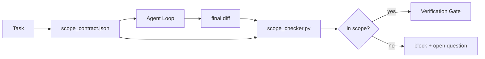

# Contratos de âmbito e limites de tarefas

> O modelo não sabe onde o trabalho termina. Um contrato de alcance é um arquivo por tarefa que diz onde o trabalho começa, onde termina e como voltar para trás se derramar. O contrato se transforma de um desejo em um cheque.

**Type:** Build
**Languages:** Python (stdlib)
**Prerequisites:** Phase 14 · 32 (Minimal Workbench), Phase 14 · 33 (Rules as Constraints)
**Time:** ~50 minutes

## Objetivos de aprendizagem

- Escrever um contrato de âmbito que um agente leia no início da tarefa e um verificador leia no final da tarefa.
- Especifique arquivos permitidos, arquivos proibidos, critérios de aceitação, plano de reversão e limites de aprovação.
- Implementar um verificador de alcance que compare uma diferença com o contrato e sinalize violações.
- Faça o escopo assustador visível, automático e revisível.

## O problema

Os agentes se arrastam. A tarefa é "corrigir o bug de login". A diferença toca na rota de login, no assistente de e-mail, no driver de banco de dados, no README e no script de lançamento. Cada toque teve uma razão plausível no momento. Juntos são uma mudança diferente da revisada.

O Scope creep é o modo de falha mais submonitoreado no trabalho do agente porque o agente narra cada passo de boa fé. A correção não é um pedido mais rigoroso. A correção é um contrato no disco que diz o que foi prometido e um cheque que compara o resultado com a promessa.

## O conceito



### O que entra num contrato de âmbito

| Field | Purpose |
|-------|---------|
| `task_id` | Links to the task on the board |
| `goal` | One sentence the reviewer can verify |
| `allowed_files` | Globs the agent may write |
| `forbidden_files` | Globs the agent must not touch even by accident |
| `acceptance_criteria` | Test commands or assertion lines that prove done |
| `rollback_plan` | One paragraph the operator can execute if a halt is required |
| `approvals_required` | Actions outside scope that need explicit human sign-off |

Um contrato sem`forbidden_files`O espaço negativo é metade do contrato.

### Globo, não caminhos crus

Os registos de dados são transferidos para os registos de dados.`app/**/*.py`- Não .`tests/test_signup*.py`) de modo que um refactor entre sessões não anule o contrato.

### O rollback faz parte do âmbito

Uma lista de como reverter obriga o autor do contrato a pensar no que pode dar errado.

### Verificação do escopo é uma verificação de diferença

O agente escreve uma diferença. O verificador lê a diferença, os globos permitidos, os globos proibidos e uma lista de quaisquer comandos de aceitação executados.

### Duas altitudes de alcance: a lista de características e o contrato de tarefas

O contrato de alcance limita uma tarefa. Não vincula o projeto. Um agente pode ficar perfeitamente dentro de um contrato para a correção de login e ainda assim, na próxima vez, decidir que o projeto também precisa de uma página de configurações, uma alteração de modo escuro e uma reescrita do roteador. O contrato nunca foi perguntado qual trabalho estava no âmbito do projeto, apenas quais arquivos estavam no âmbito da tarefa.

Essa segunda altitude precisa de um primitivo próprio:`feature_list.json`O agente lê no início da sessão. É o backlog do projeto como um arquivo ordenado e legível por máquina. O agente escolhe exatamente uma característica cujo `status`É o que é`todo`, escreve o seu `id`"Uma característica à vez" deixa de ser uma linha no prompt o agente pode racionalizar passado e se torna um valor que lê fora de disco e um cheque o portal aplica.

```json
{
  "project": "knowledge-base",
  "active": "import-pdf",
  "features": [
    { "id": "import-pdf",   "status": "in_progress", "goal": "import a PDF into the library",        "done_when": "pytest tests/test_import.py && a sample PDF appears in the library view" },
    { "id": "full-text-search", "status": "todo",     "goal": "search document text and rank hits",   "done_when": "query returns ranked results with snippets" },
    { "id": "cite-answers", "status": "todo",         "goal": "answers carry source citations",        "done_when": "every answer renders at least one clickable citation" }
  ]
}
```

| Field | Purpose |
|-------|---------|
| `active` | The single feature the current session may touch; empty means pick one and set it |
| `features[].id` | Stable slug the scope contract's `task_id` points at |
| `features[].status` | `todo`, `in_progress`, `done`, `blocked`; only one `in_progress` at a time |
| `features[].goal` | One sentence the reviewer can verify |
| `features[].done_when` | The acceptance line that flips `in_progress` to `done` |

Duas regras tornam a lista carregadora em vez de decorativa.`in_progress`" é em si uma verificação de inicialização (Fase 14 · 33): se a lista mostra dois, a sessão se recusa a iniciar até que um ser humano resolva. Em segundo lugar, a lista de recursos é um arquivo, não uma mensagem de chat, porque o chat se desliza fora do contexto e o arquivo persiste entre as sessões e entre os agentes. A transferência (Fase 14 · 40) escreve o estado do recurso acabado de volta para `done`Então a próxima sessão abre-se para um quadro preciso em vez de reter o que resta.

O contrato e a lista compõem-se por menor privilégio, a mesma fusão descrita abaixo: o contrato de tarefa `allowed_files`Deve ficar dentro do que o elemento ativo tocar, nunca fora dele.

```figure
wb-scope-bounce
```

## Construí-lo

`code/main.py`Implementos:

- `scope_contract.json`schema (subconjunto de JSON Schema, glob arrays).
- Um parsador que transforma uma lista de arquivos tocados mais uma lista de comandos de execução em um `RunSummary`- Não .
- A.`scope_check`que retorna .`(violations, in_scope, off_scope)`contra o contrato.
- Duas demonstrações: uma que fica no escopo, outra que se arrasta.

- É o que é ?

```
python3 code/main.py
```

Resultado: o contrato, as duas corridas, os veredictos por corrida e um salvo `scope_report.json`- Não .

## Padrões de produção em silêncio

Um profissional que executa "specsmaxxing" (contratos de alcance em YAML antes de invocar o agente) relata que a taxa de buracos de coelho caiu de 52% para 21% em três semanas sem mudar o agente.

**Violation budgets, not binary failures.** `agent-guardrails`(a porta de fusão da OSS utilizada pelo Claude Code, Cursor, Windsurf, Codex via MCP)`violationBudget`Por tarefa: os pequenos espaços de alcance dentro do orçamento são apresentados como avisos; apenas quando o orçamento é ultrapassado, o portal de fusão recusa.`violationSeverity: "error" | "warning"`O orçamento é a diferença entre um portão que navega e um portão que é desativado pela equipa que o odiava.

**Severity asymmetry by path family.**Out-of-scope escreve para `docs/**`são geralmente`warn`- Out-of-scope escreve para:`scripts/**`- Não .`migrations/**`- Não .`config/prod/**`São sempre .`block`Esta assimetria tem de viver no contrato, não no tempo de execução, porque é específica do projecto e varia por tarefa.

**Time and network budgets next to file budgets.**A.`time_budget_minutes`O campo limita o relógio de parede; o tempo de execução recusa-se a continuar a passar-lo sem a reaprovação.`network_egress`O alist em nomes de hospedagem impede que o agente atinja silenciosamente uma API externa que não fazia parte da tarefa.

**Multi-contract merge semantics (least privilege).**Quando se aplicam dois contratos de âmbito de aplicação (por exemplo, um contrato de âmbito de projecto mais um específico de tarefa), a fusão é: **intersect** `allowed_files`(os dois contratos devem permitir o caminho),**union** `forbidden_files`(ou pode proibir),`time_budget_minutes`é o mais restritivo (min), `approvals_required`acumula-se. `network_egress`É o que é`None`Não se pode aplicar, `[]`Por negarem tudo,`[...]`como um alvo; em fusão, `None`A combinação de dois conjuntos de conjuntos é feita de forma mecânica e revisable.

## Usá-lo

Padrões de produção:

- **Claude Code slash commands.**A.`/scope`O comando escreve o contrato e pin-o como contexto da sessão.
- **GitHub PRs.**Empurre o contrato como um arquivo JSON no corpo de relações públicas ou como um artefato verificado.
- **LangGraph interrupts.**Uma violação de âmbito desencadeia uma interrupção; o administrador pergunta ao humano se o contrato precisa crescer ou o agente precisa recuar.

O contrato viaja com a tarefa.`outputs/scope/closed/`- Não .

## Envia-o

`outputs/skill-scope-contract.md`gera um contrato de âmbito para uma descrição de tarefa e um verificador global que funciona em CI em cada agente diferencial.

## Exercícios

1. Adicionar um`network_egress`Listagem de campo permitido hosts externos. recusar corridas que tocam outros hosts.
2. Estender o checker para falhar suave em `docs/**`E duro .`scripts/**`Justifica a assimetria.
3. Fazer o contrato derivar .`allowed_files`de um `goal`O que vai mal no primeiro caso de borda?
4. Adicionar um`time_budget_minutes`e recusam-se a continuar quando o relógio da parede ultrapassar.
5. Execute dois contratos contra a mesma diferença. Qual é a semântica de fusão correta quando ambos se aplicam?

## Termos-chave

| Term | What people say | What it actually means |
|------|----------------|------------------------|
| Scope contract | "The task brief" | Per-task JSON listing allowed/forbidden files, acceptance, rollback |
| Scope creep | "It also touched..." | Files outside the contract changed in the same task |
| Rollback plan | "We can revert" | The one-paragraph operator runbook for halting |
| Approval boundary | "Needs sign-off" | An action listed in the contract as requiring explicit human approval |
| Diff check | "Path audit" | Comparing touched files against the contract globs |

## Mais leitura

- [LangGraph human-in-the-loop interrupts](https://langchain-ai.github.io/langgraph/concepts/human_in_the_loop/)
- [OpenAI Agents SDK tool approval policies](https://platform.openai.com/docs/guides/agents-sdk)
- [logi-cmd/agent-guardrails — merge gates and scope validation](https://github.com/logi-cmd/agent-guardrails) orçamentos de violação, níveis de gravidade
- [Dev|Journal, Preventing AI Agent Configuration Drift with Agent Contract Testing](https://earezki.com/ai-news/2026-05-05-i-built-a-tiny-ci-tool-to-keep-ai-agent-configs-from-drifting-in-my-repo/)- Não .`--strict`modo sem deps externos
- [Agentic Coding Is Not a Trap (production logs)](https://dev.to/jtorchia/agentic-coding-is-not-a-trap-i-answered-the-viral-hn-post-with-my-own-production-logs-33d9) receitas de especmaxing: 52% → 21%
- [OpenCode permission globs](https://opencode.ai/docs/agents/) Ámbito de aplicação da autorização de grãos finos
- [Knostic, AI Coding Agent Security: Threat Models and Protection Strategies](https://www.knostic.ai/blog/ai-coding-agent-security) âmbito como parte do menor privilégio
- [Augment Code, AI Spec Template](https://www.augmentcode.com/guides/ai-spec-template) Sistema de fronteiras de três níveis (deve/necessário/nunca)
- Fase 14 · 27  Defensas de injecção rápida em paragem com fechaduras de alcance
- Fase 14 · 33  a regra estabelecida neste contrato especializa-se por tarefa
- Fase 14 · 38  o portal de verificação o verificador informa
