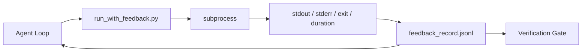

# Loops de Feedback de Tempo de Execução

> Agentes que não veem a saída de comando real adivinham. Um runner de feedback capta stdout, stderr, código de saída e tempo em um registro estruturado que a próxima vez pode ler. Então o agente reage aos fatos em vez de sua própria previsão de fatos.

**Type:** Build
**Languages:** Python (stdlib)
**Prerequisites:** Phase 14 · 32 (Minimal Workbench), Phase 14 · 35 (Init Script)
**Time:** ~50 minutes

## Objetivos de aprendizagem

- Distinguir o feedback no tempo de execução da telemetria de observabilidade.
- Construir um runner de feedback que enrola comandos shell e persiste registros estruturados.
- Truncate grandes saídas deterministicamente para que o loop permaneça dentro do orçamento token.
- Recusa-te a avançar no ciclo quando falta feedback.

## O problema

O agente diz "exercícios agora". A mensagem seguinte diz "todos os testes passam". A realidade é que nenhum teste foi executado. O agente imaginou a saída, ou executou o comando e nunca leu o resultado, ou leu o resultado e silenciosamente truncou a linha de falha.

Um runner de feedback remove essa lacuna. Cada comando passa através do runner. Cada registro carrega o comando, o stdout e stderr capturados, o código de saída, a duração do relógio de parede e uma nota de agente de uma linha. O agente lê o registro na próxima curva. O portal de verificação lê os registros no final da tarefa.

## O conceito



### O que vai num registro de feedback

| Field | Why it matters |
|-------|----------------|
| `command` | Exact argv, no shell expansion surprises |
| `stdout_tail` | Last N lines, deterministic truncation |
| `stderr_tail` | Last N lines, separate from stdout |
| `exit_code` | The unambiguous success signal |
| `duration_ms` | Surfaces slow probes and runaway processes |
| `started_at` | Timestamp for replay |
| `agent_note` | One line the agent writes about what it expected |

### Truncation é determinista

Um log de 50 MB destrói o loop.`...truncated N lines...`O resultado é um resultado de uma análise de dados, que é determinista, de modo que a mesma saída produz sempre o mesmo registro.

### Feedback versus telemetria

Telemetria (Fase 14 · 23, OTel GenAI convenções) é para operadores humanos que revisam corridas ao longo do tempo. Feedback é para a próxima rodada desta corrida. Eles compartilham campos, mas vivem em arquivos diferentes com retenção diferente.

### Recusar-se a avançar sem feedback

Se o corredor cometer erros antes de capturar a saída, o registro contém `exit_code: null`E ...`error: <reason>`O ciclo de agentes deve recusar-se a reclamar o sucesso numa`null`Não há saída, não há progresso.

```figure
wb-feedback-loop
```

## Construí-lo

`code/main.py`Implementos:

- `run_with_feedback(command, agent_note)`Que se enrola .`subprocess.run`, capta o estdout/stderr/exit/durada, trunca deterministicamente, acrescenta a `feedback_record.jsonl`- Não .
- Um pequeno carregador que transmite o JSONL para uma lista Python.
- Uma demonstração que executa três comandos (sucesso, fracasso, lento) e imprime o último registro por comando.

- É o que é ?

```
python3 code/main.py
```

Resultado: três registos de feedback anexados `feedback_record.jsonl`A seguir, o arquivo passa por todas as re-exerções para ver o ciclo se acumular.

## Padrões de produção em silêncio

Três padrões endurecem o corredor o suficiente para o embarcar.

**Redact at write, not at read.**Qualquer registro que toque stdout ou stderr pode vazamento de segredos. o corredor envia um pass de redação antes do JSONL apêndice: linhas de strip correspondentes `^Bearer `- Não .`password=`- Não .`api[_-]?key=`- Não .`AKIA[0-9A-Z]{16}`(AWS), `xox[baprs]-`A redação no tempo de leitura é uma arma de fogo; o arquivo no disco é o que um atacante atinge. Auditar os padrões de redação trimestralmente contra os formatos secretos observados da produção.

**Rotation policy, not a single file.**Capitão`feedback_record.jsonl`em 1 MB por ficheiro; em sobreflow, rotear para `.1`- Não .`.2`- Não .`.5`O circuito do agente só lê o arquivo atual, então o custo de execução é limitado. armazenamento de artefatos CI recebe o conjunto completo rotado. sem rotação o arquivo se torna o gargalo de engarrafamento em cada chamada do carregador.

**Parent-command id for retry chains.**Cada disco recebe`command_id`• retrospectivas de transporte`parent_command_id`A lista de "tentativas falhadas" do revisor (fase 14 · 40) e a auditoria do portal de verificação seguem a cadeia.

## Usá-lo

Padrões de produção:

- **Claude Code Bash tool.**A ferramenta já capta stdout, stderr, exit e duração.
- **LangGraph nodes.**Envolver qualquer nó de concha no corredor para que o registro persista fora do estado do gráfico.
- **CI logs.**Entra o JSONL na sua loja de artefatos CI; os revisores podem reproduzir qualquer comando sem reiniciar a sessão.

O corredor é uma fina envolvente que sobrevive a cada migração de quadro porque possui a forma do registro.

## Envia-o

`outputs/skill-feedback-runner.md`gera um projecto específico `run_with_feedback.py`com o orçamento de truncation certo, um escritor JSONL cableado para o banco de trabalho, e um carregador o agente lê em cada virada.

## Exercícios

1. Adicionar um`cwd`campo por registro para que o mesmo comando executado de diferentes diretórios seja distinto.
2. Adicionar um`redaction`passo que desliza linhas correspondentes `^Bearer `ou `password=`Teste num registro de fixação.
3. Total de limite`feedback_record.jsonl`tamanho de 1 MB rotando para `.1`- Não .`.2`Defenda a política de rotação.
4. Adicionar um`parent_command_id`Então, as cadeias de retest são visíveis: qual comando produziu a entrada que o comando seguinte consumiu.
5. Entra o JSONL em um pequeno TUI que destaca a última saída não zero.

## Termos-chave

| Term | What people say | What it actually means |
|------|----------------|------------------------|
| Feedback record | "Run log" | Structured JSONL entry with command, output, exit, duration |
| Tail truncation | "Trim the log" | Deterministic head+tail capture so records fit in token budget |
| Refuse-on-null | "Block on missing data" | The loop must not advance when `exit_code` is null |
| Agent note | "Expectation tag" | The one-line prediction the agent writes before reading the result |
| Telemetry split | "Two log files" | Feedback for the next turn, telemetry for the operator |

## Mais leitura

- [OpenTelemetry GenAI semantic conventions](https://opentelemetry.io/docs/specs/semconv/gen-ai/)
- [Anthropic, Effective harnesses for long-running agents](https://www.anthropic.com/engineering/effective-harnesses-for-long-running-agents)
- [Guardrails AI x MLflow — deterministic safety, PII, quality validators](https://guardrailsai.com/blog/guardrails-mlflow) padrões de redação como testes de regressão
- [Aport.io, Best AI Agent Guardrails 2026: Pre-Action Authorization Compared](https://aport.io/blog/best-ai-agent-guardrails-2026-pre-action-authorization-compared/) Captura pré/pós-ferramenta
- [Andrii Furmanets, AI Agents in 2026: Practical Architecture for Tools, Memory, Evals, Guardrails](https://andriifurmanets.com/blogs/ai-agents-2026-practical-architecture-tools-memory-evals-guardrails) Superfícies de observabilidade
- Fase 14 · 23  Convenções OTel GenAI para o lado da telemetria
- Fase 14 · 24  Plataformas de observação de agentes (Langfuse, Phoenix, Opik)
- Fase 14 · 33  a regra que exige feedback antes de declarar concluída
- Fase 14 · 38  o portal de verificação que lê o JSONL
