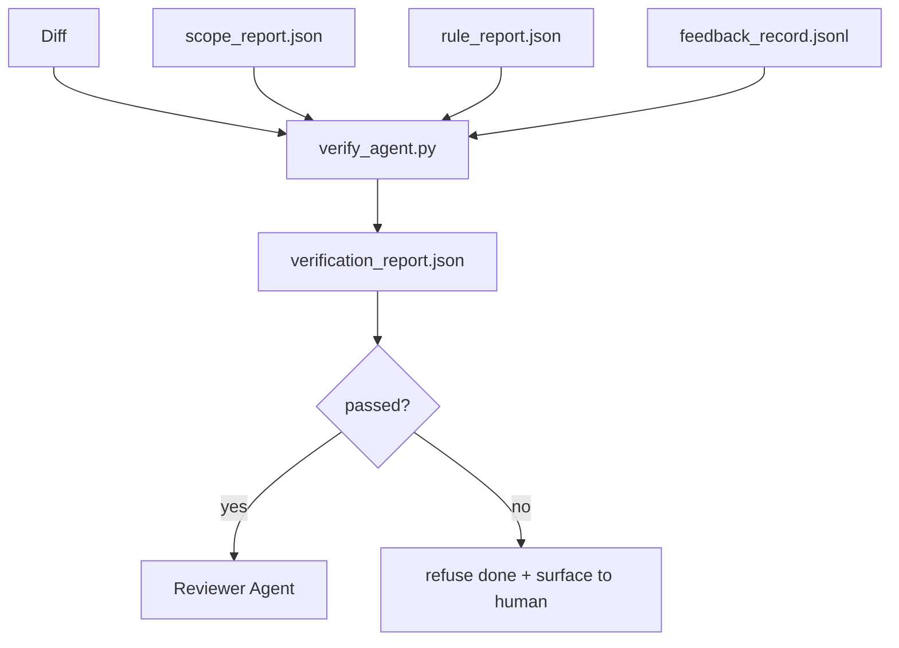

# Portões de verificação

> O agente não consegue marcar seu próprio trabalho como feito. Um portal de verificação lê o contrato de alcance, o registro de feedback, o relatório de regras e o diferencial, e responde a uma única pergunta: esta tarefa está realmente concluída?

**Type:** Build
**Languages:** Python (stdlib)
**Prerequisites:** Phase 14 · 33 (Rules), Phase 14 · 36 (Scope), Phase 14 · 37 (Feedback)
**Time:** ~55 minutes

## Objetivos de aprendizagem

- Define um portal de verificação como uma função determinista sobre artefatos de banco de trabalho.
- Combine o relatório de regra, o relatório de âmbito, os registos de feedback e a diferença num único veredicto.
- Emite um `verification_report.json`O agente de revisão e o informador podem ler.
- Recusar-se a avançar numa tarefa em caso de falha de gravidade de bloco, sem exceção.

## O problema

Os agentes declaram sucesso com muita facilidade.

- "Parece bom". O modelo leu a sua própria diferença e decidiu que era correto.
- "Os testes passaram". Disse com confiança.
- "A aceitação cumprida". Critérios de aceitação interpretados de forma suficientemente solta para significar "qualquer coisa semelhante a feita".

O portão de trabalho é um único gate de verificação que lê os artefatos que o agente já produziu e faz a chamada. O gate é determinista. O gate está no controle de versão. O gate é conectado ao CI. O agente não pode subornar.

## O conceito



### O que o portal verifica

| Check | Source artifact | Severity |
|-------|-----------------|----------|
| All acceptance commands ran | `feedback_record.jsonl` | block |
| All acceptance commands exited zero | `feedback_record.jsonl` | block |
| Scope check has no forbidden writes | `scope_report.json` | block |
| Scope check has no off-scope writes | `scope_report.json` | block or warn |
| All block-severity rules pass | `rule_report.json` | block |
| No `null` exit codes in feedback | `feedback_record.jsonl` | block |
| Touched files match `scope.allowed_files` | both | warn |

A.`warn`A conclusão é uma anotação do veredicto;`block`Encontrar impedimentos `passed: true`- Não .

### Determinista, não probabilista

O portal deve emitir o mesmo veredicto para o mesmo artefato definido sempre. Não há juízes de LLM. Os juízes de LLM pertencem ao lado do revisor (fase 14 · 39) onde o objetivo é a avaliação qualitativa, não o status.

### Um relatório, um caminho

O portão emite um .`verification_report.json`por tarefa, escrito em`outputs/verification/<task_id>.json`CI consome o mesmo caminho, vários portões com caminhos diferentes, forjam a fonte da verdade.

### Recusar sem exceção

Os resultados da gravidade do bloco não podem ser revogados pelo agente.`override_reason`e um `overridden_by`A revogação é uma alteração assinada, não uma decisão do agente.

```figure
wb-gate-sequence
```

## Construí-lo

`code/main.py`Implementos:

- Um carregador para cada artefato de entrada, todos empilhados localmente para que a lição seja autônoma.
- A.`verify(task_id, artifacts) -> VerdictReport`função pura.
- Uma impressora que mostra os resultados de cada verificação e a passagem final.
- Uma demonstração com três cenários de tarefa: passagem limpa, escopo de reviravolta, falta de aceitação.

- É o que é ?

```
python3 code/main.py
```

Resultado: três relatórios de veredicto, cada um guardado ao lado do roteiro.

## Padrões de produção em silêncio

Quatro padrões elevam o portão de "outro trabalho de linho" para "a borda decisiva".

**Defense-in-depth, not single gate.**O gancho pré-comit → verificação do estado do CI → gancho pré-ferramenta authz → gate pré-merger. Cada camada é determinista, de modo que uma falha em uma camada é capturada pela próxima. o manual de jogo de março de 2026 da microservices.io é explícito: o gancho pré-comit é impossível de passar porque, ao contrário de uma habilidade do lado do modelo, não depende do agente que segue instruções.

**Defense by deterministic check, model-judge only for nuance.**O par de Normas Híbridas 2026 da Anthropic: recompensas verificáveis (testes de unidade, verificações de esquema, códigos de saída) responder "o código resolveu o problema?"  Rubricas LLM responder "o código é legível, seguro, em estilo?" O gate executa a primeira classe; o revisor (Fase 14 · 39) executa a segunda. Misturando-os, o sinal desmorona.

**Signed override log, not Slack threads.**Cada reviravolta emite uma linha em`outputs/verification/overrides.jsonl`com: timestamp, encontrar código, razão, assinar usuário, atual HEAD compromissos. O tempo de execução recusa qualquer sobreposição que não tenha a assinatura; o rastro de auditoria é git-tracked. Esta é a linha entre uma política de sobreposição e um teatro de sobreposição.

**Coverage floor as a first-class check.**A.`coverage_report.json`alimenta um `coverage_floor`(default 80%) verificação. O gate falha se a cobertura medida cai abaixo do piso ou abaixo do piso da fusão anterior em mais de 1 ponto percentual. Sem essa verificação, os agentes apagam silenciosamente os testes que falham e os relatórios de verificação permanecem em verde.

**`--strict` mode promotes warns to blocks.**Para as filiais de liberação, as relações públicas de bloqueio de navios ou a triagem pós-incidente, `--strict`A bandeira é opt-in por ramo, não o padrão global, porque o estritamente sobre tudo corroe o fluxo diário.

## Usá-lo

Padrões de produção:

- **CI step.**A.`verify_agent`O trabalho corre o portal contra os artefatos finais do agente.`passed: true`- Não .
- **Pre-handoff hook.**O agente da hora de execução chama o portal antes de gerar o documento de entrega.
- **Manual triage.**Os operadores lêem o relatório quando um agente afirma ser bem sucedido e um ser humano suspeita disso.

O portão é a borda decisiva no fluxo do banco de trabalho.

## Envia-o

`outputs/skill-verification-gate.md`liga o portal a um projeto específico: quais os comandos de aceitação alimentam-no, quais as regras são de severidade de bloco, quais as redações fora do alcance são toleradas, como o registro de auditoria de sobreposição é armazenado.

## Exercícios

1. Adicionar um`coverage_floor`Verificação: o comando de ensaio deve apresentar um relatório de cobertura com pelo menos 80% de peso.
2. Apoio a`--strict`modo que promove cada `warn`- Não .`block`Documentar os casos em que o modo rigoroso é o padrão certo.
3. Faça com que o gate produzir um resumo de Markdown além do JSON. Defenda quais campos pertencem ao resumo.
4. Adicionar um`time_since_last_human_touch`Verificação: qualquer arquivo editado no prazo de 60 segundos após o toque de teclado humano está isento de bandeiras fora do alcance.
5. A porta é usada para um agente diferente do seu produto.

## Termos-chave

| Term | What people say | What it actually means |
|------|----------------|------------------------|
| Verification gate | "The check that stops things" | Deterministic function over workbench artifacts producing a pass/fail verdict |
| Block severity | "Hard fail" | A finding that prevents `passed: true` and requires a signed override |
| Override log | "Why we let it through" | Signed entries with reason and user id, audited by review |
| Acceptance command | "The proof" | A shell command whose zero exit is what `done` means |
| One report path | "Source of truth" | `outputs/verification/<task_id>.json`, consumed by CI and humans alike |

## Mais leitura

- [Anthropic, Harness design for long-running application development](https://www.anthropic.com/engineering/harness-design-long-running-apps)
- [OpenAI Agents SDK guardrails](https://openai.github.io/openai-agents-python/guardrails/)
- [microservices.io, GenAI dev platform: guardrails](https://microservices.io/post/architecture/2026/03/09/genai-development-platform-part-1-development-guardrails.html) Defesa em profundidade entre pré-comitamento e CI
- [ICMD, The 2026 Playbook for Agentic AI Ops](https://icmd.app/article/the-2026-playbook-for-agentic-ai-ops-guardrails-costs-and-reliability-at-scale-1776661990431) Escala de entrada de aprovação (projeto → aprovação → auto abaixo dos limiares)
- [Type-Checked Compliance: Deterministic Guardrails (arXiv 2604.01483)](https://arxiv.org/pdf/2604.01483) Lean 4 como limite superior da abertura determinista
- [logi-cmd/agent-guardrails — merge gate spec](https://github.com/logi-cmd/agent-guardrails) Ámbito de aplicação + portas de teste de mutação
- [Guardrails AI x MLflow](https://guardrailsai.com/blog/guardrails-mlflow) Validadores deterministas como marcadores de CI
- [Akira, Real-Time Guardrails for Agentic Systems](https://www.akira.ai/blog/real-time-guardrails-agentic-systems) Portas pré/pós-ferramentas
- Fase 14 · 27  Defesa de injecção rápida (par adversária do portal)
- Fase 14 · 36  o contrato de âmbito que esta porta aplica
- Fase 14 · 37  o registro de feedback este portal pontua
- Fase 14 · 39  o agente revisor o portão mãos para
