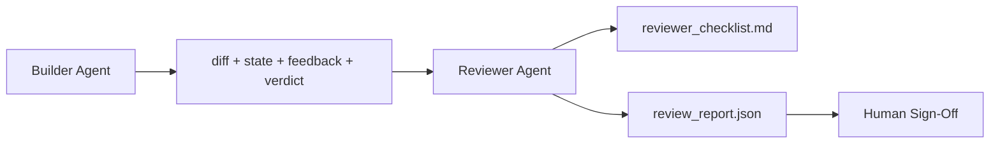

# Agente de revisor: Construtor separado do Marker

> O agente que escreveu o código não pode classificá-lo. Um revisor é um segundo ciclo com um sistema diferente, um objetivo diferente e acesso apenas para leitura a tudo o que o construtor produziu.

**Type:** Build
**Languages:** Python (stdlib)
**Prerequisites:** Phase 14 · 38 (Verification Gate)
**Time:** ~55 minutes

## Objetivos de aprendizagem

- Explique por que o mesmo agente não pode rever de forma confiável o seu próprio trabalho.
- Construir um ciclo de agente de revisão que consome artefatos de construção e emite um relatório de revisão estruturado.
- Autor de uma rubrica de revisor que classifica dimensões específicas, não vibrações.
- Liga o revisor para o banco de trabalho para que o passo de revisão humana comece com um artefato real.

## O problema

Você pede ao agente para corrigir um bug. Ele edita quatro arquivos, executa os testes e relatórios feitos. O portal de verificação (fase 14 · 38) confirma a aceitação executada e o escopo mantido. O portal diz `passed: true`Dois dias depois descobres que a correcção resolveu a metade errada do bug.

A aceitação é necessária, não é suficiente. O revisor faz as perguntas que a aceitação não pode fazer: resolveu o problema correto? alargou o âmbito sem o marcar? documentou suposições que deveriam ter sido questionadas? deixou o banco de trabalho num estado que a próxima sessão pode retomar?

## O conceito



### Rubrico de revisor

Cinco dimensões, cada uma com pontuação de 0 a 2.

| Dimension | Question |
|-----------|----------|
| Problem fit | Did the change solve the task as stated, not a nearby task? |
| Scope discipline | Were edits confined to the contract or was the contract grown deliberately? |
| Assumptions | Are all hidden assumptions written down somewhere reviewable? |
| Verification quality | Does the acceptance command actually prove the goal, or did it prove a weaker version? |
| Handoff readiness | Could the next session pick up cleanly from the current state? |

Um run abaixo de 7 é um soft fail; um run abaixo de 5 é um hard fail.

### O revisor é um papel separado, não um modelo separado

O revisor pode ser executado com o mesmo modelo que o constructor. A disciplina é a separação de papéis: diferentes implantes do sistema, diferentes entradas, nenhum acesso de escrita para o dif. A mudança de postura é a mudança de sinal.

### O revisor não pode editar a diferença

O revisor lê a diferença, o estado, o feedback, o veredicto. Ele escreve um relatório. Não corrige a diferença. Se o relatório diz "corrigir isso", o próximo construidor faz a correção; o revisor volta à revisão.

### Rubrico de revisor versus porta de verificação

O revisor faz julgamentos qualitativos: este é o trabalho certo, está documentado, a entrega é utilizável. Ambos são necessários.

```figure
wb-builder-marker
```

## Construí-lo

`code/main.py`Implementos:

- A.`ReviewerInputs`Dataclass, que agrupa os artefatos que o revisor lê.
- Uma pontuação rubrica com uma função por dimensão. Cada função é determinista e de grau de estúb para a lição; implementações reais chamariam de LLM.
- A.`review_report.json`O artigo 97.o, n.o 1, do Tratado CEE, foi aprovado em`pass`- Não .`soft_fail`- Não .`hard_fail`)).
- Dois casos de demonstração: uma mudança limpa e uma mudança de "testes certos, problema errado".

- É o que é ?

```
python3 code/main.py
```

Resultado: dois relatórios de revisão escritos no disco e uma tabela de pontuação em dimensões.

## Padrões de produção em silêncio

Os recibos: O sistema de revisão de código de IA de Cloudflare de abril de 2026 executou 131.246 revisões em 48.095 solicitações de fusão em 5.169 repos em 30 dias. A revisão média foi concluída em 3 minutos e 39 segundos. Até sete revisores especializados (segurança, desempenho, qualidade do código, documentos, gestão de libertação, conformidade, Código de Engenharia) executaram em paralelo sob um Coordenador de Revisão que deduplicou as descobertas e julgou a gravidade. Modelo de nível superior reservado exclusivamente ao coordenador; especialistas correm em níveis mais baratos.

Quatro padrões fazem com que isto funcione em escala.

**Specialist pool, not one big reviewer.**Uma revisora com uma rubrica de 5 dimensões trabalha para repos solo. Uma vez que o código base tem superfícies críticas para segurança, críticas para desempenho e documentos, dividem-se em especialistas com pedidos menores. O coordenador faz a deduplicação; os especialistas nunca executam a rubrica completa.

**Bias mitigation as design requirement, not optimization.**Os juízes do LLM mostram quatro viés confiáveis (Adnan Masood, abril de 2026): viés de posição (GPT-4 ~40% inconsistente na ordem (A,B) vs (B,A)), viés de verbosidade (~15% de pontuação inflação em direção a resultados mais longos), auto-preferência (juízes preferem resultados da mesma família de modelos), autoridade (juízes referências de taxa exagerada a autores conhecidos). Mitigations: avaliar ambas as ordens e contar apenas vitórias consistentes; usar escalas de 1 a 4 que explicitamente recompensam a conciseza; rotar juízes em todas as famílias de modelos; tirar os nomes dos autores antes de marcar.

**Calibration set, not vibes.**Um conjunto histórico de 10-20 tarefas com veredictos corretos conhecidos. Exibir o revisor sobre ele em cada mudança imediata. Se o acordo com o registro histórico cai abaixo de 80%, a rubrica precisa de revisão antes que o revisor envies. Isto é o que cada equipe eventualmente redescobre; melhor começar com ele.

**Hybrid norm with the gate.**O portal de verificação (fase 14 · 38) lida com as verificações deterministas (se a aceitação foi executada, os testes foram aprovados, o escopo foi mantido). O revisor lida com as verificações semânticas (se este é o trabalho certo, as suposições são documentadas, é a transferência útil). A orientação de 2026 da Anthropic é explícita sobre esta divisão: não peça ao revisor para refazer o que o portal já prova.

## Usá-lo

Padrões de produção:

- **Claude Code subagents.**Um sub-revisor corre depois que o construtor fecha uma tarefa.
- **OpenAI Agents SDK handoffs.**O construtor entrega ao revisor a tarefa concluída.
- **Two-model pairing.**O construidor usa um modelo mais rápido e mais barato. O revisor usa um modelo mais forte com contexto menor, focado no julgamento.

O revisor é o segundo par de olhos que cresce quando os humanos não conseguem fazer cada revisão por si mesmos.

## Envia-o

`outputs/skill-reviewer-agent.md`gera uma rubrica de revisor específica do projeto, um material de revisor ligado aos artefatos do construtor e uma integração com o portal de verificação para que a revisão humana comece a partir de um relatório escrito em vez de uma página em branco.

## Exercícios

1. Adicionar uma sexta dimensão específica ao seu domínio de produto.
2. Exerça o revisor com duas instruções diferentes do sistema (terse, verbose).
3. Adicionar um`confidence`Recusar-se a enviar o relatório quando a confiança na dimensão mais baixa for inferior a 0,6.
4. Construir um conjunto de calibração: 10 conclusões históricas com veredictos corretos conhecidos.
5. Adicione uma oferta de "pedir mais evidências": o revisor pode pedir ao construtor uma prova específica antes de marcar.

## Termos-chave

| Term | What people say | What it actually means |
|------|----------------|------------------------|
| Reviewer rubric | "Checklist" | Five-dimension 0-2 scoring with a written question per dimension |
| Soft fail | "Needs revisions" | Total below 7; builder gets findings to address |
| Hard fail | "Reject" | Total below 5 or any dimension at 0; halt and surface to human |
| Role separation | "Different prompt" | Same model can be both roles; the discipline is inputs and posture |
| Confidence floor | "Don't ship low-signal reports" | Refuse to emit a verdict when the rubric is uncertain |

## Mais leitura

- [OpenAI Agents SDK handoffs](https://openai.github.io/openai-agents-python/handoffs/)
- [Anthropic Claude Code subagents](https://code.claude.com/docs/en/sub-agents)
- [Cloudflare, Orchestrating AI Code Review at Scale](https://blog.cloudflare.com/ai-code-review/) Arquitetura de 7 especialistas + coordenadores, 131 mil corridas / 30 dias
- [Agent-as-a-Judge: Evaluating Agents with Agents (OpenReview / ICLR)](https://openreview.net/forum?id=DeVm3YUnpj) DevAI benchmark, 366 requisitos de solução hierárquica
- [Adnan Masood, Rubric-Based Evaluations and LLM-as-a-Judge: Methodologies, Biases, Empirical Validation](https://medium.com/@adnanmasood/rubric-based-evals-llm-as-a-judge-methodologies-and-empirical-validation-in-domain-context-71936b989e80) os 4 preconceitos e mitigações
- [MLflow, LLM-as-a-Judge Evaluation](https://mlflow.org/llm-as-a-judge) Ferramentas de produção para construção separada/evaluador
- [LangChain, How to Calibrate LLM-as-a-Judge with Human Corrections](https://www.langchain.com/articles/llm-as-a-judge) Fluxo de trabalho definido pela calibração
- [Evidently AI, LLM-as-a-judge: a complete guide](https://www.evidentlyai.com/llm-guide/llm-as-a-judge)
- [Arize, LLM as a Judge — Primer and Pre-Built Evaluators](https://arize.com/llm-as-a-judge/)
- Fase 14 · 05  Auto-refinamento e CRITIC (linha de base de auto-revisão de um agente único)
- Fase 14 · 30  Desenvolvimento de agente movido por Eval (gênero de conjunto de calibração)
- Fase 14 · 38  o portal de verificação que o revisor lê
- Fase 14 · 40  o pacote de entrega que o relatório do revisor alimenta
