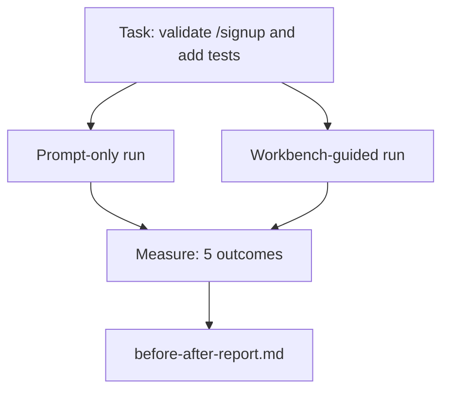

# O banco de trabalho num verdadeiro repo

> Eleven lições de superfícies não vale nada se não sobreviverem ao contato com uma base de código real. Esta lição realiza a mesma tarefa duas vezes em um pequeno aplicativo de amostra: apenas de instrução versus guiada por banco de trabalho. Os números fazem o argumento.

**Type:** Build
**Languages:** Python (stdlib)
**Prerequisites:** Phases 14 · 32 to 14 · 40
**Time:** ~60 minutes

## Objetivos de aprendizagem

- Reunião das sete superfícies de banco de trabalho numa pequena aplicação.
- Realize duas vezes a mesma tarefa (apenas de forma rápida e com orientação de banco de trabalho) e medir cinco resultados.
- Leia o relatório antes/após e decida quais as superfícies que tiveram maior alavancagem.
- Defender o banco de trabalho contra um "mas o meu modelo é bom o suficiente" empurrão.

## O problema

Uma demonstração de uma tarefa de brinquedo não convence ninguém. O caso para o banco de trabalho é feito quando uma tarefa real-feeling em um repo real-feeling chega à produção com menos falhas, menos reversões, e um pacote que a próxima sessão pode usar.

Esta lição envia o repo real e executa a mesma tarefa através de ambos os canais.

## O conceito



### A aplicação de amostra

Um manipulador de estilo FastAPI mínimo em `sample_app/`- Não .

- `app.py`com`/signup`(Ainda não há validação).
- `test_app.py`com um teste de caminho feliz.
- `README.md`E ...`scripts/release.sh`como isca de zona proibida.

### A tarefa

> Adicionar validação de entrada para `/signup`Rejeitar as senhas menores de 8 caracteres, retornar 422 com um envelope de erro de digitação. Adicionar um teste que comprova o novo comportamento.

### Os dois oleodutos

Só para o momento:

1. Leia o README.
2. Leia `app.py`- Não .
3. Editar arquivos.
4. A reivindicação está feita.

Guia de mesa de trabalho:

1. Execute o script init (Lessão 35).
2. Leia o âmbito do contrato (Lessão 36).
3. Estado de leitura (Lessão 34).
4. Apenas os arquivos permitidos.
5. Execute o comando de aceitação através do feedback runner (Lessão 37).
6. Execute a porta de verificação (Lessão 38).
7. Revisor de execução (Lessão 39).
8. Gerenciar a transferência (Lessão 40).

### Os cinco resultados medidos

| Outcome | Why it matters |
|---------|----------------|
| `tests_actually_run` | Most "tests passed" claims are unverifiable |
| `acceptance_met` | The test that proves the goal must be the test that ran |
| `files_outside_scope` | Scope creep is the dominant silent failure |
| `handoff_quality` | The next session pays for or benefits from this |
| `reviewer_total` | Qualitative judgment on top of the gate |

```figure
wb-ab-runs
```

## Construí-lo

`code/main.py`O sistema de medição de dados é um sistema de medição de dados que permite a análise de dados e de dados.`before-after-report.md`E ...`comparison.json`- Não .

- É o que é ?

```
python3 code/main.py
```

Saída: uma tabela de console de resultados por pipeline, o relatório de marcação guardado ao lado do script e o JSON para quem quer traçar.

## Padrões de produção em silêncio

A pergunta do cético é: "Quanto ajuda realmente o banco de trabalho?" Os números de 2026 dizem muito mais do que a explicação.

**Terminal Bench Top-30 to Top-5 on the same model.***Anatomia de um Agente Harness* de LangChain (abril de 2026): um agente de codificação saltou de fora do top 30 para o quinto lugar no Terminal Bench 2.0 alterando apenas o arnes. O mesmo modelo. superfícies diferentes. 25o delta.

**Vercel 80% to 100% by deleting tools.**A Vercel informou que a exclusão de 80% das ferramentas do seu agente levou a taxa de sucesso de 80% para 100%.

**Harvey 2x accuracy via harness alone.**Os agentes legais mais do que dobraram a sua precisão através da otimização do arnes, sem mudança de modelo.

**88% of enterprise AI agent projects fail to reach production.**O artigo preprints.org *Harness Engineering for Language Agents* (março de 2026) traça os falhas ao tempo de execução, não ao raciocínio: estado obsoleto, retos frágeis, contexto superado, recuperação pobre de erros intermediários.

**Long-context collapse.**O sucesso do WebAgent 40-50% cai para menos de 10% em condições de longo contexto, principalmente a partir de loops infinitos e perda de gol.

**False negatives still exist.**As tarefas factuais de um passo, lints de uma linha, formatores de execução, qualquer coisa que o modelo tenha memorizado verbalmente  estes executam mais rápido apenas de seguida.

O que se sabe é que os modelos absorvem os truques de arnes ao longo do tempo, mas hoje a carga de engenharia está nas sete superfícies, e os números provam isso.

## Usá-lo

Esta lição é o processo que você cita quando:

- Alguém pergunta por que todas as relações públicas têm um`agent-rules.md`E um contrato de alcance.
- Uma equipa quer desligar o portal de verificação "só para este sprint".
- Um novo produto de agente é lançado e você precisa de um benchmark portátil para saber se realmente economiza tempo.

Os números vão mais longe do que a explicação.

## Envia-o

`outputs/skill-workbench-benchmark.md`é um arame de avaliação portátil que corre qualquer produto de agente através de ambos os canais contra o próprio aplicativo de amostra de um projeto e relata os cinco resultados.

## Exercícios

1. Adicione um sexto resultado: edição significativa de tempo a primeiro. Como medir limpo?
2. Faça a comparação numa tarefa real do segundo dia na sua base de códigos.
3. Adicionar um pass "falso negativo": tarefas em que apenas o prompt teria sido mais rápido e a despesa do banco de trabalho é um custo real.
4. Substitua o "agente" com um verdadeiro LLM.
5. Autor de um resumo de uma página destinado a um não-engenheiro.

## Termos-chave

| Term | What people say | What it actually means |
|------|----------------|------------------------|
| Sample app | "Toy repo" | Small but realistic enough to exercise all seven surfaces |
| Pipeline | "Workflow" | Ordered sequence of surface reads/writes the agent follows |
| Before/after report | "The receipts" | The artifact you hand to a skeptic |
| False negative | "Workbench overkill" | Tasks where prompt-only is faster; useful to enumerate honestly |
| Workbench benchmark | "Reliability score" | Portable harness that runs the comparison on your codebase |

## Mais leitura

- [LangChain, The Anatomy of an Agent Harness](https://blog.langchain.com/the-anatomy-of-an-agent-harness/) Receita do Terminal Bench Top-30 ao Top-5
- [MongoDB, The Agent Harness: Why the LLM Is the Smallest Part of Your Agent System](https://www.mongodb.com/company/blog/technical/agent-harness-why-llm-is-smallest-part-of-your-agent-system)Números Vercel + Harvey
- [preprints.org, Harness Engineering for Language Agents](https://www.preprints.org/manuscript/202603.1756) 88% taxa de falhas das empresas, causas raizas do tempo de execução
- [HN: Improving 15 LLMs at Coding in One Afternoon. Only the Harness Changed](https://news.ycombinator.com/item?id=46988596) Replicado em 15 modelos
- [Cloudflare, Orchestrating AI Code Review at Scale](https://blog.cloudflare.com/ai-code-review/) 131 mil revisões / 30 dias de produção
- [Anthropic, Building Effective Agents](https://www.anthropic.com/research/building-effective-agents)
- As fases 14 · 32 a 14 · 40  as superfícies desta lição exercitar-se de ponta a ponta
- Fase 14 · 19  SWE-bench, GAIA, AgentBench como os macro referências esta lição complementa
- Fase 14 · 30  Desenvolvimento de agentes orientados por avaliação
