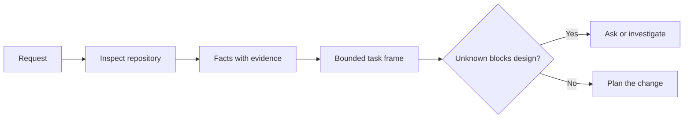

# Enframe a tarefa antes que o agente escreva código

> Um agente de codificação pode implementar uma tarefa clara rapidamente. Também pode implementar uma tarefa não clara rapidamente. A velocidade é a mesma. O custo não é.

**Type:** Learn + Build
**Languages:** Python (stdlib)
**Prerequisites:** Phase 14 lessons 31 and 36
**Time:** ~60 minutes

## Objetivos de aprendizagem

- Transforme um pedido em um quadro de tarefas limitado antes de editar.
- Separar os dados do repositório das suposições e das questões abertas.
- Defina os caminhos permitidos, os caminhos proibidos e a prova de aceitação.
- Decida quando o reconhecimento é suficiente para começar a trabalhar.

## O fracasso caro

 Adicionar proteção duplicada de e-mail soa específico. Não é. A unicidade pertence à API, serviço de domínio ou banco de dados? É a comparação sensível a casos? Que forma de erro já é pública? É permitida uma migração? Que teste prova o comportamento?

Um agente capaz preencherá essas lacunas com opções plausíveis.

A primeira unidade de trabalho do agente de codificação não é, portanto, uma edição, mas um quadro de tarefas apoiado por evidências de repositório.

## O quadro de tarefas

Um quadro útil tem seis campos:

| Field | Question |
|---|---|
| Goal | What observable behavior must change? |
| Repository facts | What did you verify in code, tests, config, or history? |
| Allowed paths | Where may the change land? |
| Forbidden paths | What must remain untouched? |
| Acceptance evidence | Which commands or observations prove the goal? |
| Unknowns | Which decisions still need evidence or human judgment? |

Os dados precisam de recibos. A API usa 409 para duplicados não é um fato até que você possa apontar para o teste ou processador existente. Um caminho de arquivo e linha são suficientes. Um resultado de comando é melhor quando o comportamento importa.



## Reconhecimento é uma busca por restrições

Não leia todo o repositório. Procure as superfícies que restringem a alteração:

1. O comportamento atual e o que lhe chama.
2. O teste mais próximo existente.
3. O contrato público ou a forma serializada.
4. As instruções do projeto que regem o caminho.
5. Os comandos de construção e verificação.
6. Alterações completas semelhantes que revelam padrões locais.

Pare quando cada decisão planejada é apoiada por evidências, explicitamente delegada ou listada como desconhecida.

## Os desconhecidos não são falhas

Um desconhecido é uma lacuna controlada. Uma suposição é uma resposta descontrolada a essa lacuna.

Classificar cada desconhecido:

- **Discoverable:**O repositório ou o sistema operacional podem responder.
- **Decidable:**O contrato de tarefa dá ao agente a autoridade para escolher.
- **Human:**A escolha altera o comportamento do produto, o custo, o risco ou a compatibilidade pública.
- **Deferred:**A escolha está fora desta fatia e pertence a não-alvos.

O agente deve continuar através de incógnitas descobertas e delegadas, deve parar em incógnitas humanas antes que a escolha seja enterrada em código.

## Aceitação antes da execução

Escreva a prova antes do parche.

- um comando de ensaio de unidade ou integração focado;
- Uma viagem de navegador com um ponto de vista designado e estado esperado;
- Um pedido por via eletrónica e um contrato de resposta exata;
- Uma medição de desempenho com um limiar;
- Uma verificação do alcance que confirme que nenhum arquivo não relacionado foi alterado.

Caso de testes não é um plano de prova.

## Construí-lo

O laboratório cria um`TaskFrame`, valida os seus limites e evidências, e escreve `outputs/task-frame.md`- Não .

Correr a partir deste diretório de lições:

```bash
python3 code/main.py
python3 -m unittest discover code/tests -v
```

Descompõe o exemplo de quatro maneiras: remova a meta, remova um recibo de fato, sobrepõe um caminho permitido e proibido e remova o comando de aceitação.

## Use-o num verdadeiro repositório

Antes de pedir a um agente para editar:

1. Escreva o objetivo como um comportamento, não como uma mudança de arquivo.
2. Regista dois ou três fatos com provas exatas.
3. Nomear o menor conjunto de caminhos permitidos.
4. Nomear espaço negativo explicitamente.
5. Escreva o comando ou observação que encerra a tarefa.
6. Faça uma lista das decisões que ainda não ganhou.

O quadro deve caber numa tela. Se não puder, a tarefa pode conter várias alterações independentemente verificáveis.

## Exercícios

1. Enfrente um erro real de um dos teus repositórios sem propor uma solução.
2. Encontre uma alegação no quadro que seja uma suposição e substitua-a por provas.
3. Adicione um humano desconhecido cuja resposta alteraria o contrato público.
4. Dividir um caminho permitido para o menor conjunto de segurança.
5. Adicionar um recibo de alcance à prova de aceitação.

## Mais leitura

- [Nuseibeh and Easterbrook, Requirements Engineering: A Roadmap](https://www.cs.toronto.edu/~sme/papers/2000/ICSE2000.pdf), para ancorar a implementação a metas do mundo real e às restrições em evolução.
- [Yang et al., SWE-agent: Agent-Computer Interfaces Enable Automated Software Engineering](https://arxiv.org/abs/2405.15793), para a prova de que a interface em torno de um agente de codificação altera a sua eficácia.

## O que você guarda

- Não .`outputs/task-frame.md`É a entrada para a próxima lição, onde o quadro torna-se um plano de execução apoiado por evidências.
