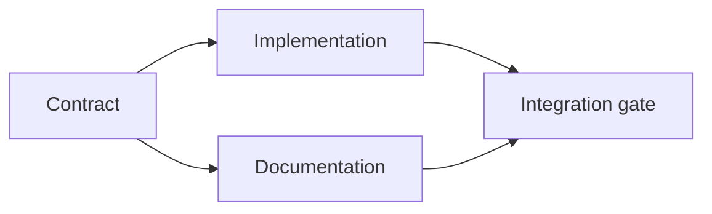

# Faça um plano de execução baseado em evidências

> Um plano não é uma lista de tarefas mais bonita, é um gráfico de dependência em que cada mudança tem uma razão e cada nó terminal tem uma prova.

**Type:** Learn + Build
**Languages:** Python (stdlib)
**Prerequisites:** Phase 14 lesson 43
**Time:** ~65 minutes

## Objetivos de aprendizagem

- Converte um quadro de tarefa em itens de trabalho com evidências e provas.
- Ordem de modelo como dependências em vez de sequência de prosa.
- Detectar fatos perdidos, dependências desconhecidas e ciclos antes de editar.
- Passo separado que pode correr juntos de passos que devem esperar.

## Por que os planos dos agentes falham

Os planos fracos repetem o pedido no tempo futuro:

1. Atualize a API.
2. Adicionar testes.
3. Atualizar a documentação.

Nada nessa lista diz o que foi encontrado, por que esses arquivos são corretos, quais contratos mudam primeiro, ou o que pode acontecer simultaneamente.

Um plano sólido estabelece cinco compromissos para cada item de trabalho:

| Commitment | Purpose |
|---|---|
| Identifier | Stable reference for dependencies and handoff |
| Change | The smallest behavior or contract change |
| Evidence | Repository facts that justify the change |
| Dependencies | Work that must be true first |
| Proof | The exact check that closes the item |

## Planeje o contrato antes de executá-lo

Quando várias superfícies dependem do mesmo comportamento, define o comportamento primeiro. Testes, implementação, documentação e integração podem então compartilhar um contrato em vez de inventar quatro versões.



O gráfico expõe a simultaneidade segura. A implementação e a documentação podem prosseguir juntas após o contrato ser fixado.

## Evidências mudam o plano

A evidência do depósito não é decoração, deve ser capaz de alterar a obra:

- Um auxiliar existente remove uma nova abstração planejada.
- Um teste de compatibilidade obriga a uma mudança.
- Uma restrição de implantação muda uma mudança de esquema para outra tarefa.
- Um tipo de resposta pública altera a ordem de execução e documentação.

Se as provas não podem alterar o plano, provavelmente não são provas para essa decisão.

## Projeto para Interrupção

As sessões de agente de codificação terminam inesperadamente.

- qual item está completo;
- que prova foi apresentada;
- quais os artefatos foram alterados;
- quais dependências estão agora desbloqueadas;
- Qual é o próximo item seguro.

Não codifique o estado apenas nas caixas de seleção dentro de um chat.

## Validação do plano

Rejeitar o plano antes da execução quando:

- O identificador é duplicado;
- um objeto de trabalho não contém provas;
- um objeto de trabalho não tem provas;
- uma dependência designa um item desconhecido;
- O gráfico contém um ciclo;
- A primeira ação irreversível ocorre antes de a incerteza relevante ser resolvida.

Os primeiros cinco controlos são mecânicos, o último exige julgamento e deve ser convocado explicitamente.

## Construí-lo

`code/main.py`Modela os itens de trabalho, valida os seus recibos, calcula as ondas de execução com um tipo topológico e escreve `outputs/evidence-plan.json`- Não .

- Correr .

```bash
python3 code/main.py
python3 -m unittest discover code/tests -v
```

O exemplo produz três ondas. A definição de contrato é executada primeiro. A implementação e a documentação são executadas juntas. O portão de integração é executado em último.

## Usá-lo com um agente de codificação

Peça ao agente para produzir o plano antes de alterar os arquivos.

1. Cada reivindicação de caminho e comportamento tem um recibo de depósito.
2. Cada item tem uma prova clara de conclusão.
3. O gráfico retarda o trabalho caro ou irreversível até que a incerteza da qual depende seja resolvida.

Aproveite o plano, não uma promessa vaga de ser cuidadoso.

## Exercícios

1. Adicionar um item de migração que requer aprovação humana explícita.
2. Crie um ciclo e explique o desacordo oculto por trás dele.
3. Divide um item que tem dois comandos de prova.
4. Adicione um item de trabalho que possa funcionar na segunda onda sem tocar em nenhum dos ramos existentes.
5. Render o plano como Markdown, mantendo o JSON como a fonte da verdade.

## Mais leitura

- [Nuseibeh and Easterbrook, Requirements Engineering: A Roadmap](https://www.cs.toronto.edu/~sme/papers/2000/ICSE2000.pdf), para a relação iterativa entre metas, especificações, acordo e evolução.
- [Barry Boehm, A Spiral Model of Software Development and Enhancement](https://dl.acm.org/doi/10.1145/12944.12948), para ordenar o desenvolvimento em torno da resolução de riscos em vez de uma sequência linear fixa.

## O que você guarda

- Não .`outputs/evidence-plan.json`Torna-se o contrato de delegação na próxima aula.
