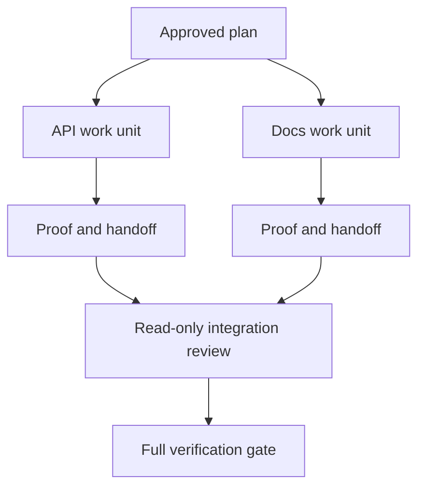

# Agente delegado Trabalha com contratos de isolamento e de fusão

> Os agentes paralelos economizam tempo de parede apenas quando o trabalho é independente.

**Type:** Learn + Build
**Languages:** Python (stdlib)
**Prerequisites:** Phase 14 lessons 39 and 44
**Time:** ~70 minutes

## Objetivos de aprendizagem

- Decidir se a delegação é justificada por uma verdadeira independência.
- Dê a cada trabalhador a propriedade exclusiva dos ficheiros e prova explícita.
- As ondas de execução de computadores de dependências.
- Desenhar um contrato de fusão para combinar o trabalho de agente com segurança.

## O teste de paralelo

Não delegar porque existam mais agentes disponíveis.

- Duas investigações podem responder independentemente a diferentes incógnitas;
- As duas implementações possuem arquivos e contratos distintos;
- Um revisor pode inspecionar um artefato concluído sem alterá-lo;
- Uma verificação externa lenta pode ser executada enquanto o trabalho local continua.

Mantém o trabalho em série quando os agentes precisam dos mesmos arquivos, da mesma decisão não resolvida ou do mesmo ambiente mutável.

## Uma unidade de trabalho é um contrato

Cada unidade delegada precisa:

| Field | Meaning |
|---|---|
| Goal | One observable result |
| Owner | One accountable worker |
| Paths | Exclusive write ownership |
| Dependencies | Completed units required before starting |
| Proof | Exact evidence returned to the integrator |
| Handoff | Files changed, decisions made, remaining risk |

Manifestação do backend não é uma unidade de trabalho. Implementa a verificação duplicada `app/accounts.py`e prová-lo com o teste de conta focada.

## O isolamento tem três camadas

1. **Filesystem isolation:**Os árvores de trabalho ou caixas de areia separadas impedem a edição acidental compartilhada.
2. **Ownership isolation:**Os contratos impedem que dois trabalhadores editem intencionalmente o mesmo caminho.
3. **State isolation:**Os registos e as saídas separadas impedem um trabalhador de sobreescrever a prova de outro trabalhador.

O isolamento do sistema de arquivos não resolve a propriedade. Duas árvores de trabalho limpas ainda podem produzir projetos conflitantes. O contrato de fusão deve resolver interfaces compartilhadas antes do início do trabalho.



## O integrador não reconstrui a obra

O integrador deve:

1. confirmar que cada entrega corresponde ao seu âmbito de aplicação atribuído;
2. Leia a prova, não apenas o resumo do trabalhador;
3. Combinar as alterações na ordem de dependência;
4. executar o portão transversal completo;
5. Rejeitar a expansão oculta do âmbito de aplicação;
6. registar conflitos como novas decisões, não como edições silenciosas.

Se a integração requer a reescritura da maior parte do resultado de um trabalhador, a decomposição original foi errada.

## Funções Humanas e Agentes

A delegação não remove o julgamento humano. O humano ainda possui escolhas que mudam o comportamento público, risco, autoridade ou custo irreversível.

Esta é uma autonomia calibrada: o sistema concede liberdade quando as evidências e o retrocesso são fortes, e requer um ponto de controlo quando as consequências são altas.

## Construí-lo

O laboratório verifica a sobreposição dos caminhos, valida dependências, calcula ondas de execução seguras e escreve `outputs/delegation-plan.json`- Não .

- Correr .

```bash
python3 code/main.py
python3 -m unittest discover code/tests -v
```

Mudança a unidade de documentos para a posse `app/`O plano deve bloquear porque a rota principal se sobrepõe à unidade API.

## Exercícios

1. Descompõe uma mudança real em duas unidades de trabalho independentes e um integrador.
2. Encontre uma divisão paralela proposta que só pareça independente.
3. Adicione um pesquisador de somente leitura cujo resultado é uma tabela de fatos.
4. Adicione um portão de fusão que verifica o conjunto final de arquivos alterados contra todos os contratos unitários.
5. Defina uma regra de cancelamento para um trabalhador cuja dependência se torna inválida.

## Mais leitura

- [Reid Smith, The Contract Net Protocol](https://doi.org/10.1109/TC.1980.1675516), para um tratamento formal precoce da atribuição distribuída de tarefas e da comunicação de resultados.
- [Eric Horvitz, Principles of Mixed-Initiative User Interfaces](https://dl.acm.org/doi/10.1145/302979.303030), para decidir quando a automação deve agir e quando deve devolver o controlo a uma pessoa.

## O que você guarda

- Não .`outputs/delegation-plan.json`Regista por que a separação é segura, quem é o dono de cada caminho e que provas a integração deve receber.
