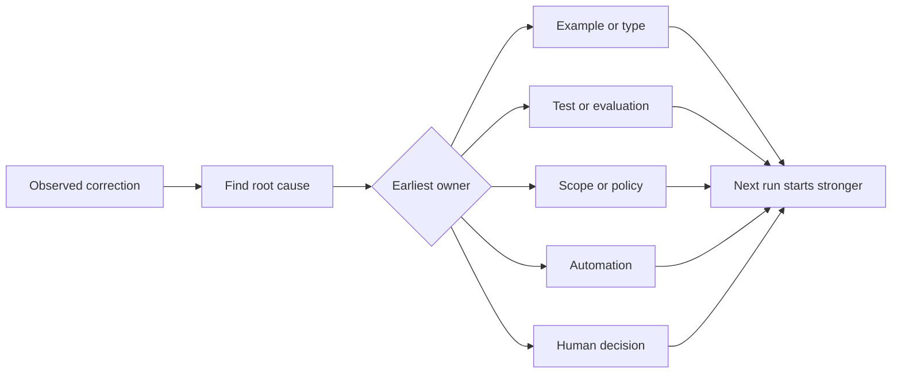

# Transforme cada correção de agente em uma melhoria do sistema

> Uma correção que só vive no chat corrige uma execução. Uma correção promovida para um teste, limite, exemplo ou ferramenta melhora cada execução posterior.

**Type:** Learn + Build
**Languages:** Python (stdlib)
**Prerequisites:** Phase 14 lessons 37 to 41
**Time:** ~65 minutes

## Objetivos de aprendizagem

- Convertem correções de agente em controles duráveis.
- Coloque cada controlo na camada mais antiga que possa impedir a recorrência.
- Desdobrar aulas repetidas com impressões digitais estáveis.
- Retirar controles que não protegem mais um risco real.

## Corrigências são evidências

Quando você diz a um agente  não editar esse arquivo, você aprendeu que o limite de alcance não era executável. Quando você diz  esta forma de saída é errada, você aprendeu que um exemplo ou teste estava faltando. Quando a configuração falha novamente, você aprendeu que o conhecimento do ambiente pertence à automação.

Trate a correção como uma observação sobre o sistema de trabalho, não como um erro de escrita imediato.

## Promover para a camada mais eficaz

Use esta ordem:

| Recurring failure | Durable destination |
|---|---|
| Wrong result or regression | Test or evaluation |
| Off-scope or unsafe action | Scope or permission policy |
| Repeated setup or command mistake | Automation or tool |
| Repeated output-format mistake | Canonical example plus validator |
| Ambiguous local convention | Instruction with a scenario check |
| Product disagreement | Human decision record |

Os controles anteriores são mais baratos. Um tipo que impede um estado inválido é mais forte do que um comentário de revisão que o capta mais tarde. Um teste focado é mais forte do que um parágrafo pedindo ao agente para se lembrar.



## O Registo Ratchet

Captura:

- Sintoma;
- Causa raiz;
- Consequência;
- Número de recorrências;
- O controlo escolhido;
- Verificação para o controlo;
- proprietário;
- data de revisão ou de aposentadoria.

Não promover todas as preferências únicas, mas promover uma correcção quando a recorrência ou consequência justificar a complexidade permanente.

## Causa separada do sintoma

O agente editado README é um sintoma.

- A tarefa permitiu a raiz do repositório;
- Os documentos foram implicitamente considerados seguros;
- A execução e a documentação do plano em conjunto;
- Dois trabalhadores tinham propriedade sobrepostas.

Cada causa pertence a um controle diferente, uma regra que apenas repete o sintoma falhará no próximo caso ligeiramente diferente.

## Os controles também estão a decadência

Os controles antigos podem entrar em conflito, inchar conteúdo e codificar um sistema que não existe mais.

- A arquitetura subjacente mudou;
- O controlo executável mais forte o substituiu;
- A falha não se repetiu numa janela significativa;
- O controlo cria mais atrito do que o risco que prevê.

O objetivo não é o arquivo de instruções mais longo, mas o sistema mais pequeno que preserva o julgamento duramente ganho.

## Construí-lo

O laboratório classifica as correções, promove-as em controles, duplica as impressões digitais e escreve.`outputs/feedback-ratchet.json`- Não .

- Correr .

```bash
python3 code/main.py
python3 -m unittest discover code/tests -v
```

Adicionar duas correções de formulação diferente com a mesma causa. Melhorar a normalização até que eles colapsem em um controle sem que colapsem falhas não relacionadas.

## Exercícios

1. Tome cinco correções de uma sessão de codificação recente e classifique os seus verdadeiros proprietários.
2. Substitua uma regra de prosa por um teste executável.
3. Adicionar uma ponderação de consequências para que uma primeira ocorrência grave possa ser promovida imediatamente.
4. Adicione um proprietário e data de aposentadoria à saída do laboratório.
5. Revisar uma instrução de agente existente e excluí-la apenas após provar que existe um controlo mais forte.

## Mais leitura

- [Basili, Caldiera, and Rombach, The Goal Question Metric Approach](https://www.cs.toronto.edu/~sme/CSC444F/handouts/GQM-paper.pdf), para transformar os objectivos em questões e medidas operacionais.
- [Shinn et al., Reflexion](https://arxiv.org/abs/2303.11366), para utilizar os traços de feedback para melhorar as decisões posteriores sem alterar os pesos do modelo.
- [Madaan et al., Self-Refine](https://arxiv.org/abs/2303.17651), para feedback iterativo e revisão dentro de um loop de tarefas.

## O que você guarda

- Não .`outputs/feedback-ratchet.json`É o fim duradouro do caminho de Engenharia Assistida por Agentes e a entrada para futuras mudanças no banco de trabalho.
