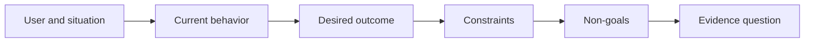

# Defina o resultado antes de escolher o resultado

> A implementação rápida aumenta a penalidade por escolher o problema errado.

**Type:** Learn + Build
**Languages:** Python (stdlib)
**Prerequisites:** None
**Time:** ~60 minutes

## Objetivos de aprendizagem

- Escreva um quadro de resultado sem nomear uma solução.
- Identifique o usuário, a situação, o comportamento atual e a mudança desejada.
- Faça as restrições e os não-alvos explícitos.
- Detectar vazamento de solução antes de endurecer em escopo.

## O resultado não é resultado

Construir um assistente de incidente nomeia uma saída.

Um quadro de resultados diz:

> Quando chega um alerta de produção, o engenheiro em serviço de chamada identifica o serviço falhado e uma ação segura seguinte dentro de dois minutos, enquanto o diagnóstico permanece apenas leitível e auditable.

Essa frase pode ser satisfeita por um software, um runbook, uma reparação de dados ou uma pequena alteração de interface.

## O quadro de seis partes

| Part | Question |
|---|---|
| User | Who experiences the problem directly? |
| Situation | When and where does it occur? |
| Current behavior | What happens today, including workarounds? |
| Desired outcome | What observable state should improve? |
| Constraints | Which safety, policy, cost, or compatibility limits are fixed? |
| Non-goals | What tempting adjacent work is excluded? |



## Encontrar uma solução

As declarações de resultados vazam soluções quando contêm uma forma de produto, interface, escolha de modelo, estrutura ou arquitetura que não foi obtida por evidências.

- Os utilizadores recebem um resumo semanal da IA vazamentos do resumo e da cadência.
- Os utilizadores entendem as alterações da conta antes da aprovação declara o resultado.
- Deplojar um banco de dados de vetores vazamentos de infraestrutura.
- Devemos ter evidências políticas relevantes durante a revisãoindica uma capacidade.

As restrições podem nomear a tecnologia quando a compatibilidade realmente a corrige.

## As restrições protegem o resultado

As restrições não são detalhes de implementação, fazem parte do objetivo do mundo real:

- Não há produção que escreva durante o diagnóstico;
- Resposta dentro do orçamento do tempo de incidente;
- Os eventos de auditoria existentes continuam a ser autorizados;
- Não haverá nova dependência do tempo de execução;
- O comportamento de acessibilidade permanece intacto.

Uma construção que atinge o resultado por violar uma restrição não alcançou o resultado.

## Não-Objetivos Criam um Limite

Os objetivos não-focais impedem que uma fatia útil se torne uma plataforma.

- Não há remediação automática;
- Não há novo sistema de envio de alertas;
- Não substituir o comandante do incidente;
- Não há análises históricas nesta fatia.

## Construí-lo

O laboratório valida um`OutcomeFrame`E escreve.`outputs/outcome-frame.json`- Não .

```bash
python3 code/main.py
python3 -m unittest discover code/tests -v
```

Substitua o resultado desejado por utilizar o assistente de incidente. O validador deve indicar que o resultado proposto foi filtrado no resultado.

## Exercícios

1. Reescrever um pedido de recurso do seu backlog como um quadro de resultado.
2. Adicionar uma restrição que altera as soluções que permanecem possíveis.
3. Adicione dois não-alvos que mantenham a primeira fatia pequena.
4. Identifique a observação mais antiga que refutaria o resultado desejado.
5. Escreva três resultados diferentes que poderiam satisfazer o mesmo resultado.

## Mais leitura

- [Nuseibeh and Easterbrook, Requirements Engineering: A Roadmap](https://www.cs.toronto.edu/~sme/papers/2000/ICSE2000.pdf), para tratar metas do mundo real como a âncora para o trabalho de software.
- [Dardenne, van Lamsweerde, and Fickas, Goal-Directed Requirements Acquisition](https://doi.org/10.1016/0167-6423(93)90021-G), para refinar os objectivos de alto nível em restrições e requisitos operacionais.

## O que você guarda

- Não .`outputs/outcome-frame.json`A próxima lição testa-o contra o fluxo de trabalho que as pessoas realmente executam.
