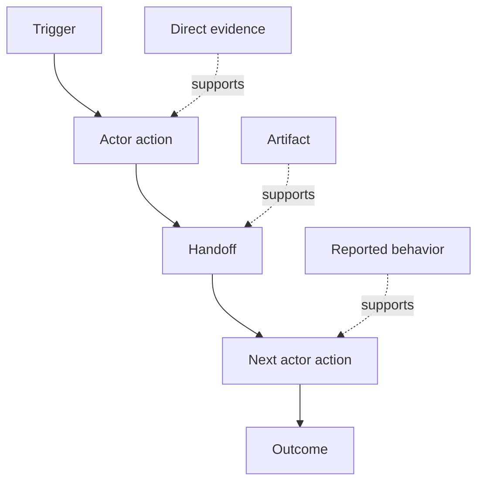

# Descubra o fluxo de trabalho que as pessoas realmente realizam

> Os requisitos não estão esperando em uma reunião para ser coletados, mas estão espalhados por ações, soluções, registros e desentendimentos.

**Type:** Learn + Build
**Languages:** Python (stdlib)
**Prerequisites:** Phase 14 lesson 47
**Time:** ~70 minutes

## Objetivos de aprendizagem

- Modela o fluxo de trabalho atual como ações ordenadas com evidências.
- Separar observação direta do comportamento relatado ou inferido.
- Localize o atrito, as entregações, a autoridade e o estado oculto.
- Mantenha visíveis as alegações incertas, em vez de transformá-las em requisitos.

## Comece com o sistema atual

Não comece por perguntar quais são as características que as pessoas querem, comece por reconstruir o que acontece agora.

Para cada passo, registar:

| Field | Example |
|---|---|
| Actor | On-call engineer |
| Trigger | Production alert arrives |
| Action | Opens alert, then searches dashboards |
| Input | Alert payload and deployment record |
| Output | Candidate service and owner |
| Friction | Context switching across three tools |
| Authority | Incident commander approves a write |
| Evidence | Screen recording, incident log, runbook |

O fluxo de trabalho é maior do que a tela. Inclui espera, copiar-pegar, canais laterais, aprovação, recuperação de erros e os passos que as pessoas deixaram de notar.

## A evidência é forte

Use uma simples escada de provas:

1. **Direct behavior:**Observação, rastreamento, gravação ou evento do sistema.
2. **Artifact:**bilhete, cadastro de execução, registro, formulário ou saída concluída.
3. **Reported behavior:**uma pessoa descreve o que faz.
4. **Inference:**A equipa conclui o que provavelmente acontecerá.

Os quatro podem ser úteis, apenas os dois primeiros provam o comportamento atual diretamente, e os outros são marcados para que a confiança não se infle silenciosamente.



## Procure quatro coisas

- **Friction:**esforço repetido, atraso, reentrada ou recuperação.
- **Hidden state:**fatos levados em memória, conversa ou notas pessoais.
- **Authority:**A pessoa ou sistema autorizado a efectuar uma alteração consequente.
- **Exceptions:**O caso em que o fluxo de trabalho normal deixe de ser normal.

As características da IA muitas vezes falham em entregas e exceções porque o caminho feliz era o único caminho moldado.

## Não se desprenda de discordâncias

Os dois utilizadores podem executar fluxos de trabalho diferentes por boas razões.

- diferentes funções;
- diferentes níveis de risco;
- O processo anterior e o atual;
- Diferenças de competência;
- Uma verdadeira divergência política.

Um fluxo de trabalho médio não pode descrever ninguém.

## Construí-lo

O laboratório armazena evidências em cada etapa do fluxo de trabalho, valida a ordem e a confiança, calcula a relação entre evidências diretas e escreve `outputs/workflow-evidence.json`- Não .

```bash
python3 code/main.py
python3 -m unittest discover code/tests -v
```

Adicione um caminho excepcional no qual o registro de implantação está faltando.

## Exercícios

1. Reconstruir um fluxo de trabalho de um registro sem entrevistar ninguém.
2. Entrevistar um utilizador e marcar todas as alegações que ainda não tenham provas diretas.
3. Adicione um limite de autoridade e um passo de recuperação de falhas.
4. Modelo de duas variantes de fluxo de trabalho sem as fundir.
5. Identifique uma característica proposta que remova um passo visível, mas deixa o trabalho oculto intocado.

## Mais leitura

- [Nuseibeh and Easterbrook, Requirements Engineering: A Roadmap](https://www.cs.toronto.edu/~sme/papers/2000/ICSE2000.pdf), especialmente o seu tratamento da elicitação como interpretação, modelagem e validação em vez de simples captura.
- [Gotel and Finkelstein, An Analysis of the Requirements Traceability Problem](https://doi.org/10.1109/ICRE.1994.292398), por dificuldade em preservar a relação entre os requisitos e as suas fontes.

## O que você guarda

- Não .`outputs/workflow-evidence.json`Transforma o atrito e a incerteza observados num mapa de suposições na próxima lição.
