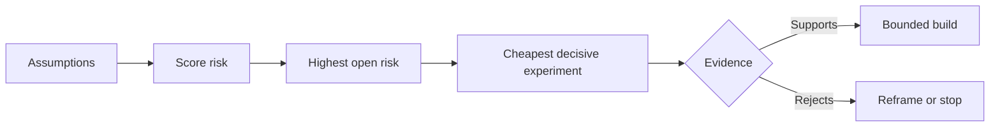

# Mapa de suposições e resolva primeiro a mais arriscada

> Um mapa de estrada esconde incerteza dentro de características.

**Type:** Learn + Build
**Languages:** Python (stdlib)
**Prerequisites:** Phase 14 lesson 48
**Time:** ~65 minutes

## Objetivos de aprendizagem

- Convertem o trabalho proposto em suposições explícitas.
- O impacto, a incerteza e a irreversão são indicados separadamente.
- Escolha a próxima experiência por risco, não pelo entusiasmo.
- Substituir as suposições testadas por evidências e decisões.

## Cada edifício contém apostas

Uma ferramenta de incidente pode depender de que todas estas informações sejam verdadeiras:

- O contexto de alerta contém informações suficientes para identificar um serviço;
- Os engenheiros confiam numa recomendação que não foram eles próprios a obter;
- O tempo de resposta desejado é importante operacionalmente;
- Os dados necessários podem ser acessados sem autoridade insegura;
- O fluxo de trabalho ocorre com frequência suficiente para justificar a manutenção.

Estas não são tarefas de implementação, mas condições para que a construção seja valiosa, utilizável, viável e segura.

## Classificação de assuntos

| Class | Question |
|---|---|
| Value | Will the outcome matter enough? |
| Usability | Can the user understand and act on it? |
| Feasibility | Can the system produce it with available data and constraints? |
| Viability | Can the organization sustain cost, ownership, and operation? |
| Safety | Can it fail without unacceptable consequence? |

Escreva suposições como declarações falsificáveis. A característica é útil não pode ser testada. Oito de dez engenheiros em chamada identificam o serviço correto mais rapidamente com o resultado de somente leitura pode.

## O risco não é um número

O laboratório usa três dimensões de um a cinco:

- **Impact:**danos se a suposição for falsa.
- **Uncertainty:**fraqueza das provas atuais.
- **Irreversibility:**custos de aprendizagem após o compromisso.

A pontuação do exemplo multiplica o impacto e a incerteza, adicionando então a irreversão. A fórmula não é universal.



## Conceba uma experiência, não um ritual de confirmação

Um teste útil tem:

- Uma alegação que possa ser falsa;
- Uma população ou uma amostra realista;
- Um resultado observável;
- Um limiar decidido antes do resultado;
- A próxima decisão é a de passar, falhar e provas ambíguas.

Evite os testes que só demonstram que a equipe pode construir a ideia.

## Reversibilidade muda ordem

As escolhas irreversíveis e de alta consequência precisam de evidências anteriores. Uma repetição de somente leitura pode preceder uma integração de produção. Um adaptador temporário pode preceder uma migração de dados. Uma recomendação aprovada pelo ser humano pode preceder uma ação automática.

A forma da construção deve seguir a forma da incerteza.

## Construí-lo

O laboratório classifica suposições, distingue as reivindicações testadas de abertas, seleciona o maior risco aberto e escreve `outputs/assumption-map.json`- Não .

```bash
python3 code/main.py
python3 -m unittest discover code/tests -v
```

Mudança das evidências sobre a suposição de maior risco e observe como a próxima experiência muda.

## Exercícios

1. Escreva cinco suposições para um recurso que deseja construir.
2. Adicione uma suposição de segurança que a sua lista de características omitiu.
3. Defina um limiar que te faça parar a construção.
4. Substitua um grande experimento por um teste mais barato e decisivo.
5. Compare a classificação de riscos com a prioridade do roteiro e explique a desajuste.

## Mais leitura

- [Barry Boehm, A Spiral Model of Software Development and Enhancement](https://dl.acm.org/doi/10.1145/12944.12948), para um ciclo de desenvolvimento orientado ao risco que resolva a incerteza antes de um compromisso mais profundo.
- [Dardenne, van Lamsweerde, and Fickas, Goal-Directed Requirements Acquisition](https://doi.org/10.1016/0167-6423(93)90021-G), para refinar os objectivos ao mesmo tempo em que surgem obstáculos e restrições.

## O que você guarda

- Não .`outputs/assumption-map.json`A próxima lição usa-o para escolher a parte mais pequena que possa produzir provas decisivas.
