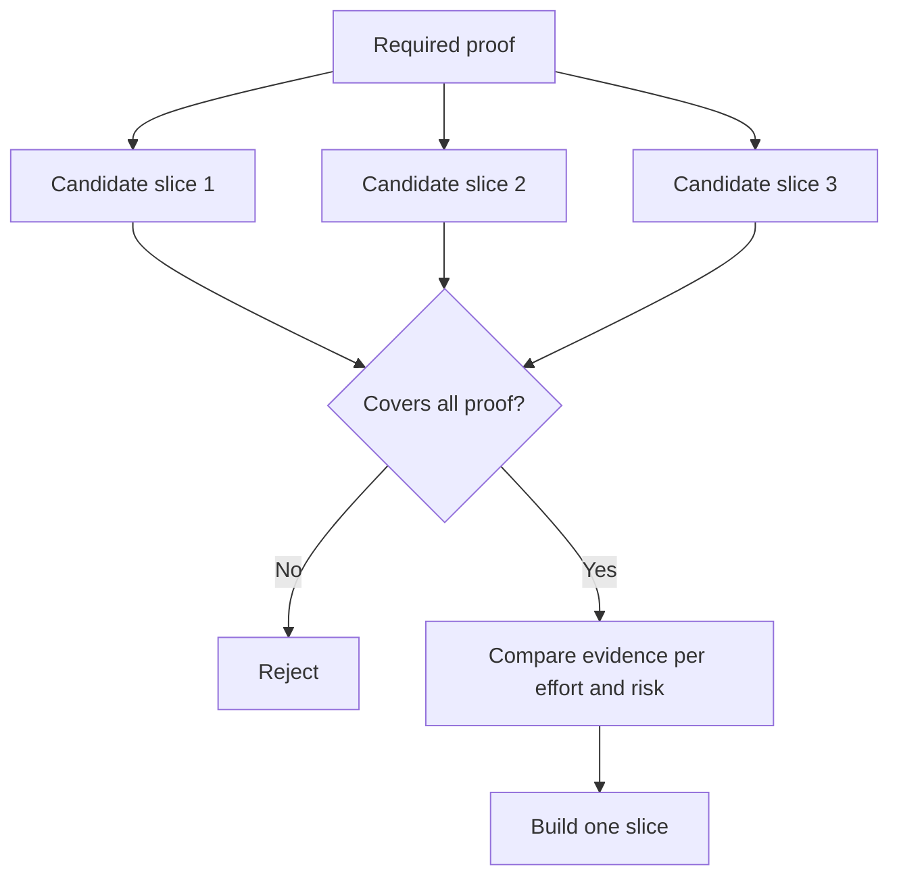

# Escolha o pedaço mais pequeno que possa mudar a decisão

> Uma pequena construção que não pode mudar a próxima decisão é meramente incompleta.

**Type:** Learn + Build
**Languages:** Python (stdlib)
**Prerequisites:** Phase 14 lesson 49
**Time:** ~65 minutes

## Objetivos de aprendizagem

- Defina uma fatia com base nas suposições que ela prova.
- Equilibrar o valor do resultado, a redução da incerteza, o esforço e a consequência.
- Prefere provas reversíveis ao compromisso de produção prematura.
- Rejeitar as fatias que omitem a parte arriscada do fluxo de trabalho.

## Vertical Means Evidência Final a fim

Uma fatia útil cruza o fluxo de trabalho real mínimo necessário para observar um resultado. Pode ser estreita em usuários, dados, duração e capacidade. Não deve ser estreita eliminando a incerteza exata que você precisa testar.

Exemplos:

- Uma repetição de apenas leitura em dez incidentes reais testa a identificação do serviço e a confiança do operador.
- Um painel polido em dados sintéticos pode testar a compreensão, mas não a viabilidade dos dados.
- Um automediador de produção testa tudo de uma vez com consequências inaceitáveis.

## Defina primeiro a prova necessária

Tomar as suposições abertas de maior risco e transformá-las num conjunto de provas exigidas.

Em seguida, compare as fatias elegíveis em:

| Dimension | Direction |
|---|---|
| Outcome value | More is better |
| Uncertainty reduced | More is better |
| Effort | Less is better |
| Consequence | Less is better |
| Reversibility | More is better |

A pontuação do laboratório é intencionalmente simples.



## Minimos falsos comuns

- **The UI-only minimum:**Elimina os dados e a incerteza operacional.
- **The infrastructure-only minimum:**prova uma possibilidade técnica sem valor para o utilizador.
- **The happy-path minimum:**O que é mais perigoso é que não há excepção.
- **The demo minimum:**produz um artefato persuasivo, mas não uma medida repetível.
- **The platform minimum:**Construir máquinas reutilizáveis antes de um fluxo de trabalho ganhá-las.

## Adicionar uma regra de parada

Antes da implementação, escreva o que acontece se a fatia falhar:

- abandonar o resultado;
- Alterar o utilizador-alvo ou a situação;
- Teste um mecanismo diferente;
- recolher melhores provas;
- Mas ainda mais poder restrito.

Se cada resultado levar à construção, a fatia não é um experimento.

## Construí-lo

O laboratório filtra os candidatos com as provas necessárias, marca as fatias elegíveis e escreve `outputs/slice-decision.json`- Não .

```bash
python3 code/main.py
python3 -m unittest discover code/tests -v
```

Adicione um candidato mais barato que provem apenas uma suposição necessária.

## Exercícios

1. Desenhar três fatias para o mesmo resultado em diferentes níveis de consequências.
2. Indique a prova necessária antes de as marcar.
3. Remover uma capacidade, preservando a prova decisiva.
4. Adicione uma regra de parada para um piloto falhado.
5. Identificar um componente reutilizarável da plataforma que deve esperar até o término da fatia.

## Mais leitura

- [Barry Boehm, A Spiral Model of Software Development and Enhancement](https://dl.acm.org/doi/10.1145/12944.12948), para combinar cada ciclo de desenvolvimento com os riscos que deve resolver.
- [Lenarduzzi and Taibi, MVP Explained: A Systematic Mapping Study on the Definitions of Minimal Viable Product](https://arxiv.org/abs/1609.07592), pela ambiguidade em torno de minimum e viable na prática de produtos de software.

## O que você guarda

- Não .`outputs/slice-decision.json`Ele registra porque é que esta fatia é a menor que pode mudar a decisão.
