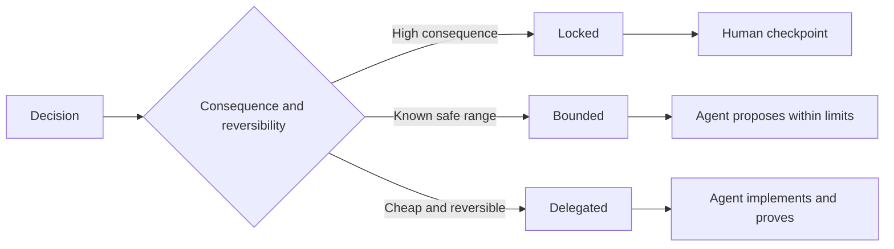

# Escreva especificações que preservem o julgamento

> Uma especificação útil fixa invariantes e evidências, deixando as opções de implementação reversíveis abertas.

**Type:** Learn + Build
**Languages:** Python (stdlib)
**Prerequisites:** Phase 14 lesson 50
**Time:** ~75 minutes

## Objetivos de aprendizagem

- Resultados separados, invariantes, exemplos, não-objetivos e prova.
- Marque as decisões como fechadas, limitadas ou delegadas.
- Preserva o julgamento dos agentes onde as escolhas são baratas e reversíveis.
- Requerem postos de controlo humanos onde as consequências ou o comportamento público mudem.

## Dois extremos maus

Uma tarefa abaixo especificada pede a um agente para adivinhar o sistema.

O meio útil é um contrato executável:

| Surface | Purpose |
|---|---|
| Outcome | The observable result |
| Invariants | Conditions that must always remain true |
| Examples | Concrete cases that reveal intent |
| Non-goals | Adjacent behavior intentionally excluded |
| Decision policy | Which choices are locked, bounded, or delegated |
| Proof | Evidence required before completion |

## Três modos de decisão

- **Locked:**O agente não deve escolher. Uso para compatibilidade pública, autoridade, segurança, custo irreversível ou compromisso com o produto.
- **Bounded:**O agente pode escolher dentro de limites explícitos. Uso para orçamentos de pesquisa, contagens de retest, dependências permitidas ou uma família de interface conhecida.
- **Delegated:**O agente é dono da escolha e deve explicá-la.



## Especifique o comportamento por meio de exemplos

Exemplos comprimem a intenção melhor do que adjetivos. Helpful, robust, e production-ready não são executáveis. Um pequeno conjunto de exemplos normais, vantagem, falha e proibidos dá ao construtor e verificador algo concreto.

Os exemplos não substituem as invariantes.

## Prova deve corresponder à alegação

- Um teste unitário prova um contrato de função local.
- Um teste de fio prova a serialização e o comportamento de transporte.
- Uma viagem de navegador prova um caminho de interface.
- Um conjunto de repetições prova o comportamento sobre casos representativos.
- Um registro de auditoria prova que os limites de autoridade foram mantidos.

Não aceite uma camada inferior como prova de uma alegação de camada superior.

## Preserve as desconhecidas de propósito

Uma especificação pode dizer que a execução pode escolher qualquer fonte de somente leitura que retorne dentro do orçamento temporal.

As especificações devem evoluir quando as evidências mudarem. Preservar a razão por trás de escolhas fechadas e limitadas para que equipes posteriores possam revê-las sem arqueologia.

## Construí-lo

O laboratório valida todas as superfícies do contrato, verifica os modos de decisão e escreve.`outputs/executable-specification.json`- Não .

```bash
python3 code/main.py
python3 -m unittest discover code/tests -v
```

Mover a decisão de produção-escrever de bloqueado para delegado. Explique por que o esquema aceita o valor mas o risco do produto não.

## Exercícios

1. Converte um bilhete de atrasos nas seis superfícies de especificação.
2. Substituir três instruções de execução por uma invariante e dois exemplos.
3. Marque todas as decisões e justifique cada escolha bloqueada ou limitada.
4. Adicione um recibo de prova para cada invariante.
5. Eliminar uma restrição que não tenha provas ou razões para o risco.

## Mais leitura

- [Nuseibeh and Easterbrook, Requirements Engineering: A Roadmap](https://www.cs.toronto.edu/~sme/papers/2000/ICSE2000.pdf), para a relação entre metas, especificações precisas, validação, acordo e evolução.
- [Zave and Jackson, Four Dark Corners of Requirements Engineering](https://doi.org/10.1145/267895.267896), para a separação de pressupostos, requisitos e especificações ambientais.
- [Gotel and Finkelstein, An Analysis of the Requirements Traceability Problem](https://doi.org/10.1109/ICRE.1994.292398), para preservar o porquê de existir uma exigência e de onde veio.

## O que você guarda

- Não .`outputs/executable-specification.json`Torna-se o contrato que os agentes de codificação e os revisores humanos compartilham.
