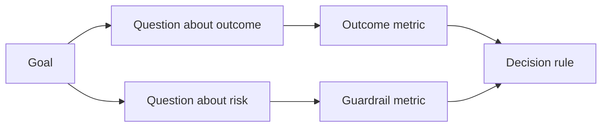

# Projetar Metricas de Sucesso Antes de o Resultado existir

> A medição deve responder a uma decisão, não decorar um painel de instrumentos. Comece com o objetivo, derive perguntas, e depois escolha as menores métricas que as respondam.

**Type:** Learn + Build
**Languages:** Python (stdlib)
**Prerequisites:** Phase 14 lessons 47 and 51
**Time:** ~70 minutes

## Objetivos de aprendizagem

- Derivar perguntas e métricas de um objetivo final.
- Defina os limiares, janelas, fontes e direções antes de observar os resultados.
- Combinar métricas de resultado com barris e contra-metricas.
- A prova da avaliação corresponde à decisão que a construção deve apoiar.

## Objetivo, Pergunta, Métrica

Comece com um objetivo:

> Reduzir o tempo de identificação do serviço afectado sem aumentar as ações inseguras.

Perguntas derivadas:

- Quão rapidamente é identificado o serviço correto?
- Quantas vezes o serviço identificado é correto?
- O diagnóstico continua a ser apenas lido?
- O fluxo de trabalho aumenta a desativação de alertas ou a carga de trabalho do operador?

Então escolha métricas que operationalizem essas perguntas.



## Uma métrica precisa de um contrato

Cada métrica precisa:

| Field | Example |
|---|---|
| Name | `median_identification_seconds` |
| Direction | at most |
| Threshold | 120 |
| Window | ten incident replays |
| Source | replay event log |
| Population | on-call engineers in the pilot |
| Kind | outcome or guardrail |

Sem fonte e janela, um número não pode ser reproduzido.

## Resultado, guarda-roupa e contra-metrica

- **Outcome metric:**melhorou o estado desejado?
- **Guardrail:**Será que uma restrição fixa permaneceu verdadeira?
- **Counter-metric:**O melhoramento local custou ou prejudicou noutro lugar?

Para um fluxo de trabalho incidente, a velocidade não é suficiente. Corretidão, gravações de produção, carga de trabalho do operador e alertas perdidas protegem contra um resultado rápido, mas inseguro.

## Evidências Offline e Online

O replay offline é útil para repetibilidade e cobertura de borda. Um piloto limitado é útil para efeitos reais de comportamento, confiança e fluxo de trabalho. Nenhum substitui o outro.

Use as provas mais baratas que possam responder à decisão em curso.

## Decida antes de medir

Escreva o pass, falhas e caminhos ambíguos antes de ver resultados.

Exemplo:

- Passagem: taxa de serviço correta de pelo menos 0,9 e tempo médio de 120 segundos;
- falha: qualquer taxa de produção ou correcção inferior a 0,75;
- ambiguidade: pequena melhoria com ampla variação, que exige um conjunto de repetições maior.

## Construí-lo

O laboratório valida um plano de medição, avalia os limites inclusivos, registra os valores faltantes e escreve `outputs/measurement-report.json`- Não .

```bash
python3 code/main.py
python3 -m unittest discover code/tests -v
```

Remova a métrica de proteção e observe por que o plano se torna inválido mesmo quando as métricas de resultado permanecem.

## Exercícios

1. Derivar três perguntas de um objetivo final.
2. Adicione uma contra-metrica que capta o custo transferido para outro papel.
3. Defina a fonte, população e janela para cada métrica.
4. Escreva passes, falhas e decisões ambíguas antes de gerar valores.
5. Identifique uma métrica que seja fácil de coletar, mas não pode alterar a decisão.

## Mais leitura

- [Basili, Software Modeling and Measurement: The Goal/Question/Metric Paradigm](https://drum.lib.umd.edu/items/8119803a-362b-42ec-b6ce-2311713e7236), para a obtenção de medições operacionais a partir de objectivos explícitos.
- [Basili, Caldiera, and Rombach, The Goal Question Metric Approach](https://www.cs.toronto.edu/~sme/CSC444F/handouts/GQM-paper.pdf), para a aplicação do método como sistema de feedback e melhoria.

## O que você guarda

- Não .`outputs/measurement-report.json`- define o portal de prova para o protótipo, o piloto ou a fase de produção.
