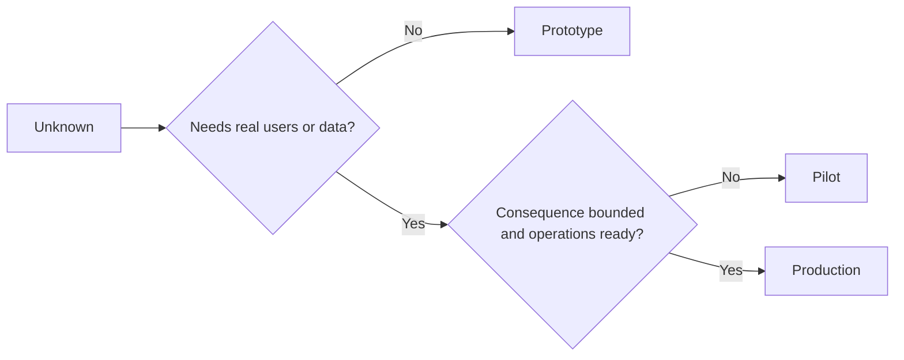

# Escolha o protótipo, o piloto ou a produção deliberadamente

> Esses são diferentes ambientes de aprendizagem, não níveis de poluição. Escolha o estágio que responde à corrente desconhecida com a menor consequência desnecessária.

**Type:** Learn + Build
**Languages:** Python (stdlib)
**Prerequisites:** Phase 14 lessons 50 to 52
**Time:** ~70 minutes

## Objetivos de aprendizagem

- Escolha um estágio de construção do desconhecido, público, dados, consequência e prontidão.
- Defina os controlos específicos de fase e os critérios de saída.
- Prevenção de que os protótipos se tornem silenciosamente sistemas de produção.
- Retardar a autoridade real até que a evidência e as operações a justificem.

## Três perguntas diferentes

| Stage | Primary question |
|---|---|
| Prototype | Can this mechanism produce the evidence at all? |
| Pilot | Does it work safely with a bounded real audience and real conditions? |
| Production | Can we own it continuously at the promised reliability and risk level? |

Um protótipo pode ser tecnicamente completo e ainda ser descartável. Um piloto pode usar dados de produção, mantendo-se limitado em público e autoridade. A produção começa quando a organização aceita a responsabilidade contínua.

## Protótipo

Use um protótipo quando o desconhecido não requer usuários reais ou dados reais.

- Discaráveis;
- Isolados;
- - comportamentos estreitos;
- Explicita a questão da aprendizagem;
- Sem falsas garantias operacionais.

Não otimize a arquitetura antes que o mecanismo ganhe outro estágio.

## Pilotão

Use um piloto quando o desconhecido requer comportamento real, dados realistas ou um fluxo de trabalho real, mas a consequência ou a prontidão ainda não é compatível com a liberação ampla.

Um piloto precisa:

- um público designado;
- um proprietário humano;
- duração e autoridade limitadas;
- Auditoria e retrocesso;
- Os limites de saída e de proteção;
- Critérios de saída para expansão, revisão ou parada.

## Produção

A produção requer mais do que a implantação:

- Objetivo de nível de serviço;
- Propriedade de pedido e de incidente;
- Revisão da segurança e da privacidade;
- Controles de custos e de capacidade;
- Rolo de volta e recuperação;
- Monitoramento contínuo;
- um caminho para a aposentadoria.



## Drift de estágio

O prototipo de código torna-se perigoso quando adquire usuários, dados ou autoridade sem adquirir propriedade. Marque limites do prototipo e piloto na configuração, controle de acesso, telemetria e documentação.

O estágio deve ser observável a partir do próprio sistema.

## Construí-lo

O laboratório escolhe um estágio do contexto da decisão, retorna os controles necessários e escreve `outputs/stage-decisions.json`- Não .

```bash
python3 code/main.py
python3 -m unittest discover code/tests -v
```

Crie o exemplo piloto para uma baixa consequência com prontidão operacional.

## Exercícios

1. Classificar três projectos em curso por fase de aprendizagem, não por estado de implantação.
2. Escrever critérios de saída do piloto que incluam uma decisão de parada.
3. Adicionar um controlo técnico que impeda que um protótipo chegue aos dados de produção.
4. Identificar a primeira responsabilidade operacional que faz a produção de construção.
5. Desenhar um recibo de volta para o piloto limitado.

## Mais leitura

- [Barry Boehm, A Spiral Model of Software Development and Enhancement](https://dl.acm.org/doi/10.1145/12944.12948), para combinar o compromisso de cada iteração com o risco resolvido.
- [Fagerholm et al., Building Blocks for Continuous Experimentation](https://doi.org/10.1145/2601248.2601276), para as condições organizacionais e técnicas necessárias para a execução contínua dos experimentos.

## O que você guarda

- Não .`outputs/stage-decisions.json`- Regista por que cada etapa é justificada e quais os controles devem existir antes da próxima.
