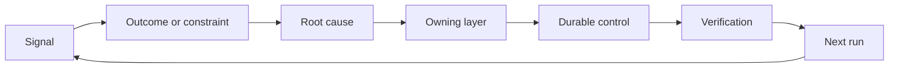

# Construir um Ratchet de Feedback com Propriedade e aposentadoria

> A navegação fecha um ciclo de construção e abre o ciclo de aprendizagem.

**Type:** Learn + Build
**Languages:** Python (stdlib)
**Prerequisites:** Phase 14 lessons 46 and 53
**Time:** ~75 minutes

## Objetivos de aprendizagem

- Transforme incidentes, avaliações, comportamento do usuário e correções em ações próprias.
- Rotear cada sinal para contexto, avaliação, política, tempo de execução ou backlog.
- Priorizar a recorrência por gravidade e frequência.
- Dê a cada controlo uma condição de aposentadoria.

## Feedback é infraestrutura

Uma equipe pode coletar vestígios, avaliações, bilhetes de suporte e registros de incidentes sem aprender com nenhum deles.

O ciclo é:

1. Observar um sinal concreto;
2. Conectar-se a um resultado, restrição ou suposição;
3. Identificar a camada de sistema mais antiga que possui a causa;
4. criar uma alteração limitada;
5. Verificar que a recorrência é menos provável;
6. Revisar se o controlo deve continuar.

## A via para a camada de posse

| Signal | Destination |
|---|---|
| False positive, regression, wrong result | Evaluation or test |
| Missing context, duplicate work, stale fact | Context source or retrieval route |
| Unsafe action or authority gap | Policy or permission boundary |
| Timeout, retry storm, unavailable dependency | Runtime control |
| New product need or unresolved tradeoff | Shaped backlog item |

Corrigir a causa na camada efetiva mais cedo possível. Não adicione outro parágrafo imediato quando um teste ou permissão pode tornar a falha impossível.



## A propriedade faz parte do controle

Toda ação de ratchet precisa:

- um proprietário;
- Uma prioridade baseada em consequências e recorrência;
- O artefato a alterar;
- A verificação que comprova a alteração;
- Uma janela de revisão ou de expiração;
- uma condição de aposentadoria.

Uma melhoria não-proprietária é uma observação com melhor formatagem.

## Retirar os controles estáveis

Os sistemas de feedback acumulam políticas. Essa política pode tornar-se contraditória e cara.

- alterações na arquitetura ou no fluxo de trabalho;
- Uma invariante de nível inferior substitui uma instrução de nível superior;
- A falha protegida não apareceu na janela escolhida;
- O controlo bloqueia o trabalho legítimo mais frequentemente do que previne o dano.

A aposentadoria também precisa de provas.

## Conectar a construção e o feedback do agente de codificação

O mesmo ratchet serve as duas faixas:

- A evidência do produto altera o quadro de resultados, suposições, fatias ou planos de medição.
- As correções de agentes de codificação alteram os testes, contexto, alcance, automação ou transferência.
- Os incidentes podem alterar tanto o limite do produto como o banco de trabalho do agente.

É por isso que a modelagem da construção não é uma fase que termina antes da codificação.

## Construí-lo

O laboratório classifica sinais, cria ações de propriedade, priorizá-las e escreve.`outputs/feedback-backlog.json`- Não .

```bash
python3 code/main.py
python3 -m unittest discover code/tests -v
```

Adicione um sinal de tempo de saída para a execução e confirme que ele se encaminha para a execução em vez do atraso geral.

## Exercícios

1. Transforma um incidente e uma reclamação de um usuário em ações de "ratchet".
2. Nomear a camada mais antiga que pode impedir cada recorrência.
3. Adicionar comandos de verificação ou observações à saída do laboratório.
4. Define uma condição de aposentadoria para uma regra de apólice.
5. Trace um aceitou correção de volta para o próximo quadro de tarefa.

## Mais leitura

- [Basili, Caldiera, and Rombach, The Goal Question Metric Approach](https://www.cs.toronto.edu/~sme/CSC444F/handouts/GQM-paper.pdf), para a aprendizagem organizacional através de medição orientada para os objectivos.
- [Fagerholm et al., Building Blocks for Continuous Experimentation](https://doi.org/10.1145/2601248.2601276), para o ciclo técnico e organizacional que liga a evidência ao desenvolvimento contínuo do produto.
- [Nuseibeh and Easterbrook, Requirements Engineering: A Roadmap](https://www.cs.toronto.edu/~sme/papers/2000/ICSE2000.pdf), para tratar os requisitos como evoluindo durante o ciclo de vida do sistema.

## O que você guarda

- Não .`outputs/feedback-backlog.json`É o artefacto final do caminho de julgamento e entrega do produto e a entrada para o próximo quadro de resultados.
