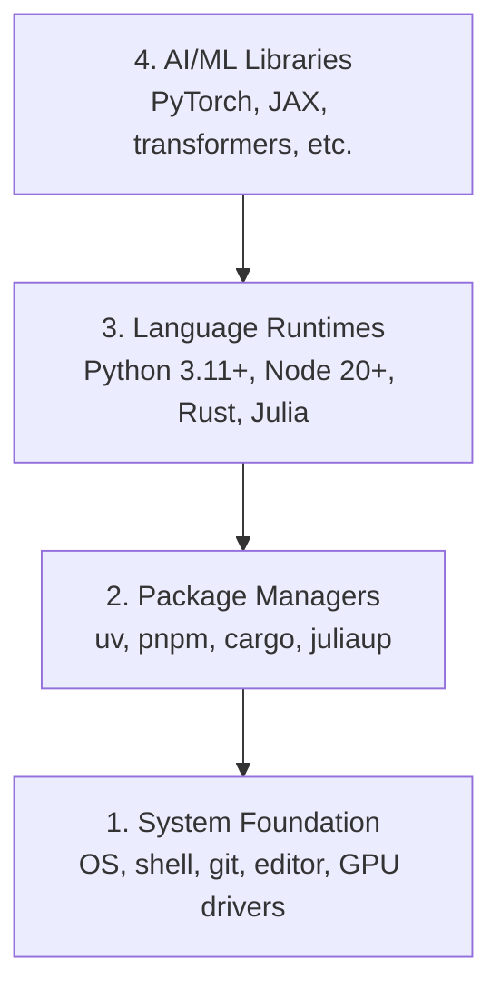

# Dev Çevre

> Aletlerin düşüncelerini şekillendirir.

**Type:** Build
**Languages:** Python, Node.js, Rust
**Prerequisites:** None
**Time:** ~45 minutes

## Öğrenme Hedefleri

- Python 3.11+, Node.js 20+ ve Rust araç zincirlerini sıfırdan kur
- Tekrarlanabilir yapılandırmalar için sanal ortamları ve paket yöneticilerini yapılandır
- CUDA/MPS ile GPU erişimini doğrulayın ve test tenzor işlemini çalıştırın
- Dört katmanlı yığını anlayın: sistem, paketler, çalıştırma zamanları, AI kütüphaneleri

## Sorun

Python, TypeScript, Rust ve Julia'yı kullanarak 500+ ders boyunca AI mühendisliği öğrenmek üzeresiniz. Eğer çevrenizin bozulursa, her ders öğrenmek yerine araçlarla mücadeleye dönüşür.

Çoğu insan çevre ayarını atlıyor, sonra saatlerce import hatalarını, sürüm çatışmalarını ve kayıp CUDA sürücülerini düzeltmeye çalışıyor.

## Anlaşım

Yapay zeka mühendisliği ortamı dört katman içerir:



Her katman altındaki katmanlara bağlı.

```figure
s0-env-stack
```

## Yapın

### Adım 1: Sistem Temel

Sistemini kontrol et ve temel şeyleri yükle.

```bash
# macOS
xcode-select --install
brew install git curl wget

# Ubuntu/Debian
sudo apt update && sudo apt install -y build-essential git curl wget

# Windows (use WSL2)
wsl --install -d Ubuntu-24.04
```

### Adım 2: UV ile Python

Kullanıyoruz .`uv` pip'ten 10-100 kat daha hızlı ve sanal ortamları otomatik olarak ele alır.

```bash
curl -LsSf https://astral.sh/uv/install.sh | sh

uv python install 3.12

uv venv
source .venv/bin/activate  # or .venv\Scripts\activate on Windows

uv pip install numpy matplotlib jupyter
```

Kontrol edin:

```python
import sys
print(f"Python {sys.version}")

import numpy as np
print(f"NumPy {np.__version__}")
a = np.array([1, 2, 3])
print(f"Vector: {a}, dot product with itself: {np.dot(a, a)}")
```

### Adım 3: pnpm ile Node.js

TypeScript dersleri için (ajanlar, MCP sunucular, web uygulamaları).

```bash
curl -fsSL https://fnm.vercel.app/install | bash
fnm install 22
fnm use 22

npm install -g pnpm

node -e "console.log('Node', process.version)"
```

**macOS / Apple Silicon (M1/M2/M3/M4):**Eğer yüklemeci `Error: Cannot install under Rosetta 2 in ARM default prefix (/opt/homebrew)`... terminaliniz Rosetta 2 altında çalışıyor .`arch`Parmak izi`i386`HomeBrew, yerel bir arm64 yapılandırması iken, fnm zorlayıcı arm64'i yükle, kabloya bağla, sonra yukarıdaki komutları tekrar çalıştır.`fnm install 22`- ...

```bash
arch -arm64 brew install fnm
echo 'eval "$(fnm env --use-on-cd)"' >> ~/.zshrc
source ~/.zshrc
```

### Dördüncü adım: Kırmızı

Performans kritik dersleri için (sürekli, sistemler).

```bash
curl --proto '=https' --tlsv1.2 -sSf https://sh.rustup.rs | sh

rustc --version
cargo --version
```

### Adım 5: Julia (Önlü)

Julia'nın parladığı ağır matematik dersleri için.

```bash
curl -fsSL https://install.julialang.org | sh

julia -e 'println("Julia ", VERSION)'
```

### Adım 6: GPU Kurulum (Biriniz varsa)

**NVIDIA (Linux / Windows):**

```bash
nvidia-smi

# Install PyTorch with CUDA
uv pip install torch torchvision torchaudio --index-url https://download.pytorch.org/whl/cu124
```

**macOS / Apple Silicon (M1/M2/M3/M4):**Mac'de beklenen CUDA yok, başarısızlık yok.**not**Geçit .`--index-url .../cuXXX`(o tekerlekler sadece Linux/Windows'dur, bu yüzden kurulum başarısız olur).

```bash
uv pip install torch torchvision torchaudio
```

Verify (herhangi bir platformda çalışır):

```python
import torch
print(f"CUDA available: {torch.cuda.is_available()}")           # False on macOS — expected
print(f"MPS available:  {torch.backends.mps.is_available()}")   # True on Apple Silicon
if torch.cuda.is_available():
    print(f"GPU: {torch.cuda.get_device_name(0)}")
```

Bir GPU yok? Sorun yok. Çoğu ders CPU'da çalışır. Eğitim ağır dersler için Google Colab veya bulut GPU'ları kullanın.

### Adım 7: Başlamak istediğiniz rotayi doğrulayın

Bu dersdeki her komutu deposu kökü, dizini,
içerir`README.md`ve `phases/`Uçuş öncesi kontrol sadece ihtiyacınız olan şeyi .
Seçilen yolu başlatır. Öntanımlı olarak daha sonraki araçları atlar böylece yeni öğrenci
Bir duvar uyarı yerine açık bir cevap.

Tam başlangıç dizisini başlat:

```bash
python3 phases/00-setup-and-tooling/01-dev-environment/code/verify.py --route beginner
```

Ya da sadece istediğiniz yolu kontrol edin:

```bash
python3 phases/00-setup-and-tooling/01-dev-environment/code/verify.py --route ml-foundations
python3 phases/00-setup-and-tooling/01-dev-environment/code/verify.py --route llm-engineering
python3 phases/00-setup-and-tooling/01-dev-environment/code/verify.py --route agents
python3 phases/00-setup-and-tooling/01-dev-environment/code/verify.py --route mcp
python3 phases/00-setup-and-tooling/01-dev-environment/code/verify.py --route agent-skills
python3 phases/00-setup-and-tooling/01-dev-environment/code/verify.py --route certification
```

Ekle`--show-later`Aynı uçuş öncesi araçları kontrol etmek istediğinizde
Kayıp bir sonraki araç asla
Seçilen rota.

Her başarısız gerekli kontrol, tespit edilen yol veya ithalat hatası ve
Ajan yetenekleri ve sertifika yolları da gösterir
Python scriptinin bir AI host'ın sahip olduğunu kanıtlayamadığı için manuel host kontrolleri
Bir beceri keşfetmişsin ya da seçtiğin beceri alanının yazılabilir olduğunu.

İlk uçuş öncesi uçuş geçince, tam olarak ilk ders yazdırır:

```text
Ready to start Beginner course.
Next: python3 phases/01-math-foundations/01-linear-algebra-intuition/code/vectors.py
```

## Kullan

Çevre kontrol ettiğiniz rota başlatmak için hazır.
Bir dersin ilk dersini tamamen engellemek yerine, onlardan istediklerinde
İşte tüm programda kullanacağınız:

| Language | Used In | Package Manager |
|----------|---------|-----------------|
| Python | Phases 1-12 (ML, DL, NLP, Vision, Audio, LLMs) | uv |
| TypeScript | Phases 13-17 (Tools, Agents, Swarms, Infra) | pnpm |
| Rust | Phases 12, 15-17 (Performance-critical systems) | cargo |
| Julia | Phase 1 (Math foundations) | Pkg |

## Gönder

Bu ders, herkesin ayarlarını kontrol etmek için çalıştırabileceği bir doğrulama senaryosunu üretir.

Bakın .`outputs/prompt-env-check.md`Yapay zeka asistanlarının çevre sorunlarını teşhis etmesine yardımcı olan bir istek için.

## Egzersizler

1. Doğrulama senaryosunu çalıştır ve herhangi bir hataları düzelt
2. Bu ders için Python sanal ortamı oluşturun ve PyTorch yükleyin
3. Dört dilde "hello world" yaz ve her birini çalıştır
