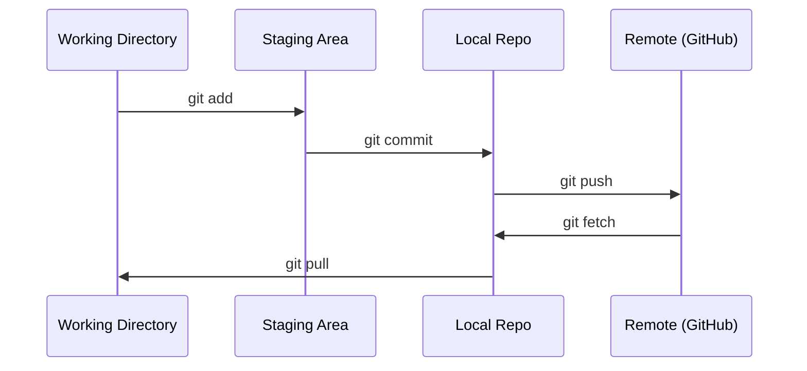

# Git & İşbirliği

> Her deney, model, ders burada izlenir.

**Type:** Learn
**Languages:** --
**Prerequisites:** Phase 0, Lesson 01
**Time:** ~30 minutes

## Öğrenme Hedefleri

- Git kimliğini yapılandırın ve günlük ekleme, commit ve push iş akışını kullanın
- Ana parçaları kırmadan ayrı deneyler için dallar oluşturun ve birleştirin
- Bir yazın .`.gitignore`Bu, model kontrol noktalarını ve büyük ikili dosyaları hariç.
- Bağlantı geçmişini  ile gezin`git log`proje gelişimini anlamak için

## Sorun

20 aşamada yüzlerce kod dosyası yazmak üzeresin. Sürüm kontrolü olmadan iş kaybedeceksin, geri alamayacağın şeyleri çözeceksin ve başkalarıyla işbirliği yapmanın hiçbir yolu olmayacak.

Git, bu araç. GitHub, kodun yaşadığı yerdir. Bu ders, bu kurs için ihtiyacınız olanları kapsar ve daha fazlasını içermez.

## Anlaşım



Hatırlamak için üç şey:
1. Sık sık saklayın (`git commit`)
2. Uzak kontrol (`git push`)
3. Deneyimler için bölge (`git checkout -b experiment`)

```figure
s0-commit-dag
```

## Yapın

### Adım 1: Git'i yapılandır

```bash
git config --global user.name "Your Name"
git config --global user.email "you@example.com"
```

### Adım 2: Günlük iş akışı

```bash
git status
git add file.py
git commit -m "Add perceptron implementation"
git push origin main
```

### Adım 3: Deney için dallama

```bash
git checkout -b experiment/new-optimizer

# ... make changes, commit ...

git checkout main
git merge experiment/new-optimizer
```

### Adım 4: Bu kurs repo ile çalışmak

Bu yüzden, GitHub'da yazma girişini yapın.`origin`Kendi kopyasında belirtiler:

```bash
git clone https://github.com/YOUR-USERNAME/ai-engineering-from-scratch.git
cd ai-engineering-from-scratch

git checkout -b my-progress
# work through lessons, commit your code
git push origin my-progress
```

## Kullan

Bu kurs için şu emirlere ihtiyacınız var:

| Command | When |
|---------|------|
| `git clone` | Get the course repo |
| `git add` + `git commit` | Save your work |
| `git push` | Back it up to GitHub |
| `git checkout -b` | Try something without breaking main |
| `git log --oneline` | See what you've done |

Bu ders için rebase, cherry-pick veya submodules gerekmiyor.

## Egzersizler

1. Bu repoyu kırp, çatalını klonla, `my-progress`Dosya yap, bindir, it
2. Bir `.gitignore`Bu, kontrol nokta dosyalarının modelini kapsar (`.pt`- Evet .`.pth`- Evet .`.safetensors`)
3. Bu repo ' nun commit tarihiyle ilgili bir bakış .`git log --oneline`Ve derslerin nasıl eklendiğini okuyun.

## Anahtar Terimler

| Term | What people say | What it actually means |
|------|----------------|----------------------|
| Commit | "Saving" | A snapshot of your entire project at a point in time |
| Branch | "A copy" | A pointer to a commit that moves forward as you work |
| Merge | "Combining code" | Taking changes from one branch and applying them to another |
| Remote | "The cloud" | A copy of your repo hosted somewhere else (GitHub, GitLab) |
