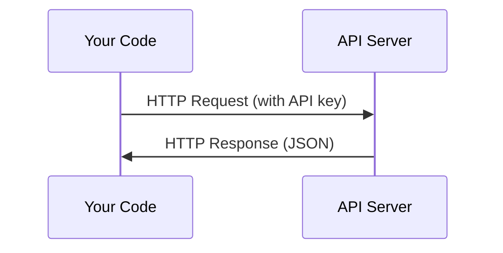

# API & Anahtarları

> Her AI API aynı şekilde çalışır: bir istek gönderin, bir cevap alın. Detaylar değişir, desen değişmez.

**Type:** Build
**Languages:** Python, TypeScript
**Prerequisites:** Phase 0, Lesson 01
**Time:** ~30 minutes

## Öğrenme Hedefleri

- API anahtarlarını çevre değişkenlerini kullanarak güvenli bir şekilde saklayın ve `.env`dosyalar
- Hem Anthropic Python SDK hem de ham HTTP kullanarak LLM API çağrısı yapın
- Çözümleme için SDK tabanlı ve ham HTTP sorgu / yanıt biçimlerini karşılaştır
- Doğrulama ve oran sınırları dahil olmak üzere yaygın API hatalarını tanımlamak ve ele almak

## Sorun

11. aşamaldan başlayarak LLM API'lerini (Anthropic, OpenAI, Google) arayacaksınız. 13-16 aşamalda bu API'leri döngülerde kullanan ajanlar inşa edeceksiniz. API anahtarlarının nasıl çalıştığını, onları nasıl güvenli bir şekilde saklayacağını ve ilk API çağrınızı nasıl yapacağını bilmeniz gerekir.

## Anlaşım



Her API çağrısı:
1. Bir son nokta (URL)
2. API anahtarı (titsinatif)
3. Bir talep kurumu (ne istediğinizi)
4. Bir yanıt vücudu (neyi geri alırsınız)

```figure
s0-secret-inject
```

## Yapın

### Adım 1: API anahtarlarını güvenli bir şekilde saklayın

Kodu asla API anahtarlarına sokmayın.

```bash
export ANTHROPIC_API_KEY="sk-ant-..."
export OPENAI_API_KEY="sk-..."
```

Ya da bir `.env`dosya (ekle `.gitignore`):

```
ANTHROPIC_API_KEY=sk-ant-...
OPENAI_API_KEY=sk-...
```

### Adım 2: İlk API çağrısı (Python)

```python
import os

import anthropic

client = anthropic.Anthropic()

MODEL = os.environ.get("LLM_MODEL", "claude-sonnet-5")

response = client.messages.create(
    model=MODEL,
    max_tokens=256,
    messages=[{"role": "user", "content": "What is a neural network in one sentence?"}]
)

print(response.content[0].text)
```

`LLM_MODEL`Diğer sağlayıcılar (OpenAI, Google ve diğerleri) bir anahtarın ve bir model kimliğinin aynı örneğini izler, ancak her birinin kendi SDK, son noktası ve talep / yanıt şeması vardır.

### Adım 3: İlk API çağrısı (TypeScript)

```typescript
import Anthropic from "@anthropic-ai/sdk";

const client = new Anthropic();

const MODEL = process.env.LLM_MODEL ?? "claude-sonnet-5";

const response = await client.messages.create({
  model: MODEL,
  max_tokens: 256,
  messages: [{ role: "user", content: "What is a neural network in one sentence?" }],
});

console.log(response.content[0].text);
```

### Adım 4: Raw HTTP (SDK yok)

```python
import os
import urllib.request
import json

url = "https://api.anthropic.com/v1/messages"
headers = {
    "Content-Type": "application/json",
    "x-api-key": os.environ["ANTHROPIC_API_KEY"],
    "anthropic-version": "2023-06-01",
}
body = json.dumps({
    "model": os.environ.get("LLM_MODEL", "claude-sonnet-5"),
    "max_tokens": 256,
    "messages": [{"role": "user", "content": "What is a neural network in one sentence?"}],
}).encode()

req = urllib.request.Request(url, data=body, headers=headers, method="POST")
with urllib.request.urlopen(req) as resp:
    result = json.loads(resp.read())
    print(result["content"][0]["text"])
```

Bu SDK'lerin kapuk altında yaptıkları şey. Çöm HTTP çağrısını anlamak debugging yaparken yardımcı olur.

## Kullan

Bu ders için:

| API | When you need it | Free tier |
|-----|-----------------|-----------|
| Anthropic (Claude) | Phases 11-16 (agents, tools) | $5 credit on signup |
| OpenAI | Phase 11 (comparison) | $5 credit on signup |
| Hugging Face | Phases 4-10 (models, datasets) | Free |

Hepsine şimdi ihtiyacın yok, dersin gerekince ayarla.

## Gönder

Bu ders şunları ortaya çıkarır:
- `outputs/prompt-api-troubleshooter.md`- yaygın API hatalarını teşhis etmek

## Egzersizler

1. Bir Anthropic API anahtarı al ve ilk API çağrını yap
2. Çöm HTTP sürümünü deneyin ve yanıt biçimini SDK sürümüne karşılaştırın
3. Kasten yanlış bir API anahtarı kullanın ve hata mesajını okuyun

## Anahtar Terimler

| Term | What people say | What it actually means |
|------|----------------|----------------------|
| API key | "Password for the API" | A unique string that identifies your account and authorizes requests |
| Rate limit | "They're throttling me" | Maximum requests per minute/hour to prevent abuse and ensure fair usage |
| Token | "A word" (in API context) | A billing unit: input and output tokens are counted and charged separately |
| Streaming | "Real-time responses" | Getting the response word by word instead of waiting for the full response |
