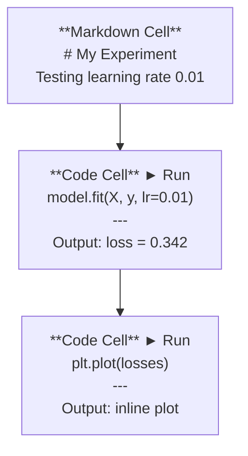
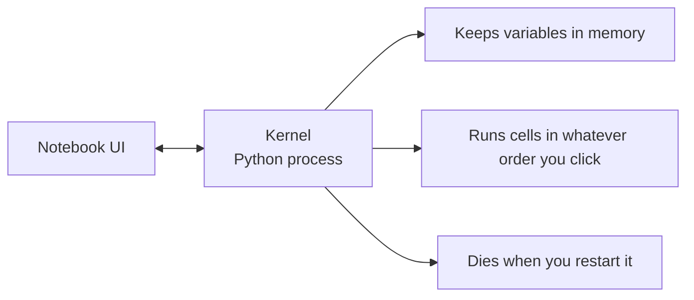

# Jupyter Not defterleri

> Bilgisayarlar, Yapay zeka mühendisliği laboratuvarı.

**Type:** Build
**Languages:** Python
**Prerequisites:** Phase 0, Lesson 01
**Time:** ~30 minutes

## Öğrenme Hedefleri

- JupyterLab, Jupyter Notebook veya VS Code'u Jupyter uzantısı ile yükle ve başlat
- Sihirli komutları kullan (`%timeit`- Evet .`%%time`- Evet .`%matplotlib inline`) referans değerlendirmek ve iç çizgiyi görüntülemek için
- Not defterleri ile senaryoları ne zaman kullanılacağını ayırt edin ve "not defterlerinde keşfet, senaryolarda gönder" iş akışını uygulayın
- Genel notebook tuzağını tanımlamak ve önlemek: düzen dışı çalıştırma, gizli durum ve hafıza sızıntıları

## Sorun

Her AI makalesi, öğretim kitabı ve Kaggle yarışması Jupyter not defterlerini kullanır. Bu makaleler kodları parça parça çalıştırmanıza, çıkışları çizgi içinde görmenize, kodları açıklamalarla karıştırmanıza ve hızlı tekrarlamanıza izin verir. Not defterleri olmadan AI'yi öğrenmeye çalışıyorsanız, çizim kağıdı olmadan matematik ödevlerini yapıyorsunuz.

Ama not defterlerinde gerçek tuzaqlar var. İnsanlar onları her şey için kullanırlar, hatta kötü oldukları şeyler de dahil. not defterini ne zaman kullanıldığını ve senaryoyu ne zaman kullanıldığını bilmek, daha sonra kabusları düzeltmekten sizi kurtaracaktır.

## Anlaşım

Not defteri hücrelerin bir listesidir. Her hücre ya kod ya da metindir.



Kerneli bir Python süreci olarak kullanılır. Bir hücre çalıştırdığınızda, kodu çekirdeğe gönderir, o da onu işletiyor ve sonucu gönderir. Tüm hücreler aynı çekirdeği paylaşır, bu yüzden hücreler arasında değişkenler kalır.



"Neyi sipariş edersen yap" kısmı hem süper güç hem de tabanca.

```figure
s0-cell-order
```

## Yapın

### Adım 1: Ara yüzünü seç

Üç seçenek, tek format:

| Interface | Install | Best for |
|-----------|---------|----------|
| JupyterLab | `pip install jupyterlab` then `jupyter lab` | Full IDE experience, multiple tabs, file browser, terminal |
| Jupyter Notebook | `pip install notebook` then `jupyter notebook` | Simple, lightweight, one notebook at a time |
| VS Code | Install "Jupyter" extension | Already in your editor, git integration, debugging |

Üçü de aynı şeyi okuyor ve yazıyor .`.ipynb`JupyterLab, AI çalışmalarında en yaygın olanıdır.

```bash
pip install jupyterlab
jupyter lab
```

### Adım 2: Önemli olan klavyeler

İki modda çalışıyorsun.`Escape`Komut modunda (solda mavi çubuğunda), `Enter`düzenleme modunda (yeşil çubuğa).

**Command mode (most used):**

| Key | Action |
|-----|--------|
| `Shift+Enter` | Run cell, move to next |
| `A` | Insert cell above |
| `B` | Insert cell below |
| `DD` | Delete cell |
| `M` | Convert to markdown |
| `Y` | Convert to code |
| `Z` | Undo cell operation |
| `Ctrl+Shift+H` | Show all shortcuts |

**Edit mode:**

| Key | Action |
|-----|--------|
| `Tab` | Autocomplete |
| `Shift+Tab` | Show function signature |
| `Ctrl+/` | Toggle comment |

`Shift+Enter`- Günde bin kere kullanacağın bir tane.

### Adım 3: Hücre türleri

**Code cells**Python çalıştır ve çıkış göster:

```python
import numpy as np
data = np.random.randn(1000)
data.mean(), data.std()
```

Çıktı: `(0.0032, 0.9987)`

**Markdown cells**Bu, yapmanızı ve neden yaptığınızı belgelemek için kullanın. Başlıkları destekler, büyük, italik, LaTeX matematik (`$E = mc^2$`), tablolar ve görüntüler.

### Dördüncü Adım: Sihirli Emirler

Bunlar Python değil, Jupyter'e özel komutlar.`%`(sırh sihir) veya `%%`(Hücre sihirini).

**Time your code:**

```python
%timeit np.random.randn(10000)
```

Çıktı: `45.2 us +/- 1.3 us per loop`

```python
%%time
model.fit(X_train, y_train, epochs=10)
```

Çıktı: `Wall time: 2.34 s`

`%timeit`Kodu defalarca çalıştırır ve ortalamalar.`%%time`Bir kere çalıştır.`%timeit`mikro işaretler için, `%%time`Eğitim koşularında.

**Enable inline plots:**

```python
%matplotlib inline
```

Her zaman .`plt.plot()`veya `plt.show()`Şimdi doğrudan defterde gösterir.

**Install packages without leaving the notebook:**

```python
!pip install scikit-learn
```

- Evet .`!`Önceden herhangi bir Shell komut çalıştırılır.

**Check environment variables:**

```python
%env CUDA_VISIBLE_DEVICES
```

### Adım 5: Zengin çıkışları çizgi içinde göster

Not defterleri, bir hücrenin son ifadesini otomatik olarak gösterir.

```python
import pandas as pd

df = pd.DataFrame({
    "model": ["Linear", "Random Forest", "Neural Net"],
    "accuracy": [0.72, 0.89, 0.94],
    "training_time": [0.1, 2.3, 45.6]
})
df
```

Bu, bir metin atı değil, biçimlendirilmiş bir HTML tabloyu gösterir.

```python
import matplotlib.pyplot as plt

plt.figure(figsize=(8, 4))
plt.plot([1, 2, 3, 4], [1, 4, 2, 3])
plt.title("Inline Plot")
plt.show()
```

Bu yüzden not defterleri AI'nin çalışmasına hakim olur. Verileri, planı ve kodları birlikte görürsünüz.

Resimler için:

```python
from IPython.display import Image, display
display(Image(filename="architecture.png"))
```

### Adım 6: Google Colab

Colab, ücretsiz bir Jupyter bilgisayara sahip bulut. GPU, önceden yüklenen kütüphaneler ve Google Drive entegrasyonu sağlar.

1. Git .[colab.research.google.com](https://colab.research.google.com)
2. Herhangi birini yükle `.ipynb`Bu kursdan dosya
3. Çalışma zamanı > Çalışma süresi tipi > T4 GPU (belirli)

Local Jupyter' dan Colab farklılıkları:
- Dosyalar oturumlar arasında kalmaz (Drive veya indirmeyi bırak)
- Öntanımlı: numpy, pandas, matplotlib, meşale, tensorflow, sklearn
- `from google.colab import files`Dosyaları yüklemek/dağlatmak
- `from google.colab import drive; drive.mount('/content/drive')`Sürekli depolama için
- 90 dakikalık faaliyetsizlik sonrası seanslar kapanması (belirli seviyede)

## Kullan

### Not defterleri vs. Scripts: Ne zaman hangi dosyayı kullanmak

| Use notebooks for | Use scripts for |
|-------------------|-----------------|
| Exploring a dataset | Training pipelines |
| Prototyping a model | Reusable utilities |
| Visualizing results | Anything with `if __name__` |
| Explaining your work | Code that runs on a schedule |
| Quick experiments | Production code |
| Course exercises | Packages and libraries |

Kural:**explore in notebooks, ship in scripts**- Evet .

AI'de yaygın bir iş akışı:
1. Not defterindeki verileri araştır
2. Not defterinde model modelin prototipini
3. İşledikten sonra, kodu `.py`dosyalar
4. Onları içeri getir .`.py`Dosyaları daha fazla deney için defterine geri gönder .

### Genel tuzaklar

**Out-of-order execution.**5. hücreyi, 2. hücreyi, 7. hücreyi çalıştırırsanız, not defteri makinenizde çalışır, ama biri üst-altı çalıştırdığında kırılır.

**Hidden state.**Bir hücreyi sildiğinizde, oluşturduğu değişken hala hafızada. Not defteri temiz görünüyor ama hayalet hücresine bağlıdır. Düzeltme: Yüklemeyi düzenli olarak yeniden başlatın.

**Memory leaks.**4GB'lik bir veri kümesi yükleniyor, bir model eğitiliyor, başka bir veri kümesi yükleniyor. Hiçbir şey serbest bırakılmıyor.`del variable_name`ve `gc.collect()`Ya da çekirdeği yeniden başlat.

## Gönder

Bu ders şunları ortaya çıkarır:
- `outputs/prompt-notebook-helper.md`Not defter sorunlarını düzeltmek için

## Egzersizler

1. JupyterLab'ı açın, bir defter oluşturun ve kullanın `%timeit`Liste anlayışı ile numpy arasında 100.000 rastgele sayının bir dizi oluşturmak için karşılaştırmak için
2. CSV'yi yükleyen, bir veri çerçevesini görüntüleyen ve bir tablo çizen bir not defteri oluşturun. Sonra Kernel > Restart & Run All'u çalıştırın ve üstten aşağıya doğru çalışırken doğrulayın
3. Şifreyi alın .`code/notebook_tips.py`, Colab bir not defterine yapıştırıp ücretsiz bir GPU ile çalıştır

## Anahtar Terimler

| Term | What people say | What it actually means |
|------|----------------|----------------------|
| Kernel | "The thing running my code" | A separate Python process that executes cells and keeps variables in memory |
| Cell | "A code block" | An independently runnable unit in a notebook, either code or markdown |
| Magic command | "Jupyter tricks" | Special commands prefixed with `%` or `%%` that control the notebook environment |
| `.ipynb` | "Notebook file" | A JSON file containing cells, outputs, and metadata. Stands for IPython Notebook |

## Daha Fazla Okumak

- [JupyterLab Docs](https://jupyterlab.readthedocs.io/)Tam özellik setinde
- [Google Colab FAQ](https://research.google.com/colaboratory/faq.html)Colab'e özel sınırlar ve özellikler için
- [28 Jupyter Notebook Tips](https://www.dataquest.io/blog/jupyter-notebook-tips-tricks-shortcuts/)Güç kullanıcısı için kısayollar
