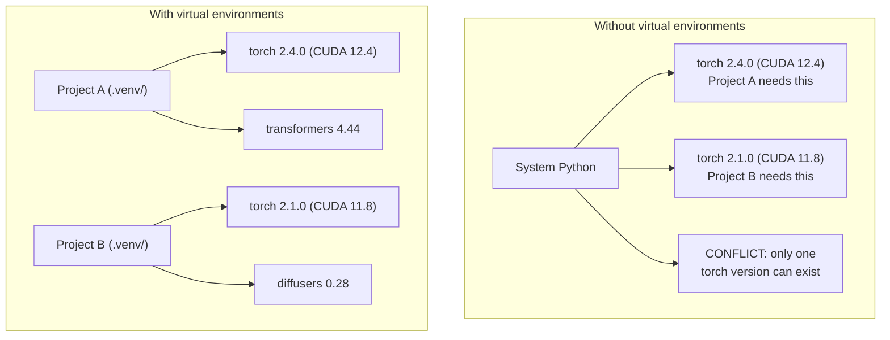

# Python Çevreleri

> bağımlılık cehennemi gerçek.

**Type:** Build
**Languages:** Shell
**Prerequisites:** Phase 0, Lesson 01
**Time:** ~30 minutes

## Öğrenme Hedefleri

- `uv`- Evet .`venv`veya`conda`
- Bir yazın .`pyproject.toml`Seçenekli bağımlılık grupları ile ve yeniden üretilebilirlik için kilitleme dosyaları oluşturur
- Genel sıkıntıları teşhis ve düzeltmek: küresel yüklemeler, pip/conda karışımı, CUDA sürümünde eşleşmeyen değişiklikler
- Çelişkili bağımlılıkları olan projeler için aşamalar arası bir çevre stratejisi uygulanmalıdır

## Sorun

Bir ince ayarlama projesi için PyTorch 2.4'i yüklersiniz. Gelecek hafta, başka bir projede PyTorch 2.1'e ihtiyaç vardır çünkü CUDA yapılandırması sabitlenir. Küresel olarak yükseltir ve ilk proje kesilir. Aşağı derecelendirir ve ikinci kesilir.

Bu bağımlılık cehennemi. Bu sürekli olarak AI/ML çalışmasında olur çünkü:

- PyTorch, JAX ve TensorFlow her biri kendi CUDA bağlamalarını gönderir
- Model kütüphaneler belirli çerçeve sürümlerini pin
- Küresel bir `pip install`Önceden olan her şeyi üstü yazıyor.
- CUDA 11.8 yapılandırmaları CUDA 12.x sürücülerle çalışmaz (ve tam tersi)

Çözüm: Her proje kendi paketleriyle kendi izole edilmiş ortamına sahip.

## Anlaşım



```figure
s0-env-isolation
```

## Yapın

### Seçenek 1: uv venv (Önerilen)

`uv`en hızlı Python paket yöneticisi (10-100 kat daha hızlı) Bir araçta sanal ortamları, Python sürümleri ve bağımlılık çözünürlüğünü ele alır.

```bash
curl -LsSf https://astral.sh/uv/install.sh | sh

uv python install 3.12

cd your-project
uv venv
source .venv/bin/activate
```

Paketleri yükle:

```bash
uv pip install torch numpy
```

Bir proje oluşturmak için `pyproject.toml`Bir adımla:

```bash
uv init my-ai-project
cd my-ai-project
uv add torch numpy matplotlib
```

### Seçenek 2: venv (İşleştirilir)

Eğer yükleyemezsen`uv`Python gemileri ile birlikte .`venv`- ...

```bash
python3 -m venv .venv
source .venv/bin/activate  # Linux/macOS
.venv\Scripts\activate     # Windows

pip install torch numpy
```

Daha yavaş .`uv`Python'un her yerinde çalışır.

### Seçenek 3: Konda (Gerektiğinde)

Conda, CUDA araç kümeleri, cuDNN ve C kütüphaneleri gibi Python dışı bağımlılıkları yönetir.

- Sistem genelinde kurulmadan belirli bir CUDA araç kit versiyonu gerekiyor
- Sistem paketlerini yükleyemeyeceğin ortak bir kümede bulunuyorsun.
- Bir kütüphanenin kurulum talimatları "conda kullan" diyor.

```bash
# Install miniconda (not the full Anaconda)
curl -LsSf https://repo.anaconda.com/miniconda/Miniconda3-latest-Linux-x86_64.sh -o miniconda.sh
bash miniconda.sh -b

conda create -n myproject python=3.12
conda activate myproject

conda install pytorch torchvision torchaudio pytorch-cuda=12.4 -c pytorch -c nvidia
```

Bir kural: bir ortam için conda kullanıyorsanız, bu ortamdaki tüm paketler için conda kullanın.`pip install`Bir konda env'de sorunlar oluşur ve bu sorunları çözmek zor olur.

### Bu Kurs için: Fazlı Strateji

Tüm kurs için tek bir ortam oluşturabilirsiniz. Yapmayın. Farklı aşamalar farklı (bazen çelişkili) bağımlılıklara ihtiyaç duyar.

Strateji:

```
ai-engineering-from-scratch/
├── .venv/                    <-- shared lightweight env for phases 0-3
├── phases/
│   ├── 04-neural-networks/
│   │   └── .venv/            <-- PyTorch env
│   ├── 05-cnns/
│   │   └── .venv/            <-- same PyTorch env (symlink or shared)
│   ├── 08-transformers/
│   │   └── .venv/            <-- might need different transformer versions
│   └── 11-llm-apis/
│       └── .venv/            <-- API SDKs, no torch needed
```

Senaryoyu oku .`code/env_setup.sh`Bu kurs için temel ortam yaratır.

## pyproject.toml Temel

Her Python projesinde bir `pyproject.toml`- Yerine geçiyor .`setup.py`- Evet .`setup.cfg`ve`requirements.txt`Bir dosyada.

```toml
[project]
name = "ai-engineering-from-scratch"
version = "0.1.0"
requires-python = ">=3.11"
dependencies = [
    "numpy>=1.26",
    "matplotlib>=3.8",
    "jupyter>=1.0",
    "scikit-learn>=1.4",
]

[project.optional-dependencies]
torch = ["torch>=2.3", "torchvision>=0.18"]
llm = ["anthropic>=0.39", "openai>=1.50"]
```

Sonra yükle:

```bash
uv pip install -e ".[torch]"    # base + PyTorch
uv pip install -e ".[llm]"     # base + LLM SDKs
uv pip install -e ".[torch,llm]" # everything
```

## Kilitleme dosyaları

Bir kilit dosyası, tüm bağımlılıkları (geçici olanlar da dahil) tam sürümlere bağlar. Bu yeniden üretilebilirliği garanti eder: kilit dosyasından yükleyen herkes tam olarak aynı paketleri alır.

```bash
# uv generates uv.lock automatically when using uv add
uv add numpy

# pip-tools approach
uv pip compile pyproject.toml -o requirements.lock
uv pip install -r requirements.lock
```

Kilit dosyayı git'e yükle. Birisi repo'yu klonladığında kilit dosyasından yükler ve aynı sürümleri alır.

## Genel Hatalar

### 1. Küresel olarak kurulması

```bash
pip install torch  # BAD: installs to system Python

source .venv/bin/activate
pip install torch  # GOOD: installs to virtual environment
```

Paketlerin nereye gittiğini kontrol et:

```bash
which python       # should show .venv/bin/python, not /usr/bin/python
which pip           # should show .venv/bin/pip
```

### 2. Pip ve kondan karışımı

```bash
conda create -n myenv python=3.12
conda activate myenv
conda install pytorch -c pytorch
pip install some-other-package   # BAD: can break conda's dependency tracking
conda install some-other-package # GOOD: let conda manage everything
```

Eğer konda içinde pip kullanmanız gerekiyorsa (bazı paketler sadece pip içindir), önce tüm conda paketlerini yükleyin, sonra da pip paketleri sonuna kadar.

### 3. Aktifleştirmeyi unutuyorum

```bash
python train.py           # uses system Python, missing packages
source .venv/bin/activate
python train.py           # uses project Python, packages found
```

Shell sorgulamanız çevre adı göstermelidir:

```
(.venv) $ python train.py
```

### 4. .venv git'e bağlanıyorum

```bash
echo ".venv/" >> .gitignore
```

Sanal ortamlar 200MB-2GB'dir. Yerel, makineler arasında taşınabilir değil.`pyproject.toml`Ve yerine kilit dosyası.

### 5. CUDA sürüm eşleşmez

```bash
nvidia-smi                # shows driver CUDA version (e.g., 12.4)
python -c "import torch; print(torch.version.cuda)"  # shows PyTorch CUDA version

# These must be compatible.
# PyTorch CUDA version must be <= driver CUDA version.
```

## Kullan

Kurs ortamınızı oluşturmak için ayar senaryoyu çalıştırın:

```bash
bash phases/00-setup-and-tooling/06-python-environments/code/env_setup.sh
```

Bu bir `.venv`çekirdek bağımlılıkları yüklenmiş ve doğrulanmış repo kökü.

## Egzersizler

1. Çık .`env_setup.sh`ve tüm kontrollerin geçerliliğini kontrol et
2. İkinci bir sanal ortam oluşturun, numpy'nin farklı bir versiyonunu yükleyin ve iki ortamın izole edildiğini onaylayın.
3. Bir yazın .`pyproject.toml`PyTorch ve Anthropic SDK'ye ihtiyaç duyan bir proje için
4. Kasten bir paket küresel olarak yükle (venv aktive etmeden), nereye gittiğini fark et, sonra onu kaldır

## Anahtar Terimler

| Term | What people say | What it actually means |
|------|----------------|----------------------|
| Virtual environment | "A venv" | An isolated directory containing a Python interpreter and packages, separate from the system Python |
| Lockfile | "Pinned dependencies" | A file listing every package and its exact version, guaranteeing identical installs across machines |
| pyproject.toml | "The new setup.py" | The standard Python project configuration file, replacing setup.py/setup.cfg/requirements.txt |
| Transitive dependency | "A dependency of a dependency" | Package B depends on C; if you install A which depends on B, C is a transitive dependency of A |
| CUDA mismatch | "My GPU isn't working" | PyTorch was compiled for a different CUDA version than what your GPU driver supports |
