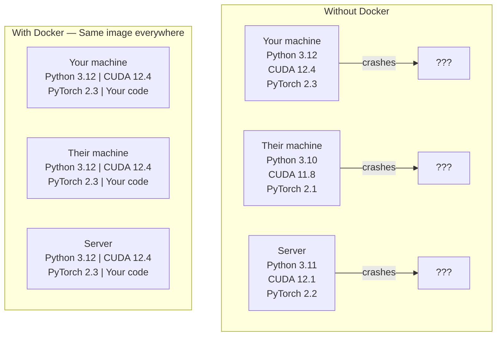

# AI için Docker

> Kontanerler "makine üzerinde çalışıyorum" bir geçmişi haline getirir.

**Type:** Build
**Languages:** Docker
**Prerequisites:** Phase 0, Lessons 01 and 03
**Time:** ~60 minutes

## Öğrenme Hedefleri

- Bir Docker dosyasından CUDA, PyTorch ve AI kütüphaneleri ile GPU etkinleştirilmiş bir Docker görüntüsü oluşturun
- Konteyner yeniden inşaatları boyunca kalıcı modeller, veri kümeleri ve kodları oluşturmak için host dizinlerini hacme olarak yükleyin
- NVIDIA Kontaner Araç Kütüsünü, konteynerlerin içindeki GPU'ları açığa çıkarmak için yapılandır
- Docker Compose kullanarak çoklu hizmetli AI uygulamalarını (inferans sunucusu + vektör veritabanı) orkestre edin

## Sorun

Laptop'unuzda PyTorch 2.3, CUDA 12.4 ve Python 3.12 ile bir model eğitmişsiniz.

AI projeleri bağımlılık kabuslarıdır. Tipik bir yığın Python, PyTorch, CUDA sürücüleri, cuDNN, sistem düzeydeki C kütüphaneleri ve tam bir kompilire sürümüne ihtiyaç duyan flash-attn gibi özel paketler içerir. Docker tüm bunları her yerde aynı şekilde çalıştırılan tek bir görüntüye paketler.

## Anlaşım

Docker, kodunuzu, çalıştırma zamanınızı, kitaplıklarınızı ve sistem araçlarınızı bir konteyner olarak adlandırılan bir ayrı bir birime sarar.



### Neden Yapay zeka projelerinin Docker'a çoğu insandan daha fazla ihtiyacı var

1. **GPU drivers are fragile.**CUDA 12.4 kodu CUDA 11.8'de çalışmıyor. Docker, NVIDIA Container Toolkit aracılığıyla host GPU sürücüsünü paylaşırken, konteyner içindeki CUDA araç kümesini izole eder.

2. **Model weights are large.**7B parametre modeli 14 GB'dır. her yeniden inşa ettiğinizde yeniden indirmeyi istemezsiniz. Docker hacmi, barındırıcıdan bir model dizini monte etmenizi sağlar.

3. **Multi-service architectures are common.**Gerçek bir AI uygulaması sadece Python metni değil. Bu bir sonuçlama sunucusu, RAG için vektör veritabanı, belki de bir web ön uçudur. Docker Compose bunların hepsini tek bir komutla orkestra eder.

### Ana kelime kümesi

| Term | What it means |
|------|---------------|
| Image | A read-only template. Your recipe. Built from a Dockerfile. |
| Container | A running instance of an image. Your kitchen. |
| Dockerfile | Instructions to build an image. Layer by layer. |
| Volume | Persistent storage that survives container restarts. |
| docker-compose | A tool for defining multi-container applications in YAML. |

### AI'de yaygın konteyner kalıpları

```
Dev Container
  Full toolkit. Editor support. Jupyter. Debugging tools.
  Used during development and experimentation.

Training Container
  Minimal. Just the training script and dependencies.
  Runs on GPU clusters. No editor, no Jupyter.

Inference Container
  Optimized for serving. Small image. Fast cold start.
  Runs behind a load balancer in production.
```

```figure
s0-image-layers
```

## Yapın

### Adım 1: Docker yükle

```bash
# macOS
brew install --cask docker
open /Applications/Docker.app

# Ubuntu
curl -fsSL https://get.docker.com | sh
sudo usermod -aG docker $USER
# Log out and back in for group change to take effect
```

Kontrol edin:

```bash
docker --version
docker run hello-world
```

### Adım 2: NVIDIA Kontaner Araç Kütücükünü (NVIDIA GPU ile Linux) yükle

Bu, Docker konteynerlerinin GPU'ya erişmesine izin verir. macOS ve Windows (WSL2) kullanıcıları bunu atlayabilir; Docker Desktop, bu platformlarda GPU'ları farklı şekilde ele alır.

```bash
distribution=$(. /etc/os-release;echo $ID$VERSION_ID)
curl -fsSL https://nvidia.github.io/libnvidia-container/gpgkey | sudo gpg --dearmor -o /usr/share/keyrings/nvidia-container-toolkit-keyring.gpg
curl -s -L https://nvidia.github.io/libnvidia-container/$distribution/libnvidia-container.list | \
    sed 's#deb https://#deb [signed-by=/usr/share/keyrings/nvidia-container-toolkit-keyring.gpg] https://#g' | \
    sudo tee /etc/apt/sources.list.d/nvidia-container-toolkit.list

sudo apt-get update
sudo apt-get install -y nvidia-container-toolkit
sudo nvidia-ctk runtime configure --runtime=docker
sudo systemctl restart docker
```

Bir konteyner içindeki GPU erişimini test edin:

```bash
docker run --rm --gpus all nvidia/cuda:12.4.1-base-ubuntu22.04 nvidia-smi
```

GPU bilgilerini görürsen, araç kümesi çalışıyor.

### Adım 3: Temel resimleri anlayın

Doğru taban görüntüsünü seçmek saatlerce debugging tasarruf eder.

```
nvidia/cuda:12.4.1-devel-ubuntu22.04
  Full CUDA toolkit. Compilers included.
  Use for: building packages that need nvcc (flash-attn, bitsandbytes)
  Size: ~4 GB

nvidia/cuda:12.4.1-runtime-ubuntu22.04
  CUDA runtime only. No compilers.
  Use for: running pre-built code
  Size: ~1.5 GB

pytorch/pytorch:2.6.0-cuda12.4-cudnn9-runtime
  PyTorch pre-installed on top of CUDA.
  Use for: skipping the PyTorch install step
  Size: ~6 GB

python:3.12-slim
  No CUDA. CPU only.
  Use for: inference on CPU, lightweight tools
  Size: ~150 MB
```

### Adım 4: AI geliştirme için Dockerfile yaz

İşte Docker Dosyası.`code/Dockerfile`- İçinden geç:

```dockerfile
FROM nvidia/cuda:12.4.1-devel-ubuntu22.04

ENV DEBIAN_FRONTEND=noninteractive
ENV PYTHONUNBUFFERED=1

RUN apt-get update && apt-get install -y --no-install-recommends \
    software-properties-common \
    git \
    curl \
    build-essential \
    && add-apt-repository -y ppa:deadsnakes/ppa \
    && apt-get update && apt-get install -y --no-install-recommends \
    python3.12 \
    python3.12-venv \
    python3.12-dev \
    && rm -rf /var/lib/apt/lists/*

RUN update-alternatives --install /usr/bin/python python /usr/bin/python3.12 1

RUN curl -sSL https://raw.githubusercontent.com/pypa/get-pip/3b73145063be545b649ad9ca83ea8da5fc915a4f/public/get-pip.py -o /tmp/get-pip.py \
    && echo "a341e1a43e38001c551a1508a73ff23636a11970b61d901d9a1cad2a18f57055  /tmp/get-pip.py" | sha256sum -c - \
    && python /tmp/get-pip.py \
    && rm /tmp/get-pip.py \
    && update-alternatives --install /usr/bin/pip pip /usr/local/bin/pip3.12 1

RUN python -m pip install --no-cache-dir --upgrade pip setuptools wheel

RUN python -m pip install --no-cache-dir \
    torch==2.6.0+cu124 \
    torchvision==0.21.0+cu124 \
    torchaudio==2.6.0+cu124 \
    --index-url https://download.pytorch.org/whl/cu124

RUN python -m pip install --no-cache-dir \
    numpy \
    pandas \
    scikit-learn \
    matplotlib \
    jupyter \
    transformers \
    datasets \
    accelerate \
    safetensors

WORKDIR /workspace

VOLUME ["/workspace", "/models"]

EXPOSE 8888

CMD ["python"]
```

Yap:

```bash
docker build -t ai-dev -f phases/00-setup-and-tooling/07-docker-for-ai/code/Dockerfile .
```

Bu, ilk sefer biraz zaman alır (CUDA taban görüntüsünü indir + PyTorch).

Çek şunu:

```bash
docker run --rm -it --gpus all \
    -v $(pwd):/workspace \
    -v ~/models:/models \
    ai-dev python -c "import torch; print(f'PyTorch {torch.__version__}, CUDA: {torch.cuda.is_available()}')"
```

Jupyter' i konteyner içinde çalıştır:

```bash
docker run --rm -it --gpus all \
    -v $(pwd):/workspace \
    -v ~/models:/models \
    -p 8888:8888 \
    ai-dev jupyter notebook --ip=0.0.0.0 --port=8888 --no-browser --allow-root
```

### Adım 5: Veriler ve modeller için boyut montörleri

Bu cihazlar olmadan, 14 GB model yüklemeleriniz konteyner durduğunda kaybolur.

```bash
# Mount your code
-v $(pwd):/workspace

# Mount a shared models directory
-v ~/models:/models

# Mount datasets
-v ~/datasets:/data
```

Eğitim senaryounuzun içinde, monte edilmiş yoldan yüklen:

```python
from transformers import AutoModel

model = AutoModel.from_pretrained("/models/llama-7b")
```

Modelle sahip dosya sisteminde çalışıyorsun.

### Adım 6: Docker Çoklu Hizmetli AI Uygulamaları için Yazı Yap

Gerçek RAG uygulaması bir sonuç sunucusu ve vektör veritabanı gerektirir. Docker Compose her ikisini de bir komutla çalışır.

Bakın .`code/docker-compose.yml`- ...

```yaml
services:
  ai-dev:
    build:
      context: .
      dockerfile: Dockerfile
    deploy:
      resources:
        reservations:
          devices:
            - driver: nvidia
              count: all
              capabilities: [gpu]
    volumes:
      - ../../../:/workspace
      - ~/models:/models
      - ~/datasets:/data
    ports:
      - "8888:8888"
    stdin_open: true
    tty: true
    command: jupyter notebook --ip=0.0.0.0 --port=8888 --no-browser --allow-root

  qdrant:
    image: qdrant/qdrant:v1.12.5
    ports:
      - "6333:6333"
      - "6334:6334"
    volumes:
      - qdrant_data:/qdrant/storage

volumes:
  qdrant_data:
```

Herşeye başla:

```bash
cd phases/00-setup-and-tooling/07-docker-for-ai/code
docker compose up -d
```

Şimdi AI geliştirme konteyneriniz vektör veritabanına ulaşabilir .`http://qdrant:6333`Docker Compose otomatik olarak paylaşılan bir ağ oluşturur.

AI konteynerinin içinden bağlantıyı test edin:

```python
from qdrant_client import QdrantClient

client = QdrantClient(host="qdrant", port=6333)
print(client.get_collections())
```

Her şeyi durdur:

```bash
docker compose down
```

Ekle`-v`Ayrıca qdrant hacmi silmek için:

```bash
docker compose down -v
```

### Adım 7: AI çalışması için kullanışlı Docker komutları

```bash
# List running containers
docker ps

# List all images and their sizes
docker images

# Remove unused images (reclaim disk space)
docker system prune -a

# Check GPU usage inside a running container
docker exec -it <container_id> nvidia-smi

# Copy a file from container to host
docker cp <container_id>:/workspace/results.csv ./results.csv

# View container logs
docker logs -f <container_id>
```

## Kullan

Şimdi yeniden üretilebilir bir AI geliştirme ortamınız var.

- Kullanım`docker compose up`Dev ortamını ve vektör veritabanını birlikte başlatmak için
- Kodunuzu, modellerinizi ve verilerinizi bir dizi olarak koyun, böylece yeniden inşa etmek arasında hiçbir şey kaybolmaz
- Bir dersin yeni bir Python paketi gerektiğinde, onu Dockerfile'e ekle ve yeniden oluştur
- Docker dosyayı takım arkadaşlarınla paylaş.

### GPU yok mu?

Çıkar `--gpus all`Bu kontaj, CPU'ya dayalı dersler için hala çalışır. PyTorch CUDA'nın yokluğunu algılar ve otomatik olarak CPU'ya geri döner.

## Egzersizler

1. Docker Dosyası oluştur ve çalıştır `python -c "import torch; print(torch.__version__)"`konteyner içinde
2. Docker-Compose stack ' i başlatın ve Qdrant ' ın AI konteynerinden erişilebildiğini kontrol edin .`http://qdrant:6333/collections`
3. Ekle`flask`Dockerfile'e, yeniden inşa edin ve port 5000'de basit bir API sunucusu çalıştırın.`-p 5000:5000`
4. Resim boyutunu ölç`docker images`Bas resimini değiştirmeye çalış .`devel`- ...`runtime`Ve boyutları karşılaştır

## Anahtar Terimler

| Term | What people say | What it actually means |
|------|----------------|----------------------|
| Container | "Lightweight VM" | An isolated process using the host kernel, with its own filesystem and network |
| Image layer | "Cached step" | Each Dockerfile instruction creates a layer. Unchanged layers are cached, so rebuilds are fast. |
| NVIDIA Container Toolkit | "GPU in Docker" | A runtime hook that exposes host GPUs to containers via `--gpus` flag |
| Volume mount | "Shared folder" | A directory on the host mapped into the container. Changes persist after the container stops. |
| Base image | "Starting point" | The `FROM` image your Dockerfile builds on top of. Determines what is pre-installed. |
