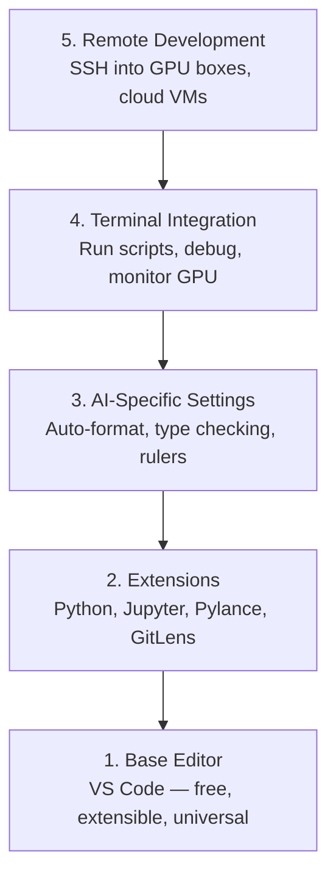

# Düzenleyici Kurulum

> Editörünüz sizin yardımcı pilotunuz, bir kez ayarlayın ki yolunuzdan çıkmasın ve ağırlığını çekmeye başlasın.

**Type:** Build
**Languages:** --
**Prerequisites:** Phase 0, Lesson 01
**Time:** ~20 minutes

## Öğrenme Hedefleri

- Python, Jupyter, linting ve uzaktan SSH için gerekli uzantılarla VS Code yükleyin
- AI iş akışları için format-on-save, tip kontrolü ve notbuk çıkışını kaydırmayı yapılandır
- Uzaktan GPU makinelerindeki kodları yerel gibi düzenlemek ve hata işlemleri için Uzaktan SSH ayarlayın
- Editör alternatiflerini (Cursor, Windsurf, Neovim) ve AI çalışması için onların pazarlamalarını değerlendirmek

## Sorun

Python yazmak, not defterleri çalıştırmak, eğitim döngüslerini düzeltmek ve GPU kutularına SSH koymak için binlerce saatinizi editörünüzün içinde geçireceksiniz. Yanlış yapılandırılmış bir editör her oturumunu sürtüşmeye dönüştürür: otomatik tamamlanmaz, tip ipucuları yoktur, iç çizgi hataları yoktur, manuel biçimlendirme ve çılgın bir terminal iş akışı.

Doğru ayarlama 20 dakika alır, atlamak her gün 20 dakika alır.

## Anlaşım

Bir AI mühendislik editörü kurulması beş şeye ihtiyaç duyar:



```figure
s0-lsp-roundtrip
```

## Yapın

### Adım 1: VS Kodunu Kur

VS Code önerilen düzenleyici. Ücretsiz, her işletim sisteminde çalışır, birinci sınıf Jupyter notebook desteğine sahiptir ve uzantı ekosisteminin AI çalışması için ihtiyacınız olan her şeyi kapsar.

İndir [code.visualstudio.com](https://code.visualstudio.com/)- Evet .

Terminalden kontrol edin:

```bash
code --version
```

- Eğer`code`macOS'ta bulunmuyor, VS Code aç, bas `Cmd+Shift+P`, "Shell Komutu" yazın ve "PATH'de 'kod' komutu yükleyin" seçin.

### İkinci Adım: Gerekli Ekstensiyonları Kur

Entegre terminalı VS Kodunda aç (`` Ctrl+```) ve AI çalışması için önemli olan uzantıları yükle:

```bash
code --install-extension ms-python.python
code --install-extension ms-python.vscode-pylance
code --install-extension ms-toolsai.jupyter
code --install-extension eamodio.gitlens
code --install-extension ms-vscode-remote.remote-ssh
code --install-extension ms-python.debugpy
code --install-extension ms-python.black-formatter
code --install-extension charliermarsh.ruff
```

Her birinin yaptığı:

| Extension | Why |
|-----------|-----|
| Python | Language support, virtual env detection, run/debug |
| Pylance | Fast type checking, autocomplete, import resolution |
| Jupyter | Run notebooks inside VS Code, variable explorer |
| GitLens | See who changed what, inline git blame |
| Remote SSH | Open a folder on a remote GPU box as if it were local |
| Debugpy | Step-through debugging for Python |
| Black Formatter | Auto-format on save, consistent style |
| Ruff | Fast linting, catches common mistakes |

Dosya `code/.vscode/extensions.json`Bu ders, proje klasörünü açtığınızda, VS Code, bunları yüklemenizi isteyecektir.

### Adım 3: Ayarları yapılandır

Ayarları `code/.vscode/settings.json`Bu derste, ya da elle uygulayın.`Settings > Open Settings (JSON)`- Evet .

AI çalışması için ana ayarlar:

```jsonc
{
    "python.analysis.typeCheckingMode": "basic",
    "editor.formatOnSave": true,
    "editor.rulers": [88, 120],
    "notebook.output.scrolling": true,
    "files.autoSave": "afterDelay"
}
```

Neden bunlar önemli:

- **Type checking on basic**Çekmeden önce yanlış argüman türlerini yakalar. Tensor şekli eşleşmezlikleri ve yanlış API parametreleri üzerinde debugging zaman tasarruf eder.
- **Format on save**Bir daha formate etmeyi düşünmeyin.
- **Rulers at 88 and 120**Siyah sarılır 88. 120 işaretçisi doküstrelerin ve yorumların çok uzun olduğunu gösterir.
- **Notebook output scrolling**Eğitim döngüleri binlerce satır yazdırırır.
- **Auto-save**: Kaydetmeyi unutacaksınız. Eğitim senaryounuz eski kod çalıştırır. Otomatik kaydetme bunu önler.

### Dördüncü Adım: Terminal Entegreasyonu

VS Code'un entegre terminali eğitim senaryolarını çalıştırmak, GPU'ları izlemek ve ortamları yönetmek için.

Doğru ayarlayın:

```jsonc
{
    "terminal.integrated.defaultProfile.osx": "zsh",
    "terminal.integrated.defaultProfile.linux": "bash",
    "terminal.integrated.fontSize": 13,
    "terminal.integrated.scrollback": 10000
}
```

Kullanılabilir kısayollar:

| Action | macOS | Linux/Windows |
|--------|-------|---------------|
| Toggle terminal | `` Ctrl+` `` | `` Ctrl+` `` |
| New terminal | `` Ctrl+Shift+` `` | `` Ctrl+Shift+` `` |
| Split terminal | `Cmd+\` | `Ctrl+Shift+5` |

Bölünmüş terminaller yararlıdır: biri senaryoyu çalıştırmak için, biri GPU ile izlemek için `nvidia-smi -l 1`veya `watch -n 1 nvidia-smi`- Evet .

### Adım 5: Uzaktan Geliştirme (SSH GPU Kutusu)

Bu, AI çalışması için en önemli uzantı. Uzaylı makinelerde (bulut VM'ler, laboratuvar sunucular, Lambda, Vast.ai) eğitim süreceksiniz. Uzaylı SSH uzaylı dosya sistemini açmanıza, dosyaları düzenlemenize, terminalleri çalıştırmanıza ve her şey yerel gibi hata işlemlerini düzeltmenize olanak tanır.

Yapılandırma:

1. Uzak SSH uzantısını yükleyin (Adım 2'de yapıldı).
2. Basın `Ctrl+Shift+P`(veya `Cmd+Shift+P`), "Uzak-SSH: Host'a Bağlantı" türü.
3. Girin .`user@your-gpu-box-ip`- Evet .
4. VS Code, sunucu bileşenini uzaktan makineye otomatik olarak yükler.

Parolasız erişim için SSH anahtarlarını ayarlayın:

```bash
ssh-keygen -t ed25519 -C "your-email@example.com"
ssh-copy-id user@your-gpu-box-ip
```

Ev sahibi ekle `~/.ssh/config`Uyum için:

```
Host gpu-box
    HostName 203.0.113.50
    User ubuntu
    IdentityFile ~/.ssh/id_ed25519
    ForwardAgent yes
```

Şimdi .`Remote-SSH: Connect to Host > gpu-box`Hemen bağlanır.

## Alternatifler

### Kursor

[cursor.com](https://cursor.com)Bu, aynı ekstensiyon ekosistemini ve ayar biçimini kullanıyor. Cursor kullanıyorsanız, bu dersdeki her şey hala geçerlidir. Aynı şeyi ithal edin `settings.json`ve `extensions.json`- Evet .

### Rüzgar sürfi

[windsurf.com](https://windsurf.com)Aynı hikaye: aynı uzantılar, aynı ayar formatı, aynı Uzay SSH desteği.

### Vim/Neovim

Eğer zaten Vim veya Neovim kullanıyorsanız ve bu konuda verimliyseniz, orada kalın.

- **pyright**veya **pylsp**Tip kontrolü için (Mason veya manuel kurulum yoluyla)
- **nvim-lspconfig**Dil sunucu entegrasyonu için
- **jupyter-vim**veya **molten-nvim**Not defteri gibi çalıştırmak için
- **telescope.nvim**Dosya/simbol arama için
- **none-ls.nvim**Şartlama/kısaltma için siyah ve kargaşlı

Eğer Vim'i kullanmıyorsanız, şimdi başlamayın. Öğrenme eğriliği AI mühendisliği öğrenmekle rekabet edecek. VS Code kullanın.

## Kullan

Bu ayarla günlük iş akışınız şöyle görünüyor:

1. Proje klasörünü VS Code'da açın (veya uzaktan SSH üzerinden GPU kutusuna bağlayın).
2. Otomatik tamamlama, yazma ipuçları ve iç hatalı hatalarla Python'u düzenleyicide yazın.
3. Jupyter defterlerini Jupyter uzantısı ile uyumlu çalıştır.
4. Eğitim senaryoları için entegre terminal kullanın.`uv pip install`, ve GPU izleme.
5. GitLens ile yapılan değişiklikleri, karar vermeden önce gözden geçirin.

## Egzersizler

1. VS Kod ve 2. Adımda listelenen tüm uzantıları yükle
2. Kopyalayın .`settings.json`Bu dersden VS Code yapılandırmalarına
3. Python dosyasını açın ve Pylance'de kaydetken tip ipuçlarını ve siyah biçimleri gösterildiğini doğrulayın
4. Uzaktan bir makineye erişimi varsa, Uzaktan SSH ayarlayın ve üzerinde bir klasör açın

## Anahtar Terimler

| Term | What people say | What it actually means |
|------|----------------|----------------------|
| LSP | "Autocomplete engine" | Language Server Protocol: a standard for editors to get type info, completions, and diagnostics from a language-specific server |
| Pylance | "The Python plugin" | Microsoft's Python language server using Pyright for type checking and IntelliSense |
| Remote SSH | "Working on the server" | VS Code extension that runs a lightweight server on a remote machine and streams the UI to your local editor |
| Format on save | "Auto-prettier" | The editor runs a formatter (Black, Ruff) every time you save, so code style is always consistent |
