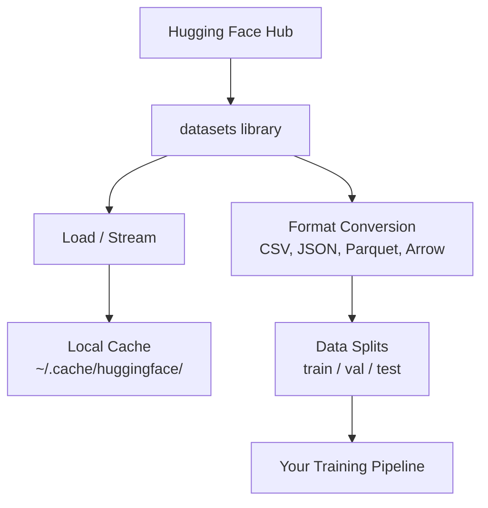

# Veriler Yönetimi

> Veriler yakıt, nasıl yönettiğinizin hızını belirler.

**Type:** Build
**Language:**Python
**Prerequisites:** Phase 0, Lesson 01
**Time:** ~45 minutes

## Öğrenme Hedefleri

- Kucaklama Yüzü ile veri kümelerini yükle, akışla ve önbelleğe koy `datasets`kütüphane
- CSV, JSON, Parquet ve Arrow biçimleri arasında dönüştürme ve onların anlaşmalarını açıklayın
- Düzgün rastgele tohumlarla tekrarlanabilir tren/valyasyon/test bölümleri oluşturmak
- Büyük model ve veri kümesi dosyalarını kullanmak `.gitignore`Git LFS veya DVC

## Sorun

Her AI projesi verilerle başlar. Veriler bulmanız, indirmeniz, biçimler arasında dönüştürmeniz, eğitim ve değerlendirme için bölmeniz ve deneylerin yeniden üretilebilmesi için versiyon yapmanız gerekir. Bunu her seferinde manuel olarak yapmak yavaş ve hatalara eğilimlidir. Tekrar edilebilir bir iş akışı gerekir.

## Anlaşım



Sarılan Yüz`datasets`Kütüphanede, AI çalışması için veri yüklemenin standart yolu, indirme, önbelleğe alma, biçim dönüşümü ve kutudan dışarı akıştırma işlemi yapılır.

```figure
s0-data-pipeline
```

## Yapın

### Adım 1: Veritabeleri kütüphanesi yükle

```bash
pip install datasets huggingface_hub
```

### Adım 2: Veriler kümesini yükle

```python
from datasets import load_dataset

dataset = load_dataset("stanfordnlp/imdb")
print(dataset)
print(dataset["train"][0])
```

Bu IMDB film inceleme verileri indirir. İlk indirilmesinden sonra, önbelleği at `~/.cache/huggingface/datasets/`- Evet .

### Adım 3: Büyük veri kümelerini akışlat

Bazı veri kümeleri diske yerleştirilecek kadar büyüktür. Akış, tümünü indirmeden onları sıra sıra yükler.

```python
dataset = load_dataset("wikimedia/wikipedia", "20220301.en", split="train", streaming=True)

for i, example in enumerate(dataset):
    print(example["title"])
    if i >= 4:
        break
```

Akış size bir `IterableDataset`.Satları geldiğinde işletiyorsunuz. Bilgi kümesi boyutundan bağımsız olarak hafıza kullanımı sabit kalır.

### Adım 4: Veri kümesi biçimleri

- Evet .`datasets`Bu kitaplık kapının altında Apache Arrow kullanıyor.

```python
dataset = load_dataset("stanfordnlp/imdb", split="train")

dataset.to_csv("imdb_train.csv")
dataset.to_json("imdb_train.json")
dataset.to_parquet("imdb_train.parquet")
```

Format karşılaştırması:

| Format | Size | Read Speed | Best For |
|--------|------|-----------|----------|
| CSV | Large | Slow | Human readability, spreadsheets |
| JSON | Large | Slow | APIs, nested data |
| Parquet | Small | Fast | Analytics, columnar queries |
| Arrow | Small | Fastest | In-memory processing (what `datasets` uses internally) |

AI çalışması için Parquet en iyi depolama biçimidir. Ok hafızada çalışmanız için. CSV ve JSON değişim için.

### Adım 5: Veriler bölünüyor

Her ML projesinin üç bölüme ihtiyacı vardır:

- **Train**Modelle bu noktada dersler çıkarır (genellikle %80).
- **Validation**: Eğitim sırasında ilerlemeyi kontrol edersiniz (genellikle %10).
- **Test**: Eğitimden sonra son değerlendirme (genellikle %10)

Bazı veri kümeleri önceden bölünmüştür.

```python
dataset = load_dataset("stanfordnlp/imdb", split="train")

split = dataset.train_test_split(test_size=0.2, seed=42)
train_val = split["train"].train_test_split(test_size=0.125, seed=42)

train_ds = train_val["train"]
val_ds = train_val["test"]
test_ds = split["test"]

print(f"Train: {len(train_ds)}, Val: {len(val_ds)}, Test: {len(test_ds)}")
```

Her zaman yeniden üretilebilirlik için bir tohum belirleyin.

### Adım 6: İndirme ve Kaş Modelleri

Modeller büyük dosyalar.`huggingface_hub`kütüphane yükleme ve önbelleğe alma işlemlerini yapar.

```python
from huggingface_hub import hf_hub_download, snapshot_download

model_path = hf_hub_download(
    repo_id="sentence-transformers/all-MiniLM-L6-v2",
    filename="config.json"
)
print(f"Cached at: {model_path}")

model_dir = snapshot_download("sentence-transformers/all-MiniLM-L6-v2")
print(f"Full model at: {model_dir}")
```

Modeller önbelleğe`~/.cache/huggingface/hub/`Bir kez indirildikten sonra, hemen sonraki sürümlere yüklenirler.

### Adım 7: Büyük dosyaları işleme

Model ağırlıkları ve büyük veri kümeleri git'e girmemelidir.

**Option A: .gitignore (simplest)**

```
*.bin
*.safetensors
*.pt
*.onnx
data/*.parquet
data/*.csv
models/
```

**Option B: Git LFS (track large files in git)**

```bash
git lfs install
git lfs track "*.bin"
git lfs track "*.safetensors"
git add .gitattributes
```

Git LFS repo'nda göstergeler ve gerçek dosyaları ayrı bir sunucuda saklar. GitHub size 1 GB ücretsiz verir.

**Option C: DVC (data version control)**

```bash
pip install dvc
dvc init
dvc add data/training_set.parquet
git add data/training_set.parquet.dvc data/.gitignore
git commit -m "Track training data with DVC"
```

DVC küçük yaratır `.dvc`Verilerin kendisi S3, GCS veya başka bir uzaktan depolama arka uçunda yaşıyor.

| Approach | Complexity | Best For |
|----------|-----------|----------|
| .gitignore | Low | Personal projects, downloaded data you can re-fetch |
| Git LFS | Medium | Teams sharing model weights via git |
| DVC | High | Reproducible experiments, large datasets, teams |

Bu ders için,`.gitignore`Makineler arasında tam deneyleri yeniden üretmek için DVC kullanın.

### Adım 8: Depolama kalıpları

**Local storage**HF önbelleği bunu otomatik olarak işliyor.

**Cloud storage**daha büyük veya makineler arasında paylaşılan herhangi bir şey için:

```python
import os

local_path = os.path.expanduser("~/.cache/huggingface/datasets/")

# s3_path = "s3://my-bucket/datasets/"
# gcs_path = "gs://my-bucket/datasets/"
```

DVC S3 ve GCS ile doğrudan entegre edilir:

```bash
dvc remote add -d myremote s3://my-bucket/dvc-store
dvc push
```

Bu kurs için yerel depolama yeterlidir. Uzaktan GPU örneklerinde ince ayarlama yaptığınızda bulut depolama önemlidir.

## Bu Kursda Kullanılan Veri Seti

| Dataset | Lessons | Size | What It Teaches |
|---------|---------|------|----------------|
| IMDB | Tokenization, classification | 84 MB | Text classification basics |
| WikiText | Language modeling | 181 MB | Next-token prediction |
| SQuAD | QA systems | 35 MB | Question answering, spans |
| Common Crawl (subset) | Embeddings | Varies | Large-scale text processing |
| MNIST | Vision basics | 21 MB | Image classification fundamentals |
| COCO (subset) | Multimodal | Varies | Image-text pairs |

Bu kitapların hepsini şimdi indirmen gerekmez.

## Kullan

Her şeyin çalışmasını sağlamak için kullanılabilirlik senaryoyu çalıştır:

```bash
python code/data_utils.py
```

Bu küçük bir veri kümesini indirir, dönüştürür, bölür ve bir özet basar.

## Gönder

Bu ders şunları ortaya çıkarır:
- `code/data_utils.py`- tekrar kullanılabilir veri yükleme ve önbelleğe alma aracı
- `outputs/prompt-data-helper.md`- bir görev için doğru veri kümesini bulma konusunda aceleci

## Egzersizler

1. Yükleyin .`glue``mrpc`İlk 5 örneği yapılandırıp kontrol et
2. Akış `c4`veriler kümesi ve 10 saniyede kaç örnek işleyebileceğinizi sayın
3. Veriler kümesini Parquet'e dönüştür ve dosya boyutunu CSV ile karşılaştır
4. sabit bir tohumla 70/15/15 tren/val/test bölümü oluşturun ve boyutları doğrulayın

## Anahtar Terimler

| Term | What people say | What it actually means |
|------|----------------|----------------------|
| Dataset split | "Training data" | A named subset (train/val/test) used at different stages of the ML lifecycle |
| Streaming | "Load it lazily" | Processing data row by row from a remote source without downloading the full dataset |
| Parquet | "Compressed CSV" | A columnar file format optimized for analytical queries and storage efficiency |
| Arrow | "Fast dataframe" | An in-memory columnar format used internally by the datasets library for zero-copy reads |
| Git LFS | "Git for big files" | An extension that stores large files outside the git repo while keeping pointers in version control |
| DVC | "Git for data" | A version control system for datasets and models that integrates with cloud storage |
| Cache | "Already downloaded" | A local copy of previously fetched data, stored at ~/.cache/huggingface/ by default |
