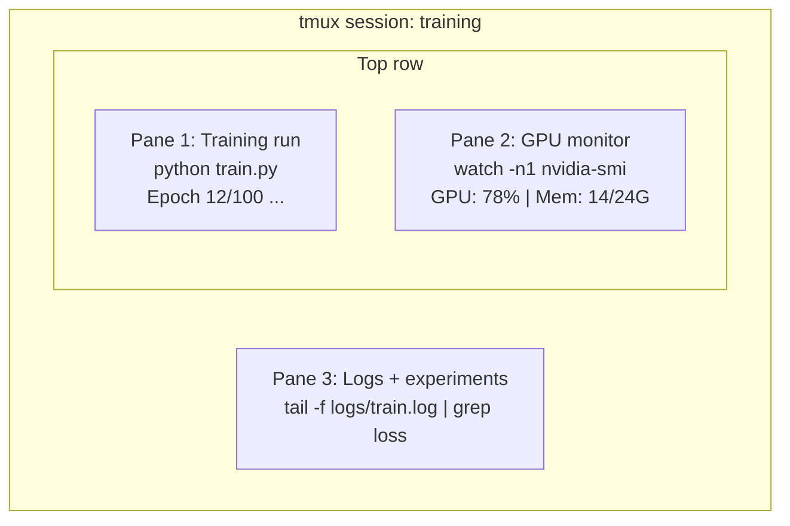

# Terminal & Shell

> Terminal, AI mühendislerinin yaşadığı yerdir.

**Type:** Learn
**Languages:** --
**Prerequisites:** Phase 0, Lesson 01
**Time:** ~35 minutes

## Öğrenme Hedefleri

- - Çöp kullan, yönlendirmeler yap.`grep`Eğitim günlüğünü komut satırından filtrelemek ve işlemek
- Aynı anda eğitim ve GPU izleme için birden fazla panel ile sürekli tmux seansları oluşturun
-  ile sistem ve GPU kaynaklarını izlemek`htop`- Evet .`nvtop`ve`nvidia-smi`
- SSH kullanarak yerel ve uzaktan makineler arasında dosya aktarımı, `scp`ve`rsync`

## Sorun

Bu yüzden, bu programın en iyi yönlendirmesi, bu programın en iyi yönlendirmesi, bu programın en iyi yönlendirmesi, bu programın en iyi yönlendirmesi, bu programın en iyi yönlendirmesi, bu programın en iyi yönlendirmesi, bu programın en iyi yönlendirmesi, bu programın en iyi yönlendirmesi ve bu programın en iyi yönlendirmesi.

Bu ders, Yapay zeka için önemli olan terminal becerileri kapsar.

## Anlaşım



Üç şey aynı anda çalışıyor, bir terminal, ayrılıp eve gidebilirsin, SSH'yi geri alabilirsin ve tekrar bağlayabilirsin.

```figure
s0-shell-pipeline
```

## Yapın

### Adım 1: Kabuklarınızu Bilin

Hangi mermiyi kullanıyorsan kontrol et.

```bash
echo $SHELL
```

Çoğu sistem kullanıyor `bash`veya `zsh`Her ikisi de iyi çalışıyor. Bu kursta komutlar her ikisinde de çalışıyor.

Bilmeniz gereken önemli şeyler:

```bash
# Move around
cd ~/projects/ai-engineering-from-scratch
pwd
ls -la

# History search (most useful shortcut you'll learn)
# Ctrl+R then type part of a previous command
# Press Ctrl+R again to cycle through matches

# Clear terminal
clear   # or Ctrl+L

# Cancel a running command
# Ctrl+C

# Suspend a running command (resume with fg)
# Ctrl+Z
```

### Adım 2: Borular ve yönlendirmeler

Bu şekilde kayıtları, filtre çıkışını ve zincir araçlarını işleyeceksiniz.

```bash
# Count how many times "loss" appears in a log
cat train.log | grep "loss" | wc -l

# Extract just the loss values from training output
grep "loss:" train.log | awk '{print $NF}' > losses.txt

# Watch a log file update in real time, filtering for errors
tail -f train.log | grep --line-buffered "ERROR"

# Sort experiments by final accuracy
grep "final_accuracy" results/*.log | sort -t= -k2 -n -r

# Redirect stdout and stderr to separate files
python train.py > output.log 2> errors.log

# Redirect both to the same file
python train.py > train_full.log 2>&1
```

İhtiyacınız olan üç yönlendirme:

| Symbol | What it does |
|--------|-------------|
| `>` | Write stdout to file (overwrite) |
| `>>` | Append stdout to file |
| `2>` | Write stderr to file |
| `2>&1` | Send stderr to same place as stdout |
| `\|` | Send stdout of one command as stdin to the next |

### Adım 3: Arka plan süreçleri

Eğitim saatlerce sürer, terminalini her zaman açık tutmak istemezsin.

```bash
# Run in background (output still goes to terminal)
python train.py &

# Run in background, immune to hangup (closing terminal won't kill it)
nohup python train.py > train.log 2>&1 &

# Check what's running in background
jobs
ps aux | grep train.py

# Bring a background job to foreground
fg %1

# Kill a background process
kill %1
# or find its PID and kill that
kill $(pgrep -f "train.py")
```

`&`- Evet .`nohup`ve`screen`- Ne ?`tmux`- ...

| Method | Survives terminal close? | Can reattach? |
|--------|-------------------------|---------------|
| `command &` | No | No |
| `nohup command &` | Yes | No (check log file) |
| `screen` / `tmux` | Yes | Yes |

Birkaç dakikadan uzun süre, tmux kullanın.

### 4. adım: tmux

tmux, birden fazla panel ile sürekli terminal seansları oluşturmanıza olanak tanır.

```bash
# Install
# macOS
brew install tmux
# Ubuntu
sudo apt install tmux

# Start a named session
tmux new -s training

# Split horizontally
# Ctrl+B then "

# Split vertically
# Ctrl+B then %

# Navigate between panes
# Ctrl+B then arrow keys

# Detach (session keeps running)
# Ctrl+B then d

# Reattach
tmux attach -t training

# List sessions
tmux ls

# Kill a session
tmux kill-session -t training
```

Tipik bir AI iş akışı oturum:

```bash
tmux new -s train

# Pane 1: start training
python train.py --epochs 100 --lr 1e-4

# Ctrl+B, " to split, then run GPU monitor
watch -n1 nvidia-smi

# Ctrl+B, % to split vertically, tail the logs
tail -f logs/experiment.log

# Now detach with Ctrl+B, d
# SSH out, go get coffee, come back
# tmux attach -t train
```

### Adım 5: Htop ve nvtop ile izleme

```bash
# System processes (better than top)
htop

# GPU processes (if you have NVIDIA GPU)
# Install: sudo apt install nvtop (Ubuntu) or brew install nvtop (macOS)
nvtop

# Quick GPU check without nvtop
nvidia-smi

# Watch GPU usage update every second
watch -n1 nvidia-smi

# See which processes are using the GPU
nvidia-smi --query-compute-apps=pid,name,used_memory --format=csv
```

`htop`Kullandığınız anahtar bağlamalar:
- `F6`veya `>`sütunlara göre sıralamak (hüye kayıplarını bulmak için hafıza kayıplarına göre sıralamak)
- `F5`ağaç görünümünü değiştirmek için (bkz. çocuk süreçleri)
- `F9`Bir süreci öldürmek için
- `/`Bir işlem adı aramak için

### Adım 6: Uzak GPU kutuları için SSH

Bulut GPU'sunu kiraladığınızda (Lambda, RunPod, Vast.ai), SSH üzerinden bağlantı kurarsınız.

```bash
# Basic connection
ssh user@gpu-box-ip

# With a specific key
ssh -i ~/.ssh/my_gpu_key user@gpu-box-ip

# Copy files to remote
scp model.pt user@gpu-box-ip:~/models/

# Copy files from remote
scp user@gpu-box-ip:~/results/metrics.json ./

# Sync a whole directory (faster for many files)
rsync -avz ./data/ user@gpu-box-ip:~/data/

# Port forward (access remote Jupyter/TensorBoard locally)
ssh -L 8888:localhost:8888 user@gpu-box-ip
# Now open localhost:8888 in your browser

# SSH config for convenience
# Add to ~/.ssh/config:
# Host gpu
#     HostName 192.168.1.100
#     User ubuntu
#     IdentityFile ~/.ssh/gpu_key
#
# Then just:
# ssh gpu
```

### Adım 7: AI çalışması için yararlı isimler

Bunları ekle .`~/.bashrc`veya `~/.zshrc`- ...

```bash
source phases/00-setup-and-tooling/10-terminal-and-shell/code/shell_aliases.sh
```

Ya da istediğinizleri kopyalayın.

```bash
# GPU status at a glance
alias gpu='nvidia-smi --query-gpu=index,name,utilization.gpu,memory.used,memory.total,temperature.gpu --format=csv,noheader'

# Kill all Python training processes
alias killtraining='pkill -f "python.*train"'

# Quick virtual environment activate
alias ae='source .venv/bin/activate'

# Watch training loss
alias watchloss='tail -f logs/*.log | grep --line-buffered "loss"'
```

Bakın .`code/shell_aliases.sh`Tam set için.

### Adım 8: Genel AI terminal modelleri

Bunlar pratikte tekrar tekrar ortaya çıkıyor:

```bash
# Run training, log everything, notify when done
python train.py 2>&1 | tee train.log; echo "DONE" | mail -s "Training complete" you@email.com

# Compare two experiment logs side by side
diff <(grep "accuracy" exp1.log) <(grep "accuracy" exp2.log)

# Find the largest model files (clean up disk space)
find . -name "*.pt" -o -name "*.safetensors" | xargs du -h | sort -rh | head -20

# Download a model from Hugging Face
wget https://huggingface.co/model/resolve/main/model.safetensors

# Untar a dataset
tar xzf dataset.tar.gz -C ./data/

# Count lines in all Python files (see how big your project is)
find . -name "*.py" | xargs wc -l | tail -1

# Check disk space (training data fills disks fast)
df -h
du -sh ./data/*

# Environment variable check before training
env | grep -i cuda
env | grep -i torch
```

## Kullan

İşte bu ders sırasında her aletin oyununa girdiği zaman:

| Tool | When you use it |
|------|----------------|
| tmux | Every training run (Phases 3+) |
| `tail -f` + `grep` | Monitoring training logs |
| `nohup` / `&` | Quick background tasks |
| `htop` / `nvtop` | Debugging slow training, OOM errors |
| SSH + `rsync` | Working on cloud GPUs |
| Piping + redirects | Processing experiment results |
| Aliases | Saving time on repetitive commands |

## Egzersizler

1. tmux kur, üç panel ile bir seans oluştur ve çalıştır `htop`Bir tane.`watch -n1 date`Bir diğerinde Python metni, üçüncüde ise.
2. `code/shell_aliases.sh`- Şalınla yeniden yüklen .`source ~/.zshrc`(veya `~/.bashrc`)
3. Yalanca bir eğitim günlüğü oluşturun `for i in $(seq 1 100); do echo "epoch $i loss: $(echo "scale=4; 1/$i" | bc)"; sleep 0.1; done > fake_train.log`ve sonra kullan `grep`- Evet .`tail`ve`awk`Sadece kayb değerlerini çıkarmak için.
4. Kullanmakta olduğunuz (veya kullandığınız) bir sunucu için SSH yapılandırma girişini ayarlayın `localhost`Sözcükleri uygulamak için).

## Anahtar Terimler

| Term | What people say | What it actually means |
|------|----------------|----------------------|
| Shell | "The terminal" | The program that interprets your commands (bash, zsh, fish) |
| tmux | "Terminal multiplexer" | A program that lets you run multiple terminal sessions inside one window, and detach/reattach |
| Pipe | "The bar thing" | The `\|` operator that sends one command's output as input to another |
| PID | "Process ID" | A unique number assigned to every running process, used to monitor or kill it |
| nohup | "No hangup" | Runs a command immune to the hangup signal, so closing the terminal won't kill it |
| SSH | "Connecting to the server" | Secure Shell, an encrypted protocol for running commands on a remote machine |
