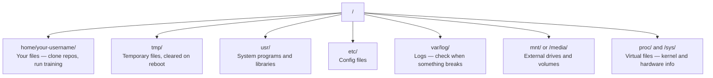

# AI için Linux

> Çoğu AI Linux'ta çalışır.

**Type:** Learn
**Languages:** --
**Prerequisites:** Phase 0, Lesson 01
**Time:** ~30 minutes

## Öğrenme Hedefleri

- Linux dosya sistemini gezin ve komut satırından gerekli dosya işlemlerini yap
- Dosya izinlerini  ile yönet`chmod`ve `chown`"Yasal izin reddedildi" hatalarını çözmek için
-  ile sistem paketlerini yükle`apt`Ve yeni bir GPU kutu kurmak için AI çalışma
- Uzak makinelerde çalışan geliştiricilerin sıklıkla hata yapan macOS-Linux arasındaki farkları tanımlayın

## Sorun

MacOS veya Windows'ta geliştirilir. Ama bulutlu bir GPU kutuya SSH'yi, Lambda örneğini kiraladığınızda veya EC2 makinesini döndürdüğünüzde Ubuntu'ya yerleşirsiniz. Terminal tek arayüzün. Arayan, Explorer, GUI yok. Dosya sistemini gezinemiyorsanız, paketleri yükleyemezseniz ve komut satırından işlemleri yönetemiyorsanız, "Linux'da bir dosyayı nasıl açılır" diye bir Google'da çalışırken, boş GPU saatleri için ödeme yapıyorsunuz.

Bu bir hayatta kalma rehberidir. Yapay zeka için uzaktan bir Linux makinesi üzerinde çalışmak için tam olarak ne ihtiyacınız olduğunu kapsar.

## Dosya Sistem Layout

Linux her şeyi tek bir kök altında organize eder .`/`- Yok .`C:\`veya `/Volumes`Dokunacağın dizinler:



Ev defteriniz `~`veya `/home/your-username`Neredeyse yaptığın her şey burada olur.

## Temel Emirler

Bunlar uzaktan bir GPU kutusunda yapacağınız şeyin %95'ini kapsayan 15 komut.

### Çevreye Geziyor

```bash
pwd                         # Where am I?
ls                          # What's here?
ls -la                      # What's here, including hidden files with details?
cd /path/to/dir             # Go there
cd ~                        # Go home
cd ..                       # Go up one level
```

### Dosyalar ve Dizinler

```bash
mkdir my-project            # Create a directory
mkdir -p a/b/c              # Create nested directories in one shot

cp file.txt backup.txt      # Copy a file
cp -r src/ src-backup/      # Copy a directory (recursive)

mv old.txt new.txt          # Rename a file
mv file.txt /tmp/           # Move a file

rm file.txt                 # Delete a file (no trash, it's gone)
rm -rf my-dir/              # Delete a directory and everything inside
```

`rm -rf`Giriş'e vurmadan önce yolun kontrolünü yap.

### Dosyaları Oku

```bash
cat file.txt                # Print entire file
head -20 file.txt           # First 20 lines
tail -20 file.txt           # Last 20 lines
tail -f log.txt             # Follow a log file in real time (Ctrl+C to stop)
less file.txt               # Scroll through a file (q to quit)
```

### Arama

```bash
grep "error" training.log           # Find lines containing "error"
grep -r "learning_rate" .           # Search all files in current directory
grep -i "cuda" config.yaml          # Case-insensitive search

find . -name "*.py"                 # Find all Python files under current dir
find . -name "*.ckpt" -size +1G     # Find checkpoint files larger than 1GB
```

## İzinler

Linux'taki her dosyanın sahibi ve izin bitleri vardır. Skriptler çalıştırılmadığında veya bir dizinye yazabilmediğinde buna rastlanırsınız.

```bash
ls -l train.py
# -rwxr-xr-- 1 user group 2048 Mar 19 10:00 train.py
#  ^^^             owner permissions: read, write, execute
#     ^^^          group permissions: read, execute
#        ^^        everyone else: read only
```

Genel düzeltmeler:

```bash
chmod +x train.sh           # Make a script executable
chmod 755 deploy.sh         # Owner: full, others: read+execute
chmod 644 config.yaml       # Owner: read+write, others: read only

chown user:group file.txt   # Change who owns a file (needs sudo)
```

Bir şey "Izin reddedildi" derse, neredeyse her zaman izin sorunu olur.`chmod +x`veya `sudo`Çoğu davası düzeltecek.

## Paket Yönetimi (apt)

Ubuntu kullanıyor `apt`Sistem düzeyinde yazılım kurmak için bu şekilde.

```bash
sudo apt update             # Refresh the package list (always do this first)
sudo apt install -y htop    # Install a package (-y skips confirmation)
sudo apt install -y build-essential  # C compiler, make, etc. Needed by many Python packages
sudo apt install -y tmux    # Terminal multiplexer (keep sessions alive after disconnect)

apt list --installed        # What's installed?
sudo apt remove htop        # Uninstall
```

Yeni bir GPU kutuya yükleyeceğiniz ortak paketler:

```bash
sudo apt update && sudo apt install -y \
    build-essential \
    git \
    curl \
    wget \
    tmux \
    htop \
    unzip \
    python3-venv
```

## Kullanıcılar ve sudo

Genellikle normal bir kullanıcı olarak giriş yapıyorsunuz. Bazı işlemlere root (admin) erişimi gerekmektedir.

```bash
whoami                      # What user am I?
sudo command                # Run a single command as root
sudo su                     # Become root (exit to go back, use sparingly)
```

Bulut GPU örneklerinde, genellikle tek kullanıcı ve zaten sudo erişiminiz vardır. Her şeyi root olarak çalıştırmayın.

## İşlemler ve sistemler

Eğitiminiz bitince veya ne olduğunu kontrol etmeniz gerektiğinde:

```bash
htop                        # Interactive process viewer (q to quit)
ps aux | grep python        # Find running Python processes
kill 12345                  # Gracefully stop process with PID 12345
kill -9 12345               # Force kill (use when graceful doesn't work)
nvidia-smi                  # GPU processes and memory usage
```

Sistemd hizmetleri yönetir ( arka plan daemonları).

```bash
sudo systemctl start nginx          # Start a service
sudo systemctl stop nginx           # Stop it
sudo systemctl restart nginx        # Restart it
sudo systemctl status nginx         # Check if it's running
sudo systemctl enable nginx         # Start automatically on boot
```

## Disk Alanı

GPU kutuları genellikle sınırlı disk alanına sahiptir.

```bash
df -h                       # Disk usage for all mounted drives
df -h /home                 # Disk usage for /home specifically

du -sh *                    # Size of each item in current directory
du -sh ~/.cache             # Size of your cache (pip, huggingface models land here)
du -sh /data/checkpoints/   # Check how big your checkpoints are

# Find the biggest space hogs
du -h --max-depth=1 / 2>/dev/null | sort -hr | head -20
```

Ortak uzay tasarrufu cihazları:

```bash
# Clear pip cache
pip cache purge

# Clear apt cache
sudo apt clean

# Remove old checkpoints you don't need
rm -rf checkpoints/epoch_01/ checkpoints/epoch_02/
```

## Ağlama

Modeller indirilir, dosyaları aktarılır ve komut satırından API'leri vurursunuz.

```bash
# Download files
wget https://example.com/model.bin                   # Download a file
curl -O https://example.com/data.tar.gz              # Same thing with curl
curl -s https://api.example.com/health | python3 -m json.tool  # Hit an API, pretty-print JSON

# Transfer files between machines
scp model.bin user@remote:/data/                     # Copy file to remote machine
scp user@remote:/data/results.csv .                  # Copy file from remote to local
scp -r user@remote:/data/checkpoints/ ./local-dir/   # Copy directory

# Sync directories (faster than scp for large transfers, resumes on failure)
rsync -avz --progress ./data/ user@remote:/data/
rsync -avz --progress user@remote:/results/ ./results/
```

Kullanım`rsync`- Tamam .`scp`Sadece değişen baytları aktarır ve kesilmiş bağlantıları ele alır.

## Sessions'i Canlı Tutun

Uzaktan bir kutuya girerken dizüstü bilgisayarınızı kapatmak eğitim koşunuzu öldürür.

```bash
tmux new -s train           # Start a new session named "train"
# ... start your training, then:
# Ctrl+B, then D            # Detach (training keeps running)

tmux ls                     # List sessions
tmux attach -t train        # Reattach to session

# Inside tmux:
# Ctrl+B, then %            # Split pane vertically
# Ctrl+B, then "            # Split pane horizontally
# Ctrl+B, then arrow keys   # Switch between panes
```

Hep uzun süre eğitim işleri yaparlar.

## Windows Kullanıcıları için WSL2

Windows'taysanız, WSL2 size çift başlatmadan gerçek bir Linux ortamı verir.

```bash
# In PowerShell (admin)
wsl --install -d Ubuntu-24.04

# After restart, open Ubuntu from Start menu
sudo apt update && sudo apt upgrade -y
```

WSL2 gerçek bir Linux çekirdeği çalıştırıyor. Bu dersdeki her şey içeride çalışıyor. Windows dosyalarınız`/mnt/c/Users/YourName/`WSL'nin içinden.

GPU pasthrough Windows tarafında kurulan NVIDIA sürücülerle çalışır. Windows NVIDIA sürücüsünü (Linux değil) yükleyin ve CUDA WSL2 içinde kullanılabilir olacaktır.

## Gotchas: macOS Linux

MacOS'tan geliyorsa sizi tökezletecek şeyler:

| macOS | Linux | Notes |
|-------|-------|-------|
| `brew install` | `sudo apt install` | Different package names sometimes. `brew install htop` vs `sudo apt install htop` works the same, but `brew install readline` vs `sudo apt install libreadline-dev` does not. |
| `open file.txt` | `xdg-open file.txt` | But you won't have a GUI on a remote box. Use `cat` or `less`. |
| `pbcopy` / `pbpaste` | Not available | Pipe to/from clipboard doesn't exist over SSH. |
| `~/.zshrc` | `~/.bashrc` | macOS defaults to zsh. Most Linux servers use bash. |
| `/opt/homebrew/` | `/usr/bin/`, `/usr/local/bin/` | Binaries live in different places. |
| `sed -i '' 's/a/b/' file` | `sed -i 's/a/b/' file` | macOS sed needs an empty string after `-i`. Linux does not. |
| Case-insensitive filesystem | Case-sensitive filesystem | `Model.py` and `model.py` are two different files on Linux. |
| Line endings `\n` | Line endings `\n` | Same. But Windows uses `\r\n`, which breaks bash scripts. Run `dos2unix` to fix. |

## Hızlı İpuç Kartı

```
Navigation:     pwd, ls, cd, find
Files:          cp, mv, rm, mkdir, cat, head, tail, less
Search:         grep, find
Permissions:    chmod, chown, sudo
Packages:       apt update, apt install
Processes:      htop, ps, kill, nvidia-smi
Services:       systemctl start/stop/restart/status
Disk:           df -h, du -sh
Network:        curl, wget, scp, rsync
Sessions:       tmux new/attach/detach
```

```figure
s0-process-fork
```

## Egzersizler

1. SSH'yi herhangi bir Linux makinesine (veya WSL2'yi aç) ekleyin ve ev dizinize gezinin.`touch`, sonra onları listede bul .`ls -la`- Evet .
2. Kurulum`htop`apt ile çalıştırıp en çok hafıza kullanan işlemleri belirleyin.
3. Bir tmux seansı başlatın, çalışın.`sleep 300`İçeride, ayrılıp, seansları listele ve tekrar bağla.
4. Kullanım`df -h`Kullanılabilir disk alanını kontrol etmek için, sonra kullan `du -sh ~/.cache/*`- Kayınatkasında ne yer alıyorsa onu bul.
5. Lokal makinenizden bir dosyayı uzaktan birine aktarmak için `scp`, sonra aynı transferü yap `rsync`Ve deneyimi karşılaştır.
