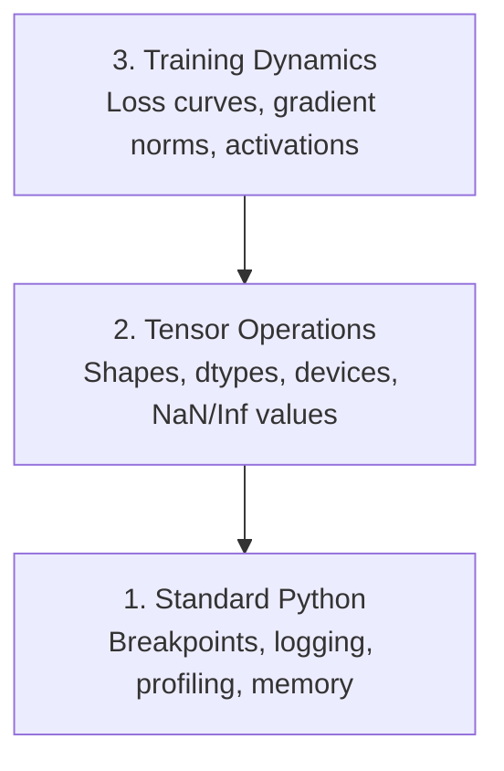

# Çözüm ve Profilleme

> En kötü AI böcekleri çökmezler. Çöp üzerinde sessizce eğitim alırlar ve güzel bir kayıp eğri rapor ederler.

**Type:** Build
**Language:**Python
**Prerequisites:** Lesson 1 (Dev Environment), basic PyTorch familiarity
**Time:** ~60 minutes

## Öğrenme Hedefleri

- Şartlı kullan `breakpoint()`ve `debug_print`Tenzor şekilleri, dtypleri ve NaN değerlerini eğitimin ortasında incelemek için
- Profil eğitim döngüleri `cProfile`- Evet .`line_profiler`ve`tracemalloc`Şişek boynuzları bulmak için
- Genel AI hatalarını tespit edin: şekil eşleşmezliği, NaN kaybı, veri sızması ve yanlış cihaz tenzorları
- Kalan eğrilikleri, ağırlık histogramları ve gradient dağılımlarını görüntülemek için TensorBoard ayarlayın

## Sorun

AI kodu normal kodtan farklı olarak başarısız olur. Bir web uygulaması bir yığın izle çöker. Yanlış yapılandırılmış bir eğitim döngüsü 8 saat sürer, GPU süresi 200 $ yakar ve her girişin ortalamasını tahmin eden bir model üretir.`.detach()`Ya da etiketlerin özelliklere sızması.

Zamanınızı ve hesaplarınızı harcamadan önce bu sessiz başarısızlıkları yakalayacak debugging araçlarına ihtiyacınız var.

## Anlaşım

AI debugging üç seviyede çalışır:



Çoğu insan doğrudan seviye 3'e atlar (TensorBoard'a bakarak). Ama AI hatalarının %80'i seviye 1 ve 2'de yaşar.

```figure
s0-flame-hot
```

## Yapın

### 1. Bölüm: Baskı Çözümleri (Evet, Çalışıyor)

Tansor kodu için, hedeflenmiş bir baskı ifadesi bir defigerden geçmekten daha iyidir çünkü şekilleri, türleri ve değer aralıklarını bir anda görmeniz gerekir.

```python
def debug_print(name, tensor):
    print(f"{name}: shape={tensor.shape}, dtype={tensor.dtype}, "
          f"device={tensor.device}, "
          f"min={tensor.min().item():.4f}, max={tensor.max().item():.4f}, "
          f"mean={tensor.mean().item():.4f}, "
          f"has_nan={tensor.isnan().any().item()}")
```

Her şüpheli operasyondan sonra bunu söyleyin.

### Bölüm 2: Python Debugger (pdb ve breakpoint)

Yapılı defugger, AI çalışması için küçümselir.`breakpoint()`Eğitim döngüsüne girerek, tensörleri etkileşimli olarak kontrol edin.

```python
def training_step(model, batch, criterion, optimizer):
    inputs, labels = batch
    outputs = model(inputs)
    loss = criterion(outputs, labels)

    if loss.item() > 100 or torch.isnan(loss):
        breakpoint()

    loss.backward()
    optimizer.step()
```

Çözücü sizi içeri atınca, yararlı komutlar:

- `p outputs.shape`şekilleri kontrol etmek için
- `p loss.item()`Kayıp değerini görmek için
- `p torch.isnan(outputs).sum()`NAN'ları saymak
- `p model.fc1.weight.grad`Değişiklikleri kontrol etmek için
- `c`devam etmek için.`q`İptal etmek

Bu şartlı bir debugging. Bir şey yanlış görünce durursun.

### Bölüm 3: Python Kayıtlama

Çizim ifadelerini, çürütme işleminiz hızlı bir kontrolden daha fazla olduğunda kayıtlama ile değiştirin.

```python
import logging

logging.basicConfig(
    level=logging.INFO,
    format="%(asctime)s [%(levelname)s] %(message)s",
    handlers=[
        logging.FileHandler("training.log"),
        logging.StreamHandler()
    ]
)
logger = logging.getLogger(__name__)

logger.info("Starting training: lr=%.4f, batch_size=%d", lr, batch_size)
logger.warning("Loss spike detected: %.4f at step %d", loss.item(), step)
logger.error("NaN loss at step %d, stopping", step)
```

Kayıtlama size zaman damgaları, ciddiyet seviyeleri ve dosya çıkışı sağlar. Öğretim çalışması sabah 3'te başarısız olduğunda, ekranın dışına kaydırılan terminal çıkışı değil, bir günlük dosyası istiyorsunuz.

### Bölüm 4: Zamanlama Kod Bölümleri

Zamanın nereye gittiğini bilmek, optimize edilme için ilk adımdır.

```python
import time

class Timer:
    def __init__(self, name=""):
        self.name = name

    def __enter__(self):
        self.start = time.perf_counter()
        return self

    def __exit__(self, *args):
        elapsed = time.perf_counter() - self.start
        print(f"[{self.name}] {elapsed:.4f}s")

with Timer("data loading"):
    batch = next(dataloader_iter)

with Timer("forward pass"):
    outputs = model(batch)

with Timer("backward pass"):
    loss.backward()
```

Genel bulgu: veri yüklenmesi eğitim süresinin %60'ını alır.`num_workers > 0`DataLoader'de, daha hızlı bir GPU değil.

### Bölüm 5: cProfile ve line_profil

El zamanlayıcılarından fazlasına ihtiyacınız olduğunda:

```bash
python -m cProfile -s cumtime train.py
```

Bu, her fonksiyon çağrısını kumületif zaman ile sıralamayı gösterir.

```bash
pip install line_profiler
```

```python
@profile
def train_step(model, data, target):
    output = model(data)
    loss = F.cross_entropy(output, target)
    loss.backward()
    return loss

# Run with: kernprof -l -v train.py
```

### Bölüm 6: Hatıra Profili

#### Tracemalloc ile CPU belleği

```python
import tracemalloc

tracemalloc.start()

# your code here
model = build_model()
data = load_dataset()

snapshot = tracemalloc.take_snapshot()
top_stats = snapshot.statistics("lineno")
for stat in top_stats[:10]:
    print(stat)
```

#### CPU belleği memory_profileri ile

```bash
pip install memory_profiler
```

```python
from memory_profiler import profile

@profile
def load_data():
    raw = read_csv("data.csv")       # watch memory jump here
    processed = preprocess(raw)       # and here
    return processed
```

Çabuk koş .`python -m memory_profiler your_script.py`Hatalı hafıza kullanımını görmek için.

#### PyTorch ile GPU belleği

```python
import torch

if torch.cuda.is_available():
    print(torch.cuda.memory_summary())

    print(f"Allocated: {torch.cuda.memory_allocated() / 1e9:.2f} GB")
    print(f"Cached: {torch.cuda.memory_reserved() / 1e9:.2f} GB")
```

OOM'u (Hatırdan) bastığınızda:

1. Toplu boyutunu azaltmak (her zaman denemek için ilk şey)
2. Kullanım`torch.cuda.empty_cache()`Önbelleğe alınan hafızaları serbest bırakmak için
3. Kullanım`del tensor`Ardından `torch.cuda.empty_cache()`Büyük ara ürünler için
4. Karışık bir hassasiyet kullanın (`torch.cuda.amp`) hafıza kullanımını yarıya indirmek için
5. Çok derin modeller için gradient kontrol noktasını kullanın

### Bölüm 7: Genel Yapay Bilgi Böcekleri ve Onları Nasıl Yakalarsınız

#### Şekil Uymazlığı

En sık rastlanan böcek.`[batch, features]`model beklediği zaman `[batch, channels, height, width]`- Evet .

```python
def check_shapes(model, sample_input):
    print(f"Input: {sample_input.shape}")
    hooks = []

    def make_hook(name):
        def hook(module, inp, out):
            in_shape = inp[0].shape if isinstance(inp, tuple) else inp.shape
            out_shape = out.shape if hasattr(out, "shape") else type(out)
            print(f"  {name}: {in_shape} -> {out_shape}")
        return hook

    for name, module in model.named_modules():
        hooks.append(module.register_forward_hook(make_hook(name)))

    with torch.no_grad():
        model(sample_input)

    for h in hooks:
        h.remove()
```

Bunu bir örnek seriyle çalıştırın.

#### Kayıplar

NaN kaybı, patlamış bir şey anlamına gelir.

- Öğrenme oranı çok yüksek
- Gümrük Kayıplarında sıfırla bölünme
- 0 veya negatif sayının kayıtları
- RNN'lerde patlama gradiyenti

```python
def detect_nan(model, loss, step):
    if torch.isnan(loss):
        print(f"NaN loss at step {step}")
        for name, param in model.named_parameters():
            if param.grad is not None:
                if torch.isnan(param.grad).any():
                    print(f"  NaN gradient in {name}")
                if torch.isinf(param.grad).any():
                    print(f"  Inf gradient in {name}")
        return True
    return False
```

#### Veriler Sızdırılıyor

Test setinde modeliniz %99 doğruluk elde ediyor.

```python
def check_data_leakage(train_set, test_set, id_column="id"):
    train_ids = set(train_set[id_column].tolist())
    test_ids = set(test_set[id_column].tolist())
    overlap = train_ids & test_ids
    if overlap:
        print(f"DATA LEAKAGE: {len(overlap)} samples in both train and test")
        return True
    return False
```

Ayrıca zamanlı sızıntıları kontrol edin: geçmişi tahmin etmek için gelecek verileri kullanın.

#### Yanlış Cihaz

Farklı cihazlarda (CPU vs. GPU) olan tenzorlar çalıştırma saatinde hatalara neden olur. Ama bazen bir tenzor CPU'da sessizce kalırken diğer her şey GPU'da kalır ve eğitim yavaş çalışır.

```python
def check_devices(model, *tensors):
    model_device = next(model.parameters()).device
    print(f"Model device: {model_device}")
    for i, t in enumerate(tensors):
        if t.device != model_device:
            print(f"  WARNING: tensor {i} on {t.device}, model on {model_device}")
```

### Bölüm 8: TensorBoard Temellikleri

TensorBoard size eğitim içinde ne olduğunu gösteriyor.

```bash
pip install tensorboard
```

```python
from torch.utils.tensorboard import SummaryWriter

writer = SummaryWriter("runs/experiment_1")

for step in range(num_steps):
    loss = train_step(model, batch)

    writer.add_scalar("loss/train", loss.item(), step)
    writer.add_scalar("lr", optimizer.param_groups[0]["lr"], step)

    if step % 100 == 0:
        for name, param in model.named_parameters():
            writer.add_histogram(f"weights/{name}", param, step)
            if param.grad is not None:
                writer.add_histogram(f"grads/{name}", param.grad, step)

writer.close()
```

Başlatın:

```bash
tensorboard --logdir=runs
```

Ne aramalı:

- **Loss not decreasing**: Öğrenme oranı çok düşük veya model mimarisi sorunu
- **Loss oscillating wildly**: Öğrenme oranı çok yüksek
- **Loss goes to NaN**: Sayısal dengesizlik (yukarıdaki NaN bölümüne bakın)
- **Train loss decreasing, val loss increasing**: Üstü takma
- **Weight histograms collapsing to zero**: Kayıp dereceler
- **Gradient histograms exploding**: Gezi kesimi gerekiyor

### Bölüm 9: VS Kod Debugger

Etkinleştirme işlemleri için, VS Kod'u  ile yapılandırın.`launch.json`- ...

```json
{
    "version": "0.2.0",
    "configurations": [
        {
            "name": "Debug Training",
            "type": "debugpy",
            "request": "launch",
            "program": "${file}",
            "console": "integratedTerminal",
            "justMyCode": false
        }
    ]
}
```

Debug konsolu, Python ifadelerini çalıştırma sırasında kullanmanızı sağlar.

Her dönüşümü görmek istediğiniz veri öncesi işleme boru hattı üzerinden geçmek için kullanışlı.

## Kullan

İşte en çok AI hatalarını yakalayan debugging iş akışı:

1. **Before training**Çıkış .`check_shapes`Giriş ve çıkış boyutlarının beklentilere uygun olduğunu kontrol edin.
2. **First 10 steps**Kullanım:`debug_print`Hiçbir şey NaN olmadığını ve değerlerin makul bir aralığında olduğunu onaylayın.
3. **During training**: Günlük kaybı, öğrenme hızı ve gradient normları. Görüntüleme için TensorBoard kullanın.
4. **When something breaks**Düşürürüm .`breakpoint()`Tesörleri etkileşimli olarak kontrol edin.
5. **For performance**Verilerin yüklenmesi vs ileri vs geri geçiş zamanı.

## Gönder

Çözümleme araç kümesi senaryosunu çalıştır:

```bash
python phases/00-setup-and-tooling/12-debugging-and-profiling/code/debug_tools.py
```

Bakın .`outputs/prompt-debug-ai-code.md`AI-specifik hataları teşhis etmeye yardımcı olan bir istek için.

## Egzersizler

1. Çık .`debug_tools.py`Ve her bölümün çıkışını okuyun. NaN (sunuç: ileri geçideki sıfırla bölün) getirmek için numayel model değiştirin ve detektörün onu yakalamasını izleyin.
2. Eğitim döngüsünü profil edin `cProfile`ve en yavaş fonksiyonu belirleyin.
3. Kullanım`tracemalloc`veri yükleme hattınızdaki hangi satır en fazla bellek ayırıyor.
4. TenzorBoard'ı basit bir eğitim için ayarlayın ve modelin aşırı uygun olup olmadığını belirleyin.
5. Kullanım`breakpoint()`Bir eğitim döngüsünün içinde. Debugger prompt'tan tenzor şekilleri, cihazları ve gradient değerlerini incelemeyi deneyin.
