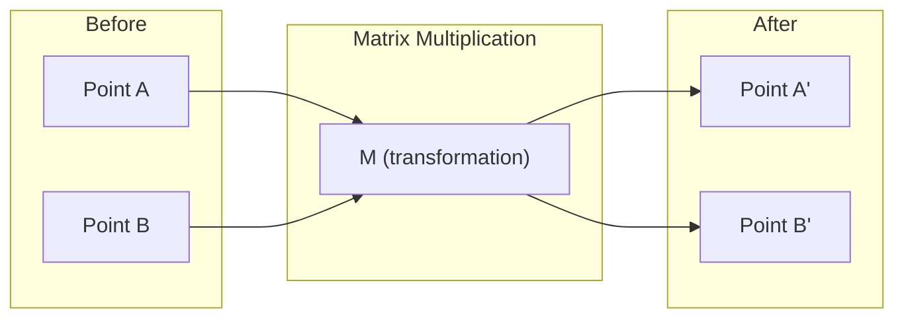
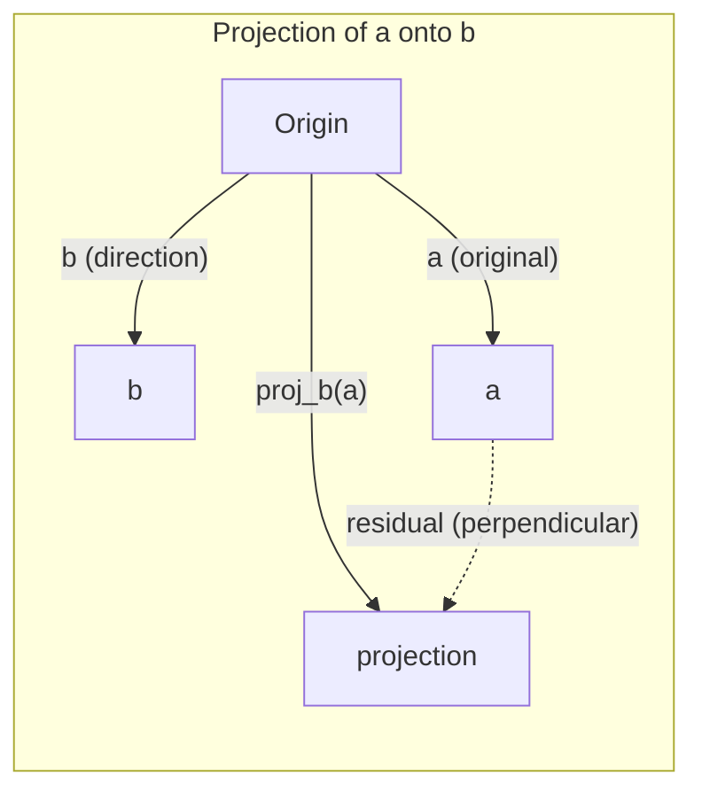

# Düzsel Cevab İçselliği

> Her AI modeli sadece matris matematikası ve şık bir şapka giyiyor.

**Type:** Learn
**Languages:** Python, Julia
**Prerequisites:** Phase 0
**Time:** ~60 minutes

## Öğrenme Hedefleri

- Python'da vektör ve matris işlemlerini (ekle, nokta ürünü, matris çarpımı) sıfırdan uygula
- Düğüm ürünü, projeksiyon ve Gram-Schmidt işleminin ne yaptığını jeometrik olarak açıklayın
- Satır azaltımı kullanarak bir dizi vektörün doğrusal bağımsızlığını, sıra ve tabanını belirleyin
- Düzsel cebir kavramlarını AI uygulamalarına bağlayın: yerleşimler, dikkat puanları ve LoRA

## Sorun

Herhangi bir ML kağıdı açın. İlk sayfada vektörler, matrisler, nokta ürünleri ve dönüşümleri göreceksiniz. Sınırlı cebir içgüdüsi olmadan bunlar sadece semboller.

Matematikçi olman gerekmez, bu işlemlerin geometrik anlamını görmelisin ve sonra da kendin kodla.

## Anlaşım

### vektörler noktalardır (ve yönler)

Vectör sadece sayılar listesi. Ama bu sayılar bir anlam taşır. Uzaydaki koordinatlar.

**2D vector [3, 2]:**

| x | y | Point |
|---|---|-------|
| 3 | 2 | The vector points from origin (0,0) to (3, 2) on the plane |

vektörün büyüklüğü karartı ((3^2 + 2^2) = karartı ((13) ve yukarı ve sağa doğru gösterir.

Yapay zeka'da vektörler her şeyi temsil eder:
- Bir kelime → 768 sayının vektörü (eğlenme alanında "mavzu")
- Bir görüntü → milyonlarca piksel değerinin vektörü
- Bir kullanıcı → bir tercih vektörü

### Matrisler Değişikliklerdir

Bir matris bir vektörü başka bir vektöre dönüştürür. Döner, ölçeklendirir, uzanır veya projekte edebilir.



Yapay zeka'da, matrisler model:
- Nöral ağ ağırlıkları → girişleri çıkışa dönüştüren matrisler
- Dikkat puanları → hangi şeye odaklanacağımızı belirleyen matrisler
- Sözcükleri vektörlere haritası yapan yerleşimler → matrisler

### Dot Ürün Ölçümleri Benzerliği

İki vektörün nokta ürünü, birbirlerine ne kadar benzer olduklarını gösterir.

```
a · b = a₁×b₁ + a₂×b₂ + ... + aₙ×bₙ

Same direction:      a · b > 0  (similar)
Perpendicular:       a · b = 0  (unrelated)
Opposite direction:  a · b < 0  (dissimilar)
```

Arama motorları, tavsiye sistemleri ve RAG'lar bu şekilde çalışır. Yüksek nokta ürünleri olan vektörleri bulurlar.

### Düzsel Bağımsızlık

Eğer v1, v2, v3 bağımsız ise, 3 boyutlu bir alanı kapsarlar. Eğer bir vektör diğerlerinin bir kombinasyonu ise, sadece bir düzlem kapsarlar.

Bu, AI için neden önemlidir: Özellik matrisinizin doğrusal bağımsız sütunları olması gerekir. İki özellik mükemmel bir şekilde ilişkili (linear olarak bağımlı) ise, model onların etkilerini ayırt edemez. Bu, gerileme sırasında çok doğrusallığa neden olur - ağırlık matrisi istikrarsız hale gelir ve küçük giriş değişiklikleri vahşi çıkış dalgalanmaları üretir.

**Concrete example:**

```
v1 = [1, 0, 0]
v2 = [0, 1, 0]
v3 = [2, 1, 0]   # v3 = 2*v1 + v2
```

v1 ve v2 bağımsızdır. Ne bir skalar katı ne de diğerinin kombinasyonu. ama v3 = 2*v1 + v2, bu yüzden {v1, v2, v3} bağımlı bir set. Bu üç vektör hepsi xy düzleminde.

Veriler kümesinde: eğer feature_3 = 2*feature_1 + feature_2, ekleyerek feature_3 modelde sıfır yeni bilgi verir. Daha da kötüsü, normal denklemleri tek başına yapar - ağırlıklar için benzersiz bir çözüm yoktur.

### Temel ve Renk

Bir temel, tüm alanı kaplayan asgari bir dizi doğrusal bağımsız vektördür.

3D alanı için standart temel {1,0,0], [0,1,0], [0,0,1]}. Ancak 3D'deki herhangi üç bağımsız vektör geçerli bir temel oluşturur.

Bir matrisin rütbesi = doğrusal bağımsız sütun sayısı = doğrusal bağımsız satır sayısı.
- Sistemde sonsuz sayıda çözüm vardır (veya hiç yoktur)
- Değişiklik sırasında bilgi kaybolur.
- Matris tersine çevirilemez

| Situation | Rank | What it means for ML |
|-----------|------|---------------------|
| Full rank (rank = min(m, n)) | Maximum possible | Unique least-squares solution exists. Model is well-conditioned. |
| Rank deficient (rank < min(m, n)) | Below maximum | Features are redundant. Infinitely many weight solutions. Regularization needed. |
| Rank 1 | 1 | Every column is a scaled copy of one vector. All data lies on a line. |
| Near rank-deficient (small singular values) | Numerically low | Matrix is ill-conditioned. Tiny input noise causes large output changes. Use SVD truncation or ridge regression. |

### Proje

Proje vectörü **a**vektörüne**b****a****b**- ...

```
proj_b(a) = (a dot b / b dot b) * b
```

Geri kalan (a - proj_b(a)) b'ye diktir. Bu ortogonal parçalanma en az karelik yerleşimlerin temelidir.

Projection her yerde ML'de:
- Düzsel gerileme gözlemlerden sütun alanına olan mesafeyi en aza indirir.
- PCA, en yüksek değişikliğin yönlerine yönelik verileri projeseler
- Transformatörlerde dikkat, sorguların anahtarlara projeksiyonlarını hesaplar



**Example:**A = [3, 4], b = [1, 0]

proj_b(a) = (3*1 + 4*0) / (1*1 + 0*0) * [1, 0] = 3 * [1, 0] = [3, 0]

Y bileşenini düşüren projeksiyon, en basit biçimindeki boyutların azalmasıdır.

### Gram-Schmidt Süreci

Ortonormal, her vektörün uzunluğu 1 ve her çiftin dik olması anlamına gelir.

Algoritm:
1. İlk vektörü alın, normalleştirin.
2. İkinci vektörü alın, ilk vektörün üzerinde projeksiyonunu çıkarın, normalleştirin.
3. Üçüncü vektörü alın, tüm önceki vektörlere projeksiyonlarını çıkarın, normalleştirin.
4. Geri kalan vektörler için tekrarlayın

```
Input:  v1, v2, v3, ... (linearly independent)

u1 = v1 / |v1|

w2 = v2 - (v2 dot u1) * u1
u2 = w2 / |w2|

w3 = v3 - (v3 dot u1) * u1 - (v3 dot u2) * u2
u3 = w3 / |w3|

Output: u1, u2, u3, ... (orthonormal basis)
```

QR parçalanması içsel olarak bu şekilde çalışır. Q ortonomal temeldir, R projeksiyon katılıklarını yakalar. QR parçalanması:
- Düzsel sistemlerin çözümü (Gaussian ortadan kaldırılmasından daha istikrarlı)
- Bilgisayar öz değerleri (QR algoritması)
- En az kare geri dönüşü (standard sayısal yöntem)

```figure
eigen-directions
```

## Yapın

### Adım 1: sıfırdan vektörler (Python)

```python
class Vector:
    def __init__(self, components):
        self.components = list(components)
        self.dim = len(self.components)

    def __add__(self, other):
        return Vector([a + b for a, b in zip(self.components, other.components)])

    def __sub__(self, other):
        return Vector([a - b for a, b in zip(self.components, other.components)])

    def dot(self, other):
        return sum(a * b for a, b in zip(self.components, other.components))

    def magnitude(self):
        return sum(x**2 for x in self.components) ** 0.5

    def normalize(self):
        mag = self.magnitude()
        return Vector([x / mag for x in self.components])

    def cosine_similarity(self, other):
        return self.dot(other) / (self.magnitude() * other.magnitude())

    def __repr__(self):
        return f"Vector({self.components})"


a = Vector([1, 2, 3])
b = Vector([4, 5, 6])

print(f"a + b = {a + b}")
print(f"a · b = {a.dot(b)}")
print(f"|a| = {a.magnitude():.4f}")
print(f"cosine similarity = {a.cosine_similarity(b):.4f}")
```

### Adım 2: sıfırdan matrisler (Python)

```python
class Matrix:
    def __init__(self, rows):
        self.rows = [list(row) for row in rows]
        self.shape = (len(self.rows), len(self.rows[0]))

    def __matmul__(self, other):
        if isinstance(other, Vector):
            return Vector([
                sum(self.rows[i][j] * other.components[j] for j in range(self.shape[1]))
                for i in range(self.shape[0])
            ])
        rows = []
        for i in range(self.shape[0]):
            row = []
            for j in range(other.shape[1]):
                row.append(sum(
                    self.rows[i][k] * other.rows[k][j]
                    for k in range(self.shape[1])
                ))
            rows.append(row)
        return Matrix(rows)

    def transpose(self):
        return Matrix([
            [self.rows[j][i] for j in range(self.shape[0])]
            for i in range(self.shape[1])
        ])

    def __repr__(self):
        return f"Matrix({self.rows})"


rotation_90 = Matrix([[0, -1], [1, 0]])
point = Vector([3, 1])

rotated = rotation_90 @ point
print(f"Original: {point}")
print(f"Rotated 90°: {rotated}")
```

### Adım 3: Bu neden AI için önemli

```python
import random

random.seed(42)
weights = Matrix([[random.gauss(0, 0.1) for _ in range(3)] for _ in range(2)])
input_vector = Vector([1.0, 0.5, -0.3])

output = weights @ input_vector
print(f"Input (3D): {input_vector}")
print(f"Output (2D): {output}")
print("This is what a neural network layer does -- matrix multiplication.")
```

### Dördüncü adım: Julia versiyonu

```julia
a = [1.0, 2.0, 3.0]
b = [4.0, 5.0, 6.0]

println("a + b = ", a + b)
println("a · b = ", a ⋅ b)       # Julia supports unicode operators
println("|a| = ", √(a ⋅ a))
println("cosine = ", (a ⋅ b) / (√(a ⋅ a) * √(b ⋅ b)))

# Matrix-vector multiplication
W = [0.1 -0.2 0.3; 0.4 0.5 -0.1]
x = [1.0, 0.5, -0.3]
println("Wx = ", W * x)
println("This is a neural network layer.")
```

### Adım 5: Düzsel bağımsızlık ve sıfırdan projeksiyon (Python)

```python
def is_linearly_independent(vectors):
    n = len(vectors)
    dim = len(vectors[0].components)
    mat = Matrix([v.components[:] for v in vectors])
    rows = [row[:] for row in mat.rows]
    rank = 0
    for col in range(dim):
        pivot = None
        for row in range(rank, len(rows)):
            if abs(rows[row][col]) > 1e-10:
                pivot = row
                break
        if pivot is None:
            continue
        rows[rank], rows[pivot] = rows[pivot], rows[rank]
        scale = rows[rank][col]
        rows[rank] = [x / scale for x in rows[rank]]
        for row in range(len(rows)):
            if row != rank and abs(rows[row][col]) > 1e-10:
                factor = rows[row][col]
                rows[row] = [rows[row][j] - factor * rows[rank][j] for j in range(dim)]
        rank += 1
    return rank == n


def project(a, b):
    scalar = a.dot(b) / b.dot(b)
    return Vector([scalar * x for x in b.components])


def gram_schmidt(vectors):
    orthonormal = []
    for v in vectors:
        w = v
        for u in orthonormal:
            proj = project(w, u)
            w = w - proj
        if w.magnitude() < 1e-10:
            continue
        orthonormal.append(w.normalize())
    return orthonormal


v1 = Vector([1, 0, 0])
v2 = Vector([1, 1, 0])
v3 = Vector([1, 1, 1])
basis = gram_schmidt([v1, v2, v3])
for i, u in enumerate(basis):
    print(f"u{i+1} = {u}")
    print(f"  |u{i+1}| = {u.magnitude():.6f}")

print(f"u1 · u2 = {basis[0].dot(basis[1]):.6f}")
print(f"u1 · u3 = {basis[0].dot(basis[2]):.6f}")
print(f"u2 · u3 = {basis[1].dot(basis[2]):.6f}")
```

## Kullan

NumPy ile aynı şey -- pratikte kullanacağınız şey:

```python
import numpy as np

a = np.array([1, 2, 3], dtype=float)
b = np.array([4, 5, 6], dtype=float)

print(f"a + b = {a + b}")
print(f"a · b = {np.dot(a, b)}")
print(f"|a| = {np.linalg.norm(a):.4f}")
print(f"cosine = {np.dot(a, b) / (np.linalg.norm(a) * np.linalg.norm(b)):.4f}")

W = np.random.randn(2, 3) * 0.1
x = np.array([1.0, 0.5, -0.3])
print(f"Wx = {W @ x}")
```

### NumPy ile sıralama, projeksiyon ve QR

```python
import numpy as np

A = np.array([[1, 2], [2, 4]])
print(f"Rank: {np.linalg.matrix_rank(A)}")

a = np.array([3, 4])
b = np.array([1, 0])
proj = (np.dot(a, b) / np.dot(b, b)) * b
print(f"Projection of {a} onto {b}: {proj}")

Q, R = np.linalg.qr(np.random.randn(3, 3))
print(f"Q is orthogonal: {np.allclose(Q @ Q.T, np.eye(3))}")
print(f"R is upper triangular: {np.allclose(R, np.triu(R))}")
```

### PyTorch - Tensörler Otodiff ile vektörler

```python
import torch

x = torch.randn(3, requires_grad=True)
y = torch.tensor([1.0, 0.0, 0.0])

similarity = torch.dot(x, y)
similarity.backward()

print(f"x = {x.data}")
print(f"y = {y.data}")
print(f"dot product = {similarity.item():.4f}")
print(f"d(dot)/dx = {x.grad}")
```

Doppler ürününün x ile ilgili gradiyenti sadece y. PyTorch bunu otomatik olarak hesapladı. Bir sinir ağındaki her işlem bu tür işlemlerden oluşur. Matris çarpıcıları, nokta ürünleri, projeksiyonlar ve tüm bunlar üzerinden gradiyenti otomatik olarak izler.

NumPy'nin yaptığı şeyi bir satırdan inşa ettin.

## Gönder

Bu ders şunları ortaya çıkarır:
- `outputs/prompt-linear-algebra-tutor.md`-- AI asistanlarının geometrik algebereyi öğretmeleri için bir ipucu

## Bağlantılar

Bu dersdeki her şey modern Yapay zeka'nın belirli parçalarıyla bağlantılı:

| Concept | Where it shows up |
|---------|------------------|
| Dot product | Attention scores in transformers, cosine similarity in RAG |
| Matrix multiply | Every neural network layer, every linear transformation |
| Linear independence | Feature selection, avoiding multicollinearity |
| Rank | Determining if a system is solvable, LoRA (low-rank adaptation) |
| Projection | Linear regression (projecting onto column space), PCA |
| Gram-Schmidt / QR | Numerical solvers, eigenvalue computation |
| Orthonormal basis | Stable numerical computation, whitening transforms |

LoRA özel bir değinime layık. Ağır dil modellerini düşük sıralama matrislerine parçalayarak ince ayarlar. LoRA, 4096x4096 ağırlık matrisini (16M parametreleri) güncelleme yerine, 4096x16 ve 16x4096 boyutlarındaki iki matrisi (131K parametreleri) güncelleme yapmaktadır. 16 sıradaki kısıtlama, LoRA'nın ağırlık güncellemeyi 4096 boyutlu alanın 16 boyutlu bir alt alanında yaşatmasını varsaydığını gösterir. Bu gerçek iş yapan doğrusal cebir.

## Egzersizler

1. Uygulama`Vector.angle_between(other)`İki vektör arasındaki açıyı derecelerdeki dönüştürür.
2. X koordinatını ikiye katlayan ve y koordinatını üç katlayan 2 boyutlu bir ölçekleme matrisi oluşturup, sonra vektöre uygulayın [1, 1]
3. 5 rastgele kelime benzeri vektör ( boyut 50), iki en benzerini cosine benzerliği kullanarak bul
4. Gram-Schmidt çıkışının gerçekten ortonom olduğunu kontrol edin: Her çiftin 0 nokta ürünü ve her vektörün 1 büyüklüğü olduğunu kontrol edin
5. 2 sıralı 3x3 bir matris oluşturun. `rank()`Sonra sütunların hangi geometrik nesneyi kapsadığını açıklayın.
6. [1, 2, 3] vektörünü [1, 1, 1] üzerine projekt edin.

## Anahtar Terimler

| Term | What people say | What it actually means |
|------|----------------|----------------------|
| Vector | "An arrow" | A list of numbers representing a point or direction in n-dimensional space |
| Matrix | "A table of numbers" | A transformation that maps vectors from one space to another |
| Dot product | "Multiply and sum" | A measure of how aligned two vectors are -- the core of similarity search |
| Embedding | "Some AI magic" | A vector that represents the meaning of something (word, image, user) |
| Linear independence | "They don't overlap" | No vector in the set can be written as a combination of the others |
| Rank | "How many dimensions" | The number of linearly independent columns (or rows) in a matrix |
| Projection | "The shadow" | The component of one vector in the direction of another |
| Basis | "The coordinate axes" | A minimal set of independent vectors that span the space |
| Orthonormal | "Perpendicular unit vectors" | Vectors that are mutually perpendicular and each have length 1 |
