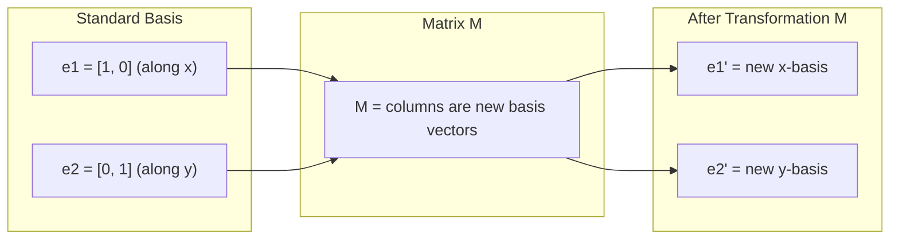
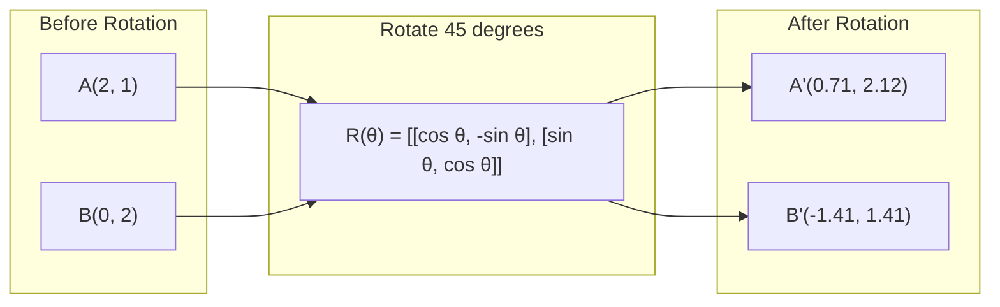
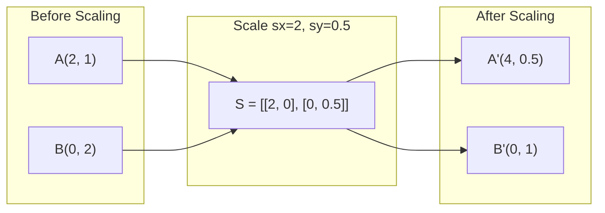
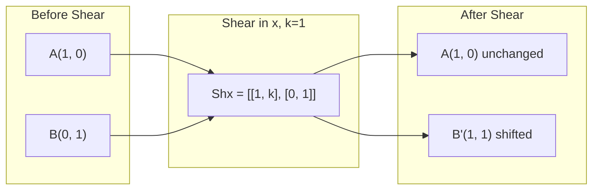
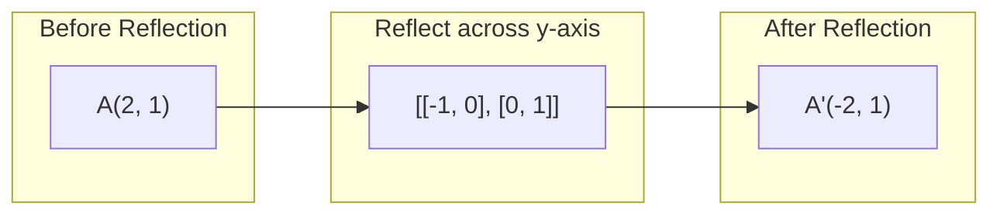
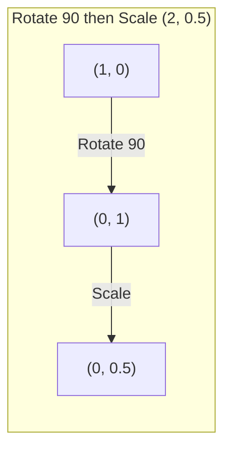
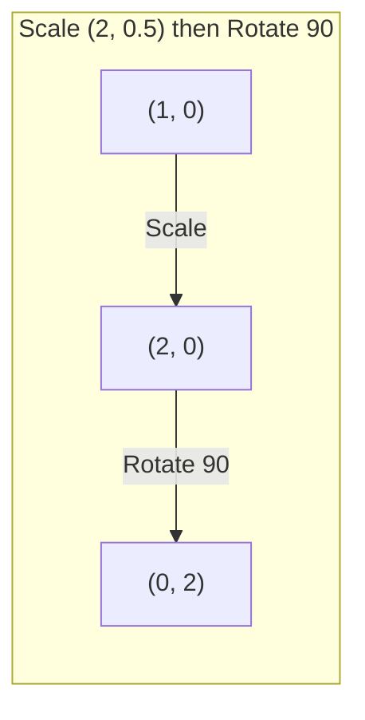

# Matrix Değişiklikleri

> Matrix, uzayı yeniden şekillendiren bir makine. Her noktaya ne yaptığını öğrenir ve tüm dönüşümü anlarsın.

**Type:** Build
**Languages:** Python, Julia
**Prerequisites:** Phase 1, Lessons 01-02 (Linear Algebra Intuition, Vectors & Matrices Operations)
**Time:** ~75 minutes

## Öğrenme Hedefleri

- Dönüşüm, ölçekleme, kesme ve yansıma matrislerini oluşturun ve bunları 2D ve 3D noktalara uygulayın
- Matris çarpımı ile birden fazla dönüşüm oluşturun ve sırayı değerlendirmek için
- Karakteristik denklemden 2x2 matrislerin öz değerlerini ve öz vektörlerini hesaplayın
- Kendi değerlerin neden PCA yönlerini, RNN istikrarını ve spektral gruplama davranışını belirlediğini açıklayın

## Sorun

PCA hakkında okuyorsunuz ve "kovarians matrisinin öz vektörlerini bul". model istikrarı hakkında okuyorsunuz ve "tüm öz değerlerinin büyüklüğü 1'den az olup olmadığını kontrol edin".

Matrisler sadece sayı ağları değildir. Bunlar uzay makineleri. Bir dönüm matrisi noktaları döndürür. Bir ölçekleme matrisi onları uzatır. Bir kesme matrisi onları eğitir. Bir sinir ağının verilere uyguladığı her dönüşüm bu işlemlerden biridir veya bunların bir bileşimi. Bu ders bu işlemleri somut hale getirir.

## Anlaşım

### Matrisler olarak dönüşümler

2 boyutlu her doğrusal dönüşüm 2x2 matris olarak yazılabilir. Matris size temel vektörlerin [1, 0] ve [0, 1] nerede sona ereceğini tam olarak söyler.



### Dönüşüm

2 boyutlu bir dönüm açısı ile teta uzaklıkları ve açıları sağlam tutar.



3 boyutlu bir aksanın etrafında dönersiniz.

```
Rz(theta) = | cos  -sin  0 |     Rotate around z-axis
            | sin   cos  0 |     (x-y plane spins, z stays)
            |  0     0   1 |

Rx(theta) = | 1   0     0    |   Rotate around x-axis
            | 0  cos  -sin   |   (y-z plane spins, x stays)
            | 0  sin   cos   |

Ry(theta) = |  cos  0  sin |     Rotate around y-axis
            |   0   1   0  |     (x-z plane spins, y stays)
            | -sin  0  cos |
```

### Ölçekleme

Ölçekleme her eksesi boyunca bağımsız olarak uzanır veya sıkıştırır.



### Çekim

Çekim, diğerini sabit tutarak bir ekseni eğilerek düzgenleri paralelogramlara dönüştürür.



Çekim matrisleri:
- `Shx = [[1, k], [0, 1]]`x by k * y
- `Shy = [[1, 0], [k, 1]]`y'yi k * x'e çevirir

### Düşünce

Yansıma bir ekseni veya çizgi boyunca noktaları yansıtır.



Refleksiyon matrisleri:
- Y-öksü boyunca yansıt: `[[-1, 0], [0, 1]]`
- X-ötesinin üzerinde yansıt: `[[1, 0], [0, -1]]`

### Yapı: zincirleme dönüşümleri

A ve sonra B dönüşümlerini uygulayarak matrislerini çarpmakla aynıdır: `result = B @ A @ point`Düzenle, sonra ölçekle dön ve sonra ölçekle dön.



Yapılanlar: `S @ R = [[0, -2], [0.5, 0]]`



Yapılanlar: `R @ S = [[0, -0.5], [2, 0]]`

Matrix çarpımı kommutatif değil.

### Kendi değerler ve kendi vektörler

Bir matris onlara çarptığında çoğu vektör yön değiştirir. Eigenvektorlar özeldir: matris sadece onları ölçeklendirir, asla döndürmez. Ölçekleme faktörü öz değerdir.

```
A @ v = lambda * v

v is the eigenvector (direction that survives)
lambda is the eigenvalue (how much it stretches)

Example: A = | 2  1 |
             | 1  2 |

Eigenvector [1, 1] with eigenvalue 3:
  A @ [1,1] = [3, 3] = 3 * [1, 1]     (same direction, scaled by 3)

Eigenvector [1, -1] with eigenvalue 1:
  A @ [1,-1] = [1, -1] = 1 * [1, -1]  (same direction, unchanged)
```

Matris, alanı [1, 1] boyunca 3x uzatır ve [1, -1] değişmez kalır.

### Kendi bileşimi

Bir matrisin n doğrusal bağımsız öz vektörü varsa, parçalanabilir:

```
A = V @ D @ V^(-1)

V = matrix whose columns are eigenvectors
D = diagonal matrix of eigenvalues
V^(-1) = inverse of V

This says: rotate into eigenvector coordinates, scale along each axis, rotate back.
```

### Kendi değerlerin neden önemli olduğu

**PCA.**Kovayans matrisinin öz vektörleri ana bileşenlerdir. öz değerleri size her bileşen ne kadar farklılık yakaladığını söyler. öz değerlere göre sıralayın, üst k'yi tutun ve boyut oranı azalır.

**Stability.**Tekrarlanan ağlarda ve dinamik sistemlerde, büyüklüğü > 1 olan öz değerleri çıkışların patlamasına neden olur. Büyüklük < 1 onları ortadan kaldırır. Bu bir cümlede belirtilen kaybolma/fışkırma gradient sorunu.

**Spectral methods.**Grafik sinir ağları, bitişiklik matrisinin öz değerlerini kullanır. Spektral gruplama, Laplakya öz değerlerini kullanır.

### Volüm ölçekleme faktörü olarak belirleyici

Bir dönüşüm matrisinin belirleyicisi size alanın (2D) veya hacminin (3D) ne kadar ölçeklendirdiğini söyler.

```
det = 1:   area preserved (rotation)
det = 2:   area doubled
det = 0:   space crushed to lower dimension (singular)
det = -1:  area preserved but orientation flipped (reflection)

| det(Rotation) | = 1        (always)
| det(Scale sx, sy) | = sx * sy
| det(Shear) | = 1           (area preserved)
| det(Reflection) | = -1     (orientation flipped)
```

```figure
matrix-transform
```

## Yapın

### Adım 1: Değişiklik matrisleri sıfırdan (Python)

```python
import math

def rotation_2d(theta):
    c, s = math.cos(theta), math.sin(theta)
    return [[c, -s], [s, c]]

def scaling_2d(sx, sy):
    return [[sx, 0], [0, sy]]

def shearing_2d(kx, ky):
    return [[1, kx], [ky, 1]]

def reflection_x():
    return [[1, 0], [0, -1]]

def reflection_y():
    return [[-1, 0], [0, 1]]

def mat_vec_mul(matrix, vector):
    return [
        sum(matrix[i][j] * vector[j] for j in range(len(vector)))
        for i in range(len(matrix))
    ]

def mat_mul(a, b):
    rows_a, cols_b = len(a), len(b[0])
    cols_a = len(a[0])
    return [
        [sum(a[i][k] * b[k][j] for k in range(cols_a)) for j in range(cols_b)]
        for i in range(rows_a)
    ]

point = [1.0, 0.0]
angle = math.pi / 4

rotated = mat_vec_mul(rotation_2d(angle), point)
print(f"Rotate (1,0) by 45 deg: ({rotated[0]:.4f}, {rotated[1]:.4f})")

scaled = mat_vec_mul(scaling_2d(2, 3), [1.0, 1.0])
print(f"Scale (1,1) by (2,3): ({scaled[0]:.1f}, {scaled[1]:.1f})")

sheared = mat_vec_mul(shearing_2d(1, 0), [1.0, 1.0])
print(f"Shear (1,1) kx=1: ({sheared[0]:.1f}, {sheared[1]:.1f})")

reflected = mat_vec_mul(reflection_y(), [2.0, 1.0])
print(f"Reflect (2,1) across y: ({reflected[0]:.1f}, {reflected[1]:.1f})")
```

### Adım 2: Değişikliklerin oluşumu

```python
R = rotation_2d(math.pi / 2)
S = scaling_2d(2, 0.5)

rotate_then_scale = mat_mul(S, R)
scale_then_rotate = mat_mul(R, S)

point = [1.0, 0.0]
result1 = mat_vec_mul(rotate_then_scale, point)
result2 = mat_vec_mul(scale_then_rotate, point)

print(f"Rotate 90 then scale: ({result1[0]:.2f}, {result1[1]:.2f})")
print(f"Scale then rotate 90: ({result2[0]:.2f}, {result2[1]:.2f})")
print(f"Same? {result1 == result2}")
```

### Adım 3: Öz değerleri sıfırdan (2x2)

2x2 matris için `[[a, b], [c, d]]`, öz değerleri karakteristik denklemi çözüyor: `lambda^2 - (a+d)*lambda + (ad - bc) = 0`- Evet .

```python
def eigenvalues_2x2(matrix):
    a, b = matrix[0]
    c, d = matrix[1]
    trace = a + d
    det = a * d - b * c
    discriminant = trace ** 2 - 4 * det
    if discriminant < 0:
        real = trace / 2
        imag = (-discriminant) ** 0.5 / 2
        return (complex(real, imag), complex(real, -imag))
    sqrt_disc = discriminant ** 0.5
    return ((trace + sqrt_disc) / 2, (trace - sqrt_disc) / 2)

def eigenvector_2x2(matrix, eigenvalue):
    a, b = matrix[0]
    c, d = matrix[1]
    if abs(b) > 1e-10:
        v = [b, eigenvalue - a]
    elif abs(c) > 1e-10:
        v = [eigenvalue - d, c]
    else:
        if abs(a - eigenvalue) < 1e-10:
            v = [1, 0]
        else:
            v = [0, 1]
    mag = (v[0] ** 2 + v[1] ** 2) ** 0.5
    return [v[0] / mag, v[1] / mag]

A = [[2, 1], [1, 2]]
vals = eigenvalues_2x2(A)
print(f"Matrix: {A}")
print(f"Eigenvalues: {vals[0]:.4f}, {vals[1]:.4f}")

for val in vals:
    vec = eigenvector_2x2(A, val)
    result = mat_vec_mul(A, vec)
    scaled = [val * vec[0], val * vec[1]]
    print(f"  lambda={val:.1f}, v={[round(x,4) for x in vec]}")
    print(f"    A@v = {[round(x,4) for x in result]}")
    print(f"    l*v = {[round(x,4) for x in scaled]}")
```

### Adım 4: Hızlılık ölçekleme faktörü olarak belirleyici

```python
def det_2x2(matrix):
    return matrix[0][0] * matrix[1][1] - matrix[0][1] * matrix[1][0]

print(f"det(rotation 45) = {det_2x2(rotation_2d(math.pi/4)):.4f}")
print(f"det(scale 2,3)   = {det_2x2(scaling_2d(2, 3)):.1f}")
print(f"det(shear kx=1)  = {det_2x2(shearing_2d(1, 0)):.1f}")
print(f"det(reflect y)   = {det_2x2(reflection_y()):.1f}")

singular = [[1, 2], [2, 4]]
print(f"det(singular)     = {det_2x2(singular):.1f}")
print("Singular: columns are proportional, space collapses to a line.")
```

## Kullan

NumPy, tüm bunları optimize edilmiş rutinlerle halleder.

```python
import numpy as np

theta = np.pi / 4
R = np.array([[np.cos(theta), -np.sin(theta)],
              [np.sin(theta),  np.cos(theta)]])

point = np.array([1.0, 0.0])
print(f"Rotate (1,0) by 45 deg: {R @ point}")

S = np.diag([2.0, 3.0])
composed = S @ R
print(f"Scale(2,3) after Rotate(45): {composed @ point}")

A = np.array([[2, 1], [1, 2]], dtype=float)
eigenvalues, eigenvectors = np.linalg.eig(A)
print(f"\nEigenvalues: {eigenvalues}")
print(f"Eigenvectors (columns):\n{eigenvectors}")

for i in range(len(eigenvalues)):
    v = eigenvectors[:, i]
    lam = eigenvalues[i]
    print(f"  A @ v{i} = {A @ v}, lambda * v{i} = {lam * v}")

print(f"\ndet(R) = {np.linalg.det(R):.4f}")
print(f"det(S) = {np.linalg.det(S):.1f}")

B = np.array([[3, 1], [0, 2]], dtype=float)
vals, vecs = np.linalg.eig(B)
D = np.diag(vals)
V = vecs
reconstructed = V @ D @ np.linalg.inv(V)
print(f"\nEigendecomposition A = V @ D @ V^-1:")
print(f"Original:\n{B}")
print(f"Reconstructed:\n{reconstructed}")
```

### NumPy ile 3 boyutlu dönüşümler

```python
def rotation_3d_z(theta):
    c, s = np.cos(theta), np.sin(theta)
    return np.array([[c, -s, 0], [s, c, 0], [0, 0, 1]])

def rotation_3d_x(theta):
    c, s = np.cos(theta), np.sin(theta)
    return np.array([[1, 0, 0], [0, c, -s], [0, s, c]])

point_3d = np.array([1.0, 0.0, 0.0])
rotated_z = rotation_3d_z(np.pi / 2) @ point_3d
rotated_x = rotation_3d_x(np.pi / 2) @ point_3d

print(f"\n3D point: {point_3d}")
print(f"Rotate 90 around z: {np.round(rotated_z, 4)}")
print(f"Rotate 90 around x: {np.round(rotated_x, 4)}")
```

## Gönder

Bu ders PCA (Fase 2) ve nöral ağ ağırlık analizi için geometrik temel oluşturur. Burada inşa edilen öz değer / egigenvektor kodu, üretim ML sistemlerinde boyut azaltımı, spektral kümelerleme ve istikrar analizini destekleyen aynı algoritmadır.

## Egzersizler

1. Birim kareye ([0,0], [1,0], [1,1], [0,1] köşeler) dönüşüm, ölçekleme ve kesme uygulayın. Her bir köşenin dönüştürülmüş köşelerini yazdırın.

2. Karakteristik denklemden yararlanarak matrisin öz değerlerini elle bulun.

3. Üç dönüşümden oluşan bir kompozisyon oluşturun (30 derece döndürün, [1.5, 0.8 ile ölçeklendirin], kx=0.3 ile kesin ve bir döngü içinde düzenlenen 8 noktaya uygulayın. Koordinatların önünü ve arkasını yazdırın.

## Anahtar Terimler

| Term | What people say | What it actually means |
|------|----------------|----------------------|
| Rotation matrix | "Spins things" | An orthogonal matrix that moves points along circular arcs while preserving distances and angles. Determinant is always 1. |
| Scaling matrix | "Makes things bigger" | A diagonal matrix that stretches or compresses independently along each axis. Determinant is the product of scale factors. |
| Shearing matrix | "Slants things" | A matrix that shifts one coordinate proportionally to another, turning rectangles into parallelograms. Determinant is 1. |
| Reflection | "Mirrors things" | A matrix that flips space across an axis or plane. Determinant is -1. |
| Composition | "Do two things" | Multiplying transformation matrices to chain operations. Order matters: B @ A means apply A first, then B. |
| Eigenvector | "Special direction" | A direction that the matrix only scales, never rotates. The transformation's fingerprint. |
| Eigenvalue | "How much it stretches" | The scalar factor by which the matrix scales its eigenvector. Can be negative (flip) or complex (rotation). |
| Eigendecomposition | "Break the matrix apart" | Writing a matrix as V @ D @ V^(-1), separating it into its fundamental scaling directions and magnitudes. |
| Determinant | "A single number from a matrix" | The factor by which the transformation scales area (2D) or volume (3D). Zero means the transformation is irreversible. |
| Characteristic equation | "Where eigenvalues come from" | det(A - lambda * I) = 0. The polynomial whose roots are the eigenvalues. |

## Daha Fazla Okumak

- [3Blue1Brown: Linear Transformations](https://www.3blue1brown.com/lessons/linear-transformations)-- Matrislerin uzayı nasıl yeniden şekillendirdiğini görsel sezgiler
- [3Blue1Brown: Eigenvectors and Eigenvalues](https://www.3blue1brown.com/lessons/eigenvalues)-- öz vektörlerin geometrik anlamı hakkında en iyi görsel açıklama
- [MIT 18.06 Lecture 21: Eigenvalues and Eigenvectors](https://ocw.mit.edu/courses/18-06-linear-algebra-spring-2010/)- Gilbert Strang'ın klasik tedavisi.
