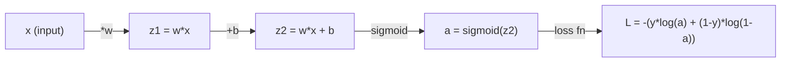
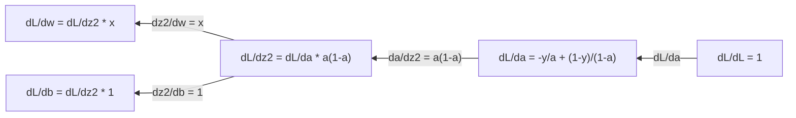
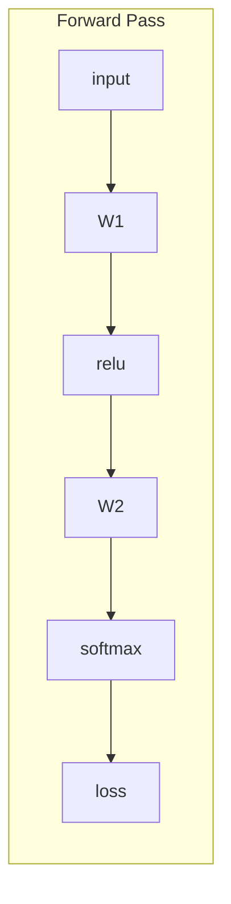
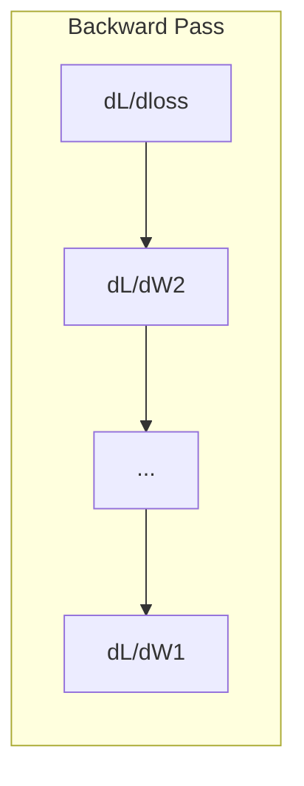

# Makine Öğrenimi Hesaplama

> Derivatifler, aşağı doğru olan yönü söyler.

**Type:** Learn
**Language:**Python
**Prerequisites:** Phase 1, Lessons 01-03
**Time:** ~60 minutes

## Öğrenme Hedefleri

- Ortak ML fonksiyonları için sayısal ve analitik türevleri hesaplayın (x^2, sigmoid, çapraz entropy)
- 1D ve 2D'de bir kayıp fonksiyonunu en aza indirmek için sıfırdan gradient düşüşü uygulayın
- Bir çizgisi gerileme modelinin gradiyentiyi çıkarın ve manuel ağırlık güncelleştirmeleri ile çalıştırın
- Hessian matrisini, Taylor serisi yaklaşımlarını ve optimizasyon yöntemleriyle bağlantısını açıklayın

## Sorun

Her ağırlık bir düğümdür, ve modelin biraz daha yanlış olması için her düğümün hangi yönde döndürüleceğini bulmanız gerekir.

Kalkülüs olmadan, sinir ağını eğitmek, rastgele değişiklikleri denemek ve en iyisini ummak anlamına gelir.

## Anlaşım

### Devirim nedir?

Bir türev değişim hızını ölçer. bir işlevi için y = f(x), türev f'(x) size söyler: x'yi küçük bir miktarda itirseniz, y ne kadar değişir?

Geometrik olarak, türe bir noktada çelişkin çizginin eğimi.

**f(x) = x^2:**

| x | f(x) | f'(x) (slope) |
|---|------|---------------|
| 0 | 0    | 0 (flat, at the bottom) |
| 1 | 1    | 2 |
| 2 | 4    | 4 (tangent line slope at this point) |
| 3 | 9    | 6 |

X=2'de eğim 4'dir. Eğer x'i biraz sağdan hareket ettirseniz, y bu miktarın yaklaşık 4 katına çıkar. x=0'da eğim 0'dur.

Resmi tanım:

```
f'(x) = lim   f(x + h) - f(x)
        h->0  -----------------
                     h
```

Kodda, sınırı atlayıp çok küçük bir h kullanırız. Bu sayısal türevdir.

### Bölümsel türevler: Bir seferde bir değişken

Gerçek fonksiyonlar birçok giriş vardır. Bir sinir ağı kaybı binlerce ağırlığa bağlıdır. Bir kısmi türev bir hariç tüm değişkenleri sabit tutar, sonra türevini o birine göre alır.

```
f(x, y) = x^2 + 3xy + y^2

df/dx = 2x + 3y     (treat y as a constant)
df/dy = 3x + 2y     (treat x as a constant)
```

Her kısmi türeç cevap verir: Eğer sadece bu ağırlığı itirsem, kaybı nasıl değiştiriyor?

### Gradyent: tüm kısmi türevlerin vektörü

Gradient, her kısmi türevini bir vektörde toplar. f ((x, y, z) fonksiyonu için, gradient:

```
grad f = [ df/dx, df/dy, df/dz ]
```

Merdiven en dik tırmanış yönünde işaret eder.

**Contour plot of f(x,y) = x^2 + y^2:**

İşlev, kontur çizgiler olarak konsentrik döngülerle bir kase şeklinde oluşur.

| Point | grad f | -grad f (descent direction) |
|-------|--------|----------------------------|
| (1, 1) | [2, 2] (points uphill, away from minimum) | [-2, -2] (points downhill, toward minimum) |
| (0, 0) | [0, 0] (flat, at the minimum) | [0, 0] |

Bu bir resimde gradient düşüşü.

### Optimize bağlantısı

Bir sinir ağını eğitmek optimizasyon demektir. modelin ne kadar yanlış olduğunu ölçen bir kayb fonksiyonu L ((w1, w2, ..., wn) var. Onu en aza indirmek istiyorsunuz.

```
Gradient descent update rule:

  w_new = w_old - learning_rate * dL/dw

For every weight:
  1. Compute the partial derivative of loss with respect to that weight
  2. Subtract a small multiple of it from the weight
  3. Repeat
```

Öğrenme hızı adım boyutunu kontrol eder. Çok büyük ve sen aşır. Çok küçük ve sen sürüklenir.

**Loss landscape (1D slice):**

Kayıp işlevi L ((w) ağırlık w değişirken zirve ve vadilerle bir eğri oluşturur.

| Feature | Description |
|---------|-------------|
| Global minimum | The lowest point on the entire curve -- the best solution |
| Local minimum | A valley that is lower than its neighbors but not the lowest overall |
| Slope | Gradient descent follows the slope downhill from any starting point |

Gradyent düşüş, yamaçın aşağıya doğru ilerler. Yerel minimumlarda sıkışabilir, ancak yüksek boyutlu alanlarda (milyonlarca ağırlık) bu nadiren pratik bir problemdir.

### Sayısal ve analitik türevler

Bir türevini hesaplamanın iki yolu vardır.

Analiz: hesap kurallarını el ile uygulayın. f'(x) = x^2, türev f'(x) = 2x. Tam.

Sayısal: tanımı kullanarak tahmini. F ((x+h) ve f ((x-h) küçük bir h için hesaplayın, sonra farkı kullanın.

```
Numerical (central difference):

f'(x) ~= f(x + h) - f(x - h)
          -----------------------
                  2h

h = 0.0001 works well in practice
```

Sayısal türevler daha yavaş ama herhangi bir fonksiyon için çalışır. Analitik türevler hızlıdır ancak formülü çıkarmanızı gerektirir. Nöral ağ çerçeveleri üçüncü bir yaklaşımı kullanır: otomatik farklılaşma, tam türevleri mekanik olarak hesaplar.

### Basit fonksiyonlar için elden üretilen türevler

Bunlar ML'de tekrar tekrar göreceğiniz türevler.

```
Function        Derivative       Used in
--------        ----------       -------
f(x) = x^2     f'(x) = 2x      Loss functions (MSE)
f(x) = wx + b  f'(w) = x        Linear layer (gradient w.r.t. weight)
                f'(b) = 1        Linear layer (gradient w.r.t. bias)
                f'(x) = w        Linear layer (gradient w.r.t. input)
f(x) = e^x     f'(x) = e^x     Softmax, attention
f(x) = ln(x)   f'(x) = 1/x     Cross-entropy loss
f(x) = 1/(1+e^-x)  f'(x) = f(x)(1-f(x))   Sigmoid activation
```

f ((x) = x^2:

```
f(x) = x^2    f'(x) = 2x

  x    f(x)   f'(x)   meaning
  -2    4      -4      slope tilts left (decreasing)
  -1    1      -2      slope tilts left (decreasing)
   0    0       0      flat (minimum!)
   1    1       2      slope tilts right (increasing)
   2    4       4      slope tilts right (increasing)
```

f(w) = wx + b için x=3, b=1:

```
f(w) = 3w + 1    f'(w) = 3

The derivative with respect to w is just x.
If x is big, a small change in w causes a big change in output.
```

### Zincir kuralı

İşlevler bir araya geldiğinde, zincir kuralı size nasıl farklılık göstereceğinizi söyler.

```
If y = f(g(x)), then dy/dx = f'(g(x)) * g'(x)

Example: y = (3x + 1)^2
  outer: f(u) = u^2       f'(u) = 2u
  inner: g(x) = 3x + 1    g'(x) = 3
  dy/dx = 2(3x + 1) * 3 = 6(3x + 1)
```

Nöral ağlar fonksiyon zincirleri: giriş -> doğrusal -> etkinleştirme -> doğrusal -> etkinleştirme -> kayb. Geri yayılma, çıkıştan girişe tekrar tekrar uygulanan zincir kuraldır. Tüm algoritma budur.

### Hessian Matrix

Merdiven, eğimden, Hessian'dan eğrilikten bahseder.

Hessian, ikinci sıradaki kısmi türevlerin matrisidir. f ((x1, x2, ..., xn) fonksiyonu için, Hessian'ın giriş (i, j) şudur:

```
H[i][j] = d^2f / (dx_i * dx_j)
```

2 değişken fonksiyon için f ((x, y):

```
H = | d^2f/dx^2    d^2f/dxdy |
    | d^2f/dydx    d^2f/dy^2 |
```

**What the Hessian tells you at a critical point (where gradient = 0):**

| Hessian property | Meaning | Example surface |
|-----------------|---------|-----------------|
| Positive definite (all eigenvalues > 0) | Local minimum | Bowl pointing up |
| Negative definite (all eigenvalues < 0) | Local maximum | Bowl pointing down |
| Indefinite (mixed eigenvalues) | Saddle point | Horse saddle shape |

**Example:**f(x, y) = x^2 - y^2 (bir otlak fonksiyonu)

```
df/dx = 2x       df/dy = -2y
d^2f/dx^2 = 2    d^2f/dy^2 = -2    d^2f/dxdy = 0

H = | 2   0 |
    | 0  -2 |

Eigenvalues: 2 and -2 (one positive, one negative)
--> Saddle point at (0, 0)
```

f ((x, y) = x^2 + y^2 (bir kase) ile karşılaştırın:

```
H = | 2  0 |
    | 0  2 |

Eigenvalues: 2 and 2 (both positive)
--> Local minimum at (0, 0)
```

**Why the Hessian matters in ML:**

Newton'un yöntemi, gradient düşüşünden daha iyi optimizasyon adımlarını almak için Hessian'ı kullanır.

```
Newton's update:    w_new = w_old - H^(-1) * gradient
Gradient descent:   w_new = w_old - lr * gradient
```

Newton'un yöntemi daha hızlı bir şekilde yaklaşır çünkü Hessian'ın "daha" kaymaları - dik yönler daha küçük adımlar alır, düz yönler daha büyük adımlar alır.

N parametre olan bir sinir ağı için Hessian N x N. 1 milyon parametre olan bir model 1 trilyon giriş matrisine ihtiyaç duyar.

| Method | What it uses | Cost | Convergence |
|--------|-------------|------|-------------|
| Gradient descent | First derivatives only | O(N) per step | Slow (linear) |
| Newton's method | Full Hessian | O(N^3) per step | Fast (quadratic) |
| L-BFGS | Approximate Hessian from gradient history | O(N) per step | Medium (superlinear) |
| Adam | Per-parameter adaptive rates (diagonal Hessian approx) | O(N) per step | Medium |
| Natural gradient | Fisher information matrix (statistical Hessian) | O(N^2) per step | Fast |

Adam, derin öğrenme için varsayılan optimizerdir. Parametre başına gradientlerin çalışkan ortalamasını ve değişimini takip ederek ikinci sıradaki bilgileri ucuz bir şekilde yaklaştırır.

### Taylor Serisi Yaklaşımları

Herhangi bir düz fonksiyon yerel olarak bir polinom ile yaklaşılabilir:

```
f(x + h) = f(x) + f'(x)*h + (1/2)*f''(x)*h^2 + (1/6)*f'''(x)*h^3 + ...
```

Ne kadar çok terimi eklerseniz, yaklaşım daha iyi olur -- ama sadece x noktasına yakın.

**Why Taylor series matter for ML:**

- **First-order Taylor = gradient descent.**f(x + h) ~ f(x) + f'(x) *h kullanırken, bir çizgi yaklaşım yapıyorsunuz.

- **Second-order Taylor = Newton's method.**f(x + h) ~ f(x) + f'(x) *h + (1/2) *f'(x) *h^2, bir kare modeli elde edersiniz.

- **Loss function design.**MSE ve çapraz entropi, düzgün bir şekilde hareket eder, yani Taylor genişlemeleri iyi davranır.

```
Approximation order    What it captures    Optimization method
-------------------    -----------------   -------------------
0th order (constant)   Just the value      Random search
1st order (linear)     Slope               Gradient descent
2nd order (quadratic)  Curvature           Newton's method
Higher orders          Finer structure     Rarely used in ML
```

Anahtar anlayış: tüm gradient tabanlı optimizasyon aslında kayıp fonksiyonunu yerel olarak yaklaştırmak ve bu yaklaşımın en azına doğru adım atmakla ilgilidir.

### ML'deki bütünler

Devireler değişim oranlarını söyler. Integraller bir eğri altında alanı hesaplar.

ML'de, entegralları el ile hesaplamak nadiren mümkündür, ama kavram her yerde:

**Probability.**Sıklık p ((x) olan sürekli rastgele değişken için:
```
P(a < X < b) = integral from a to b of p(x) dx
```
A ve b arasındaki olasılık yoğunluk eğrisinin altındaki alan, bu aralıkta iniş olasılığıdır.

**Expected value.**Muhtemelen ağırlanan ortalama sonuç:
```
E[f(X)] = integral of f(x) * p(x) dx
```
Verilerin dağıtımına karşı beklenen kayıp bir ayrılmaz bir unsurdur.

**KL divergence.**İki dağılımın ne kadar farklı olduğunu ölçer:
```
KL(p || q) = integral of p(x) * log(p(x) / q(x)) dx
```
VAE'lerde, bilgi destillasyonunda ve Bayesian sonuçlandırmada kullanılır.

**Normalization constants.**Bayesian sonucu:
```
p(w | data) = p(data | w) * p(w) / integral of p(data | w) * p(w) dw
```
Adınlayıcı, tüm olası parametreler değerlerinin bir bütünüdür. Genellikle çözülemezdir, bu nedenle MCMC ve varyasyonsal çıkarım gibi yaklaşımları kullanıyoruz.

| Integral concept | Where it appears in ML |
|-----------------|----------------------|
| Area under curve | Probability from density functions |
| Expected value | Loss functions, risk minimization |
| KL divergence | VAEs, policy optimization, distillation |
| Normalization | Bayesian posteriors, softmax denominator |
| Marginal likelihood | Model comparison, evidence lower bound (ELBO) |

### Bilgisayar Grafikinde Çok Değişken Zincir Kuralı

Zincir kuralı sadece bir çizgide skalar fonksiyonlara uygulanmaz. Bir nöral ağda değişkenler yayılır ve birleşir.



Geriye geçiş sağdan sola dereceleri hesaplar:



Her ok yerel türevle çarpılır. Her bir parametrenin gradiyenti kayıptan bu parametre giden yol boyunca tüm yerel türevlerin ürünüdür. Yollar dalınca ve birleşince katkıları toplamlanır (çok değişken zincir kuralı).

Bu, geri yayılma: bir hesaplama grafiği ile sistematik olarak uygulanan zincir kuralı, çıkıştan girişlere kadar.

### Jacobian Matrix

Bir fonksiyon bir vektörü bir vektöre (örneğin bir nöral ağ katmanı gibi) haritasında bulduğunda, onun türevisi bir matrisdir. Jacobian, her çıkışın her girişe ilişkin her kısmi türevini içerir.

F: R^n -> R^m için, Jacobian J bir m x n matrisidir:

| | x1 | x2 | ... | xn |
|---|---|---|---|---|
| f1 | df1/dx1 | df1/dx2 | ... | df1/dxn |
| f2 | df2/dx1 | df2/dx2 | ... | df2/dxn |
| ... | ... | ... | ... | ... |
| fm | dfm/dx1 | dfm/dx2 | ... | dfm/dxn |

PyTorch onu işletiyor. Ama varlığını bilmek size geri yayılma şekilleri anlamanıza yardımcı olur: bir katman R^n'i R^m'e haritası yaparsa, onun Jacobian'ı m x n'dir.

### Neden bu sinir ağları için önemlidir

Bir sinir ağındaki her ağırlık bir gradient alır.





Her kilo güncelleme:
- `W1 = W1 - lr * dL/dW1`
- `W2 = W2 - lr * dL/dW2`

Önceki geçiş tahmin ve kayıp hesaplar. Geriye geçiş her ağırlığa göre kayıp dikme hesaplar. Sonra her ağırlık bir adım aşağı doğru gider. Milyonlarca adım için tekrarlayın. Bu derin öğrenme.

```figure
derivative-tangent
```

## Yapın

### Adım 1: Sayısal türev sıfırdan

```python
def numerical_derivative(f, x, h=1e-7):
    return (f(x + h) - f(x - h)) / (2 * h)

def f(x):
    return x ** 2

for x in [-2, -1, 0, 1, 2]:
    numerical = numerical_derivative(f, x)
    analytical = 2 * x
    print(f"x={x:2d}  f'(x) numerical={numerical:.6f}  analytical={analytical:.1f}")
```

Sayı türeği analitik bir ile birçok onluk yerine eşleşir.

### Adım 2: Ayrı ögeleri ve gradientler

```python
def numerical_gradient(f, point, h=1e-7):
    gradient = []
    for i in range(len(point)):
        point_plus = list(point)
        point_minus = list(point)
        point_plus[i] += h
        point_minus[i] -= h
        partial = (f(point_plus) - f(point_minus)) / (2 * h)
        gradient.append(partial)
    return gradient

def f_multi(point):
    x, y = point
    return x**2 + 3*x*y + y**2

grad = numerical_gradient(f_multi, [1.0, 2.0])
print(f"Numerical gradient at (1,2): {[f'{g:.4f}' for g in grad]}")
print(f"Analytical gradient at (1,2): [2*1+3*2, 3*1+2*2] = [{2*1+3*2}, {3*1+2*2}]")
```

### Adım 3: F ((x) = x^2'nin minimumunu bulmak için dereceli düşüş

```python
x = 5.0
lr = 0.1
for step in range(20):
    grad = 2 * x
    x = x - lr * grad
    print(f"step {step:2d}  x={x:8.4f}  f(x)={x**2:10.6f}")
```

X=5'den başlayarak her adım x=0'ye (minimum) daha yakınlaşır.

### Adım 4: 2 boyutlu bir fonksiyonda dereceli düşüş

```python
def f_2d(point):
    x, y = point
    return x**2 + y**2

point = [4.0, 3.0]
lr = 0.1
for step in range(30):
    grad = numerical_gradient(f_2d, point)
    point = [p - lr * g for p, g in zip(point, grad)]
    loss = f_2d(point)
    if step % 5 == 0 or step == 29:
        print(f"step {step:2d}  point=({point[0]:7.4f}, {point[1]:7.4f})  f={loss:.6f}")
```

### Adım 5: Sayısal ve analitik türevleri karşılaştırmak

```python
import math

test_functions = [
    ("x^2",      lambda x: x**2,          lambda x: 2*x),
    ("x^3",      lambda x: x**3,          lambda x: 3*x**2),
    ("sin(x)",   lambda x: math.sin(x),   lambda x: math.cos(x)),
    ("e^x",      lambda x: math.exp(x),   lambda x: math.exp(x)),
    ("1/x",      lambda x: 1/x,           lambda x: -1/x**2),
]

x = 2.0
print(f"{'Function':<12} {'Numerical':>12} {'Analytical':>12} {'Error':>12}")
print("-" * 50)
for name, f, df in test_functions:
    num = numerical_derivative(f, x)
    ana = df(x)
    err = abs(num - ana)
    print(f"{name:<12} {num:12.6f} {ana:12.6f} {err:12.2e}")
```

### Adım 6: Hesyon'u sayısal olarak hesaplamak

```python
def hessian_2d(f, x, y, h=1e-5):
    fxx = (f(x + h, y) - 2 * f(x, y) + f(x - h, y)) / (h ** 2)
    fyy = (f(x, y + h) - 2 * f(x, y) + f(x, y - h)) / (h ** 2)
    fxy = (f(x + h, y + h) - f(x + h, y - h) - f(x - h, y + h) + f(x - h, y - h)) / (4 * h ** 2)
    return [[fxx, fxy], [fxy, fyy]]

def saddle(x, y):
    return x ** 2 - y ** 2

def bowl(x, y):
    return x ** 2 + y ** 2

H_saddle = hessian_2d(saddle, 0.0, 0.0)
H_bowl = hessian_2d(bowl, 0.0, 0.0)
print(f"Saddle Hessian: {H_saddle}")  # [[2, 0], [0, -2]] -- mixed signs
print(f"Bowl Hessian:   {H_bowl}")    # [[2, 0], [0, 2]]  -- both positive
```

Saddle fonksiyonunun Hessian öz değerleri 2 ve -2 (bir saddle noktasını doğrulayan karıştırılmış işaretler) vardır.

### Adım 7: Taylor yaklaşımı

```python
import math

def taylor_approx(f, f_prime, f_double_prime, x0, h, order=2):
    result = f(x0)
    if order >= 1:
        result += f_prime(x0) * h
    if order >= 2:
        result += 0.5 * f_double_prime(x0) * h ** 2
    return result

x0 = 0.0
for h in [0.1, 0.5, 1.0, 2.0]:
    true_val = math.sin(h)
    t1 = taylor_approx(math.sin, math.cos, lambda x: -math.sin(x), x0, h, order=1)
    t2 = taylor_approx(math.sin, math.cos, lambda x: -math.sin(x), x0, h, order=2)
    print(f"h={h:.1f}  sin(h)={true_val:.4f}  order1={t1:.4f}  order2={t2:.4f}")
```

X0 = 0 yakınında, sin(x) ~ x (birinci sıradaki Taylor). Yaklaşım küçük h için mükemmel ama büyük h için ayrılır. Bu nedenle gradient düşüşü küçük öğrenme oranları ile en iyi çalışır - her adım çizgisi yaklaşımın doğru olduğunu varsayır.

### Adım 8: Neden bu bir nöral ağ için önemlidir

```python
import random

random.seed(42)

w = random.gauss(0, 1)
b = random.gauss(0, 1)
lr = 0.01

xs = [1.0, 2.0, 3.0, 4.0, 5.0]
ys = [3.0, 5.0, 7.0, 9.0, 11.0]

for epoch in range(200):
    total_loss = 0
    dw = 0
    db = 0
    for x, y in zip(xs, ys):
        pred = w * x + b
        error = pred - y
        total_loss += error ** 2
        dw += 2 * error * x
        db += 2 * error
    dw /= len(xs)
    db /= len(xs)
    total_loss /= len(xs)
    w -= lr * dw
    b -= lr * db
    if epoch % 40 == 0 or epoch == 199:
        print(f"epoch {epoch:3d}  w={w:.4f}  b={b:.4f}  loss={total_loss:.6f}")

print(f"\nLearned: y = {w:.2f}x + {b:.2f}")
print(f"Actual:  y = 2x + 1")
```

Her gradient tabanlı eğitim döngüsü bu örneği izler: tahmin, hesap kaybı, hesap gradientleri, güncelleme ağırlıkları.

## Kullan

NumPy ile aynı işlemler daha hızlı ve daha kısa:

```python
import numpy as np

x = np.array([1, 2, 3, 4, 5], dtype=float)
y = np.array([3, 5, 7, 9, 11], dtype=float)

w, b = np.random.randn(), np.random.randn()
lr = 0.01

for epoch in range(200):
    pred = w * x + b
    error = pred - y
    loss = np.mean(error ** 2)
    dw = np.mean(2 * error * x)
    db = np.mean(2 * error)
    w -= lr * dw
    b -= lr * db

print(f"Learned: y = {w:.2f}x + {b:.2f}")
```

PyTorch gradient hesaplamasını otomatikleştirir ama güncelleme döngüsü aynı.

## Egzersizler

1. Uygulama`numerical_second_derivative(f, x)`kullanmak`numerical_derivative`x^3'ün ikinci türevinin x=2'de 12 olduğunu kontrol edin.
2. F ((x, y) = (x - 3) ^ 2 + (y + 1) ^ 2'nin en azını bulmak için gradient düşüşünü kullanın. (0, 0) 'den başlayın. Cevap (3, -1) 'e yakın olmalıdır.
3. Gradyent düşüş döngüsüne momentum ekleyin: Geçmiş gradientleri toplayan bir hız vektörünü koruyun.

## Anahtar Terimler

| Term | What people say | What it actually means |
|------|----------------|----------------------|
| Derivative | "The slope" | The rate of change of a function at a point. Tells you how much the output changes per unit change in input. |
| Partial derivative | "Derivative of one variable" | The derivative with respect to one variable while all others are held constant. |
| Gradient | "Direction of steepest ascent" | A vector of all partial derivatives. Points in the direction that increases the function fastest. |
| Gradient descent | "Go downhill" | Subtract the gradient (times a learning rate) from the parameters to reduce the loss. The core of neural network training. |
| Learning rate | "Step size" | A scalar that controls how big each gradient descent step is. Too large: diverge. Too small: converge slowly. |
| Chain rule | "Multiply the derivatives" | The rule for differentiating composed functions: df/dx = df/dg * dg/dx. The mathematical basis of backpropagation. |
| Jacobian | "Matrix of derivatives" | When a function maps vectors to vectors, the Jacobian is the matrix of all partial derivatives of outputs with respect to inputs. |
| Numerical derivative | "Finite differences" | Approximating a derivative by evaluating the function at two nearby points and computing the slope between them. |
| Backpropagation | "Reverse-mode autodiff" | Computing gradients layer by layer from output to input using the chain rule. How neural networks learn. |
| Hessian | "Matrix of second derivatives" | The matrix of all second-order partial derivatives. Describes the curvature of a function. Positive definite Hessian at a critical point means local minimum. |
| Taylor series | "Polynomial approximation" | Approximating a function near a point using its derivatives: f(x+h) ~ f(x) + f'(x)h + (1/2)f''(x)h^2 + ... The basis for understanding why gradient descent and Newton's method work. |
| Integral | "Area under the curve" | The accumulation of a quantity over a range. In ML, integrals define probabilities, expected values, and KL divergence. |

## Daha Fazla Okumak

- [3Blue1Brown: Essence of Calculus](https://www.3blue1brown.com/topics/calculus)- Derivatifler, entegrallar ve zincir kuralları için görsel sezgisellik
- [Stanford CS231n: Backpropagation](https://cs231n.github.io/optimization-2/)- gradientlerin sinir ağları katmanları üzerinden nasıl akıştığı
