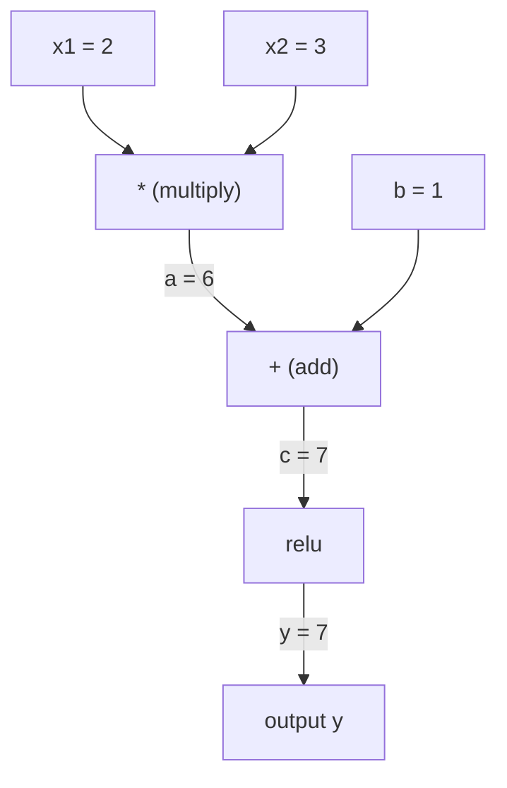
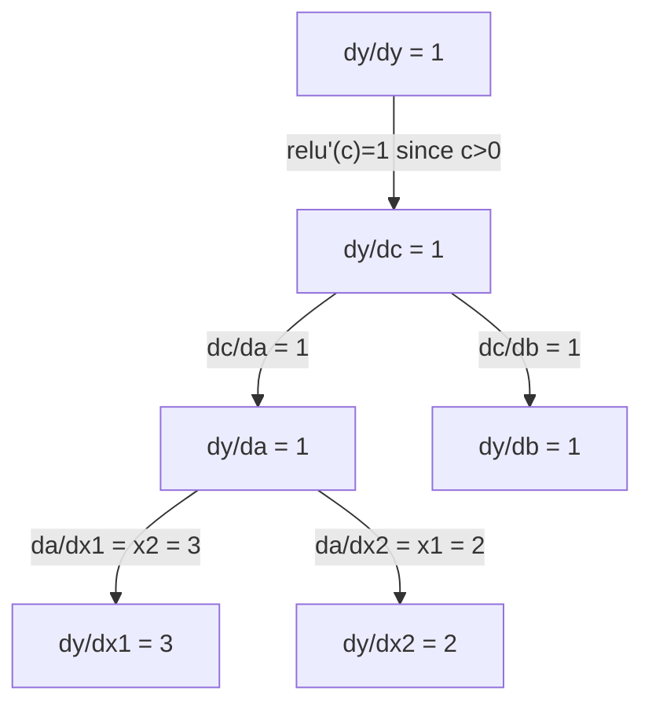

# Zincir Kuralı ve Otomatik Farklılık

> Zincir kuralı öğrenen her sinir ağının arkasındaki motor.

**Type:** Build
**Language:**Python
**Prerequisites:** Phase 1, Lesson 04 (Derivatives & Gradients)
**Time:** ~90 minutes

## Öğrenme Hedefleri

- Operasyonları kaydeten ve ters mod otomatik olarak gradientleri hesaplayan minimal bir otograd motoru (Değer sınıfı) oluşturun
- Topolojik sıralama kullanarak bir hesaplama grafiği üzerinden ileri ve geri geçişler uygulayın
- Sadece sıfırdan otograd motoru kullanarak XOR üzerinde çok katmanlı bir perceptron inşa ve eğit
- Sayısal sınırlı farklara karşı gradient kontrolü kullanarak otomatik değişikliğin doğruluğunu kontrol edin

## Sorun

Basit fonksiyonların türevlerini hesaplayabilirsiniz. Ama bir sinir ağı basit bir fonksiyon değildir. Birbiriyle oluşan yüzlerce fonksiyon: matris çarpımı, tarafsızlık ekleme, etkinleştirme uygulama, matris tekrar çarpımı, softmax, çapraz entropi kaybı.

Ağı eğitmek için, her tek ağırlığa göre kaybın gradiyendine ihtiyacınız var. Bunu el ile yapmak milyonlarca parametre için imkansızdır. Sayısal olarak yapmak (sonuçlu farklılıklar) çok yavaş.

Zincir kuralı size matematik verir. Otomatik farklılık size algoritma verir. Birlikte, tek ileri geçişle orantılı olarak, zaman içinde işlevlerin keyfi bir kompozisyonu ile kesin gradientleri hesaplamanıza izin verirler.

PyTorch, TensorFlow ve JAX'in işleyişleri bu şekilde.

## Anlaşım

### Zincir Kuralı

- Eğer`y = f(g(x))`, derivatif `y``x`Bu:

```
dy/dx = dy/dg * dg/dx = f'(g(x)) * g'(x)
```

Zincir boyunca türevleri çarpın. Her bağlantı yerel türevini ekler.

Örnek: `y = sin(x^2)`

```
g(x) = x^2       g'(x) = 2x
f(g) = sin(g)     f'(g) = cos(g)

dy/dx = cos(x^2) * 2x
```

Daha derin kompozisyonlar için zincir uzanır:

```
y = f(g(h(x)))

dy/dx = f'(g(h(x))) * g'(h(x)) * h'(x)
```

Bir sinir ağının her katmanı bu zincirdeki bir bağlantıdır.

### Hesaplama Grafikleri

Bir hesaplama grafiği zincir kuralını görsel hale getirir. Her işlem bir düğüm olur. Veriler grafiğin üzerinden ileri akıyor. Gradyentler geri akıyor.

**Forward pass (compute values):**



**Backward pass (compute gradients):**



Geriye geçiş, her düğümde zincir kuralını uyguluyor ve çıkıştan girişlere gradientleri yayıyor.

### Önceki Mod vs Geriye Geçerli Mod

Bir grafik aracılığıyla zincir kuralını uygulamanın iki yolu vardır.

**Forward mode**Girişlerdeki işlemleri başlatır ve türevleri ileriye doğru itirir.`dx/dx = 1`Bu, çok az giriş ve çok çıkış olduğunda iyi olur.

```
Forward mode: seed dx/dx = 1, propagate forward

  x = 2       (dx/dx = 1)
  a = x^2     (da/dx = 2x = 4)
  y = sin(a)  (dy/dx = cos(a) * da/dx = cos(4) * 4 = -2.615)
```

**Reverse mode**çıkıştan başlayıp, eğrilikleri geriye çekir.`dy/dy = 1`Bu, çok fazla giriş ve çok az çıkış olduğunda iyi olur.

```
Reverse mode: seed dy/dy = 1, propagate backward

  y = sin(a)  (dy/dy = 1)
  a = x^2     (dy/da = cos(a) = cos(4) = -0.654)
  x = 2       (dy/dx = dy/da * da/dx = -0.654 * 4 = -2.615)
```

Nöral ağlar milyonlarca giriş (koşul) ve bir çıkış (kayıp) vardır. Ters mod tüm gradientleri bir geri geçişle hesaplar. Bu nedenle geri yayılma ters mod kullanır.

| Mode | Seed | Direction | Best when |
|------|------|-----------|-----------|
| Forward | `dx_i/dx_i = 1` | Input to output | Few inputs, many outputs |
| Reverse | `dy/dy = 1` | Output to input | Many inputs, few outputs (neural nets) |

### Önceki Mod için Çift Sayılar

Önceki mod ikili sayı ile zarif bir şekilde uygulanabilir.`a + b*epsilon`nerede`epsilon^2 = 0`- Evet .

```
Dual number: (value, derivative)

(2, 1) means: value is 2, derivative w.r.t. x is 1

Arithmetic rules:
  (a, a') + (b, b') = (a+b, a'+b')
  (a, a') * (b, b') = (a*b, a'*b + a*b')
  sin(a, a')         = (sin(a), cos(a)*a')
```

Giriş değişkenini türev 1 ile ekle. türev her işlem boyunca otomatik olarak çoğalabilir.

### Autograd Motor Oluşturma

Bir otograd motoru üç şeye ihtiyaç duyar:

1. **Value wrapping.**Her sayıyı değerini ve eğilimi depolayan bir nesneye sarın.
2. **Graph recording.**Her işlem girişlerini ve yerel gradient fonksiyonunu kaydeder.
3. **Backward pass.**Topolojik olarak grafikleri sıralayıp, sonra her düğümde zincir kuralını uygulayarak tersine yürüyün.

PyTorch'ın işi tam olarak bu.`autograd`- Evet.`torch.Tensor`sınıf değerleri sarar, işlemleri kaydetir.`requires_grad=True`, ve çağrıda gradient hesaplar .`.backward()`- Evet .

### PyTorch Autograd Kapuç altında Nasıl Çalışır

PyTorch kodu yazarken:

```python
x = torch.tensor(2.0, requires_grad=True)
y = x ** 2 + 3 * x + 1
y.backward()
print(x.grad)  # 7.0 = 2*x + 3 = 2*2 + 3
```

PyTorch içi:

1. Bir `Tensor` için düğüm`x`- Evet .`requires_grad=True`
2. Her operasyon (`**`- Evet .`*`- Evet .`+`) yeni bir düğüm oluşturur ve geriye doğru işlevi kaydeder
3. `y.backward()`Kaydedilen grafik üzerinden ters mod otomatik devreyi tetikler
4. Her düğümün `grad_fn`Yerel gradientleri hesaplar ve ana düğümlerine aktarır
5. Gradientler `.grad`Katkı yoluyla atributlar (değiştirilmez)

Grafik dinamiktir (hareketle tanımlanır). Her ileri geçişte yeni bir grafik inşa edilir. Bu nedenle PyTorch modeller içinde kontrol akışını (eğer / başka, döngüler) destekliyor.

```figure
chain-rule
```

## Yapın

### Adım 1: Değer sınıfı

```python
class Value:
    def __init__(self, data, children=(), op=''):
        self.data = data
        self.grad = 0.0
        self._backward = lambda: None
        self._prev = set(children)
        self._op = op

    def __repr__(self):
        return f"Value(data={self.data:.4f}, grad={self.grad:.4f})"
```

Her zaman .`Value`sayısal verilerini, gradiyenti (başlangıçta sıfır), geriye dönük bir fonksiyonu ve ürettiği çocuk düğümlerine işaretler depolar.

### Adım 2: Gradyent izleme ile aritmetik işlemler

```python
    def __add__(self, other):
        other = other if isinstance(other, Value) else Value(other)
        out = Value(self.data + other.data, (self, other), '+')
        def _backward():
            self.grad += out.grad
            other.grad += out.grad
        out._backward = _backward
        return out

    def __mul__(self, other):
        other = other if isinstance(other, Value) else Value(other)
        out = Value(self.data * other.data, (self, other), '*')
        def _backward():
            self.grad += other.data * out.grad
            other.grad += self.data * out.grad
        out._backward = _backward
        return out

    def relu(self):
        out = Value(max(0, self.data), (self,), 'relu')
        def _backward():
            self.grad += (1.0 if out.data > 0 else 0.0) * out.grad
        out._backward = _backward
        return out
```

Her işlem, yerel gradientleri hesaplayıp akıntıdaki gradientle çarpmayı bilen bir kapanma oluşturur (`out.grad`                                                                                                                                                                                                                                                                                                                                                                                                                                                                                                                             `+=`Bir değer birden fazla işlemde kullanıldığı durumları ele alır.

### Adım 3: Geriye geçiş

```python
    def backward(self):
        topo = []
        visited = set()
        def build_topo(v):
            if v not in visited:
                visited.add(v)
                for child in v._prev:
                    build_topo(child)
                topo.append(v)
        build_topo(self)

        self.grad = 1.0
        for v in reversed(topo):
            v._backward()
```

Topolojik sıralama, her düğümün, çocuklarına yayılmadan önce tamamen hesaplanmasını sağlar.

### Dördüncü adım: Tam bir motor için daha fazla operasyon

Temel değer sınıfı ekleme, çarpma ve relü ile ilgilenir. Gerçek bir otograd motoruna daha fazlası gerekmektedir.

```python
    def __neg__(self):
        return self * -1

    def __sub__(self, other):
        return self + (-other)

    def __radd__(self, other):
        return self + other

    def __rmul__(self, other):
        return self * other

    def __rsub__(self, other):
        return other + (-self)

    def __pow__(self, n):
        out = Value(self.data ** n, (self,), f'**{n}')
        def _backward():
            self.grad += n * (self.data ** (n - 1)) * out.grad
        out._backward = _backward
        return out

    def __truediv__(self, other):
        return self * (other ** -1) if isinstance(other, Value) else self * (Value(other) ** -1)

    def exp(self):
        import math
        e = math.exp(self.data)
        out = Value(e, (self,), 'exp')
        def _backward():
            self.grad += e * out.grad
        out._backward = _backward
        return out

    def log(self):
        import math
        out = Value(math.log(self.data), (self,), 'log')
        def _backward():
            self.grad += (1.0 / self.data) * out.grad
        out._backward = _backward
        return out

    def tanh(self):
        import math
        t = math.tanh(self.data)
        out = Value(t, (self,), 'tanh')
        def _backward():
            self.grad += (1 - t ** 2) * out.grad
        out._backward = _backward
        return out
```

**Why each operation matters:**

| Operation | Backward rule | Used in |
|-----------|--------------|---------|
| `__sub__` | Reuses add + neg | Loss computation (pred - target) |
| `__pow__` | n * x^(n-1) | Polynomial activations, MSE (error^2) |
| `__truediv__` | Reuses mul + pow(-1) | Normalization, learning rate scaling |
| `exp` | exp(x) * upstream | Softmax, log-likelihood |
| `log` | (1/x) * upstream | Cross-entropy loss, log probabilities |
| `tanh` | (1 - tanh^2) * upstream | Classic activation function |

Akıllı tarafı:`__sub__`ve `__truediv__`Bu işlemler, zincir kuralının altta yatan ekleme/mul/pow işlemleri ile oluşturulduğu için ücretsiz olarak doğru gradientler elde eder.

### Adım 5: Mini MLP sıfırdan

Tam bir değer sınıfı ile, bir sinir ağı oluşturabilirsin. PyTorch yok NumPy yok. Sadece değerler ve zincir kuralı.

```python
import random

class Neuron:
    def __init__(self, n_inputs):
        self.w = [Value(random.uniform(-1, 1)) for _ in range(n_inputs)]
        self.b = Value(0.0)

    def __call__(self, x):
        act = sum((wi * xi for wi, xi in zip(self.w, x)), self.b)
        return act.tanh()

    def parameters(self):
        return self.w + [self.b]

class Layer:
    def __init__(self, n_inputs, n_outputs):
        self.neurons = [Neuron(n_inputs) for _ in range(n_outputs)]

    def __call__(self, x):
        return [n(x) for n in self.neurons]

    def parameters(self):
        return [p for n in self.neurons for p in n.parameters()]

class MLP:
    def __init__(self, sizes):
        self.layers = [Layer(sizes[i], sizes[i+1]) for i in range(len(sizes)-1)]

    def __call__(self, x):
        for layer in self.layers:
            x = layer(x)
        return x[0] if len(x) == 1 else x

    def parameters(self):
        return [p for layer in self.layers for p in layer.parameters()]
```

A.`Neuron`hesaplamalar`tanh(w1*x1 + w2*x2 + ... + b)`- A.`Layer`Bu, nöronların bir listesidir.`MLP`Her ağırlık bir `Value`, bu yüzden arıyorum`loss.backward()`Her parametreye gradientleri yayar.

**Training on XOR:**

```python
random.seed(42)
model = MLP([2, 4, 1])  # 2 inputs, 4 hidden neurons, 1 output

xs = [[0, 0], [0, 1], [1, 0], [1, 1]]
ys = [-1, 1, 1, -1]  # XOR pattern (using -1/1 for tanh)

for step in range(100):
    preds = [model(x) for x in xs]
    loss = sum((p - y) ** 2 for p, y in zip(preds, ys))

    for p in model.parameters():
        p.grad = 0.0
    loss.backward()

    lr = 0.05
    for p in model.parameters():
        p.data -= lr * p.grad

    if step % 20 == 0:
        print(f"step {step:3d}  loss = {loss.data:.4f}")

print("\nPredictions after training:")
for x, y in zip(xs, ys):
    print(f"  input={x}  target={y:2d}  pred={model(x).data:6.3f}")
```

Bu, mikrograd. Temiz Python'da otomatik farklılık ile tam bir sinir ağı eğitim döngüsü. Her ticari derin öğrenme çerçevesinde büyük ölçekte aynı şey yapılır.

### Adım 6: Aralıklı kontrol

Otodiff'in doğru olduğunu nasıl bileceksin? Sayısal türevlerle karşılaştır. Bu gradient kontrolü.

```python
def gradient_check(build_expr, x_val, h=1e-7):
    x = Value(x_val)
    y = build_expr(x)
    y.backward()
    autodiff_grad = x.grad

    y_plus = build_expr(Value(x_val + h)).data
    y_minus = build_expr(Value(x_val - h)).data
    numerical_grad = (y_plus - y_minus) / (2 * h)

    diff = abs(autodiff_grad - numerical_grad)
    return autodiff_grad, numerical_grad, diff
```

Karmaşık bir ifadeyle test edin:

```python
def expr(x):
    return (x ** 3 + x * 2 + 1).tanh()

ad, num, diff = gradient_check(expr, 0.5)
print(f"Autodiff:  {ad:.8f}")
print(f"Numerical: {num:.8f}")
print(f"Difference: {diff:.2e}")
# Difference should be < 1e-5
```

Yeni işlemler uygulandığında derecelerin kontrolü gereklidir. Geriye doğru geçişinizde bir hata varsa, sayısal kontrol onu yakalar.

**When to use gradient checking:**

| Situation | Do gradient check? |
|-----------|-------------------|
| Adding a new operation to your autograd | Yes, always |
| Debugging a training loop that won't converge | Yes, check gradients first |
| Production training | No, too slow (2x forward passes per parameter) |
| Unit tests for autograd code | Yes, automate it |

### Adım 7: El hesaplama karşısında kontrol edin

```python
x1 = Value(2.0)
x2 = Value(3.0)
a = x1 * x2          # a = 6.0
b = a + Value(1.0)    # b = 7.0
y = b.relu()          # y = 7.0

y.backward()

print(f"y = {y.data}")          # 7.0
print(f"dy/dx1 = {x1.grad}")   # 3.0 (= x2)
print(f"dy/dx2 = {x2.grad}")   # 2.0 (= x1)
```

El kontrolü: `y = relu(x1*x2 + 1)`- O zamandan beri .`x1*x2 + 1 = 7 > 0`Relu bir kimliktir.
`dy/dx1 = x2 = 3`- Evet .`dy/dx2 = x1 = 2`Motor eşleşir.

## Kullan

### PyTorch ile karşılaştır

```python
import torch

x1 = torch.tensor(2.0, requires_grad=True)
x2 = torch.tensor(3.0, requires_grad=True)
a = x1 * x2
b = a + 1.0
y = torch.relu(b)
y.backward()

print(f"PyTorch dy/dx1 = {x1.grad.item()}")  # 3.0
print(f"PyTorch dy/dx2 = {x2.grad.item()}")  # 2.0
```

Motorunuz PyTorch ile aynı sonucu hesaplar çünkü matematik aynı: zincir kuralıyla ters mod otomatik olarak çalıştırma.

### Daha karmaşık bir ifade

```python
a = Value(2.0)
b = Value(-3.0)
c = Value(10.0)
f = (a * b + c).relu()  # relu(2*(-3) + 10) = relu(4) = 4

f.backward()
print(f"df/da = {a.grad}")  # -3.0 (= b)
print(f"df/db = {b.grad}")  #  2.0 (= a)
print(f"df/dc = {c.grad}")  #  1.0
```

## Gönder

Bu ders şunları ortaya çıkarır:
- `outputs/skill-autodiff.md`-- otograd sistemlerini oluşturma ve düzeltme becerisi
- `code/autodiff.py`- ... uzatabileceğiniz en az bir oto-üstü motoru

Burada oluşturulan Değer sınıfı 3. aşamada sinir ağı eğitim döngüsünün temelini oluşturur.

## Egzersizler

1. Ekle`__pow__`Değer sınıfına gönderin böylece hesaplayabilirsiniz `x ** n`- Bunu kontrol et .`d/dx(x^3)`- ...`x=2`eşit `12.0`- Evet .

2. Ekle`tanh`- Bu bir aktivasyon fonksiyonu.`tanh'(0) = 1`ve `tanh'(2) = 0.0707`(Yaklaşık).

3. Tek bir nöron için hesaplama grafikleri oluştur: `y = relu(w1*x1 + w2*x2 + b)`Beş gradientini hesaplayın ve PyTorch'a karşı doğrulayın.

4. Önceki modda ikili numaralar kullanarak otomatik olarak kullanın.`Dual`sınıflandırıp, ters mod motorunuzla aynı türevleri verdiyse doğrulayın.

## Anahtar Terimler

| Term | What people say | What it actually means |
|------|----------------|----------------------|
| Chain rule | "Multiply the derivatives" | The derivative of composed functions equals the product of each function's local derivative, evaluated at the right point |
| Computational graph | "The network diagram" | A directed acyclic graph where nodes are operations and edges carry values (forward) or gradients (backward) |
| Forward mode | "Push derivatives forward" | Autodiff that propagates derivatives from inputs to outputs. One pass per input variable. |
| Reverse mode | "Backpropagation" | Autodiff that propagates gradients from outputs to inputs. One pass per output variable. |
| Autograd | "Automatic gradients" | A system that records operations on values, builds a graph, and computes exact gradients via the chain rule |
| Dual numbers | "Value plus derivative" | Numbers of the form a + b*epsilon (epsilon^2 = 0) that carry derivative information through arithmetic |
| Topological sort | "Dependency order" | Ordering graph nodes so every node comes after all its dependencies. Required for correct gradient propagation. |
| Gradient accumulation | "Add, don't replace" | When a value feeds into multiple operations, its gradient is the sum of all incoming gradient contributions |
| Dynamic graph | "Define by run" | A computation graph rebuilt on every forward pass, allowing Python control flow inside models (PyTorch style) |
| Gradient checking | "Numerical verification" | Comparing autodiff gradients against numerical finite-difference gradients to verify correctness. Essential for debugging. |
| MLP | "Multi-layer perceptron" | A neural network with one or more hidden layers of neurons. Each neuron computes a weighted sum plus bias, then applies an activation function. |
| Neuron | "Weighted sum + activation" | The basic unit: output = activation(w1*x1 + w2*x2 + ... + b). The weights and bias are learnable parameters. |

## Daha Fazla Okumak

- [3Blue1Brown: Backpropagation calculus](https://www.youtube.com/watch?v=tIeHLnjs5U8)-- nöral ağlarda zincir kuralının görsel açıklaması
- [PyTorch Autograd mechanics](https://pytorch.org/docs/stable/notes/autograd.html)-- gerçek sistemin nasıl çalıştığını
- [Baydin et al., Automatic Differentiation in Machine Learning: a Survey](https://arxiv.org/abs/1502.05767)-- kapsamlı referans
