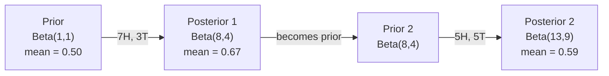

# Bayes teoremi

> Muhtemelen beklediğiniz şeyle ilgili Bayes teoremi de öğrendiğiniz şeyle ilgili.

**Type:** Build
**Language:**Python
**Prerequisites:** Phase 1, Lesson 06 (Probability Fundamentals)
**Time:** ~75 minutes

## Öğrenme Hedefleri

- Önceden, olasılıklardan ve kanıtlardan sonraki olasılıkları hesaplamak için Bayes teorimini uygulayın
- Laplace düzeltmesi ve log- uzay hesaplama ile Naive Bayes metin sınıflandırıcısını sıfırdan oluşturun
- MLE ve MAP tahminlerini karşılaştırın ve MAP'nin L2 düzenlenmesine nasıl karşılık verdiğini açıklayın
- A/B testleri için Beta-Binomial konjugat öncüleri kullanarak sıralı Bayesian güncelleştirmeyi uygulayın

## Sorun

Teste yüzde 99 doğruluk gösteriyor, test pozitif.

Çoğu insan 99% diyor. Gerçek cevap hastalığın ne kadar nadir olduğuna bağlıdır. Eğer 10.000 kişiden 1 kişi hastalıktırsa, olumlu sonuçlar sadece hasta olma şansının %1'ini verir. Diğer olumlu sonuçların %99'u sağlıklı insanlardan gelen sahte alarmlardır.

Bu bir hile sorusu değil. Bayes teoremi. Her spam filtre, her tıbbi teşhis, belirsizlikleri ölçen her makine öğrenme modeli bu tam olarak mantık kullanır. İnançla başlarsınız. Kanıt görürsünüz. Güncelleştiriyorsunuz.

Bunu anlamadan ML sistemleri inşa ederseniz, model çıkışlarını yanlış yorumlarsınız, kötü eşiği belirlersiniz ve aşırı güvenli tahminler gönderirsiniz.

## Anlaşım

### Ortak olasılıktan Bayes'e

Ders 06 ' dan beri şartsal olasılığın:

```
P(A|B) = P(A and B) / P(B)
```

Ve simetrik olarak:

```
P(B|A) = P(A and B) / P(A)
```

Her iki ifade de aynı sayıcıya sahiptir: P(A ve B).

```
P(A and B) = P(A|B) * P(B) = P(B|A) * P(A)

Therefore:

P(A|B) = P(B|A) * P(A) / P(B)
```

Bu Bayes teoremi. 4 büyüklük, 1 denklem.

### Dört bölüm

| Part | Name | What it means |
|------|------|---------------|
| P(A\|B) | Posterior | Your updated belief about A after seeing evidence B |
| P(B\|A) | Likelihood | How probable the evidence B is if A is true |
| P(A) | Prior | Your belief about A before seeing any evidence |
| P(B) | Evidence | Total probability of seeing B under all possibilities |

Kanıt terimi P(B) normalleştiricidir. Toplam olasılık yasasını kullanarak genişletebilirsiniz:

```
P(B) = P(B|A) * P(A) + P(B|not A) * P(not A)
```

### Tıbbi test örneği

Bir hastalık 10.000 kişiden 1'i etkiliyor. Test %99 doğrudur (hastalık olanların %99'unu yakalar, %1'inde yanlış pozitif verir).

```
P(sick)          = 0.0001     (prior: disease is rare)
P(positive|sick) = 0.99       (likelihood: test catches it)
P(positive|healthy) = 0.01    (false positive rate)

P(positive) = P(positive|sick) * P(sick) + P(positive|healthy) * P(healthy)
            = 0.99 * 0.0001 + 0.01 * 0.9999
            = 0.000099 + 0.009999
            = 0.010098

P(sick|positive) = P(positive|sick) * P(sick) / P(positive)
                 = 0.99 * 0.0001 / 0.010098
                 = 0.0098
                 = 0.98%
```

Bir hastalığa rastlananlar bile, çoğu kez yanlış pozitif sonuçlar verir.

### Spam filtre örneği

"Lotteri" kelimesini içeren bir e-posta aldınız.

```
P(spam)                = 0.3      (30% of email is spam)
P("lottery"|spam)      = 0.05     (5% of spam emails contain "lottery")
P("lottery"|not spam)  = 0.001    (0.1% of legitimate emails contain "lottery")

P("lottery") = 0.05 * 0.3 + 0.001 * 0.7
             = 0.015 + 0.0007
             = 0.0157

P(spam|"lottery") = 0.05 * 0.3 / 0.0157
                  = 0.955
                  = 95.5%
```

Bir kelime olasılığı %30'dan %95.5'e kaydırır. Gerçek bir spam filtresi Bayes'i yüzlerce kelime üzerinde aynı anda uyguluyor.

### Naive Bayes: Bağımsızlık varsayımı

Naive Bayes, tüm özelliklerin sınıfı göz önüne alındığında koşulsuz bağımsız olduğunu varsayarak bunu birden fazla özelliğe uzattı:

```
P(class | feature_1, feature_2, ..., feature_n)
  = P(class) * P(feature_1|class) * P(feature_2|class) * ... * P(feature_n|class)
    / P(feature_1, feature_2, ..., feature_n)
```

"Sane" kısmı bağımsızlık varsayımıdır. Metinde, kelime olayları bağımsız değildir ("Yeni" ve "York" ilişkilidir). Ancak varsayım pratikte şaşırtıcı derecede iyi çalışır çünkü sınıflandırıcı sadece sınıfları sıralamalı, kalibrli olasılıkları üretmemelidir.

Tüm sınıflar için isimlendirici aynı olduğundan, onu atlayıp saylayıcıları karşılaştırabilirsiniz:

```
score(class) = P(class) * product of P(feature_i | class)
```

En yüksek puanı alan sınıfı seç.

### Maksimum olasılık tahminleri (MLE)

Eğitim verilerinden P                                                                                                                                                                                                                                                            

```
P("free"|spam) = (number of spam emails containing "free") / (total spam emails)
```

Bu MLE: gözlemlenen verileri en olası yapan parametreler değerlerini seçin. Muhtemelenlik fonksiyonunu en üst düzeye çıkarıyorsunuz, bu da ayrı sayılar için nispet frekansına düşürür.

Sorun: Eğer bir kelime eğitim sırasında spam'de hiç görünmezse, MLE ona sıfır olasılık verir.

```
P(word|class) = (count(word, class) + 1) / (total_words_in_class + vocabulary_size)
```

Her saymaya 1 eklemek, hiç bir olasılığın asla sıfır olmadığını sağlar.

### Maksimum a posteriori (MAP)

MLE soruyor: hangi parametreler P ((dataparameters) maksimum olarak değerlendiriyor?

MAP soruyor: hangi parametreler P                                                                                                                                                                                                                                                           

Bayes teoremiyle:

```
P(parameters|data) proportional to P(data|parameters) * P(parameters)
```

MAP, parametrelerin kendileri üzerinde bir öncü ekler. Eğer parametrelerin küçük olması gerektiğine inanıyorsanız, bunu büyük değerleri cezalandıran bir öncü olarak kodlarsınız. Bu ML'deki L2 düzenlenmesine benzer. Kırmızı tepede "boğaz" cezası, ağırlıklarda kelimenin tam anlamıyla Gaussian öncüdür.

| Estimation | Optimizes | ML equivalent |
|------------|-----------|---------------|
| MLE | P(data\|params) | Unregularized training |
| MAP | P(data\|params) * P(params) | L2 / L1 regularization |

### Bayesian vs. Frequentist: pratik fark

Frequentistler parametreyi bilinmeyen bir şey olarak görüyor ve "Bu deneyi defalarca tekrarlarsam ne olur?" diye soruyorlar.

Bayesililer parametreleri dağılım olarak görüyor ve "Ben gözlemlediğimden dolayı parametreler hakkında ne düşünüyorum?" diye soruyorlar.

ML sistemlerinin inşaatı için pratik fark:

| Aspect | Frequentist | Bayesian |
|--------|-------------|----------|
| Output | Point estimate | Distribution over values |
| Uncertainty | Confidence intervals (about procedure) | Credible intervals (about parameter) |
| Small data | Can overfit | Prior acts as regularization |
| Computation | Usually faster | Often requires sampling (MCMC) |

Çoğu üretim ML frekansist (SGD, nokta tahminleri) Bayesian yöntemler kalibrli belirsizlik (tıp kararları, güvenlik kritik sistemleri) veya verilerin az olduğu (çık atışlı öğrenme, soğuk başlangıç) zaman parlaklık gösterir.

### Bayesian düşüncesinin ML için neden önemli olduğu

Bağlantı analogiden daha derin:

**Priors are regularization.**Gaussian önlemleri L2 düzenlemesi, Laplace önlemleri L1'dir. Her düzenleme terimini eklediğinizde, hangi parametreler değerlerini beklediğiniz hakkında Bayesian bir ifade yapıyorsunuz.

**Posteriors are uncertainty.**Tek tahmin edilen olasılık, modelin bu tahminle ilgili ne kadar güvenli olduğunu söylemez. Bayesian yöntemleri size bir dağılım verir: "P(spam) 0.8 ile 0.95 arasında olduğunu düşünüyorum".

**Bayes updates are online learning.**Bugünün arkası yarınki öncesidir. Modeliniz yeni verileri gördüğünde, inançlarını sıfırdan yeniden eğitmek yerine, aşamalı olarak güncelleyecek.

**Model comparison is Bayesian.**Bayesian bilgi kriterleri (BIC), sınırlı olasılıkla ve Bayes faktörleri, aşırı uygun olmadan modeller arasında seçim yapmak için Bayesian mantık kullanır.

```figure
bayes-update
```

## Yapın

### Adım 1: Bayes teoremi işlevi

```python
def bayes(prior, likelihood, false_positive_rate):
    evidence = likelihood * prior + false_positive_rate * (1 - prior)
    posterior = likelihood * prior / evidence
    return posterior

result = bayes(prior=0.0001, likelihood=0.99, false_positive_rate=0.01)
print(f"P(sick|positive) = {result:.4f}")
```

### Adım 2: Naive Bayes sınıflandırıcısı

```python
import math
from collections import defaultdict

class NaiveBayes:
    def __init__(self, smoothing=1.0):
        self.smoothing = smoothing
        self.class_counts = defaultdict(int)
        self.word_counts = defaultdict(lambda: defaultdict(int))
        self.class_word_totals = defaultdict(int)
        self.vocab = set()

    def train(self, documents, labels):
        for doc, label in zip(documents, labels):
            self.class_counts[label] += 1
            words = doc.lower().split()
            for word in words:
                self.word_counts[label][word] += 1
                self.class_word_totals[label] += 1
                self.vocab.add(word)

    def predict(self, document):
        words = document.lower().split()
        total_docs = sum(self.class_counts.values())
        vocab_size = len(self.vocab)
        best_class = None
        best_score = float("-inf")
        for cls in self.class_counts:
            score = math.log(self.class_counts[cls] / total_docs)
            for word in words:
                count = self.word_counts[cls].get(word, 0)
                total = self.class_word_totals[cls]
                score += math.log((count + self.smoothing) / (total + self.smoothing * vocab_size))
            if score > best_score:
                best_score = score
                best_class = cls
        return best_class
```

Log olasılığı, düşük akışın önlenmesini sağlar. Birçok küçük olasılığı çarpırken yüzen nokta için çok küçük sayılar üretilir. Log olasılığı toplamı sayısal olarak istikrarlıdır ve matematiksel olarak eşittir.

### Adım 3: Spam verilerini eğit

```python
train_docs = [
    "win free money now",
    "free lottery ticket winner",
    "claim your prize today free",
    "urgent offer free cash",
    "congratulations you won free",
    "meeting tomorrow at noon",
    "project update attached",
    "can we schedule a call",
    "quarterly report review",
    "lunch on thursday sounds good",
    "team standup notes attached",
    "please review the pull request",
]

train_labels = [
    "spam", "spam", "spam", "spam", "spam",
    "ham", "ham", "ham", "ham", "ham", "ham", "ham",
]

classifier = NaiveBayes()
classifier.train(train_docs, train_labels)

test_messages = [
    "free money waiting for you",
    "meeting rescheduled to friday",
    "you won a free prize",
    "please review the attached report",
]

for msg in test_messages:
    print(f"  '{msg}' -> {classifier.predict(msg)}")
```

### Dördüncü adım: Öğrenilen olasılıkları incelemek

```python
def show_top_words(classifier, cls, n=5):
    vocab_size = len(classifier.vocab)
    total = classifier.class_word_totals[cls]
    probs = {}
    for word in classifier.vocab:
        count = classifier.word_counts[cls].get(word, 0)
        probs[word] = (count + classifier.smoothing) / (total + classifier.smoothing * vocab_size)
    sorted_words = sorted(probs.items(), key=lambda x: x[1], reverse=True)
    for word, prob in sorted_words[:n]:
        print(f"    {word}: {prob:.4f}")

print("\nTop spam words:")
show_top_words(classifier, "spam")
print("\nTop ham words:")
show_top_words(classifier, "ham")
```

## Kullan

Scikit-Learn gemileri üretime hazır saf Bayes uygulamalar:

```python
from sklearn.feature_extraction.text import CountVectorizer
from sklearn.naive_bayes import MultinomialNB
from sklearn.metrics import classification_report

vectorizer = CountVectorizer()
X_train = vectorizer.fit_transform(train_docs)
clf = MultinomialNB()
clf.fit(X_train, train_labels)

X_test = vectorizer.transform(test_messages)
predictions = clf.predict(X_test)
for msg, pred in zip(test_messages, predictions):
    print(f"  '{msg}' -> {pred}")
```

Aynı algoritma. CountVectorizer, işaretleme ve kelime birikimi oluşturmayı halleder. MultinomialNB, düzeltmeyi ve kayıt olasılıklarını içeride haller.

## Gönder

Burada inşa edilen NaiveBayes sınıfı tüm hattı gösterir: tokenizasyon, Laplace düzleştirmesi ile olasılık tahminleri, log- uzay tahminleri.`code/bayes.py`Python'un standart kütüphanesi dışında hiçbir bağımlılık olmadan son-son çalıştırılır.

### Birlikte Birlikte Birlikte Birlikte Birlikte Birlikte Birlikte Birlikte Birlikte Birlikte Birlikte Birlikte Birlikte Birlikte Birlikte Birlikte Birlikte Birlikte Birlikte Birlikte Birlikte Birlikte Birlikte Birlikte Birlikte Birlikte Birlikte Birlikte Birlikte Birlikte Birlikte Birlikte Birlikte Birlikte Birlikte Birlikte Birlikte Birlikte Birlikte Birlikte Birlikte Birlikte Birlikte Birlikte Birlikte Birlikte Birlikte Birlikte Birlikte Birlikte Birlikte Birlikte Birlikte Birlikte Birlikte Birlikte Birlikte Birlikte Birlikte Birlikte Birlikte Birlikte Birlikte Birlikte Birlikte Birlikte Birlikte Birlikte Birlikte Birlikte Birlikte Birlikte Birlikte Birlikte Birlikte Birlikte Birlikte Birlikte Birlikte Birlikte Birlikte Birlikte Birlikte Birlikte Birlikte Birlikte Birlikte Birlikte Birlikte Birlikte Birlikte Birlikte Birlikte Birlikte Birlikte Birlikte Birlikte Birlikte Birlikte Birlikte Birlikte Birlikte Birlikte Birlikte Birlikte Birlikte Birlikte Birlikte Birlikte Birlikte Birlikte Birlikte Birlikte Birlikte Birlikte Birlikte Birlikte Birlikte Birlikte Birlikte Birlikte Birlikte Birlikte Birlikte Birlikte Birlikte Birlikte Birlikte Birlikte Birlikte Birlikte Birlikte Birlikte Birlikte Birlikte Birlikte Birlikte Birlikte Birlikte Birlikte Birlikte Birlikte Birlikte Birlikte Birlikte Birlikte Birlikte Birlikte Birlikte Birlikte Birlikte Birlikte Birlikte Birlikte Birlikte Birlikte Birlikte Birlikte Birlikte Birlikte Birlikte Birlikte Birlikte Birlikte Birlikte Birlikte Birlikte Birlikte Birlikte Birlikte Birlikte Birlikte Birlikte Birlikte Birlikte Birlikte Birlikte Birlikte Birlikte Birlikte Birlikte Birlikte Birlikte Birlikte Birlikte Birlikte Birlikte Birlikte Birlikte Birlikte Birlikte Birlikte Birlikte Birlikte Birlikte Birlikte Birlikte Birlikte Birlikte Birlikte Birlikte Birlikte Birlikte Birlikte Birlikte Birlikte Birlikte Birlikte Birlikte Birlikte Birlikte Birlikte Birlikte Birlikte Birlikte Birlikte Birlikte Birlikte Birlikte Birlikte Birlikte Birlikte Birlikte Birlikte Birlikte Birlikte Birlikte Birlikte Birlikte Birlikte Birlikte Birlikte Birlikte Birlikte Birlikte Birlikte Birlikte Birlikte Birlikte Birlikte Birlikte Birlikte Birlikte Birlikte Birlikte Birlikte Birlikte Birlikte Birlikte Birlikte Birlikte Birlikte Birlikte Birlikte Birlikte

Ön ve arka bölünme aynı bölünme ailesine ait olduğunda ön bölünme "konjugat" olarak adlandırılır. Bu Bayesian güncelleştirmesini cebirsel olarak temiz yapar.

| Likelihood | Conjugate Prior | Posterior | Example |
|-----------|----------------|-----------|---------|
| Bernoulli | Beta(a, b) | Beta(a + successes, b + failures) | Coin flip bias estimation |
| Normal (known variance) | Normal(mu_0, sigma_0) | Normal(weighted mean, smaller variance) | Sensor calibration |
| Poisson | Gamma(a, b) | Gamma(a + sum of counts, b + n) | Modeling arrival rates |
| Multinomial | Dirichlet(alpha) | Dirichlet(alpha + counts) | Topic modeling, language models |

Bu neden önemlidir: konjugat ön önlemleri olmadan, sonradan yaklaşmak için Monte Carlo örneklemesine veya varyasyon sonucuya ihtiyacınız var.

Beta dağılım, pratikte en yaygın konjugat öncidir. Beta(a, b) bir olasılık parametri hakkında inancınızı temsil eder. Ortalama a/(a+b.

Beta öncesi özel durumlar:
- Beta ((1, 1) = üniform. Parametre hakkında hiçbir fikriniz yok.
- Beta ((10, 10) = 0.5'e ulaştı.
- Beta ((1, 10) = 0'a doğru eğilen. Parametre küçük olduğuna inanıyorsun.

Güncelleme kuralı çok basit:

```
Prior:     Beta(a, b)
Data:      s successes, f failures
Posterior: Beta(a + s, b + f)
```

Entegral yok, örnekleme yok, sadece ekleme.

### Bayesian Değişiklikleri

Bayesian sonuçları doğal olarak sıradan bir şekilde gerçekleşir. Bugünün arkası yarınki öncesine dönüşür. Gerçek sistemler tüm tarihi verileri yeniden işleme yapmadan bu şekilde adım adım öğrenir.

Konkrete bir örnek: bir madeni paranın adil olup olmadığını tahmin etmek.

**Day 1: No data yet.**
Beta'dan başlayalım. 1'den başlayalım.
- Önceki ortalama: 0,5
- Prior, düz bir [0, 1]

**Day 2: Observe 7 heads, 3 tails.**
Arka = Beta(1 + 7, 1 + 3) = Beta(8, 4)
- Arka ortalama: 8/12 = 0.667
- Kanıtlar para başlara doğru yönlendirilmiş olduğunu gösteriyor

**Day 3: Observe 5 more heads, 5 more tails.**
Dünki arka parayı bugünün ön parayı olarak kullan.
Arka = Beta(8 + 5, 4 + 5) = Beta(13, 9)
- Ardından ortalama: 13/22 = 0,591
- Dengeli yeni veriler tahminleri 0.5'e geri çekmiş.



Gözetimlerin sırası önemli değildir. Beta(1,1) aynı anda tüm 12 baş ve 8 kuyruğu ile güncellenmiş Beta(13, 9) - aynı sonuç verir.

Bu, üretim ML sistemlerinde çevrimiçi öğrenmenin temelidir. Thompson'un banditler için örneklemesi, artışlı önerme sistemleri ve akış anomali tespitçileri bu örneği kullanır.

### A/B Testlerine Bağlantı

A/B testleri Bayesian sonucu olarak gizlenir.

Kurulum: iki düğme rengi test ediyorsunuz. A (mavi) ve B (yeşil) variansı. Hangisinin daha fazla tıklama aldığını bilmek istiyorsunuz.

Bayesian A/B testi:

1. **Prior.**Her iki varians için Beta ((1, 1) ile başlayın.
2. **Data.**A Variant: 1000 görüntüden 50 tıklama. B Variant: 1000 görüntüden 65 tıklama.
3. **Posteriors.**
   - A: Beta(1 + 50, 1 + 950) = Beta(51, 951). Ortalama = 0.051
   - B: Beta(1 + 65, 1 + 935) = Beta(66, 936). Ortalama = 0,066
4. **Decision.**P ((B > A) hesaplayın -- B'nin gerçek dönüşüm oranının A'dan daha yüksek olasılığı.

P (B) > A) hesaplamak analitik olarak zor ama Monte Carlo onu önemsiz kılar:

```
1. Draw 100,000 samples from Beta(51, 951)  -> samples_A
2. Draw 100,000 samples from Beta(66, 936)  -> samples_B
3. P(B > A) = fraction of samples where B > A
```

Eğer P(B > A) > 0.95, B varianti gönderirsiniz. Eğer 0.05 ile 0.95 arasında ise, verileri toplamaya devam edersiniz.

Sıklıklı A/B testlerine göre avantajlar:
- Doğrudan bir olasılık ifadesi elde ediyorsunuz: "B'nin daha iyi olma ihtimali %97'dir"
- P değerini karıştırmak yok, "siflet hipotezini reddetme" koruma yok.
- Yanlış pozitif oranları şişirmeyerek sonuçları herhangi bir zamanda kontrol edebilirsiniz (bir "bakma sorunu" yok)
- Önceki bilgiyi içerebilirsiniz (örneğin, önceki testler dönüşüm oranlarının genellikle %3-8 olduğunu göstermektedir)

| Aspect | Frequentist A/B | Bayesian A/B |
|--------|----------------|--------------|
| Output | p-value | P(B > A) |
| Interpretation | "How surprising is this data if A=B?" | "How likely is B better than A?" |
| Early stopping | Inflates false positives | Safe at any point (given a well-chosen prior and correctly specified model) |
| Prior knowledge | Not used | Encoded as Beta prior |
| Decision rule | p < 0.05 | P(B > A) > threshold |

## Egzersizler

1. **Multiple tests.**Bir hasta iki kez bağımsız testlerde pozitif testler yapar (her ikisi de %99 doğrudur, hastalık yayılması 10.000'den 1'dir).

2. **Smoothing impact.**Spam sınıflandırıcısını 0.01, 0.1, 1.0 ve 10.0'luk düzeltme değerleriyle çalıştırın.

3. **Add features.**NaiveBayes sınıfını genişletmek için mesaj uzunluğu (kısık/uzun) kelimeler sayısının yanında bir özellik olarak kullanın.

4. **MAP by hand.**Görülen verileri (7 baş 10 para atışında) göz önüne alarak, tarafsızlığın MAP tahminini Beta ((2,2) öncesi kullanılarak hesaplayın.

## Anahtar Terimler

| Term | What people say | What it actually means |
|------|----------------|----------------------|
| Prior | "My initial guess" | P(hypothesis) before observing evidence. In ML: the regularization term. |
| Likelihood | "How well the data fits" | P(evidence\|hypothesis). How probable the observed data is under a specific hypothesis. |
| Posterior | "My updated belief" | P(hypothesis\|evidence). The prior multiplied by the likelihood, then normalized. |
| Evidence | "The normalizing constant" | P(data) across all hypotheses. Ensures the posterior sums to 1. |
| Naive Bayes | "That simple text classifier" | A classifier that assumes features are independent given the class. Works well despite the false assumption. |
| Laplace smoothing | "Add-one smoothing" | Adding a small count to every feature to prevent zero probabilities from unseen data. |
| MLE | "Just use the frequencies" | Choose parameters that maximize P(data\|parameters). No prior. Can overfit with small data. |
| MAP | "MLE with a prior" | Choose parameters that maximize P(data\|parameters) * P(parameters). Equivalent to regularized MLE. |
| Log-probability | "Work in log space" | Using log(P) instead of P to avoid floating-point underflow when multiplying many small numbers. |
| False positive | "A wrong alarm" | The test says positive, but the true state is negative. Drives the base rate fallacy. |

## Daha Fazla Okumak

- [3Blue1Brown: Bayes' theorem](https://www.youtube.com/watch?v=HZGCoVF3YvM)- tıbbi test örneği ile görsel açıklama
- [Stanford CS229: Generative Learning Algorithms](https://cs229.stanford.edu/notes2022fall/cs229-notes2.pdf)- Naif Bayes ve onun ayrımcılık modellerine ilişkisi
- [Think Bayes](https://greenteapress.com/wp/think-bayes/)- ücretsiz kitap, Bayesian istatistikleri Python kodu ile
- [scikit-learn Naive Bayes](https://scikit-learn.org/stable/modules/naive_bayes.html)- üretim uygulamaları ve her variantın ne zaman kullanılacağı
