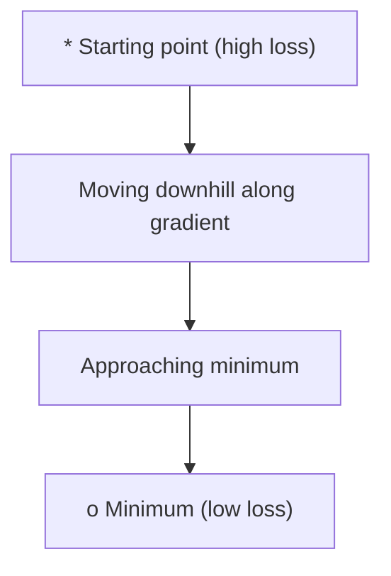
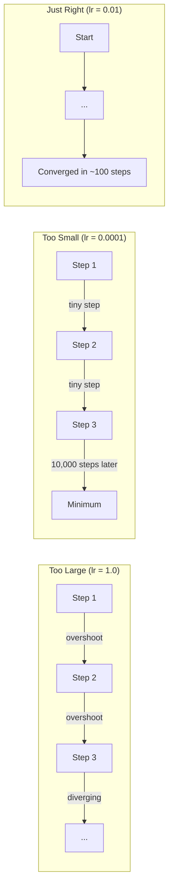
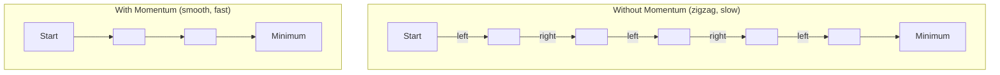
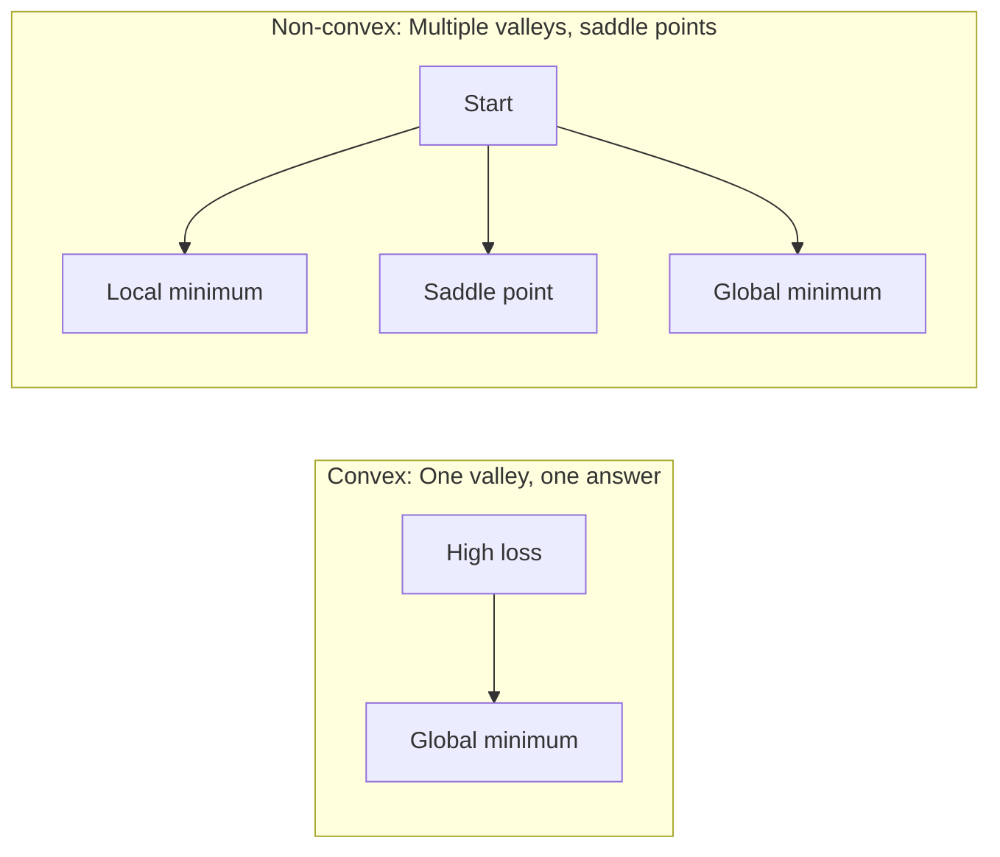
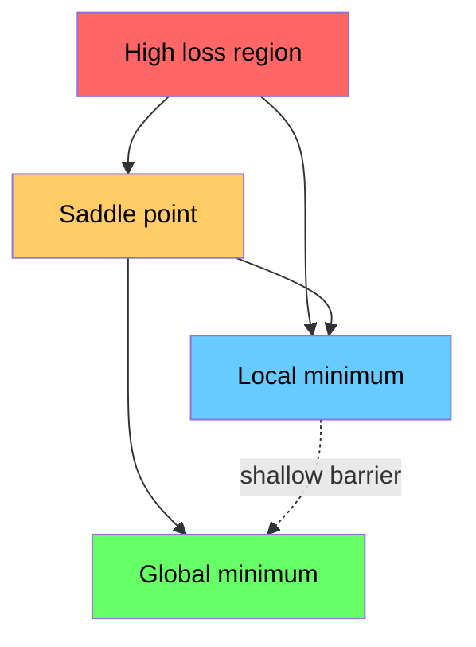

# Optimize

> Bir sinir ağını eğitmek, bir vadinin dibini bulmaktan başka bir şey değildir.

**Type:** Build
**Language:**Python
**Prerequisites:** Phase 1, Lessons 04-05 (Derivatives, Gradients)
**Time:** ~75 minutes

## Öğrenme Hedefleri

- Vanilya derecesinin düşüşünü, SGD'yi hızla ve Adam'ı sıfırdan uygula
- Rosenbrock fonksiyonunda optimizer konverjensiyasını karşılaştırın ve Adam'ın ağırlık başına öğrenme oranlarını neden uyarladığını açıklayın
- Konveks kayıpları olmayan landşaftları ayırt edin ve yüksek boyutlarda otlak noktalarının rolünü açıklayın
- Eğitim istikrarı için öğrenme hızının programlarını (adım çöküşü, kozinik gerileme, ısınma) yapılandırmak

## Sorun

Kayıp fonksiyonu var. modelinizin ne kadar yanlış olduğunu söyler. Değişiklikler var. Kayıpın hangi yönde daha kötü olduğunu söylerler. Şimdi tepeden aşağı yürüyecek bir stratejiye ihtiyacınız var.

Saf yaklaşım basit: gradiyentin karşısına hareket et. Adımı öğrenme oranı olarak adlandırılan bir sayıya göre ölçeyin. Tekrar ediyorum. Bu bir gradient düşüşü ve işe yarıyor. Ama "iş"in bazı uyarıları var. Çok yüksek bir öğrenme hızı var ve vadide tamamen geçiyor ve duvarlar arasında sıçrayıyorsun. Çok küçük ve binlerce gereksiz adım üzerinde cevap için kaydırırsın. Bir sedil noktasına vurur ve bir minimum bulmadığınız halde hareket etmeyi bırakırsınız.

Derin öğrenme alanındaki her optimizer aynı soruya cevap verir: Vadinin dibine daha hızlı ve daha güvenilir bir şekilde nasıl ulaşabilirsiniz?

## Anlaşım

### Optimize edilmenin anlamı

Optimize, bir fonksiyonu en aza indirgen (veya en üst düzeye çıkaran) giriş değerlerini bulmaktır. Makine öğreniminde, işlev kaybıdır. Girişler modelin ağırlıklarıdır. Eğitim optimizasyondur.

```
minimize L(w) where:
  L = loss function
  w = model weights (could be millions of parameters)
```

### Değerlendirme (vanil)

En basit optimizör. Her ağırlığa göre kaybın gradiyenti hesaplayın. Her ağırlığı gradiyentin karşı yönüne taşıyin.

```
w = w - lr * gradient
```

Tüm algoritma bu.



### Öğrenme hızı: en önemli hiperparametre

Öğrenme hızı adım boyutunu kontrol eder.



Doğru öğrenme oranı için bir formül yoktur. Bunu deney yoluyla bulursunuz. Ortak başlangıç noktaları: Adam için 0.001 , SGD için 0.01 hızla.

### SGD vs. parti vs. mini parti

Vanilla gradient düşüşü, bir adım atmadan önce tüm veri kümesi üzerindeki gradient hesaplar. Bu, parti gradient düşüşü olarak adlandırılır.

Stochastic gradient descent (SGD), tek bir rastgele örnekte gradient hesaplar ve hemen adımlar atar.

Mini-batch gradient düşüş farkı bölüyor. gradientini küçük bir parti üzerinde hesaplayın (32, 64, 128, 256 örnek), sonra adım atın.

| Variant | Batch size | Gradient quality | Speed per step | Noise |
|---------|-----------|-----------------|---------------|-------|
| Batch GD | Entire dataset | Exact | Slow | None |
| SGD | 1 sample | Very noisy | Fast | High |
| Mini-batch | 32-256 | Good estimate | Balanced | Moderate |

SGD ve mini-batch'taki gürültü bir hata değil.

### Momentum: top aşağı doğru yuvarlanıyor

Vanilla gradient düşüşü sadece akım gradientini izler. Eğer gradient zigzagları (sık sık dar vadilerde) varsa, ilerleme yavaş olur. Momentum, geçmiş gradientleri bir hız terimi olarak biriktirerek bunu düzeltir.

```
v = beta * v + gradient
w = w - lr * v
```

Benzer bir örnek: bir top tepeden aşağı doğru yuvarlanır. Her çarpışmada durmaz ve yeniden başlatmaz.



`beta`Daha yüksek beta, daha fazla momentum, daha düzgün yollar, ama yön değişimlerine daha yavaş tepki gösterir.

### Adam: Adaptif öğrenme oranları

Farklı ağırlıkların farklı öğrenme oranlarına ihtiyacı vardır. Nadiren büyük dereceler elde eden bir ağırlık sonunda daha büyük adımlar atmalıdır. Sürekli büyük dereceler elde eden bir ağırlık daha küçük adımlar atmalıdır.

Adam (Adaptif Moment Tahmini) ağırlık başına iki şeyi takip ediyor:

1. İlk an (m): gradientlerin (momantum gibi) akış ortalaması
2. İkinci an (v): seksenlik derecelerin (gradyen büyüklüğü) devam eden ortalaması

```
m = beta1 * m + (1 - beta1) * gradient
v = beta2 * v + (1 - beta2) * gradient^2

m_hat = m / (1 - beta1^t)    bias correction
v_hat = v / (1 - beta2^t)    bias correction

w = w - lr * m_hat / (sqrt(v_hat) + epsilon)
```

Bölüm `sqrt(v_hat)`Bu, temel anlayışdır. Büyük gradientli ağırlıklar büyük bir sayıyla bölünür (küçük etkili adım). Küçük gradientli ağırlıklar küçük bir sayıyla bölünür (büyük etkili adım). Her ağırlık kendi uyarlayıcı öğrenme oranına sahiptir.

Öntanımlı hiperparametre: `lr=0.001, beta1=0.9, beta2=0.999, epsilon=1e-8`Bu öntanımlılar çoğu sorun için iyi çalışır.

### Öğrenme oranı programları

Sıkı bir öğrenme oranı bir uzlaşma. Eğitimde erken saatlerde hızlı ilerleme sağlamak için büyük adımlar atmak istersin. Eğitimde geç saatlerde, en azına yakın ince ayarlama yapmak için küçük adımlar atmak istersin.

Ortak programlar:

| Schedule | Formula | Use case |
|----------|---------|----------|
| Step decay | lr = lr * factor every N epochs | Simple, manual control |
| Exponential decay | lr = lr_0 * decay^t | Smooth reduction |
| Cosine annealing | lr = lr_min + 0.5 * (lr_max - lr_min) * (1 + cos(pi * t / T)) | Transformers, modern training |
| Warmup + decay | Linear ramp up, then decay | Large models, prevents early instability |

### Konves vs. konves olmayan

Bir eğri fonksiyonun en az bir tane olması gerekmektedir.`f(x) = x^2`-Konküks.

Nöral ağ kaybı fonksiyonları konveks değildir. Birçok yerel minimum, otlak noktaları ve düz bölgelere sahiptir.



Bu nedenle, bu durumun bir parçası olarak, yerel minimumlar, yüksek boyutlu sinir ağlarında nadiren bir sorun oluşturur. Çoğu yerel minimum, küresel minimumlara yakın bir kayıp değeri vardır.

### Kayıp manzarayı görselleştirme

Kayıp tüm ağırlıkların işlevi. 1 milyon ağırlıklı bir model için kayıp manzarası 1.000.001 boyutlu bir alanda yaşar.



Keskin minimumlar kötü bir şekilde genelleşir. Düz minimeler iyi bir şekilde genelleşir. Bu, SPD'nin hızla Adam'dan son test doğruluğunda genellikle daha iyi performans göstermesinin bir nedeni: gürültüsü keskin minimumlara yerleşmesini engeller.

```figure
gradient-descent
```

## Yapın

### Adım 1: Test fonksiyonunu tanımlayın

Rosenbrock fonksiyonu klasik bir optimizasyon referansıdır. En azı (1, 1) bulmak kolay ama takip etmek zor olan dar bir eğri vadide bulunur.

```
f(x, y) = (1 - x)^2 + 100 * (y - x^2)^2
```

```python
def rosenbrock(params):
    x, y = params
    return (1 - x) ** 2 + 100 * (y - x ** 2) ** 2

def rosenbrock_gradient(params):
    x, y = params
    df_dx = -2 * (1 - x) + 200 * (y - x ** 2) * (-2 * x)
    df_dy = 200 * (y - x ** 2)
    return [df_dx, df_dy]
```

### Adım 2: Vanil gradiyenti düşüşü

```python
class GradientDescent:
    def __init__(self, lr=0.001):
        self.lr = lr

    def step(self, params, grads):
        return [p - self.lr * g for p, g in zip(params, grads)]
```

### Adım 3: İhtimalle SGD

```python
class SGDMomentum:
    def __init__(self, lr=0.001, momentum=0.9):
        self.lr = lr
        self.momentum = momentum
        self.velocity = None

    def step(self, params, grads):
        if self.velocity is None:
            self.velocity = [0.0] * len(params)
        self.velocity = [
            self.momentum * v + g
            for v, g in zip(self.velocity, grads)
        ]
        return [p - self.lr * v for p, v in zip(params, self.velocity)]
```

### Dördüncü adım: Adam

```python
class Adam:
    def __init__(self, lr=0.001, beta1=0.9, beta2=0.999, epsilon=1e-8):
        self.lr = lr
        self.beta1 = beta1
        self.beta2 = beta2
        self.epsilon = epsilon
        self.m = None
        self.v = None
        self.t = 0

    def step(self, params, grads):
        if self.m is None:
            self.m = [0.0] * len(params)
            self.v = [0.0] * len(params)

        self.t += 1

        self.m = [
            self.beta1 * m + (1 - self.beta1) * g
            for m, g in zip(self.m, grads)
        ]
        self.v = [
            self.beta2 * v + (1 - self.beta2) * g ** 2
            for v, g in zip(self.v, grads)
        ]

        m_hat = [m / (1 - self.beta1 ** self.t) for m in self.m]
        v_hat = [v / (1 - self.beta2 ** self.t) for v in self.v]

        return [
            p - self.lr * mh / (vh ** 0.5 + self.epsilon)
            for p, mh, vh in zip(params, m_hat, v_hat)
        ]
```

### Adım 5: Çalıştır ve karşılaştır

```python
def optimize(optimizer, func, grad_func, start, steps=5000):
    params = list(start)
    history = [params[:]]
    for _ in range(steps):
        grads = grad_func(params)
        params = optimizer.step(params, grads)
        history.append(params[:])
    return history

start = [-1.0, 1.0]

gd_history = optimize(GradientDescent(lr=0.0005), rosenbrock, rosenbrock_gradient, start)
sgd_history = optimize(SGDMomentum(lr=0.0001, momentum=0.9), rosenbrock, rosenbrock_gradient, start)
adam_history = optimize(Adam(lr=0.01), rosenbrock, rosenbrock_gradient, start)

for name, history in [("GD", gd_history), ("SGD+M", sgd_history), ("Adam", adam_history)]:
    final = history[-1]
    loss = rosenbrock(final)
    print(f"{name:6s} -> x={final[0]:.6f}, y={final[1]:.6f}, loss={loss:.8f}")
```

Beklenen çıkış: Adam en hızlı bir şekilde yaklaşır. SGD'nin hızı daha dengeli bir yol izler. Vanilla GD'nin dar vadide yavaş ilerlemesi.

## Kullan

Pratikte PyTorch veya JAX optimizörlerini kullanın. Parametre gruplarını, ağırlık kaybını, gradient kesimini ve GPU hızlandırmasını işleyebilirler.

```python
import torch

model = torch.nn.Linear(784, 10)

sgd = torch.optim.SGD(model.parameters(), lr=0.01, momentum=0.9)
adam = torch.optim.Adam(model.parameters(), lr=0.001)
adamw = torch.optim.AdamW(model.parameters(), lr=0.001, weight_decay=0.01)

scheduler = torch.optim.lr_scheduler.CosineAnnealingLR(adam, T_max=100)
```

Basamak kuralları:

- Adam'dan başlayın (lr=0.001).
- En iyi son doğruluğa ihtiyacınız olduğunda ve daha fazla ayarlama yapabileceğiniz zaman (lr=0.01, momentum=0.9) SGD'ye geçin.
- Transformatörler için AdamW (Kahırılmış ağırlık kaybı olan Adam) kullanın.
- Her zaman birkaç dönemden uzun süreli eğitim için öğrenme oranı programını kullanın.
- Eğitim dengesizse öğrenme hızını azaltın. Eğitim çok yavaşsa, onu artırın.

## Gönder

Bu ders doğru optimizasyon cihazını seçmek için bir ipucu oluşturur.`outputs/prompt-optimizer-guide.md`- Evet .

Burada inşa edilen optimizer sınıfları, nöral ağı sıfırdan eğittikten sonra 3. aşamada yeniden ortaya çıkar.

## Egzersizler

1. **Learning rate sweep.**Rosenbrock işlevi üzerinde öğrenme oranları ile vanilya gradient düşüşü çalıştırın [0.0001, 0.0005, 0.001, 0.005, 0.01]. Her biri için 5000 adımdan sonra son kaybı çizin veya yazdırın.

2. **Momentum comparison.**Rosenbrock fonksiyonunda momentum değerleri ile SGD çalıştırın. Her adımda kayıpları takip edin. Hangi momentum değerinin en hızlı yakınlaşması? Hangi atışlar?

3. **Saddle point escape.**Fonksiyonu tanımlayın `f(x, y) = x^2 - y^2`Vanilya GD, SGD ve Adam'ın hareketlerini karşılaştırın.

4. **Implement learning rate decay.**GradientDescent sınıfına bir eksponensel çöküş programı ekleyin: `lr = lr_0 * 0.999^step`Rosenbrock fonksiyonunda çürümeden ve çürümeden bir yakınlık karşılaştırın.

## Anahtar Terimler

| Term | What people say | What it actually means |
|------|----------------|----------------------|
| Gradient descent | "Go downhill" | Update weights by subtracting the gradient scaled by the learning rate. The most basic optimizer. |
| Learning rate | "Step size" | A scalar that controls how far each update moves the weights. Too large causes divergence. Too small wastes compute. |
| Momentum | "Keep rolling" | Accumulate past gradients into a velocity vector. Dampens oscillations and accelerates movement through consistent directions. |
| SGD | "Random sampling" | Stochastic gradient descent. Compute gradient on a random subset instead of the full dataset. Almost always means mini-batch SGD in practice. |
| Mini-batch | "A chunk of data" | A small subset of training data (32-256 samples) used to estimate the gradient. Balances speed and gradient accuracy. |
| Adam | "The default optimizer" | Adaptive Moment Estimation. Tracks per-weight running averages of gradients and squared gradients to give each weight its own learning rate. |
| Bias correction | "Fix the cold start" | Adam's first and second moments are initialized to zero. Bias correction divides by (1 - beta^t) to compensate during early steps. |
| Learning rate schedule | "Change lr over time" | A function that adjusts the learning rate during training. Large steps early, small steps late. |
| Convex function | "One valley" | A function where any local minimum is the global minimum. Gradient descent always finds it. Neural network losses are not convex. |
| Saddle point | "Flat but not a minimum" | A point where the gradient is zero but it is a minimum in some directions and a maximum in others. Common in high dimensions. |
| Loss landscape | "The terrain" | The loss function plotted over weight space. Visualized by slicing along two random directions. |
| Convergence | "Getting there" | The optimizer has reached a point where further steps do not meaningfully reduce the loss. |

## Daha Fazla Okumak

- [Sebastian Ruder: An overview of gradient descent optimization algorithms](https://ruder.io/optimizing-gradient-descent/)- Tüm büyük optimizörlerin kapsamlı araştırması
- [Why Momentum Really Works (Distill)](https://distill.pub/2017/momentum/)- momentum dinamiklerinin etkileşimli görselleştirilmesi
- [Adam: A Method for Stochastic Optimization (Kingma & Ba, 2014)](https://arxiv.org/abs/1412.6980)- orijinal Adam kağıdı, okunur ve kısa
- [Visualizing the Loss Landscape of Neural Nets (Li et al., 2018)](https://arxiv.org/abs/1712.09913)- keskin ve düz minimumları gösteren kağıt
