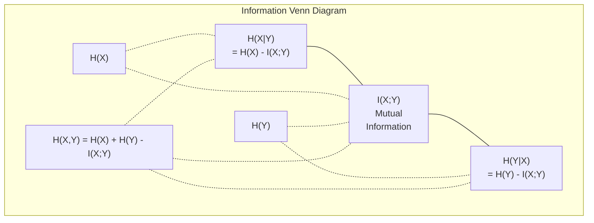

# Bilgi Teorisi

> Bilgi teorisi sürpriz ölçümleri. Kayıp fonksiyonları buna dayanıyor.

**Type:** Learn
**Language:**Python
**Prerequisites:** Phase 1, Lesson 06 (Probability)
**Time:** ~60 minutes

## Öğrenme Hedefleri

- Entrofi, çapraz entropi ve KL farklılığını sıfırdan hesaplayın ve ilişkilerini açıklayın
- Çarpışık entropi kaybını neden en aza indirmek log olasılığını en üst düzeye çıkarmakla eşdeğer olduğunu öğrenin .
- Özellikler ve hedef arasındaki karşılıklı bilgileri, özellik önemini sıralamak için hesaplayın
- Bir dil modeli etkili kelime kümesi boyutundan seçtiği gibi karmaşıklığı açıklayın

## Sorun

Sen ararsın .`CrossEntropyLoss()`Bu, bir grup sınıflandırma modeli olarak kullanılır. her dil modelinde "kafas karışıklığı" görürsünüz.

Bilgi teorisi, belirsizlik, sıkıştırma ve tahmin hakkında mantık yürütmek için bir dil verir. Claude Shannon 1948'de iletişim sorunlarını çözmek için icat etti.

Bu ders, her formülü sıfırdan inşa eder böylece nereden geldiğini ve neden çalıştığını görürsün.

## Anlaşım

### Bilgi içeriği (Sorprize)

Bir şey gerçekleşmesi beklenmedik olduğunda, daha fazla bilgi taşıyor.

P olasılığı olan bir olayın bilgi içeriği:

```
I(x) = -log(p(x))
```

Log base 2'yi kullanarak bitler elde ediyoruz.

```
Event              Probability    Surprise (bits)
Fair coin heads    0.5            1.0
Rolling a 6        0.167          2.58
1-in-1000 event    0.001          9.97
Certain event      1.0            0.0
```

Bazı olaylar sıfır bilgi taşır.

### Entropi (Ortalama sürpriz)

Entropi, bir dağıtımın tüm olası sonuçları üzerinde beklenen sürprizdir.

```
H(P) = -sum( p(x) * log(p(x)) )  for all x
```

Bir adil maden, ikili değişken için en fazla entropiye sahiptir: 1 bit. Tarafsız bir maden (% 99 başları) düşük entropiye sahiptir: 0.08 bit. Ne olacağını zaten biliyorsunuz, bu yüzden her atış size neredeyse hiçbir şey söylemez.

```
Fair coin:    H = -(0.5 * log2(0.5) + 0.5 * log2(0.5)) = 1.0 bit
Biased coin:  H = -(0.99 * log2(0.99) + 0.01 * log2(0.01)) = 0.08 bits
```

Entropi bir dağılımdaki eksiksiz belirsizlikleri ölçer.

### Çarpıcı Entropi (Her Gün Kullanılan Kayıp Fonksiyonu)

Çelişki entropisi, P dağılımından gelen olayları kodlamak için dağılım Q'yi kullandığınızda ortalama sürpriz ölçümünü ölçer.

```
H(P, Q) = -sum( p(x) * log(q(x)) )  for all x
```

P, gerçek dağılımdır. Q, modelinizin tahminidir. Q, P ile mükemmel bir şekilde eşleşirse, çapraz entropi entropiye eşittir. Herhangi bir eşleşme eksikliği onu daha büyük yapar.

Sınıflandırmada, P bir tek sıcak vektördür (gerçek sınıfın olasılığı 1'dir, diğer her şey 0). Bu, çapraz entropiyi basitleştirir:

```
H(P, Q) = -log(q(true_class))
```

Bu sınıflandırma için bütün çapraz entropi kaybı formülü. Doğru sınıfın öngörülen olasılıklarını en üst düzeye çıkarın.

### KL Değişimi (Yekimler Arasındaki Uzaklık)

KL farklılığı, P yerine Q kullanmanın ne kadar fazladan sürpriz aldığını ölçer.

```
D_KL(P || Q) = sum( p(x) * log(p(x) / q(x)) )  for all x
             = H(P, Q) - H(P)
```

Çelişki entropisi, entropi artı KL farklılığıdır. Gerçek dağılımın entropi eğitimin sırasında sabit olduğundan, çapraz entropiyi en aza indirmek KL farklılığı en aza indirmekle aynıdır.

KL farklılığı simetrik değildir: D_KL(P  Q) != D_KL(Q  P). Gerçek bir mesafe metrik değildir.

### Karşılıklı Bilgi

Karşılıklı bilgi, bir değişkenin bir değişken hakkında ne kadar bilgi vermesini ölçer.

```
I(X; Y) = H(X) - H(X|Y)
        = H(X) + H(Y) - H(X, Y)
```

Eğer X ve Y bağımsız ise karşılıklı bilgi sıfırdır. Birini bilmek size diğerini hakkında hiçbir şey söylemez. Eğer mükemmel bir şekilde ilişkili ise karşılıklı bilgi her iki değişkenin entropiye eşit olur.

Özellik seçimi sırasında, bir özellik ve hedef arasındaki yüksek karşılıklı bilgi, özellikin yararlı olduğu anlamına gelir.

### Şartlı Entropi

H(Y de X) Y hakkında ne kadar belirsizlik kaldığını ölçer.

```
H(Y|X) = H(X,Y) - H(X)
```

İki aşırılık:
- Eğer X tamamen Y'yi belirlerse, H(Y de X) = 0. X'i bilmek Y hakkında tüm belirsizlikleri ortadan kaldırır. Örnek: X = sıcaklık Celsius, Y = sıcaklık Fahrenheit.
- Eğer X size Y hakkında hiçbir şey söylemezse, H(YX ) = H(Y). X'i bilmek hiç de belirsizlikinizi azaltmaz.

Şartlı entropi her zaman negatif değildir ve asla H(Y'yi aşmaz:

```
0 <= H(Y|X) <= H(Y)
```

Makine öğreniminde koşullu entropi karar ağaçlarında ortaya çıkar. Her bölünmede, algoritma H(Y) ile ilgili en fazla belirsizlikten kurtulduğu özelliği olan H ((Y)) değerini en aza indirgenir.

### Ortak Entropi

H(X,Y) X ve Y'nin ortak dağılımının entropi.

```
H(X,Y) = -sum sum p(x,y) * log(p(x,y))   for all x, y
```

Ana özellik:

```
H(X,Y) <= H(X) + H(Y)
```

X ve Y bağımsız olduğunda eşitlik geçerlidir. Bilgiler paylaşırsa, ortak entropi bireysel entropi toplamından daha azdır. "Kayıp" entropi tam olarak karşılıklı bilgi.



İlişkiler:
- H(X,Y) = H(X) + H(Y
- H (H) - H (H) - H (H) - H (H) - H (H) - H (H) - H (H) - H (H) - H (H) - H (H) - H (H) - H (H) - H (H) - H (H) - H (H) - H (H) - H (H) - H (H) - H (H) - H (H) - H (H) - H (H) - H (H) - H (H) - H (H) - H (H) - H (H) - H (H) - H (H) - H (H) - H (H) - H (H) - H (H) - H (H) - H) - H (H) - H (H) - H) - H (H) - H) - H (H) - H) - H (H) - H) - H) - H (H) - H) - H) - H (H) - H) - H) - H) - H) - H (H) - H) - H) - H) - H) - H - H - H - H - H - H - H - H - H - H - H - H - H - H - H - H - H - H - H - H - H - H - H - H - H - H - H - H - H - H - H - H - H - H - H - H - H - H - H - H - H - H - H - H - H - H - H - H - H - H - H - H - H - H - H - H - H - H - H - H - H - H - H - H - H - H - H - H - H - H - H - H - H - H - H - H - H - H - H - H - H - H - H - H - H - H - H - H - H - H - H - H - H - H - H - H - H - H - H - H - H - H - H - H - H - H - H - H - H - H - H - H - H - H - H - H - H - H - H - H - H - H - H - H - H - H -
- H(X,Y) = H(X) + H(Y) - I(X;Y)

### Karşılıklı Bilgi (Deep Dive)

Karşılıklı bilgi I(X;Y) bir değişkenin ne kadar bilinmesi diğerine ilişkin belirsizlikleri azaltır.

```
I(X;Y) = H(X) - H(X|Y)
       = H(Y) - H(Y|X)
       = H(X) + H(Y) - H(X,Y)
       = sum sum p(x,y) * log(p(x,y) / (p(x) * p(y)))
```

Özellikleri:
- I ((X;Y) >= 0 her zaman. Bir şeyi gözlemleyerek asla bilgiyi kaybetmezsiniz.
- I(X;Y) = 0 eğer ve sadece X ve Y bağımsızsa.
- I(X;Y) = I(Y;X) KL farklılığından farklı olarak simetriktir.
- I(X;X) = H(X). Bir değişken tüm bilgilerini kendisiyle paylaşır.

**Mutual information for feature selection.**ML'de hedef hakkında bilgilendirici özellikler istiyorsunuz. karşılıklı bilgi size özellikleri sıralamanın prensipsel bir yolunu sağlar:

1. Her bir özellik için X_i, Y hedef değişken olduğu I(X_i; Y) hesaplayın.
2. MI puanı ile sıralama özellikleri.
3. Üst k özelliklerini tut.

Bu özellik ve hedef arasındaki herhangi bir ilişki için çalışır - doğrusal, doğrusal olmayan, tek sesli veya değil. Korrelasyon sadece doğrusal ilişkileri yakalar. MI her şeyi yakalar.

| Method | Detects | Computational cost | Handles categorical? |
|--------|---------|-------------------|---------------------|
| Pearson correlation | Linear relationships | O(n) | No |
| Spearman correlation | Monotonic relationships | O(n log n) | No |
| Mutual information | Any statistical dependency | O(n log n) with binning | Yes |

### Etiket Düzeltme ve Çaplak Entropi

Standart sınıflandırma sert hedefler kullanır: [0, 0, 1, 0]. Gerçek sınıf olasılık 1 alır, diğer her şey 0. Etiket düzeltme bunları yumuşak hedeflerle değiştirir:

```
soft_target = (1 - epsilon) * hard_target + epsilon / num_classes
```

Epsilon = 0,1 ve 4 sınıf:
- Zor hedef: [0, 0, 1, 0]
- Yumuşak hedef: [0.025, 0.025, 0.925, 0.025]

Bilgi teorisi açısından etiket düzeltmesi hedef dağılımının entropiyi arttırır. sert bir sıcak hedeflerin entropi 0 vardır - belirsizlik yoktur. yumuşak hedeflerin pozitif entropi vardır.

Bu neden yardımcı oluyor:
- Modelin logitleri aşırı değerlere götürmesini engeller (çelişkin entropi altında tek sıcak bir hedefe mükemmel şekilde eşleşmek için sonsuz logitler gerekmektedir)
- Düzenlendirme olarak hareket eder: model % 100 güvenli olamaz
- Kalibrasyonu iyileştirir: öngörülen olasılıklar gerçek belirsizlikleri daha iyi yansıtır
- Eğitim ve sonuçlandırma davranışları arasındaki farkı azaltır

Etiket düzeltmesi ile çapraz entropi kaybı:

```
L = (1 - epsilon) * CE(hard_target, prediction) + epsilon * H_uniform(prediction)
```

İkinci terim, bir yandan da aynı olmayan tahminleri cezalandırır. Güven konusunda doğrudan düzenlenme.

### Çarpışıklık Neden Klassifikasyon Kaybısı

Üç bakış açısı, aynı sonucu.

**Information theory view.**Çarpışık entropi, modelinizin gerçek dağılım yerine dağıtımını kullanarak kaç bit harcadığınızı ölçer.

**Maximum likelihood view.**Gerçek sınıf y_i olan N eğitim örnekleri için:

```
Likelihood     = product( q(y_i) )
Log-likelihood = sum( log(q(y_i)) )
Negative log-likelihood = -sum( log(q(y_i)) )
```

Son satır, çapraz entropi kaybı. çapraz entropiyi en aza indirmek = modeliniz altında eğitim verilerinin olasılığını artırmak.

**Gradient view.**Logitler ile ilgili çapraz entropi gradiyenti basit ( öngörülmüş - doğru) temiz, istikrarlı ve hesaplama hızıdır.

### Bitler vs Nats

Tek fark, kütük tabanı.

```
log base 2   -> bits      (information theory tradition)
log base e   -> nats      (machine learning convention)
log base 10  -> hartleys  (rarely used)
```

1 nat = 1/ln(2) bit = 1.4427 bit. PyTorch ve TensorFlow varsayılan olarak doğal log (nats) kullanırlar.

### Kafası karışık

Kafası karışıklık, çapraz entropiyi gösterir. modelin arasında belirsiz olduğu eşit olası seçeneklerin etkin sayısını gösterir.

```
Perplexity = 2^H(P,Q)   (if using bits)
Perplexity = e^H(P,Q)   (if using nats)
```

50 karmaşıklığı olan bir dil modeli ortalama olarak, 50 olası sonraki jetonlardan eşit bir şekilde seçmek zorunda olduğu gibi karışık.

GPT-2 ortak referans değerlerinde ~30 karmaşıklığa ulaştı. Modern modeller iyi temsil edilen alanlar için tek rakamlıdır.

```figure
entropy-kl
```

## Yapın

### Adım 1: Bilgi içeriği ve entropi

```python
import math

def information_content(p, base=2):
    if p <= 0 or p > 1:
        return float('inf') if p <= 0 else 0.0
    return -math.log(p) / math.log(base)

def entropy(probs, base=2):
    return sum(
        p * information_content(p, base)
        for p in probs if p > 0
    )

fair_coin = [0.5, 0.5]
biased_coin = [0.99, 0.01]
fair_die = [1/6] * 6

print(f"Fair coin entropy:   {entropy(fair_coin):.4f} bits")
print(f"Biased coin entropy: {entropy(biased_coin):.4f} bits")
print(f"Fair die entropy:    {entropy(fair_die):.4f} bits")
```

### Adım 2: Çelişkili entropi ve KL farklılığı

```python
def cross_entropy(p, q, base=2):
    total = 0.0
    for pi, qi in zip(p, q):
        if pi > 0:
            if qi <= 0:
                return float('inf')
            total += pi * (-math.log(qi) / math.log(base))
    return total

def kl_divergence(p, q, base=2):
    return cross_entropy(p, q, base) - entropy(p, base)

true_dist = [0.7, 0.2, 0.1]
good_model = [0.6, 0.25, 0.15]
bad_model = [0.1, 0.1, 0.8]

print(f"Entropy of true dist:     {entropy(true_dist):.4f} bits")
print(f"CE (good model):          {cross_entropy(true_dist, good_model):.4f} bits")
print(f"CE (bad model):           {cross_entropy(true_dist, bad_model):.4f} bits")
print(f"KL divergence (good):     {kl_divergence(true_dist, good_model):.4f} bits")
print(f"KL divergence (bad):      {kl_divergence(true_dist, bad_model):.4f} bits")
```

### Adım 3: Kısası entropiyayı sınıflandırma kaybı olarak

```python
def softmax(logits):
    max_logit = max(logits)
    exps = [math.exp(z - max_logit) for z in logits]
    total = sum(exps)
    return [e / total for e in exps]

def cross_entropy_loss(true_class, logits):
    probs = softmax(logits)
    return -math.log(probs[true_class])

logits = [2.0, 1.0, 0.1]
true_class = 0

probs = softmax(logits)
loss = cross_entropy_loss(true_class, logits)

print(f"Logits:      {logits}")
print(f"Softmax:     {[f'{p:.4f}' for p in probs]}")
print(f"True class:  {true_class}")
print(f"Loss:        {loss:.4f} nats")
print(f"Perplexity:  {math.exp(loss):.2f}")
```

### Adım 4: Çelişki entropisi negatif log olasılığına eşittir

```python
import random

random.seed(42)

n_samples = 1000
n_classes = 3
true_labels = [random.randint(0, n_classes - 1) for _ in range(n_samples)]
model_logits = [[random.gauss(0, 1) for _ in range(n_classes)] for _ in range(n_samples)]

ce_loss = sum(
    cross_entropy_loss(label, logits)
    for label, logits in zip(true_labels, model_logits)
) / n_samples

nll = -sum(
    math.log(softmax(logits)[label])
    for label, logits in zip(true_labels, model_logits)
) / n_samples

print(f"Cross-entropy loss:      {ce_loss:.6f}")
print(f"Negative log-likelihood: {nll:.6f}")
print(f"Difference:              {abs(ce_loss - nll):.2e}")
```

### Adım 5: Karşılıklı bilgi

```python
def mutual_information(joint_probs, base=2):
    rows = len(joint_probs)
    cols = len(joint_probs[0])

    margin_x = [sum(joint_probs[i][j] for j in range(cols)) for i in range(rows)]
    margin_y = [sum(joint_probs[i][j] for i in range(rows)) for j in range(cols)]

    mi = 0.0
    for i in range(rows):
        for j in range(cols):
            pxy = joint_probs[i][j]
            if pxy > 0:
                mi += pxy * math.log(pxy / (margin_x[i] * margin_y[j])) / math.log(base)
    return mi

independent = [[0.25, 0.25], [0.25, 0.25]]
dependent = [[0.45, 0.05], [0.05, 0.45]]

print(f"MI (independent): {mutual_information(independent):.4f} bits")
print(f"MI (dependent):   {mutual_information(dependent):.4f} bits")
```

## Kullan

NumPy'yi kullanan aynı kavramlar, pratikte nasıl kullanacağınız:

```python
import numpy as np

def np_entropy(p):
    p = np.asarray(p, dtype=float)
    mask = p > 0
    result = np.zeros_like(p)
    result[mask] = p[mask] * np.log(p[mask])
    return -result.sum()

def np_cross_entropy(p, q):
    p, q = np.asarray(p, dtype=float), np.asarray(q, dtype=float)
    mask = p > 0
    return -(p[mask] * np.log(q[mask])).sum()

def np_kl_divergence(p, q):
    return np_cross_entropy(p, q) - np_entropy(p)

true = np.array([0.7, 0.2, 0.1])
pred = np.array([0.6, 0.25, 0.15])
print(f"Entropy:    {np_entropy(true):.4f} nats")
print(f"Cross-ent:  {np_cross_entropy(true, pred):.4f} nats")
print(f"KL div:     {np_kl_divergence(true, pred):.4f} nats")
```

Neyi sıfırdan inşa ettin ?`torch.nn.CrossEntropyLoss()`Şimdi eğitim sırasında kayıpların neden azaldığını biliyorsunuz: modelinizin tahmin edilen dağılım, değersiz bilgi nats'lerinde ölçülen gerçek dağılımına yaklaşmaktadır.

## Egzersizler

1. İngilizce alfabesinin entropiyi, aynı dağılım (26 harf) ile hesaplayın.

2. Bir model gerçek sınıf 1 olan bir örnek için logitler çıkarır.`cross_entropy_loss`Hangi logitler sıfır kaybı verir?

3. KL farklılığının simetrik olmadığını gösterin. iki dağılım seçin P ve Q ve hesaplayın D_KL_P_K  Q) ve DL Q  P. Neden farklı olduklarını açıklayın.

4. Bir dizi belirti tahmininin karmaşıklığını hesaplayan bir işlev oluşturun. (true_token_index, predicted_logits) çiftlerinin bir listesini vererek, sıradanın karmaşıklığını geri gönderin.

## Anahtar Terimler

| Term | What people say | What it actually means |
|------|----------------|----------------------|
| Information content | "Surprise" | The number of bits (or nats) needed to encode an event: -log(p) |
| Entropy | "Randomness" | The average surprise across all outcomes of a distribution. Measures irreducible uncertainty. |
| Cross-entropy | "The loss function" | Average surprise when using model distribution Q to encode events from true distribution P. |
| KL divergence | "Distance between distributions" | Extra bits wasted by using Q instead of P. Equals cross-entropy minus entropy. Not symmetric. |
| Mutual information | "How related are X and Y" | Reduction in uncertainty about X from knowing Y. Zero means independent. |
| Softmax | "Turn logits into probabilities" | Exponentiate and normalize. Maps any real-valued vector to a valid probability distribution. |
| Perplexity | "How confused the model is" | Exponential of cross-entropy. The effective vocabulary size the model is choosing from at each step. |
| Bits | "Shannon's unit" | Information measured with log base 2. One bit resolves one fair coin flip. |
| Nats | "ML's unit" | Information measured with natural log. Used by PyTorch and TensorFlow by default. |
| Negative log-likelihood | "NLL loss" | Identical to cross-entropy loss for one-hot labels. Minimizing it maximizes the probability of correct predictions. |

## Daha Fazla Okumak

- [Shannon 1948: A Mathematical Theory of Communication](https://people.math.harvard.edu/~ctm/home/text/others/shannon/entropy/entropy.pdf)- orijinal kağıt, hala okunur
- [Visual Information Theory (Chris Olah)](https://colah.github.io/posts/2015-09-Visual-Information/)- entropinin ve KL farklılığının en iyi görsel açıklaması
- [PyTorch CrossEntropyLoss docs](https://pytorch.org/docs/stable/generated/torch.nn.CrossEntropyLoss.html)- yeni inşa ettiğiniz şeyi nasıl uygulayacağınız
