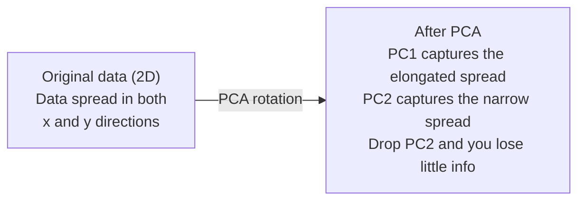

# Boyutların Azaldılması

> Yüksek boyutlu verilerin yapısı vardır. Doğru açıdan bakarak bulabilirsiniz.

**Type:** Build
**Language:**Python
**Prerequisites:** Phase 1, Lessons 01 (Linear Algebra Intuition), 02 (Vectors, Matrices & Operations), 03 (Eigenvalues & Eigenvectors), 06 (Probability & Distributions)
**Time:** ~90 minutes

## Öğrenme Hedefleri

- PCA'yı sıfırdan uygulamak: merkez verileri, kovariansa matrisini hesaplamak, eigendecompose ve proje
- Ana bileşenlerin sayısını seçmek için açıklanan varyansa oranı ve dirsek yöntemi kullanın.
- 2 boyutlu MNIST rakamlarını görselleştirmek için PCA, t-SNE ve UMAP'yi karşılaştırın ve onların anlaşmazlıklarını açıklayın
- Standart PCA'nın işleme yapamadığı çizgisiz veri yapıları ayırmak için RBF çekirdeği ile çekirdek PCA uygulamak

## Sorun

Bir örnek için 784 özellik olan bir veri kümesi vardır. Belki el yazılı rakamların piksel değerleri olabilir. Belki de gen ekspresyonu seviyeleri olabilir. Belki de kullanıcı davranış sinyalleri olabilir. 784 boyutları görsel olarak göremezsiniz. Onları çizemezsiniz. Onlar hakkında düşünemezsiniz.

Ama bu 784 özelliklerinin çoğu fazladan. Gerçek bilgi çok daha küçük bir yüzeyde yaşar. El yazılı "7" onu tanımlamak için 784 bağımsız sayıya ihtiyacı yoktur. Birkaç şeye ihtiyacı vardır: çarpmanın açısı, çapraz çubuğun uzunluğu, ne kadar eğilimi.

Boyut azaltma, daha küçük yüzeyi bulur. 784 boyutlu verilerinizi alır ve önemli olan yapıyı korurken 2, 10 veya 50 boyutlara sıkıştırır.

## Anlaşım

### Boyutsuzluk laneti

Yüksek boyutlu alanlar içgüdüsel değildir.

**Distance becomes meaningless.**Yüksek boyutlarda, herhangi iki rastgele nokta arasındaki mesafe aynı değere doğru birleştiğinde, her nokta diğer noktalardan yaklaşık olarak aynı mesafeyi bulursa, en yakın komşu arayışı çalışmayı bırakır.

```
Dimension    Avg distance ratio (max/min between random points)
2            ~5.0
10           ~1.8
100          ~1.2
1000         ~1.02
```

**Volume concentrates in corners.**D boyutlu bir birim hiper küpünün 2'lik köşeleri vardır. 100 boyutda, neredeyse tüm hacmin merkezin uzak köşelerinde olması.

**You need exponentially more data.**Bir uzaydaki örneklerin aynı yoğunluğunu korumak için 2 boyuttan 20 boyut'a geçmek 10^18 kat daha fazla veriye ihtiyaç duyar.

### PCA: önemli yönleri bul

Ana Komponent Analiz (PCA) verilerinizin en çok değişen ekselerini bulur. Koordinat sisteminizi döndürür böylece ilk eksesi en çok değişimi, ikinci eksesi en çok değişimi algılar ve benzeri şeyler.

Algoritm:

```
1. Center the data        (subtract the mean from each feature)
2. Compute covariance     (how features move together)
3. Eigendecomposition     (find the principal directions)
4. Sort by eigenvalue     (biggest variance first)
5. Project               (keep top k eigenvectors, drop the rest)
```

Özelleme neden? Kovariansa matrisi simetrik ve pozitif yarı belirlenmiş. Kendi vektörleri özellik alanında ortogonal yönlerdir. Kendi değerleri size her yönün ne kadar değişimi yakaladığını söyler. En büyük kendi değer noktalarına sahip olan kendi vektör maksimum değişimin yönünde.



- **Before PCA:**Veri bulutu hem x hem de y ekselerinde diyagonal olarak yayılmıştır
- **After PCA:**Koordinat sistemi döndürülür, böylece PC1 maksimum varyansa yönüne (uzunlaştırılmış yayılma) ve PC2 minimum varyansa yönüne (kısık yayılma) uyum sağlar.
- **Dimensionality reduction:**PC2'yi bırakmak, verileri PC1'e gönderir. Çok az bilgi kaybedilir.

### Açıklanan değişim oranı

Her ana bileşen toplam değişikliğin bir kısmını yakalar.

```
Component    Eigenvalue    Explained ratio    Cumulative
PC1          4.73          0.473              0.473
PC2          2.51          0.251              0.724
PC3          1.12          0.112              0.836
PC4          0.89          0.089              0.925
...
```

Toplam açıklanan varyansa 0,95'e ulaştığında, birçok bileşenin bilgiyi 95%'ini yakaladığını biliyorsun.

### Bileşen sayısını seçmek

Üç strateji:

1. **Threshold.**Farklılığın %90-95'ini açıklayacak kadar bileşen tut.
2. **Elbow method.**Plan, bileşenler arasındaki değişimi açıkladı.
3. **Downstream performance.**PCA'yı önceden işleme olarak kullanın. k'yi tarayın ve modelinizin doğruluğunu ölçün.

### t-SNE: mahalleleri korumak

t-Distributed Stochastic Neighbor Embedding (t-SNE) görselleştirme için tasarlanmıştır.

İntüyüs: orijinal alanda, uzaklıklarına göre nokta çiftlerine olasılık dağılımını hesaplayın. Yakın noktalarda yüksek olasılık elde edilir. Uzak noktalarda düşük olasılık elde edilir. Sonra aynı olasılık dağılımının geçerli olduğu 2 boyutlu bir düzenleme bulun. 784 boyutlarda komşu olan noktalar 2 boyutlu komşu kalır.

T-SNE'nin temel özellikleri:
- - PCA'nın yapamadığı karmaşık manifoldları ortaya çıkarabilir.
- Farklı koşular farklı düzeni oluşturur.
- Kafası karışıklık parametri, kaç komşunu dikkate almayı belirler (tipik aralığı: 5-50).
- Çıktıdaki kümeler arasındaki mesafeler anlamlı değildir. Sadece kümelerin kendileri anlamlıdır.
- Büyük veri kümeleri üzerinde yavaş.

### UMAP: Daha hızlı ve daha iyi küresel yapı

Teker teker yaklaşım ve projeksiyon (UMAP) t-SNE'ye benzer şekilde çalışır ancak iki avantajı vardır:
- Tüm çiftlik mesafelerini hesaplamak yerine en yakın komşu grafiklerini kullanıyor.
- Daha iyi küresel yapı.Klysterlerin üretimdeki göreceli konumları t-SNE'ye göre daha anlamlı olma eğilimindedir.

UMAP, yüksek boyutlu alanlarda ağırlıklı bir grafik ( "kafık topolojik temsil") oluşturur ve daha sonra bu grafikleri mümkün olduğunca iyi koruyan düşük boyutlu bir düzen bulur.

Ana parametreler:
- `n_neighbors`Bu nedenle, daha yüksek değerler daha küresel bir yapıyı korur.
- `min_dist`Daha düşük değerler daha yoğun kümeler oluşturur.

### Ne zaman kullanılır

| Method | Use case | Preserves | Speed |
|--------|----------|-----------|-------|
| PCA | Preprocessing before training | Global variance | Fast (exact), works on millions of samples |
| PCA | Quick exploratory visualization | Linear structure | Fast |
| t-SNE | Publication-quality 2D plots | Local neighborhoods | Slow (< 10k samples ideal) |
| UMAP | 2D visualization at scale | Local + some global structure | Medium (handles millions) |
| PCA | Feature reduction for models | Variance-ranked features | Fast |
| t-SNE / UMAP | Understanding cluster structure | Cluster separation | Medium to slow |

Basamak kural: önceden işleme ve veri sıkıştırması için PCA kullanın. 2 boyutlu yapıyı görselleştirmeniz gerektiğinde t-SNE veya UMAP kullanın.

### Kernel PCA

Standart PCA, doğrusal alt alanlar bulur. Koordinat sisteminizi döndürür ve ekseleri düşürür. Ama veriler doğrusal olmayan bir çeşitlikte bulunursa ne olur? 2 boyutlu bir daire hiçbir çizgiyle ayırılamaz. Standart PCA yardımcı olmaz.

Kernel PCA, bir çekirdek fonksiyonu tarafından tetiklenen yüksek boyutlu bir özellik alanında, bu alanın koordinatlarını açıkça hesaplamadan PCA'yı uyguluyor.

Algoritm:
1. K_ij = k(x_i, x_j) olduğu çekirdek matrisini hesaplayın
2. Yükleme alanında çekirdek matrisini merkeze edin
3. Eigendecompose merkezli çekirdek matrisi
4. Üst öz vektörler (1/sqrt(öz değerleri ile ölçebilir) projeksiyonlardır

Genel çekirdek fonksiyonları:

| Kernel | Formula | Good for |
|--------|---------|----------|
| RBF (Gaussian) | exp(-gamma * \|\|x - y\|\|^2) | Most nonlinear data, smooth manifolds |
| Polynomial | (x . y + c)^d | Polynomial relationships |
| Sigmoid | tanh(alpha * x . y + c) | Neural network-like mappings |

Kerneli PCA ile standart PCA ne zaman kullanılır:

| Criterion | Standard PCA | Kernel PCA |
|-----------|-------------|------------|
| Data structure | Linear subspace | Nonlinear manifold |
| Speed | O(min(n^2 d, d^2 n)) | O(n^2 d + n^3) |
| Interpretability | Components are linear combinations of features | Components lack direct feature interpretation |
| Scalability | Works on millions of samples | Kernel matrix is n x n, memory-limited |
| Reconstruction | Direct inverse transform | Requires pre-image approximation |

Klasik örnek: 2 boyutlu konsentrik döngüler. Birbiri diğerinin içinde iki nokta halka. Standart PCA her ikisini de aynı çizgiye doğru projekt eder. sınıflandırma için işe yaramaz. RBF çekirdeği ile çekirdeği PCA, iç döngüyü ve dış döngüyü farklı bölgelerde haritası yapar ve onları doğrusal olarak ayırır.

### Yeniden Yapım Hatası

Boyutların ne kadar azalıyor? 784 boyutları 50'e sıkıştırdın.

Yeniden yapılandırma hatasını ölçmek:
1. Proje verileri k boyutlara: X_reduced = X @ W_k
2. Yeniden yapılandır: X_hat = X_reduced @ W_k^T
3. Hesaplama MSE: ortalama

PCA için, yeniden yapılama hatası açıklanan varyansa ile temiz bir ilişkiye sahiptir:

```
Reconstruction error = sum of eigenvalues NOT included
Total variance = sum of ALL eigenvalues
Fraction lost = (sum of dropped eigenvalues) / (sum of all eigenvalues)
```

Her bileşen için açıklanan varyansa oranı:

```
explained_ratio_k = eigenvalue_k / sum(all eigenvalues)
```

Toplam açıklanan parça sayısı ile ilgili çizim, size "ikkinci" eğri verir.
- Kürenin düzlenmesi (karşılıkların azalması)
- Toplam değişkenlik eşiğini geçti (genellikle 0,90 veya 0,95)
- Aşağıdaki görev performans platoları

Yeniden inşaat hatası k seçmekten daha yararlıdır. Anomalyayı tespit etmek için kullanabilirsiniz: yüksek yeniden inşaat hatası olan örnekler öğrenilen alt alanına uymayan dış değerlerdir. Bu, üretim sistemlerinde PCA tabanlı anomaly tespitinin temelini oluşturur.

```figure
pca-axes
```

## Yapın

### Adım 1: PCA sıfırdan

```python
import numpy as np

class PCA:
    def __init__(self, n_components):
        self.n_components = n_components
        self.components = None
        self.mean = None
        self.eigenvalues = None
        self.explained_variance_ratio_ = None

    def fit(self, X):
        self.mean = np.mean(X, axis=0)
        X_centered = X - self.mean

        cov_matrix = np.cov(X_centered, rowvar=False)

        eigenvalues, eigenvectors = np.linalg.eigh(cov_matrix)

        sorted_idx = np.argsort(eigenvalues)[::-1]
        eigenvalues = eigenvalues[sorted_idx]
        eigenvectors = eigenvectors[:, sorted_idx]

        self.components = eigenvectors[:, :self.n_components].T
        self.eigenvalues = eigenvalues[:self.n_components]
        total_var = np.sum(eigenvalues)
        self.explained_variance_ratio_ = self.eigenvalues / total_var

        return self

    def transform(self, X):
        X_centered = X - self.mean
        return X_centered @ self.components.T

    def fit_transform(self, X):
        self.fit(X)
        return self.transform(X)
```

### İkinci adım: Sintez veriler üzerinde test

```python
np.random.seed(42)
n_samples = 500

t = np.random.uniform(0, 2 * np.pi, n_samples)
x1 = 3 * np.cos(t) + np.random.normal(0, 0.2, n_samples)
x2 = 3 * np.sin(t) + np.random.normal(0, 0.2, n_samples)
x3 = 0.5 * x1 + 0.3 * x2 + np.random.normal(0, 0.1, n_samples)

X_synthetic = np.column_stack([x1, x2, x3])

pca = PCA(n_components=2)
X_reduced = pca.fit_transform(X_synthetic)

print(f"Original shape: {X_synthetic.shape}")
print(f"Reduced shape:  {X_reduced.shape}")
print(f"Explained variance ratios: {pca.explained_variance_ratio_}")
print(f"Total variance captured: {sum(pca.explained_variance_ratio_):.4f}")
```

### Adım 3: MNIST rakamları 2 boyutlu

```python
from sklearn.datasets import fetch_openml

mnist = fetch_openml("mnist_784", version=1, as_frame=False, parser="auto")
X_mnist = mnist.data[:5000].astype(float)
y_mnist = mnist.target[:5000].astype(int)

pca_mnist = PCA(n_components=50)
X_pca50 = pca_mnist.fit_transform(X_mnist)
print(f"50 components capture {sum(pca_mnist.explained_variance_ratio_):.2%} of variance")

pca_2d = PCA(n_components=2)
X_pca2d = pca_2d.fit_transform(X_mnist)
print(f"2 components capture {sum(pca_2d.explained_variance_ratio_):.2%} of variance")
```

### 4. adım: sklearn ile karşılaştır

```python
from sklearn.decomposition import PCA as SklearnPCA
from sklearn.manifold import TSNE

sklearn_pca = SklearnPCA(n_components=2)
X_sklearn_pca = sklearn_pca.fit_transform(X_mnist)

print(f"\nOur PCA explained variance:     {pca_2d.explained_variance_ratio_}")
print(f"Sklearn PCA explained variance: {sklearn_pca.explained_variance_ratio_}")

diff = np.abs(np.abs(X_pca2d) - np.abs(X_sklearn_pca))
print(f"Max absolute difference: {diff.max():.10f}")

tsne = TSNE(n_components=2, perplexity=30, random_state=42)
X_tsne = tsne.fit_transform(X_mnist)
print(f"\nt-SNE output shape: {X_tsne.shape}")
```

### Adım 5: UMAP karşılaştırması

```python
try:
    from umap import UMAP

    reducer = UMAP(n_components=2, n_neighbors=15, min_dist=0.1, random_state=42)
    X_umap = reducer.fit_transform(X_mnist)
    print(f"UMAP output shape: {X_umap.shape}")
except ImportError:
    print("Install umap-learn: pip install umap-learn")
```

## Kullan

Bir sınıflandırıcıdan önce önceden işleme olarak PCA:

```python
from sklearn.decomposition import PCA as SklearnPCA
from sklearn.linear_model import LogisticRegression
from sklearn.model_selection import train_test_split
from sklearn.metrics import accuracy_score

X_train, X_test, y_train, y_test = train_test_split(
    X_mnist, y_mnist, test_size=0.2, random_state=42
)

results = {}
for k in [10, 30, 50, 100, 200]:
    pca_k = SklearnPCA(n_components=k)
    X_tr = pca_k.fit_transform(X_train)
    X_te = pca_k.transform(X_test)

    clf = LogisticRegression(max_iter=1000, random_state=42)
    clf.fit(X_tr, y_train)
    acc = accuracy_score(y_test, clf.predict(X_te))
    var_captured = sum(pca_k.explained_variance_ratio_)
    results[k] = (acc, var_captured)
    print(f"k={k:>3d}  accuracy={acc:.4f}  variance={var_captured:.4f}")
```

784 boyuttan çok önce performans platoları.

## Gönder

Bu ders şunları ortaya çıkarır:
- `outputs/skill-dimensionality-reduction.md`- belirli bir görev için doğru boyut azaltma tekniğini seçme becerisi

## Egzersizler

1. PCA sınıfını desteklemek için değiştir `inverse_transform`. 10, 50 ve 200 bileşenden MNIST rakamlarını yeniden oluşturun. Her bir bileşen için yeniden oluşturma hatasını (orjinalden ortalama kare farkı) yazdırın.

2. t-SNE'yi aynı MNIST alt kümesi üzerinde 5, 30 ve 100'lik karmaşıklık değerleriyle çalıştırın. Çıktılık değişimi nasıl açıklayın.

3. Sadece 5'i bilgilendirici olan 50 özellikten oluşan bir veri kümesi alın (bir tane `sklearn.datasets.make_classification`). PCA uygulayın ve açıklanan varyansa eğri verilerin aslında beş boyutlu olduğunu doğru bir şekilde belirlediğini kontrol edin.

## Anahtar Terimler

| Term | What people say | What it actually means |
|------|----------------|----------------------|
| Curse of dimensionality | "Too many features" | Distances, volumes, and data density all behave counterintuitively as dimensions grow. Models need exponentially more data to compensate. |
| PCA | "Reduce dimensions" | Rotate your coordinate system so the axes align with the directions of maximum variance, then drop the low-variance axes. |
| Principal component | "An important direction" | An eigenvector of the covariance matrix. The direction in feature space along which the data varies most. |
| Explained variance ratio | "How much info this component has" | The fraction of total variance captured by one principal component. Sum the top k ratios to see how much k components preserve. |
| Covariance matrix | "How features correlate" | A symmetric matrix where entry (i,j) measures how feature i and feature j move together. Diagonal entries are individual variances. |
| t-SNE | "That cluster plot" | A nonlinear method that maps high-dimensional data to 2D by preserving pairwise neighborhood probabilities. Good for visualization, not for preprocessing. |
| UMAP | "Faster t-SNE" | A nonlinear method based on topological data analysis. Preserves both local and some global structure. Scales better than t-SNE. |
| Perplexity | "A t-SNE knob" | Controls the effective number of neighbors each point considers. Low perplexity focuses on very local structure. High perplexity captures broader patterns. |
| Manifold | "The surface the data lives on" | A lower-dimensional surface embedded in a higher-dimensional space. A sheet of paper crumpled in 3D is a 2D manifold. |

## Daha Fazla Okumak

- [A Tutorial on Principal Component Analysis](https://arxiv.org/abs/1404.1100)(Shlens) - PCA'nın net bir şekilde yerden çıkartılması
- [How to Use t-SNE Effectively](https://distill.pub/2016/misread-tsne/)(Wattenberg et al.) - t-SNE tuzağı ve parametreler seçimi için interaktif rehber
- [UMAP documentation](https://umap-learn.readthedocs.io/)- UMAP yazarlarının teorisi ve pratik rehberliği
