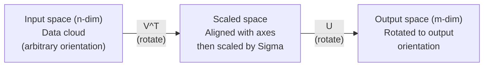
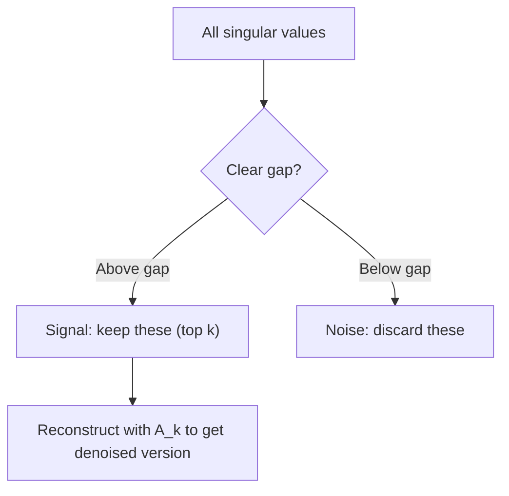

# Tek değerlerin parçalanması

> SVD, çizgisi cebirdeki İsviçre ordusu bıçağı. Her matrisin bir tane vardır. Her veri bilimcisi bir taneye ihtiyaç duyar.

**Type:** Build
**Languages:** Python, Julia
**Prerequisites:** Phase 1, Lessons 01 (Linear Algebra Intuition), 02 (Vectors & Matrices Operations), 03 (Matrix Transformations)
**Time:** ~120 minutes

## Öğrenme Hedefleri

- Güç İterasyonu yoluyla SVD uygulamak ve U, Sigma ve V^T'nin geometrik anlamını açıklamak
- Resim sıkıştırılması için kısaltılmış SVD uygulayın ve sıkıştırma oranı vs. yeniden yapılandırma hatasını ölçün
- SVD üzerinden Moore-Penrose pseudoinversini hesaplayın .
- SVD'yi PCA'ya, tavsiye sistemlerine (latent faktörler) ve NLP'deki latent semantik analizi ile bağlayın

## Sorun

Bir 1000x2000 matrisiniz var. Belki de kullanıcı filmleri dereceleri. Belki de bir belge term frekans tablosudur. Belki de bir resmin piksel değerleri. Onu sıkıştırmak, tanımlamak, içinde gizli bir yapı bulmak veya en az kareli bir sistem çözmek gerekir. Eigendecomposition sadece kareli matrislerde çalışır.

SVD herhangi bir matris üzerinde çalışır. Herhangi bir şekil. Her sıra. Hiç koşul yoktur. Matrisin uzayla ne yaptığını ortaya çıkaran üç faktöre parçaladı.

## Anlaşım

### SVD'nin geometrik olarak ne yaptığını

Her matris, şekilinden bağımsız olarak, üç işlem yapar: dön, ölçek, dön.

```
A = U * Sigma * V^T

      m x n     m x m    m x n    n x n
     (any)    (rotate)  (scale)  (rotate)
```

A matrisi göz önüne alındığında, SVD onu aşağıdaki konularda değerlendirir:
- V^T giriş alanında vektörleri döndürür (n boyutlu)
- Her eksesi boyunca Sigma ölçekleri (kendi veya kompres)
- U sonucu çıkış alanına döndürür (m boyutlu)



SVD'ye bir matris verilir. "Bu matris bir giriş küresini alır, önce V^T ile döndürür, sonra Sigma ile elipsoide uzatır, sonra elipsoide U ile döndür".

### Tam bir parçalanma

M x n şekli olan A matrisi için:

```
A = U * Sigma * V^T

where:
  U     is m x m, orthogonal (U^T U = I)
  Sigma is m x n, diagonal (singular values on the diagonal)
  V     is n x n, orthogonal (V^T V = I)

The singular values sigma_1 >= sigma_2 >= ... >= sigma_r > 0
where r = rank(A)
```

U sütunları sol tek tek vektörler olarak adlandırılır. V sütunları sağ tek tek vektörler olarak adlandırılır. Sigma'nın diyagonal girişleri tek tek değerler olarak adlandırılır. Onlar her zaman negatif olmayan ve geleneksel olarak azalır sırada sıralanmıştır.

### Sol tekerleyici vektörler, tekerleyici değerler, sağ tekerleyici vektörler

SVD'nin her bileşeninin farklı bir geometrik anlamı vardır.

**Right singular vectors (columns of V):**Bunlar giriş alanı (R^n) için bir ortonomal temel oluşturur. Bunlar giriş alanındaki yönleridir. Matris çıkış alanındaki ortogonal yönlere haritası yapar.

**Singular values (diagonal of Sigma):**Bu, ölçekleme faktörleri. i. tek değer, matrisin i. sağ tek vektör boyunca vektörleri ne kadar uzattığını söyler.

**Left singular vectors (columns of U):**Bunlar çıkış alanı için bir ortonomal temel oluşturur (R^m). I. sol tek tek tek tek tek tek tek tek tek tek tek tek tek tek tek tek tek tek tek tek tek tek tek tek tek tek tek tek tek tek tek tek tek tek tek tek tek tek tek tek tek tek tek tek tek tek tek tek tek tek tek tek tek tek tek tek tek tek tek tek tek tek tek tek tek tek tek tek tek tek tek tek tek tek tek tek tek tek tek tek tek tek tek tek tek tek tek tek tek tek tek tek tek tek tek tek tek tek tek tek tek tek tek tek tek tek tek tek tek tek tek tek tek tek tek tek tek tek tek tek tek tek tek tek tek tek tek tek tek tek tek tek tek tek tek tek tek tek tek tek tek tek tek tek tek tek tek tek tek tek tek tek tek tek tek tek tek tek tek tek tek tek tek tek tek tek tek tek tek tek tek tek tek tek tek tek tek tek tek tek tek tek tek tek tek tek tek tek tek tek tek tek tek tek tek tek tek tek tek tek tek tek tek tek tek tek tek tek tek tek tek tek tek tek tek tek tek tek tek tek tek tek tek tek tek tek tek tek tek tek tek tek tek tek tek tek tek tek tek tek tek tek tek tek tek tek tek tek tek tek tek tek tek tek tek tek tek tek tek tek tek tek tek tek tek tek tek tek tek tek tek tek tek tek tek tek tek tek tek tek tek tek tek tek tek tek tek tek tek tek tek tek tek tek tek tek tek tek tek tek tek tek tek tek tek tek tek tek tek tek tek tek tek tek tek tek tek tek tek tek tek tek tek tek tek tek tek tek tek tek tek tek tek tek tek tek tek tek tek tek tek tek tek tek tek tek tek tek tek tek tek tek tek tek tek tek tek tek tek tek tek tek tek tek tek tek tek tek tek tek tek tek tek tek tek tek tek tek tek tek tek tek tek tek tek tek tek tek tek tek tek tek tek tek tek tek tek tek tek tek tek tek tek tek tek tek tek tek tek tek tek tek tek tek tek tek tek tek tek tek tek tek tek tek tek tek tek tek tek tek tek tek tek tek tek tek tek tek tek tek tek tek tek tek tek tek tek tek tek tek tek tek tek tek tek tek tek tek tek tek tek tek tek tek tek tek tek tek tek tek tek tek tek tek tek tek tek tek tek tek tek tek tek tek tek tek tek tek tek

Arasındaki ilişki:

```
A * v_i = sigma_i * u_i

The matrix A takes the i-th right singular vector v_i,
scales it by sigma_i, and maps it to the i-th left singular vector u_i.
```

Bu size herhangi bir matrisin ne yaptığını koordinat-koordinat bir resim verir.

### Dış ürün biçimi

SVD, 1 sınıf matrislerinin toplamı olarak yazılabilir:

```
A = sigma_1 * u_1 * v_1^T + sigma_2 * u_2 * v_2^T + ... + sigma_r * u_r * v_r^T

Each term sigma_i * u_i * v_i^T is a rank-1 matrix (an outer product).
The full matrix is the sum of r such matrices, where r is the rank.
```

Bu form düşük sıralama yaklaşımının temelidir. Her terim bir yapı katmanı ekler. Birinci terim tek en önemli örneği yakalar. İkinci terim bir sonraki en önemli olanı yakalar. Ve buna benzer. Bu toplamı kısaltmak size verilen herhangi bir sıralamada mümkün olan en iyi yaklaşım sağlar.

```
Rank-1 approx:    A_1 = sigma_1 * u_1 * v_1^T
                  (captures the dominant pattern)

Rank-2 approx:    A_2 = sigma_1 * u_1 * v_1^T + sigma_2 * u_2 * v_2^T
                  (captures the two most important patterns)

Rank-k approx:    A_k = sum of top k terms
                  (optimal by the Eckart-Young theorem)
```

### Kendi bileşimi ile ilişki

SVD ve eigende kompozisyon derin bir bağlantıya sahiptir. A'nın tek değerleri ve vektörleri doğrudan A^T A ve A^T'nin öz değerlerinden ve öz vektörlerinden gelir.

```
A^T A = V * Sigma^T * U^T * U * Sigma * V^T
      = V * Sigma^T * Sigma * V^T
      = V * D * V^T

where D = Sigma^T * Sigma is a diagonal matrix with sigma_i^2 on the diagonal.

So:
- The right singular vectors (V) are eigenvectors of A^T A
- The singular values squared (sigma_i^2) are eigenvalues of A^T A

Similarly:
A A^T = U * Sigma * V^T * V * Sigma^T * U^T
      = U * Sigma * Sigma^T * U^T

So:
- The left singular vectors (U) are eigenvectors of A A^T
- The eigenvalues of A A^T are also sigma_i^2
```

Bu bağlantı size üç şeyi anlatıyor:
1. Tek değerler her zaman gerçek ve negatif değildir (pozitif yarı tanımlı bir matrisin öz değerlerinin kare köküdürler).
2. SVD'yi A^T A'nın kendi bileşimi ile hesaplayabilirsiniz, ancak bu durum numarasını karesine katarak sayısal doğruluğu kaybeder.
3. A kare ve simetrik pozitif yarı belirlenmiş olduğunda, SVD ve eigende kompozisyon aynı şeydir.

### Kısaltılmış SVD: düşük seviye yakınlaştırma

Eckart-Young-Mirsky teoremi, A'ya en iyi sıra-k yaklaşımının (hem Frobenius hem de spektral normda) sadece üst k tek değerlerini ve ilgili vektörlerini tutarak elde edildiğini belirtir:

```
A_k = U_k * Sigma_k * V_k^T

where:
  U_k     is m x k  (first k columns of U)
  Sigma_k is k x k  (top-left k x k block of Sigma)
  V_k     is n x k  (first k columns of V)

Approximation error = sigma_{k+1}  (in spectral norm)
                    = sqrt(sigma_{k+1}^2 + ... + sigma_r^2)  (in Frobenius norm)
```

Bu sadece "iyi" bir yaklaşım değil. Bu, provable olarak, sıra k'nin en iyi yaklaşımıdır.

| Component | Relative magnitude | Kept in rank-3 approx? |
|-----------|-------------------|------------------------|
| sigma_1 | Largest | Yes |
| sigma_2 | Large | Yes |
| sigma_3 | Medium-large | Yes |
| sigma_4 | Medium | No (error) |
| sigma_5 | Medium-small | No (error) |
| sigma_6 | Small | No (error) |
| sigma_7 | Very small | No (error) |
| sigma_8 | Tiny | No (error) |

A_3 en büyük üç tek değerini yakalar. Hata = kalan değerler (sigma_4 ile sigma_8).

Tek değerler hızlı bir şekilde bozulursa, küçük bir k matrisin çoğunu yakalar.

### SVD ile görüntü sıkıştırma

Gri ölçekli bir görüntü, piksel yoğunlukları matrisidir. 800x600 görüntüde 480.000 değer vardır. SVD onu daha az ile yaklaştırmanıza izin verir.

```
Original image: 800 x 600 = 480,000 values

SVD with rank k:
  U_k:      800 x k values
  Sigma_k:  k values
  V_k:      600 x k values
  Total:    k * (800 + 600 + 1) = k * 1401 values

  k=10:   14,010 values   (2.9% of original)
  k=50:   70,050 values  (14.6% of original)
  k=100: 140,100 values  (29.2% of original)

  The compression ratio improves as k gets smaller,
  but visual quality degrades.
```

Anahtar anlayış: doğal görüntüler hızlı bir şekilde bozulan tekerlek değerlerine sahiptir. İlk birkaç tekerlek değerleri geniş yapıyı (şekiller, gradientler) yakalar. Sonrakiler ince ayrıntıları ve gürültüyi yakalar. 50'de kesmek genellikle orijinaline neredeyse benzer görünen bir görüntü üretir.

### Önerme sistemleri için SVD

Netflix Ödülü bunu ünlü kıldı. Çoğu giriş kayıp olduğu bir kullanıcı filmleri derecelendirme matrisiniz var.

```
             Movie1  Movie2  Movie3  Movie4  Movie5
  User1      [  5      ?       3       ?       1  ]
  User2      [  ?      4       ?       2       ?  ]
  User3      [  3      ?       5       ?       ?  ]
  User4      [  ?      ?       ?       4       3  ]

  ? = unknown rating
```

Bu değerlendirme matrisi düşük bir sıralama sahiptir. Kullanıcıların tamamen bağımsız zevkleri yoktur. Çoğu tercihleri açıklayan bir avuç gizli faktör vardır (harekete karşı drama, eskiye karşı yeniye, beyinye karşı visceral).

SVD (dolmuş) derecelendirme matrisinde, aşağıdaki bölümlere ayrılır:
- U: gizli faktör alanında kullanıcı profilleri
- Sigma: her gizli faktörün önemi
- V^T: gizli faktör alanında film profili

Bir kullanıcı tarafından bir film için tahmin edilen derece, kullanıcı profilinin film profilinin nokta ürünüdür (birbirlik değerleriyle ağırlanır).

Bu yöntemler, simon funk'in en az kareyi değiştiren ve eksik olan verileri doğrudan ele alan eksel SVD veya ALS gibi değişkenleri kullanır.

### NLP'de SVD: Latent Semantik Analiz

Latent Semantic Analysis (LSA), ayrıca Latent Semantic Indexing (LSI) olarak da adlandırılır, SVD'yi bir term-dokümant matrisine uyguluyor.

```
             Doc1   Doc2   Doc3   Doc4
  "cat"      [  3      0      1      0  ]
  "dog"      [  2      0      0      1  ]
  "fish"     [  0      4      1      0  ]
  "pet"      [  1      1      1      1  ]
  "ocean"    [  0      3      0      0  ]

After SVD with rank k=2:

  Each document becomes a point in 2D "concept space."
  Each term becomes a point in the same 2D space.
  Documents about similar topics cluster together.
  Terms with similar meanings cluster together.

  "cat" and "dog" end up near each other (land pets).
  "fish" and "ocean" end up near each other (water concepts).
  Doc1 and Doc3 cluster if they share similar topics.
```

LSA, çiğ metinden semantik benzerliği yakalamak için ilk başarılı yöntemlerden biriydi. Aynı metinlerde eş anlamlı terimler görünmeye eğilimli olduğu için çalışır.

### Gürültü azaltmak için SVD

Gürültülü veriler, sinyalin en üst tek değerlerde yoğunlaştığını ve gürültü tüm tek değerlere yayıldığını gösterir.

**Clean signal singular values:**

| Component | Magnitude | Type |
|-----------|-----------|------|
| sigma_1 | Very large | Signal |
| sigma_2 | Large | Signal |
| sigma_3 | Medium | Signal |
| sigma_4 | Near zero | Negligible |
| sigma_5 | Near zero | Negligible |

**Noisy signal singular values (noise adds to all):**

| Component | Magnitude | Type |
|-----------|-----------|------|
| sigma_1 | Very large | Signal |
| sigma_2 | Large | Signal |
| sigma_3 | Medium | Signal |
| sigma_4 | Small | Noise |
| sigma_5 | Small | Noise |
| sigma_6 | Small | Noise |
| sigma_7 | Small | Noise |



Bu, sinyal işleme, bilimsel ölçüm ve veri temizlemesinde kullanılır.

### SVD yoluyla sahte tersleşme

Moore-Penrose pseudoinverse A+ metrik inversiyonunu kareler olmayan ve tekerlekli metriklere genelleştirir.

```
If A = U * Sigma * V^T, then:

A+ = V * Sigma+ * U^T

where Sigma+ is formed by:
  1. Transpose Sigma (swap rows and columns)
  2. Replace each non-zero diagonal entry sigma_i with 1/sigma_i
  3. Leave zeros as zeros

For A (m x n):      A+ is (n x m)
For Sigma (m x n):  Sigma+ is (n x m)
```

Pseudoinverse en az kare problemlerini çözür. Ax = b'nin kesin çözümü yoksa (över belirlenmiş sistem), o zaman x = A + b en az kare çözümüdür (BXAx - b'yi en az azaltır).

```
Overdetermined system (more equations than unknowns):

  [1  1]         [3]
  [2  1] x   =   [5]       No exact solution exists.
  [3  1]         [6]

  x_ls = A+ b = V * Sigma+ * U^T * b

  This gives the x that minimizes the sum of squared residuals.
  Same result as the normal equations (A^T A)^(-1) A^T b,
  but numerically more stable.
```

### Sayısal istikrar avantajları

A^T A'nın kendi bileşimi hesaplamak tek değerleri karıştırır (A^T A'nın kendi değerleri sigma_i^2) Bu durum sayısını karıştırır ve sayısız hataları artırır.

```
Example:
  A has singular values [1000, 1, 0.001]
  Condition number of A: 1000 / 0.001 = 10^6

  A^T A has eigenvalues [10^6, 1, 10^{-6}]
  Condition number of A^T A: 10^6 / 10^{-6} = 10^{12}

  Computing SVD directly: works with condition number 10^6
  Computing via A^T A:     works with condition number 10^{12}
                           (6 extra digits of precision lost)
```

Modern SVD algoritmaları (Golub-Kahan bidiagonalizasyonu) doğrudan A'da çalışırlar, asla A^T A oluşturmazlar. Bu nedenle her zaman tercih edilmelidir `np.linalg.svd(A)`- Tamam .`np.linalg.eig(A.T @ A)`- Evet .

### PCA'ya bağlantı

PCA, merkezi veriler üzerinde SVD'dir. Bu bir benzerlik değil.

```
Given data matrix X (n_samples x n_features), centered (mean subtracted):

Covariance matrix: C = (1/(n-1)) * X^T X

PCA finds eigenvectors of C. But:

  X = U * Sigma * V^T    (SVD of X)

  X^T X = V * Sigma^2 * V^T

  C = (1/(n-1)) * V * Sigma^2 * V^T

So the principal components are exactly the right singular vectors V.
The explained variance for each component is sigma_i^2 / (n-1).

In sklearn, PCA is implemented using SVD, not eigendecomposition.
It is faster and more numerically stable.
```

Bu, 10. derste boyut azaltma hakkında öğrendiğiniz her şey SVD'nin kapuk altında olduğunu gösterir. PCA, makine öğreniminde SVD'nin en yaygın uygulamasıdır.

```figure
svd-rank-reconstruction
```

## Yapın

### Adım 1: Güç İterasyonu kullanarak sıfırdan SVD

Fikir: en büyük tek değer ve vektörlerini bulmak için, A^T A (veya A A^T) üzerinde güç iterasyonunu kullanın.

```python
import numpy as np

def power_iteration(M, num_iters=100):
    n = M.shape[1]
    v = np.random.randn(n)
    v = v / np.linalg.norm(v)

    for _ in range(num_iters):
        Mv = M @ v
        v = Mv / np.linalg.norm(Mv)

    eigenvalue = v @ M @ v
    return eigenvalue, v

def svd_from_scratch(A, k=None):
    m, n = A.shape
    if k is None:
        k = min(m, n)

    sigmas = []
    us = []
    vs = []

    A_residual = A.copy().astype(float)

    for _ in range(k):
        AtA = A_residual.T @ A_residual
        eigenvalue, v = power_iteration(AtA, num_iters=200)

        if eigenvalue < 1e-10:
            break

        sigma = np.sqrt(eigenvalue)
        u = A_residual @ v / sigma

        sigmas.append(sigma)
        us.append(u)
        vs.append(v)

        A_residual = A_residual - sigma * np.outer(u, v)

    U = np.column_stack(us) if us else np.empty((m, 0))
    S = np.array(sigmas)
    V = np.column_stack(vs) if vs else np.empty((n, 0))

    return U, S, V
```

### Adım 2: NumPy ile test ve karşılaştırma

```python
np.random.seed(42)
A = np.random.randn(5, 4)

U_ours, S_ours, V_ours = svd_from_scratch(A)
U_np, S_np, Vt_np = np.linalg.svd(A, full_matrices=False)

print("Our singular values:", np.round(S_ours, 4))
print("NumPy singular values:", np.round(S_np, 4))

A_reconstructed = U_ours @ np.diag(S_ours) @ V_ours.T
print(f"Reconstruction error: {np.linalg.norm(A - A_reconstructed):.8f}")
```

### Adım 3: Resim sıkıştırma göstergesi

```python
def compress_image_svd(image_matrix, k):
    U, S, Vt = np.linalg.svd(image_matrix, full_matrices=False)
    compressed = U[:, :k] @ np.diag(S[:k]) @ Vt[:k, :]
    return compressed

image = np.random.seed(42)
rows, cols = 200, 300
image = np.random.randn(rows, cols)

for k in [1, 5, 10, 20, 50]:
    compressed = compress_image_svd(image, k)
    error = np.linalg.norm(image - compressed) / np.linalg.norm(image)
    original_size = rows * cols
    compressed_size = k * (rows + cols + 1)
    ratio = compressed_size / original_size
    print(f"k={k:>3d}  error={error:.4f}  storage={ratio:.1%}")
```

### 4. Adım: Gürültü azaltma

```python
np.random.seed(42)
clean = np.outer(np.sin(np.linspace(0, 4*np.pi, 100)),
                 np.cos(np.linspace(0, 2*np.pi, 80)))
noise = 0.3 * np.random.randn(100, 80)
noisy = clean + noise

U, S, Vt = np.linalg.svd(noisy, full_matrices=False)
denoised = U[:, :5] @ np.diag(S[:5]) @ Vt[:5, :]

print(f"Noisy error:    {np.linalg.norm(noisy - clean):.4f}")
print(f"Denoised error: {np.linalg.norm(denoised - clean):.4f}")
print(f"Improvement:    {(1 - np.linalg.norm(denoised - clean) / np.linalg.norm(noisy - clean)):.1%}")
```

### Adım 5: Pseudoinverse

```python
A = np.array([[1, 1], [2, 1], [3, 1]], dtype=float)
b = np.array([3, 5, 6], dtype=float)

U, S, Vt = np.linalg.svd(A, full_matrices=False)
S_inv = np.diag(1.0 / S)
A_pinv = Vt.T @ S_inv @ U.T

x_svd = A_pinv @ b
x_lstsq = np.linalg.lstsq(A, b, rcond=None)[0]
x_pinv = np.linalg.pinv(A) @ b

print(f"SVD pseudoinverse solution:  {x_svd}")
print(f"np.linalg.lstsq solution:   {x_lstsq}")
print(f"np.linalg.pinv solution:    {x_pinv}")
```

## Kullan

Tam çalışma gösterileri var .`code/svd.py`.SVD'yi görüntü sıkıştırma, tavsiye sistemleri, gizli semantik analiz ve gürültü azaltma için kullanmak için çalıştırın.

```bash
python svd.py
```

Julia versiyonu .`code/svd.jl`Julia'nın doğuştan kullandığı aynı kavramları gösterir.`svd()`işlevi ve `LinearAlgebra`Paket.

```bash
julia svd.jl
```

## Gönder

Bu ders şunları ortaya çıkarır:
- `outputs/skill-svd.md`- Gerçek projelerde SVD'yi ne zaman ve nasıl uygulayacağınızı bilme yeteneği

## Egzersizler

1. A^T A'nın kendi bileşimini hesaplayın ve V ve tek değerleri elde edin, sonra U = A V Sigma^{-1} hesaplayın.

2. Gerçek bir gri ölçekli görüntü yükleyin (veya birini gri ölçekli olarak dönüştürün). 1, 5, 10, 25, 50, 100 sıralarında sıkıştırın. Her bir sıra için sıkıştırma oranını ve görevi hatayı hesaplayın.

3. Küçük bir önerme sistemi oluşturun. Bilinen bazı girişlerle 10x8 kullanıcı filmi dereceleri matrisi oluşturun. Kayıp girişleri satır araçlarıyla doldurun. SVD hesaplayın ve sıra-3 yaklaşımını yeniden yapılandırın. Kayıp dereceleri tahmin etmek için yeniden yapılandırılmış matrisi kullanın. Tahminlerin makul olup olmadığını kontrol edin.

4. Her konu 5 ilişkili terimlere sahiptir. Ses ekleyin. SVD uygulayın ve üst 3 tek kelime değerinin diğerlerinden çok daha büyük olduğunu doğrulayın. 3 boyutlu gizli alanı belgeleri projelendir ve aynı konu kümesinden gelen belgeleri birlikte kontrol edin.

5. Temiz bir düşük sıralama matrisi oluşturun (seviye 3, boyut 50x40) ve farklı seviyelerde Gaussian gürültüsü ekleyin (sigma = 0.1, 0.5, 1.0, 2.0). Her gürültü seviyesine göre, k'yi 1'den 40'a doğru süpürerek ve temiz matrisle yeniden yapılandırma hatasını ölçerek en uygun kesim seviyesini bulun.

## Anahtar Terimler

| Term | What people say | What it actually means |
|------|----------------|----------------------|
| SVD | "Factor any matrix" | Decompose A into U Sigma V^T where U and V are orthogonal and Sigma is diagonal with non-negative entries. Works for any matrix of any shape. |
| Singular value | "How important this component is" | The i-th diagonal entry of Sigma. Measures how much the matrix stretches along the i-th principal direction. Always non-negative, sorted in decreasing order. |
| Left singular vector | "Output direction" | A column of U. The direction in output space that the i-th right singular vector maps to (after scaling by sigma_i). |
| Right singular vector | "Input direction" | A column of V. The direction in input space that the matrix maps to the i-th left singular vector (after scaling by sigma_i). |
| Truncated SVD | "Low-rank approximation" | Keep only the top k singular values and their vectors. Produces the provably best rank-k approximation to the original matrix (Eckart-Young theorem). |
| Rank | "True dimensionality" | The number of non-zero singular values. Tells you how many independent directions the matrix actually uses. |
| Pseudoinverse | "Generalized inverse" | V Sigma+ U^T. Inverts non-zero singular values, leaves zeros as zeros. Solves least-squares problems for non-square or singular matrices. |
| Condition number | "How sensitive to errors" | sigma_max / sigma_min. A large condition number means small input changes cause large output changes. SVD reveals this directly. |
| Latent factor | "Hidden variable" | A dimension in the low-rank space discovered by SVD. In recommendations, a latent factor might correspond to genre preference. In NLP, it might correspond to a topic. |
| Frobenius norm | "Total matrix size" | Square root of the sum of squared entries. Equals the square root of the sum of squared singular values. Used to measure approximation error. |
| Eckart-Young theorem | "SVD gives the best compression" | For any target rank k, the truncated SVD minimizes the approximation error over all possible rank-k matrices. |
| Power iteration | "Find the biggest eigenvector" | Repeatedly multiply a random vector by the matrix and normalize. Converges to the eigenvector with the largest eigenvalue. The building block of many SVD algorithms. |

## Daha Fazla Okumak

- [Gilbert Strang: Linear Algebra and Its Applications, Chapter 7](https://math.mit.edu/~gs/linearalgebra/)- SVD' nin uygulamalar ile iyice tedavi edilmesi
- [3Blue1Brown: But what is the SVD?](https://www.youtube.com/watch?v=vSczTbgc8Rc)- SVD için geometrik algılama
- [We Recommend a Singular Value Decomposition](https://www.ams.org/publicoutreach/feature-column/fcarc-svd)- Amerikan Matematik Derneği tarafından erişilebilir genel bakış
- [Netflix Prize and Matrix Factorization](https://sifter.org/~simon/journal/20061211.html)- Simon Funk'ın SVD'deki orijinal blog yazısı tavsiyeler için
- [Latent Semantic Analysis](https://en.wikipedia.org/wiki/Latent_semantic_analysis)- SVD'nin orijinal NLP uygulaması
- [Numerical Linear Algebra by Trefethen and Bau](https://people.maths.ox.ac.uk/trefethen/text.html)- SVD algoritmaları ve sayısal özelliklerini anlamak için altın standart
