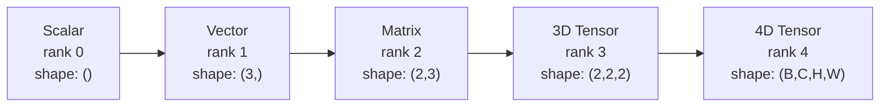
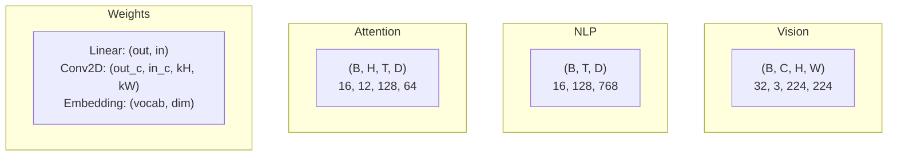
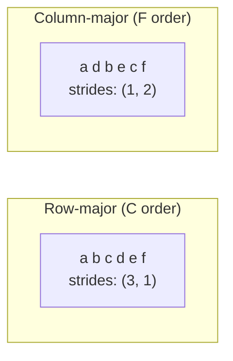
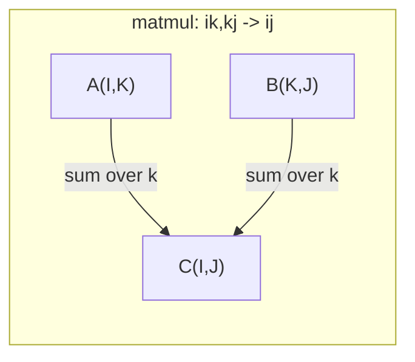

# Tensör İşlemleri

> Tensorlar veriler ve derin öğrenme arasındaki ortak dil. Her görüntü, her cümle, her gradient onların içinden akıyor.

**Type:** Build
**Language:**Python
**Prerequisites:** Phase 1, Lessons 01 (Linear Algebra Intuition), 02 (Vectors, Matrices & Operations)
**Time:** ~90 minutes

## Öğrenme Hedefleri

- Şekil, adım, yeniden şekil, transpose ve element-hikmetli işlemlerle sıfırdan bir tensor sınıfı uygulayın
- Veri kopyasını yapmadan farklı şekillerdeki tenzorlarda çalışmak için yayın kurallarını uygula
- Düğüm ürünleri, matris çarpmaları, dış ürünler ve seri işlemler için birim ifadeleri yazın
- Çok başlı dikkatin her adımı boyunca tam tenzor şekilleri izleyin

## Sorun

Bir transformatör inşa edersin, ön geçit temiz görünüyor, çalıştırırsın ve elde edersin:`RuntimeError: mat1 and mat2 shapes cannot be multiplied (32x768 and 512x768)`Şekillerine bakıp transpose deneyin.`Expected 4D input (got 3D input)`Bir sıçrama eklersen başka bir şey kırılır.

Şekil hataları derin öğrenme kodunda en yaygın hatalardır. Konseptik olarak zor değiller - her işlemin bir şekil kontratı vardır - ama hızlı bir şekilde çoğalabilirler. Bir transformatörün düzinelerce şekil değiştirmesi, transposasyonu ve yayınları bir arada zincirlenmesi vardır. Bir yanlış eksik ve hata kaskasları. Daha da kötüsü, bazı şekil hataları hatalar atmaz. Onlar sessizce çöp üretirler yanlış boyutta yayınlarken veya yanlış ekseni toplayarak.

Matrisler iki şey kümesi arasındaki çiftlik ilişkileri ele alıyor. Gerçek veriler iki boyutta uyum sağlamaz. 32 RGB görüntülerinin bir parti 224x224'te 4D tenzorudur:`(32, 3, 224, 224)`12 başlı kendine dikkat 4 boyutlu bir şey .`(batch, heads, seq_len, head_dim)`Bu yapı, tensördür. İşlemlerini yönetmek ve şekil hataları önemsiz bir şekilde hata çözülebilir hale gelir.

## Anlaşım

### Tensör nedir?

Tensör, bir eşit veri tipi olan çok boyutlu bir sayı dizisidir.**rank**(veya **order**) Her boyut bir **axis**- Ne ?**shape**her eksesi boyunca boyutları listeden bir tuple.



Toplam elementler = tüm boyutların ürünü.`(2, 3, 4)`Tutulur .`2 * 3 * 4 = 24`unsurlar.

### Derin öğrenme için tensor şekilleri

Farklı veri türleri, konvansiyonla belirli tenzor şekillerine haritası yapmaktadır.



PyTorch, NCHW (kanallar ilk) kullanır. TensorFlow, NHWC (kanallar son) için varsayılan özelliklere sahiptir.

### Hatırlama düzenlemesi nasıl çalışır

Hatıradaki 2 boyutlu bir dizil, 1 boyutlu bir bayt dizisidir. **Strides**Her eksesi boyunca bir adım atmak için kaç element atlamayı söyleyebilirim.



Transpose verileri hareket ettirmez.**non-contiguous**-- bir satırdaki elementler artık hafızada bitişik değil.

### Yayınlama kuralları

Yayınlama, verileri kopyalamadan farklı şekillerdeki tensörleri çalıştırmanıza olanak tanır. Sağdan şekillerin uyumlu olması. İki boyut eşit olduğunda veya bir tane 1.

```
Tensor A:     (8, 1, 6, 1)
Tensor B:        (7, 1, 5)
Padded B:     (1, 7, 1, 5)
Result:       (8, 7, 6, 5)
```

### Einsum: evrensel tenzor işlevi

Einstein toplamı her ekseni bir harf ile etiketler. Girişdeki ekseler toplamlanır ama çıkış değil. Her iki eksede de saklanır.



Anahtar örnekler: `i,i->`(dot ürün), `i,j->ij`(dış ürün), `ii->`(izleri), `ij->ji`(Transpose), `bij,bjk->bik`(batch matmul), `bhtd,bhsd->bhts`(Dikkat puanları).

```figure
tensor-broadcast
```

## Yapın

Kod içinde yaşıyor .`code/tensors.py`Her adım, orada uygulanmaya işaret eder.

### Adım 1: Tensiyon depolama ve adımlar

Bir tensör, sayıların düz listesini ve şekil metadatalarını saklar.

```python
class Tensor:
    def __init__(self, data, shape=None):
        if isinstance(data, (list, tuple)):
            self._data, self._shape = self._flatten_nested(data)
        elif isinstance(data, np.ndarray):
            self._data = data.flatten().tolist()
            self._shape = tuple(data.shape)
        else:
            self._data = [data]
            self._shape = ()

        if shape is not None:
            total = reduce(lambda a, b: a * b, shape, 1)
            if total != len(self._data):
                raise ValueError(
                    f"Cannot reshape {len(self._data)} elements into shape {shape}"
                )
            self._shape = tuple(shape)

        self._strides = self._compute_strides(self._shape)

    @staticmethod
    def _compute_strides(shape):
        if len(shape) == 0:
            return ()
        strides = [1] * len(shape)
        for i in range(len(shape) - 2, -1, -1):
            strides[i] = strides[i + 1] * shape[i + 1]
        return tuple(strides)
```

Şekil için`(3, 4)`, adımlar `(4, 1)`-- bir satır ileriye 4 element atlamak, bir sütun ileriye 1 element atlamak.

### Adım 2: Yeniden şekillendirin, sıkın, sıkın

Modelleştirme, element sırasını değiştirmeden şeklini değiştirir.`-1`Bir boyut için boyutunu çıkarmak için.

```python
t = Tensor(list(range(12)), shape=(2, 6))
r = t.reshape((3, 4))
r = t.reshape((-1, 3))
```

Squeeze, 1. boyuttaki ekseni çıkarır. Uncpress bir ekler.`(D,)`bir partiye eklenir `(B, T, D)`Çekilmemesi gerek .`(1, 1, D)`- Evet .

```python
t = Tensor(list(range(6)), shape=(1, 3, 1, 2))
s = t.squeeze()
v = Tensor([1, 2, 3])
u = v.unsqueeze(0)
```

### Adım 3: Transpose ve permute

Transpose iki ekseni değiştirir, Permute tüm ekseni yeniden düzenler.

```python
mat = Tensor(list(range(6)), shape=(2, 3))
tr = mat.transpose(0, 1)

t4d = Tensor(list(range(24)), shape=(1, 2, 3, 4))
perm = t4d.permute((0, 2, 3, 1))
```

Transpose veya permute sonrasında, tenzor hafızada birbiriyle uzlaşmaz.`view`Düzsel olmayan tenzorlarda başarısız olur -- kullan `reshape`Ya da aramak .`.contiguous()`Önce.

### Adım 4: Elementler açısından işlemler ve azaltmalar

Element-wise ops (ekle, çarp, çıkar) her öğeye bağımsız olarak uygulanır ve şeklini korur.

```python
a = Tensor([[1, 2], [3, 4]])
b = Tensor([[10, 20], [30, 40]])
c = a + b
d = a * 2
s = a.sum(axis=0)
```

CNN'de küresel ortalama birleştirme: `(B, C, H, W).mean(axis=[2, 3])`üretir `(B, C)`. NLP'de sırayla birleştirme ortalaması: `(B, T, D).mean(axis=1)`üretir `(B, D)`- Evet .

### Adım 5: NumPy ile yayınlama

- Evet .`demo_broadcasting_numpy()``tensors.py`- Temel modellerini gösteriyor.

```python
activations = np.random.randn(4, 3)
bias = np.array([0.1, 0.2, 0.3])
result = activations + bias

images = np.random.randn(2, 3, 4, 4)
scale = np.array([0.5, 1.0, 1.5]).reshape(1, 3, 1, 1)
result = images * scale

a = np.array([1, 2, 3]).reshape(-1, 1)
b = np.array([10, 20, 30, 40]).reshape(1, -1)
outer = a * b
```

Yayınlama yoluyla çiftlik mesafe: yeniden şekillendirmek `(M, 2)`- ...`(M, 1, 2)`ve `(N, 2)`- ...`(1, N, 2)`, çıkar, kare, son eksesi boyunca toplam, kare kökü alın. Sonuç: `(M, N)`- Evet .

### Adım 6: Einsum operasyonları

- Evet .`demo_einsum()`ve `demo_einsum_gallery()`fonksiyonlar her ortak örneği geçer.

```python
a = np.array([1.0, 2.0, 3.0])
b = np.array([4.0, 5.0, 6.0])
dot = np.einsum("i,i->", a, b)

A = np.array([[1, 2], [3, 4], [5, 6]], dtype=float)
B = np.array([[7, 8, 9], [10, 11, 12]], dtype=float)
matmul = np.einsum("ik,kj->ij", A, B)

batch_A = np.random.randn(4, 3, 5)
batch_B = np.random.randn(4, 5, 2)
batch_mm = np.einsum("bij,bjk->bik", batch_A, batch_B)
```

Bir kısıtlamanın hesaplama maliyeti tüm indeks boyutlarının (daha fazla ve toplam) ürünüdür.`bij,bjk->bik`B=32, I=128, J=64, K=128:`32 * 128 * 64 * 128 = 33,554,432`kat kat kat kat kat kat kat kat kat kat kat kat kat kat kat kat kat kat kat kat kat kat kat kat kat kat kat kat kat kat kat kat kat kat kat kat kat kat kat kat kat kat kat kat kat kat kat kat kat kat kat kat kat kat kat kat kat kat kat kat kat kat kat kat kat kat kat kat kat kat kat kat kat kat kat kat kat kat kat kat kat kat kat kat kat kat kat kat kat kat kat kat kat kat kat kat kat kat kat kat kat kat kat kat kat kat kat kat kat kat kat kat kat kat kat kat kat kat kat kat kat kat kat kat kat kat kat kat kat kat kat kat kat kat kat kat kat kat kat kat kat kat kat kat kat kat kat kat kat kat kat kat kat kat kat kat kat kat kat kat kat kat kat kat kat kat kat kat kat kat kat kat kat kat kat kat kat kat kat kat kat kat kat kat kat kat kat kat kat kat kat kat kat kat kat kat kat kat kat kat kat kat kat kat kat kat kat kat kat kat kat kat kat kat kat kat kat kat kat kat kat kat kat kat kat kat kat kat kat kat kat kat kat kat kat kat kat kat kat kat kat kat kat kat kat kat kat kat kat kat kat kat kat kat kat kat kat kat kat kat kat kat kat kat kat kat kat kat kat kat kat kat kat kat kat kat kat kat kat kat kat kat kat kat kat kat kat kat kat kat kat kat kat kat kat kat kat kat kat kat kat kat kat kat kat kat kat kat kat kat kat kat kat kat kat kat kat kat kat kat kat kat kat kat kat kat kat kat kat kat kat kat kat kat kat kat kat kat kat kat kat kat kat kat kat kat kat kat kat kat kat kat kat kat kat kat kat kat kat kat kat kat kat kat kat kat kat kat kat kat kat kat kat kat kat kat kat kat kat kat kat kat kat kat kat kat kat kat kat kat kat kat kat kat kat kat kat kat kat kat kat kat kat kat kat kat kat kat kat kat kat kat kat kat kat kat kat kat kat kat kat kat kat kat kat kat kat kat kat kat kat kat kat kat kat kat kat kat kat kat kat kat kat kat kat kat kat kat kat kat kat kat kat kat kat kat kat kat kat kat kat kat kat kat kat kat kat kat kat kat kat kat kat kat kat kat kat kat kat kat kat kat kat kat kat kat kat kat kat kat kat kat kat kat kat kat kat kat kat kat kat kat kat kat kat kat kat kat kat kat

### Adım 7: Eynüm yoluyla dikkat mekanizması

- Evet .`demo_attention_einsum()`Bu işlevi, bir çok başlı dikkat uygulaması ile başlıyor.

```python
B, H, T, D = 2, 4, 8, 16
E = H * D

X = np.random.randn(B, T, E)
W_q = np.random.randn(E, E) * 0.02

Q = np.einsum("bte,ek->btk", X, W_q)
Q = Q.reshape(B, T, H, D).transpose(0, 2, 1, 3)

scores = np.einsum("bhtd,bhsd->bhts", Q, K) / np.sqrt(D)
weights = softmax(scores, axis=-1)
attn_output = np.einsum("bhts,bhsd->bhtd", weights, V)

concat = attn_output.transpose(0, 2, 1, 3).reshape(B, T, E)
output = np.einsum("bte,ek->btk", concat, W_o)
```

Her adım bir tensor işlemidir: projeksiyon (matmul via einsum), baş bölünmesi (reform + transpose), dikkat puanları (batch matmul via einsum), ağırlıklı toplam (batch matmul via einsum), baş birleşimi (transpose + reshape), çıkış projeksiyonu (matmul via einsum).

## Kullan

### Çizik vs NumPy

| Operation | Scratch (Tensor class) | NumPy |
|---|---|---|
| Create | `Tensor([[1,2],[3,4]])` | `np.array([[1,2],[3,4]])` |
| Reshape | `t.reshape((3,4))` | `a.reshape(3,4)` |
| Transpose | `t.transpose(0,1)` | `a.T` or `a.transpose(0,1)` |
| Squeeze | `t.squeeze(0)` | `np.squeeze(a, 0)` |
| Sum | `t.sum(axis=0)` | `a.sum(axis=0)` |
| Einsum | N/A | `np.einsum("ij,jk->ik", a, b)` |

### Çizik vs PyTorch

```python
import torch

t = torch.tensor([[1, 2, 3], [4, 5, 6]], dtype=torch.float32)
t.shape
t.stride()
t.is_contiguous()

t.reshape(3, 2)
t.unsqueeze(0)
t.transpose(0, 1)
t.transpose(0, 1).contiguous()

torch.einsum("ik,kj->ij", A, B)
```

PyTorch, otograd, GPU desteği ve optimize edilmiş BLAS çekirdeklerini ekler. Şekil semantikleri aynıdır.

### Her sinir ağ katmanı bir tensor işlevi olarak

| Operation | Tensor Form | Einsum |
|---|---|---|
| Linear layer | `Y = X @ W.T + b` | `"bd,od->bo"` + bias |
| Attention QKV | `Q = X @ W_q` | `"btd,dh->bth"` |
| Attention scores | `Q @ K.T / sqrt(d)` | `"bhtd,bhsd->bhts"` |
| Attention output | `softmax(scores) @ V` | `"bhts,bhsd->bhtd"` |
| Batch norm | `(X - mu) / sigma * gamma` | element-wise + broadcast |
| Softmax | `exp(x) / sum(exp(x))` | element-wise + reduction |

## Gönder

Bu ders iki tekrar kullanılabilir ipucu verir:

1. **`outputs/prompt-tensor-shapes.md`**-- Tenzor şekli eşleşmezliklerini düzeltmek için sistematik bir istek. Her ortak işlem için karar tabloları (matmul, yayın, kedi, doğrusal, Conv2d, BatchNorm, softmax) ve bir düzeltme arama tablo içerir.

2. **`outputs/prompt-tensor-debugger.md`**-- Bir adım adım defoglama uyarısı şekil hatası sizi engellediğinde herhangi bir AI asistanına yapıştırır.

## Egzersizler

1. **Easy -- Reshape round-trip.**Şekil tensörü alın .`(2, 3, 4)`- Onu yeniden şekillendir .`(6, 4)`Sonra da `(24,)`, sonra geri dön .`(2, 3, 4)`. Verify elementleri sırası, her adımda düz verileri basarak korunur.

2. **Medium -- Implement broadcasting.**`Tensor`sınıfı`broadcast_to(shape)`Bu yöntem, hedef şekline uygun olarak 1 boyut boyutlarını genişletir.`_elementwise_op`İşlemden önce otomatik olarak yayınlanmak için.`(3, 1)`ve `(1, 4)`üretimi`(3, 4)`- Evet .

3. **Hard -- Build einsum from scratch.**Temel bir uygulama yapın `einsum(subscripts, *tensors)`En az: nokta ürünü (`i,i->`), matris çarpımı (`ij,jk->ik`), dış ürün (`i,j->ij`(), ve transpose (`ij->ji`) Alt yazılı dizileri analiz edin, sözleşmiş indeksleri belirleyin ve tüm indeks kombinasyonlarını inceleyin.`np.einsum`- Evet .

4. **Hard -- Attention shape tracker.**Alıcı bir fonksiyon yaz `batch_size`- Evet .`seq_len`- Evet .`embed_dim`ve`num_heads`Giriş, Q/K/V projesi, baş bölümü, dikkat puanları, softmax ağırlıkları, ağırlıklı toplam, baş birleşimi, çıkış projesi.`demo_attention_einsum()`çıkış.

## Anahtar Terimler

| Term | What people say | What it actually means |
|---|---|---|
| Tensor | "A matrix but more dimensions" | A multi-dimensional array with uniform type and defined shape, strides, and operations |
| Rank | "The number of dimensions" | The number of axes. A matrix has rank 2, not rank equal to its matrix rank |
| Shape | "The size of the tensor" | A tuple listing the size along each axis. `(2, 3)` means 2 rows, 3 columns |
| Stride | "How memory is laid out" | The number of elements to skip to advance one position along each axis |
| Broadcasting | "It just works when shapes differ" | A strict set of rules: align from right, dimensions must be equal or one must be 1 |
| Contiguous | "The tensor is normal" | Elements stored sequentially in memory with no gaps or reordering from the logical layout |
| Einsum | "A fancy way to write matmul" | A general notation that expresses any tensor contraction, outer product, trace, or transpose in one line |
| View | "Same as reshape" | A tensor sharing the same memory buffer but with different shape/stride metadata. Fails on non-contiguous data |
| Contraction | "Summing over an index" | The general operation where a shared index between tensors is multiplied and summed, producing a lower-rank result |
| NCHW / NHWC | "PyTorch vs TensorFlow format" | Memory layout conventions for image tensors. NCHW puts channels before spatial dims, NHWC puts them after |

## Daha Fazla Okumak

- [NumPy Broadcasting](https://numpy.org/doc/stable/user/basics.broadcasting.html)-- Görsel örneklerle birlikte Kanonik Kurallar
- [PyTorch Tensor Views](https://pytorch.org/docs/stable/tensor_view.html)- Görüşler ne zaman çalışır ve ne zaman kopyalar
- [einops](https://github.com/arogozhnikov/einops)- Tenzor yeniden şekillendirmeyi okuyabilir ve güvenli hale getiren bir kitaplık
- [The Illustrated Transformer](https://jalammar.github.io/illustrated-transformer/)- Dikkatin içinden akıp giden tenzor şekilleri görselleştirir
- [Einstein Summation in NumPy](https://numpy.org/doc/stable/reference/generated/numpy.einsum.html)-- Örneklerle birlikte tam bir toplam belgesini
