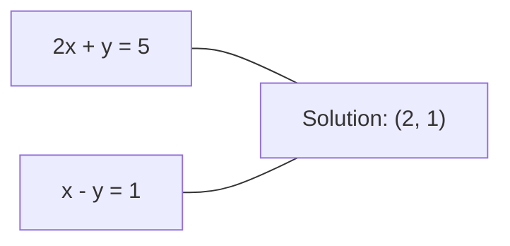
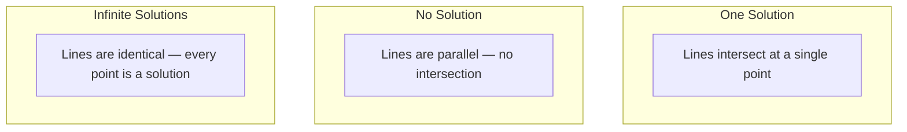

# Düzsel Sistemler

> Ax = b çözmek, matematikte hala sinir ağınızı çalıştıran en eski sorundur.

**Type:** Build
**Language:**Python
**Prerequisites:** Phase 1, Lessons 01 (Linear Algebra Intuition), 02 (Vectors & Matrices), 03 (Matrix Transformations)
**Time:** ~120 minutes

## Öğrenme Hedefleri

- Ax = b'yi kısmi dönüş ve geri dönüş ile ortadan kaldırarak çöz
- LU, QR ve Cholesky parçalanmaları ile faktör matrisleri ve her biri ne zaman uygun olduğunu açıklayın
- En az kare için normal denklemleri çıkarın ve onları doğrusal ve kıyıs geri dönüşüne bağlayın
- Durum numarasını kullanarak kötü koşullu sistemleri teşhis edin ve onları istikrarlandırmak için düzenleme uygulayın

## Sorun

Her zaman bir çizgi gerilemeyi eğitirseniz, bir çizgi sistemi çözersiniz. En az kare uygunluğu hesapladığınızda, bir çizgi sistemi çözersiniz.`y = Wx + b`Bu, bir çizgi sistemin bir tarafını değerlendirmek. düzenleme eklediğinizde, sistemini değiştirirsiniz. Gaussian süreçlerini kullandığınızda, bir matrisi katkı yaparsınız.

A, bilinen katılımcıların bir matrisidir. b, bilinen çıkışların bir vektörüdür. x, bulmak istediğiniz bilinmeyenlerin vektörüdür. Düzsel gerileme esnasında, A, veriler matrisiniz, b hedef vektörünüz, ve x ağırlık vektörünüzdür. Tüm model: Ax'ın mümkün olduğunca b'ye yakın olması için x bul.

Bu ders, bu denklemin sıfırdan çözülmesinin tüm önemli yöntemlerini oluşturur. Bazı yöntemlerin neden hızlı, diğerlerinin neden istikrarlı olduğunu, neden bazılarının sadece kare sistemler için çalışmasının ve diğerlerinin aşırı belirlenmiş sistemleri yönetmesinin neden olduğunu ve neden cevaplarınızın herhangi bir anlamı olup olmadığını matrisinizin koşul sayısı belirler.

## Anlaşım

### Ax = b'nin geometrik anlamı

Bir doğrusal denklem sistemi bir jeometrik yorumuna sahiptir. Her denklem bir hiper düzlem tanımlar. Çözüm tüm hiper düzlemlerin kesiştiği nokta (veya nokta kümesi) dır.

```
2x + y = 5          Two lines in 2D.
x - y  = 1          They intersect at x=2, y=1.
```



Üç şey olabilir:



Matrix biçiminde "bir çözüm" A'nın dönüştürülebilir olduğunu gösterir. "Hiçbir çözüm" sistemin tutarlı olmadığı anlamına gelir. "Sınırsız çözümler" A'nın sıfır boşluğuna sahip olduğunu gösterir. ML sorunlarının çoğu "haklı çözüm" kategorisine girer çünkü bilinmeyenlerden (parametrlerden) daha fazla denklem ( veri noktası) vardır. En az kare bu noktada gelir.

### Sütun resmi vs. satır resmi

Ax = b'yi okumak için iki yol vardır.

**Row picture.**A'nın her satırı bir denklem tanımlar. Her denklem bir hiper düzlemdir.

**Column picture.**A'nın her sütunu bir vektördür. soru şu olur: A'nın sütunlarının hangi doğrusal kombinasyonu b'yi üretir?

```
A = | 2  1 |    b = | 5 |
    | 1 -1 |        | 1 |

Row picture: solve 2x + y = 5 and x - y = 1 simultaneously.

Column picture: find x1, x2 such that:
  x1 * [2, 1] + x2 * [1, -1] = [5, 1]
  2 * [2, 1] + 1 * [1, -1] = [4+1, 2-1] = [5, 1]   check.
```

Sütun resmi daha temeldir. Eğer b A'nın sütun alanında yer alırsa, sistemde bir çözüm vardır. Eğer b'nin olmadığı durumlarda, sütun alanında en yakın noktayı bulursunuz.

### Gaussian ortadan kaldırılması

Gaussian eliminasyonu, Ax = b'yi üst üçgenli bir sisteme dönüştürür.

Algoritm:

```
1. For each column k (the pivot column):
   a. Find the largest entry in column k at or below row k (partial pivoting).
   b. Swap that row with row k.
   c. For each row i below k:
      - Compute multiplier m = A[i][k] / A[k][k]
      - Subtract m times row k from row i.
2. Back substitute: solve from the last equation upward.
```

Örnek:

```
Original:
| 2  1  1 | 8 |       R2 = R2 - (2)R1     | 2  1   1 |  8 |
| 4  3  3 |20 |  -->  R3 = R3 - (1)R1 --> | 0  1   1 |  4 |
| 2  3  1 |12 |                            | 0  2   0 |  4 |

                       R3 = R3 - (2)R2     | 2  1   1 |  8 |
                                       --> | 0  1   1 |  4 |
                                           | 0  0  -2 | -4 |

Back substitute:
  -2 * x3 = -4    -->  x3 = 2
  x2 + 2  = 4     -->  x2 = 2
  2*x1 + 2 + 2 = 8 --> x1 = 2
```

Gaussian eliminasyonu işlemlerin O ((n^3) maliyetini artırır. 1000x1000 sistem için bu yaklaşık bir milyar yüzen nokta işlemidir.

### Bölümsel dönüşüm: neden önemli

Eğer bir pivot elementi sıfırsa, sıfırla bölünürsünüz. Küçükse, yuvarlama hatalarını artırırsınız.

```
Bad pivot:                       With partial pivoting:
| 0.001  1 | 1.001 |            Swap rows first:
| 1      1 | 2     |            | 1      1 | 2     |
                                 | 0.001  1 | 1.001 |
m = 1/0.001 = 1000              m = 0.001/1 = 0.001
R2 = R2 - 1000*R1               R2 = R2 - 0.001*R1
| 0.001  1     | 1.001   |      | 1      1     | 2     |
| 0     -999   | -999.0  |      | 0      0.999 | 0.999 |

x2 = 1.000 (correct)            x2 = 1.000 (correct)
x1 = (1.001 - 1)/0.001          x1 = (2 - 1)/1 = 1.000 (correct)
   = 0.001/0.001 = 1.000        Stable because the multiplier is small.
```

Sınırlı hassasiyetle yüzen nokta aritmetikinde, çekilmemiş versiyon önemli rakamları kaybedebilir.

### LU parçalanması

LU parçalanma faktörleri A'yı aşağı üçgenli matris L'ye ve üst üçgenli matris U'ya ayırır: A = LU. L matrisinde Gaussian ortadan kaldırma çarpıları saklanır. U matrisinde ortadan kaldırma sonucu bulunur.

```
A = L @ U

| 2  1  1 |   | 1  0  0 |   | 2  1   1 |
| 4  3  3 | = | 2  1  0 | @ | 0  1   1 |
| 2  3  1 |   | 1  2  1 |   | 0  0  -2 |
```

Neden sadece ortadan kaldırmak yerine faktör? Çünkü bir L ve U'nun bulunduğu zaman, yeni bir b için Ax = b çözmek sadece O ((n ^ 2):

```
Ax = b
LUx = b
Let y = Ux:
  Ly = b    (forward substitution, O(n^2))
  Ux = y    (back substitution, O(n^2))
```

O  n^3) maliyeti faktörleşme sırasında bir kez ödenir. Her sonraki çözüm O  n^2). Aynı A'yla ama farklı b vektörleri ile 1000 sistemi çözmek zorunda kalırsanız, LU toplam çalışmanın 1000/3'ünü korur.

Bölümsel dönüşümle, PA = LU elde edersiniz. Burada P, satır değişimlerini kaydeden bir değişim matrisi.

### QR parçalanması

QR parçalanma faktörleri A'yı ortogonal bir matris Q ve üst üçgenli bir matris R: A = QR'ye dönüştürür.

Ortogonal bir matrisin Q^T Q = I özelliği vardır. Sütunları ortonomal vektörlerdir.

```
A = Q @ R

Q has orthonormal columns: Q^T Q = I
R is upper triangular

To solve Ax = b:
  QRx = b
  Rx = Q^T b    (just multiply by Q^T, no inversion needed)
  Back substitute to get x.
```

QR, en az kare problemlerini çözmek için LU'dan sayıca daha istikrarlıdır.

```
Given columns a1, a2, ... of A:

q1 = a1 / ||a1||

q2 = a2 - (a2 . q1) * q1        (subtract projection onto q1)
q2 = q2 / ||q2||                (normalize)

q3 = a3 - (a3 . q1) * q1 - (a3 . q2) * q2
q3 = q3 / ||q3||

R[i][j] = qi . aj    for i <= j
```

Her adım, tüm önceki q vektörleri boyunca bileşenini çıkarır ve sadece yeni ortogonal yönü bırakır.

### Cholesky parçalanması

A simetrik (A = A^T) ve pozitif kesin (tüm öz değerleri pozitif) olduğunda, L'nin aşağı üçgenli olduğu A = L^T olarak faktor edebilirsiniz.

```
A = L @ L^T

| 4  2 |   | 2  0 |   | 2  1 |
| 2  5 | = | 1  2 | @ | 0  2 |

L[i][i] = sqrt(A[i][i] - sum(L[i][k]^2 for k < i))
L[i][j] = (A[i][j] - sum(L[i][k]*L[j][k] for k < j)) / L[j][j]    for i > j
```

Cholesky, LU'dan iki kat daha hızlı ve depolama alanının yarısını gerektirir.

- Kovariansa matrisleri simetrik pozitif yarı belirlenmiş (regularizasyonla pozitif belirlenmiş)lerdir.
- Gaussian süreçlerinde çekirdek matrisi simetrik pozitif kesin.
- En az bir konveks fonksiyonun Hessian'ı simetrik pozitif kesin.
- A^T A her zaman simetrik pozitif yarı belirlenmişdir.

Gaussian süreçlerinde çekirdek matrisini K ile Cholesky'yi faktorlaştırır, sonra da K alfa = y'yi çözüp öngörücü ortalamayı elde edersiniz. Cholesky faktörü ayrıca sınırlı olasılık için log-determinant verir: log det(K) = 2 * toplam(log(diag(L))).

### En az kare: Ax = b'nin tam çözümü olmadığı zaman

A m x n ise m > n (bilinmeyenlerden daha fazla denklem) ise sistem aşırı belirlenmiş olur. Tam bir çözüm yoktur. Bunun yerine, karelerindeki hatayı en aza indirersiniz:

```
minimize ||Ax - b||^2

This is the sum of squared residuals:
  sum((A[i,:] @ x - b[i])^2 for i in range(m))
```

Minimizeci normal denklemleri tatmin eder:

```
A^T A x = A^T b
```

Delivran: genişle Ax - b b b b b b b b b ^ 2 = (Ax - b) ^ T (Ax - b) = x^T A^T A x - 2 x^T A^T b + b^T b.

```
Original system (overdetermined, 4 equations, 2 unknowns):
| 1  1 |         | 3 |
| 1  2 | x     = | 5 |       No exact x satisfies all 4 equations.
| 1  3 |         | 6 |
| 1  4 |         | 8 |

Normal equations:
A^T A = | 4  10 |    A^T b = | 22 |
        | 10 30 |            | 63 |

Solve: x = [1.5, 1.7]

This is linear regression. x[0] is the intercept, x[1] is the slope.
```

### Normal denklemler = doğrusal gerileme

Bağlantı tamdır. Düzsel gerileme sırasında, veriler matrisiniz X'de örnek başına bir satır ve bir sütun bulunur. Hedef vektörünüz y'de örnek başına bir giriş bulunur.

```
X^T X w = X^T y
w = (X^T X)^(-1) X^T y
```

Bu, doğrusal gerileme için kapalı biçimle yapılan çözüm.`sklearn.linear_model.LinearRegression.fit()`Bu işlemleri (veya QR veya SVD üzerinden eşdeğer bir işlem) hesaplar.

Matris'e düzenleme terimi lambda * I ekleyin ve bir kıyıs geri dönüşü elde edin:

```
(X^T X + lambda * I) w = X^T y
w = (X^T X + lambda * I)^(-1) X^T y
```

Regulize, matrisi daha iyi koşullandırır (tam tersine doğru dönüştürülmesini kolaylaştırır) ve ağırlıkları sıfıra doğru küçültmekle aşırı uyumlu olmaktan kaçınır.

### Pseudoinverse (Moore-Penrose)

Pseudoinverse A+, metrik inversiyonunu kareler olmayan ve tekerlekli metriklere genelleştirir.

```
x = A+ b

where A+ = V Sigma+ U^T    (computed via SVD)
```

Sigma +, her sıfır dışı tek değerin karşılıklılığını alıp sonucu aktararak oluşur.

```
A = U Sigma V^T        (SVD)

Sigma = | 5  0 |       Sigma+ = | 1/5  0  0 |
        | 0  2 |                | 0  1/2  0 |
        | 0  0 |

A+ = V Sigma+ U^T
```

Pseudoinverse, minimum norm en az kare çözümü verir.
- Bir çözüm: A + b verir.
- Çözüm yok: A + b en az kare çözümü verir.
- Sonsuz çözümler: A + b en küçük bir değerli değerli değer verir.

NumPy'nin `np.linalg.lstsq`ve `np.linalg.pinv`İkisi de SVD'yi içten kullanıyor.

### Şart numarası

Şart numarası, çözümün girişdeki küçük değişikliklere ne kadar duyarlı olduğunu ölçer.

```
kappa(A) = ||A|| * ||A^(-1)|| = sigma_max / sigma_min
```

sigma_max ve sigma_min en büyük ve en küçük tek değerler olduğu yerlerde.

```
Well-conditioned (kappa ~ 1):        Ill-conditioned (kappa ~ 10^15):
Small change in b -->                Small change in b -->
small change in x                    huge change in x

| 2  0 |   kappa = 2/1 = 2          | 1   1          |   kappa ~ 10^15
| 0  1 |   safe to solve            | 1   1+10^(-15) |   solution is garbage
```

Basamak kuralları:
- kappa < 100: güvenli, çözünürlük doğru.
- Kappa ~ 10^k: kaybedersiniz yaklaşık k kesim kesimsel noktayı aritmetik.
- kappa ~ 10^16 (float64): çözünürlük anlamsızdır.

ML'de kötü koşullama özellikler neredeyse üst çizgilerde olduğunda gerçekleşir. Düzenlendirme (lambda * I eklemek) durum sayısını sigma_max / sigma_min'den (sigma_max + lambda) / (sigma_min + lambda) 'ye iyileştirir.

### İteratif yöntemler: konjugat gradiyenti

Çok büyük nadir sistemler (bilinmeyen milyonlarca) için, LU veya Cholesky gibi doğrudan yöntemler çok pahalıdır.

Konjugate gradient (CG), A simetrik pozitif kesin olduğunda Ax = b'yi çözür. En fazla n iterasyonda (tam aritmetikte) kesin çözümü bulur, ancak A'nın öz değerleri gruplandırıldığında tipik olarak çok daha hızlı bir şekilde birleşti.

```
Algorithm sketch:
  x0 = initial guess (often zero)
  r0 = b - A x0           (residual)
  p0 = r0                 (search direction)

  For k = 0, 1, 2, ...:
    alpha = (rk . rk) / (pk . A pk)
    x_{k+1} = xk + alpha * pk
    r_{k+1} = rk - alpha * A pk
    beta = (r_{k+1} . r_{k+1}) / (rk . rk)
    p_{k+1} = r_{k+1} + beta * pk
    if ||r_{k+1}|| < tolerance: stop
```

CG:
- Büyük ölçekli optimizasyon (Newton-CG yöntemi)
- PDE diskretleştirmelerini çözmek
- Kernel matrisi faktör için çok büyük olduğu çekirdek yöntemleri
- Diğer iteratif çözücüler için ön koşullama

Daha iyi koşullanmış sistemler daha hızlı bir şekilde bir araya gelir, bu da düzenlenmenin yardımcı olmasının bir başka nedeni.

### Tam tablo: hangi yöntem

| Method | Requirements | Cost | Use case |
|--------|-------------|------|----------|
| Gaussian elimination | Square, nonsingular A | O(n^3) | One-off solve of a square system |
| LU decomposition | Square, nonsingular A | O(n^3) factor + O(n^2) solve | Multiple solves with the same A |
| QR decomposition | Any A (m >= n) | O(mn^2) | Least squares, numerically stable |
| Cholesky | Symmetric positive definite A | O(n^3/3) | Covariance matrices, Gaussian processes, ridge regression |
| Normal equations | Overdetermined (m > n) | O(mn^2 + n^3) | Linear regression (small n) |
| SVD / pseudoinverse | Any A | O(mn^2) | Rank-deficient systems, minimum-norm solutions |
| Conjugate gradient | Symmetric positive definite, sparse A | O(n * k * nnz) | Large sparse systems, k = iterations |

### ML ile bağlantı

Bu dersdeki her yöntem üretim ML'de yer almaktadır:

**Linear regression.**Kapalı biçimli çözüm normal denklemleri X^T X w = X^T y çözür. Bu, Cholesky (n küçükse) veya QR (sayısal istikrar önemlise) veya SVD (matris sıra eksik olabilirse) yoluyla yapılır.

**Ridge regression.**Lambda * I'yi X^T X'ye ekler. Düzenlenmiş sistem (X^T X + lambda * I) w = X^T y her zaman Cholesky aracılığıyla çözülebilir çünkü X^T X + lambda * I lambda için simetrik pozitif kesin.

**Gaussian processes.**Önceden belirlenen ortalama, K'nin çekirdek matrisi olduğu K alfa = y çözülmesini gerektirir. K'nin Cholesky faktörleşmesi standart yaklaşımdır.

**Neural network initialization.**Ortogonal başlangıç, derin ağlarda sinyal çökmesini önlerken sütunları ortonomik olan ağırlık matrislerini oluşturmak için QR parçalanmasını kullanır.

**Preconditioning.**Büyük ölçekli optimizörler, eşleşik gradient çözücüler için önceden koşullar olarak eksik Cholesky veya eksik LU kullanır.

**Feature engineering.**X^T X'in koşul numarası, özelliklerin üst çizgisi olup olmadığını söyler.

```figure
linear-system-conditioning
```

## Yapın

### Adım 1: kısmi dönümle Gaussian ortadan kaldırılması

```python
import numpy as np

def gaussian_elimination(A, b):
    n = len(b)
    Ab = np.hstack([A.astype(float), b.reshape(-1, 1).astype(float)])

    for k in range(n):
        max_row = k + np.argmax(np.abs(Ab[k:, k]))
        Ab[[k, max_row]] = Ab[[max_row, k]]

        if abs(Ab[k, k]) < 1e-12:
            raise ValueError(f"Matrix is singular or nearly singular at pivot {k}")

        for i in range(k + 1, n):
            m = Ab[i, k] / Ab[k, k]
            Ab[i, k:] -= m * Ab[k, k:]

    x = np.zeros(n)
    for i in range(n - 1, -1, -1):
        x[i] = (Ab[i, -1] - Ab[i, i+1:n] @ x[i+1:n]) / Ab[i, i]

    return x
```

### Adım 2: LU parçalanması

```python
def lu_decompose(A):
    n = A.shape[0]
    L = np.eye(n)
    U = A.astype(float).copy()
    P = np.eye(n)

    for k in range(n):
        max_row = k + np.argmax(np.abs(U[k:, k]))
        if max_row != k:
            U[[k, max_row]] = U[[max_row, k]]
            P[[k, max_row]] = P[[max_row, k]]
            if k > 0:
                L[[k, max_row], :k] = L[[max_row, k], :k]

        for i in range(k + 1, n):
            L[i, k] = U[i, k] / U[k, k]
            U[i, k:] -= L[i, k] * U[k, k:]

    return P, L, U

def lu_solve(P, L, U, b):
    n = len(b)
    Pb = P @ b.astype(float)

    y = np.zeros(n)
    for i in range(n):
        y[i] = Pb[i] - L[i, :i] @ y[:i]

    x = np.zeros(n)
    for i in range(n - 1, -1, -1):
        x[i] = (y[i] - U[i, i+1:] @ x[i+1:]) / U[i, i]

    return x
```

### Adım 3: Cholesky parçalanması

```python
def cholesky(A):
    n = A.shape[0]
    L = np.zeros_like(A, dtype=float)

    for i in range(n):
        for j in range(i + 1):
            s = A[i, j] - L[i, :j] @ L[j, :j]
            if i == j:
                if s <= 0:
                    raise ValueError("Matrix is not positive definite")
                L[i, j] = np.sqrt(s)
            else:
                L[i, j] = s / L[j, j]

    return L
```

### Adım 4: Normal denklemler üzerinden en az kare

```python
def least_squares_normal(A, b):
    AtA = A.T @ A
    Atb = A.T @ b
    return gaussian_elimination(AtA, Atb)

def ridge_regression(A, b, lam):
    n = A.shape[1]
    AtA = A.T @ A + lam * np.eye(n)
    Atb = A.T @ b
    L = cholesky(AtA)
    y = np.zeros(n)
    for i in range(n):
        y[i] = (Atb[i] - L[i, :i] @ y[:i]) / L[i, i]
    x = np.zeros(n)
    for i in range(n - 1, -1, -1):
        x[i] = (y[i] - L.T[i, i+1:] @ x[i+1:]) / L.T[i, i]
    return x
```

### Adım 5: Şart numarası

```python
def condition_number(A):
    U, S, Vt = np.linalg.svd(A)
    return S[0] / S[-1]
```

## Kullan

Gerçek veriler üzerinde çizgisi geri dönüş ve kıyıs geri dönüş için parçaları bir araya getirmek:

```python
np.random.seed(42)
X_raw = np.random.randn(100, 3)
w_true = np.array([2.0, -1.0, 0.5])
y = X_raw @ w_true + np.random.randn(100) * 0.1

X = np.column_stack([np.ones(100), X_raw])

w_ols = least_squares_normal(X, y)
print(f"OLS weights (ours):    {w_ols}")

w_np = np.linalg.lstsq(X, y, rcond=None)[0]
print(f"OLS weights (numpy):   {w_np}")
print(f"Max difference: {np.max(np.abs(w_ols - w_np)):.2e}")

w_ridge = ridge_regression(X, y, lam=1.0)
print(f"Ridge weights (ours):  {w_ridge}")

from sklearn.linear_model import Ridge
ridge_sk = Ridge(alpha=1.0, fit_intercept=False)
ridge_sk.fit(X, y)
print(f"Ridge weights (sklearn): {ridge_sk.coef_}")
```

## Gönder

Bu ders şunları ortaya çıkarır:
- `code/linear_systems.py`Gaussian ortadan kaldırma, LU parçalanma, Cholesky parçalanma, en az kare ve kıyıs geri dönüşü baştan başlayan uygulamalar içerir.
- Normal denklemlerin ve sklearn'ın Hattı Gerileme'nin aynı ağırlıkları ürettiğini gösteren bir çalışma göstergesi

## Egzersizler

1. Sistem çözülüyor.`[[1,2,3],[4,5,6],[7,8,10]] x = [6, 15, 27]`Gaussian eliminasyonunuzu, LU çözücüünüzü kullanarak ve`np.linalg.solve`Üçü de aynı cevabı kayarak tolerans içinde verilecek.

2. 50x5 rastgele bir matris X oluşturun ve hedef y = X @ w_true + gürültü.`np.linalg.qr`), SVD (önteminde `np.linalg.svd`), ve `np.linalg.lstsq`Dört çözümü de karşılaştırın. X^T X'in koşul sayısını ölçün ve hangi yönteme güvendiğinizi nasıl etkilediğini açıklayın.

3. İki sütun neredeyse aynı hale getirerek neredeyse tek bir matris oluşturun (örneğin, sütun 2 = sütun 1 + 1e-10 * gürültü). Şart numarası hesaplayın. Ax = b'yi düzenleştirici ve düzensiz çözün (0,01 * I ekleyin). Çözümleri ve kalanları karşılaştırın. düzenlenmenin neden yardımcı olduğunu açıklayın.

4. 100x100 rastgele simetrik pozitif belirlenmiş matris için konjugat gradient algoritmasını uygulayın. 1e-8 toleransına doğru kaç iterasyon gerekiyor. n iterasyonların teorik maksimum ile karşılaştırın.

5. Cholesky çözücü ile LU çözücü ile zaman ayır .`np.linalg.solve`10'ın, 50'nin, 200'nin, 500'ün ölçüsündeki simetrik pozitif belirlenmiş matrisler üzerinde.

## Anahtar Terimler

| Term | What people say | What it actually means |
|------|----------------|----------------------|
| Linear system | "Solve for x" | A set of linear equations Ax = b. Finding x means finding the input that produces output b under transformation A. |
| Gaussian elimination | "Row reduce" | Systematically zero out entries below the diagonal using row operations, producing an upper triangular system solvable by back substitution. O(n^3). |
| Partial pivoting | "Swap rows for stability" | Before eliminating in column k, swap the row with the largest absolute value in that column to the pivot position. Prevents division by small numbers. |
| LU decomposition | "Factor into triangles" | Write A = LU where L is lower triangular (stores multipliers) and U is upper triangular (the eliminated matrix). Amortizes the O(n^3) cost over multiple solves. |
| QR decomposition | "Orthogonal factorization" | Write A = QR where Q has orthonormal columns and R is upper triangular. More stable than LU for least squares. |
| Cholesky decomposition | "Square root of a matrix" | For symmetric positive definite A, write A = LL^T. Half the cost of LU. Used for covariance matrices, kernel matrices, and ridge regression. |
| Least squares | "Best fit when exact is impossible" | Minimize the sum of squared residuals ||Ax - b||^2 when the system is overdetermined (more equations than unknowns). |
| Normal equations | "The calculus shortcut" | A^T A x = A^T b. Setting the gradient of ||Ax - b||^2 to zero. This IS the closed-form solution to linear regression. |
| Pseudoinverse | "Inversion for non-square matrices" | A+ = V Sigma+ U^T via SVD. Gives the minimum-norm least-squares solution for any matrix, square or rectangular, singular or not. |
| Condition number | "How trustworthy is this answer" | kappa = sigma_max / sigma_min. Measures sensitivity to input perturbations. Lose about log10(kappa) digits of precision. |
| Ridge regression | "Regularized least squares" | Solve (X^T X + lambda I) w = X^T y. Adding lambda I improves conditioning and shrinks weights toward zero. Prevents overfitting. |
| Conjugate gradient | "Iterative Ax=b for big matrices" | An iterative solver for symmetric positive definite systems. Converges in at most n steps. Practical for large sparse systems where factorization is too expensive. |
| Overdetermined system | "More data than parameters" | m > n in an m-by-n system. No exact solution exists. Least squares finds the best approximation. This is every regression problem. |
| Back substitution | "Solve from the bottom up" | Given an upper triangular system, solve the last equation first, then substitute backward. O(n^2). |
| Forward substitution | "Solve from the top down" | Given a lower triangular system, solve the first equation first, then substitute forward. O(n^2). Used in the L step of LU solves. |

## Daha Fazla Okumak

- [MIT 18.06: Linear Algebra](https://ocw.mit.edu/courses/18-06-linear-algebra-spring-2010/)(Gilbert Strang) - Düzsel sistemler ve matris faktörleşmeleri konusunda kesin ders.
- [Numerical Linear Algebra](https://people.maths.ox.ac.uk/trefethen/text.html)(Trefethen & Bau) - Sayısal istikrarı, koşullamaları ve algoritmaların neden başarısız olduğunu anlamak için standart referans
- [Matrix Computations](https://www.cs.cornell.edu/cv/GolubVanLoan4/golubandvanloan.htm)(Golub & Van Loan) - her matris algoritması için ansiklopedik referans
- [3Blue1Brown: Inverse Matrices](https://www.3blue1brown.com/lessons/inverse-matrices)-- Ax = b çözmenin geometrik anlamı için görsel algılama
