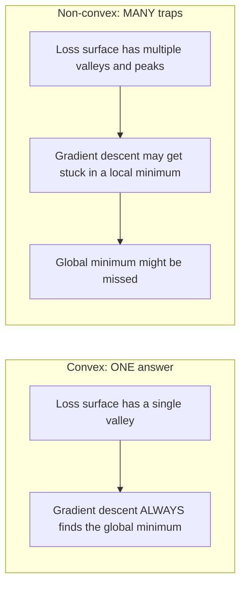
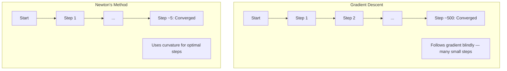
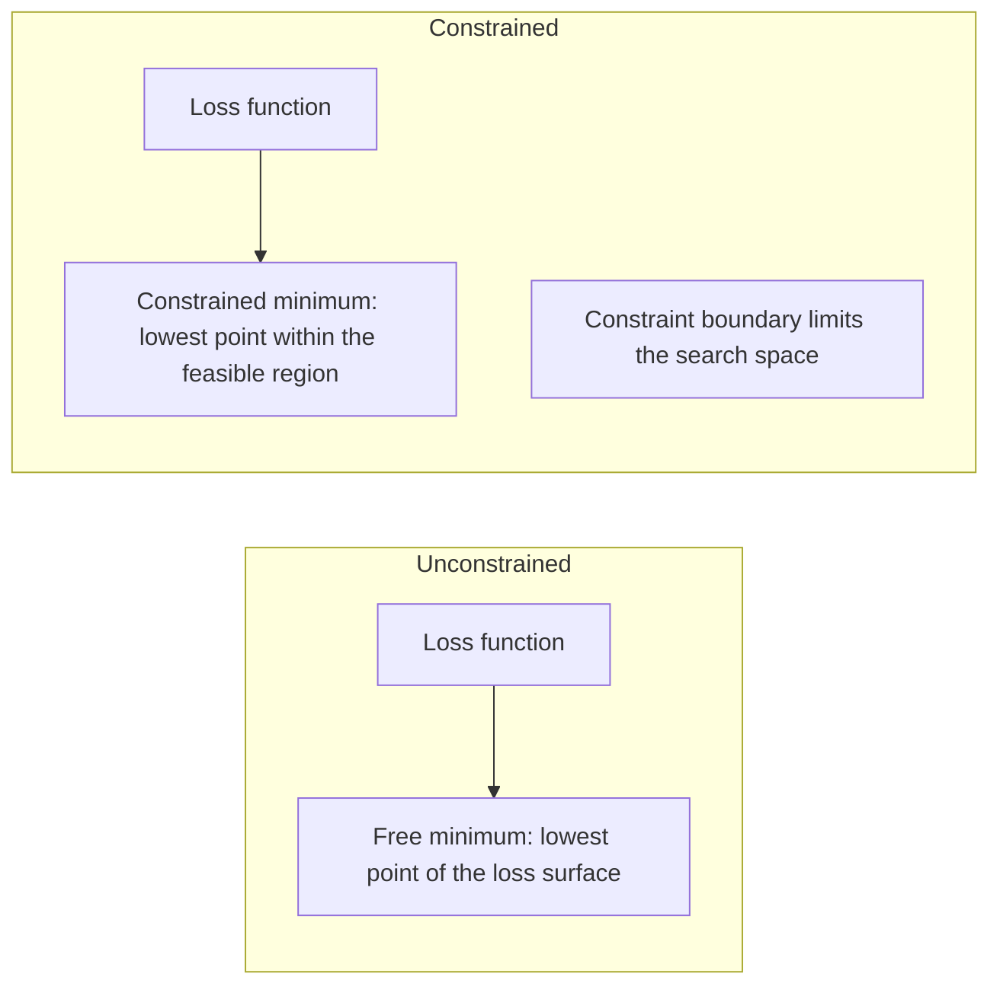
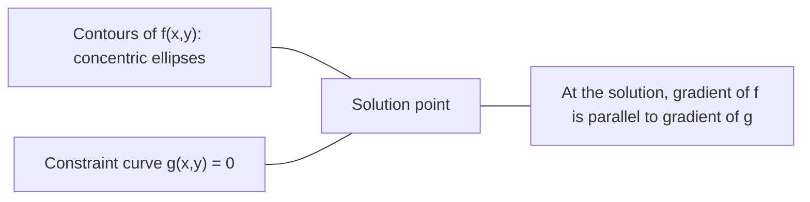

# Konves Optimizasyon

> Konves sorunlarının tek bir vadisi var, sinir ağlarının milyonlarca.

**Type:** Build
**Language:**Python
**Prerequisites:** Phase 1, Lessons 04 (Calculus for ML), 08 (Optimization)
**Time:** ~90 minutes

## Öğrenme Hedefleri

- Bir fonksiyonun tanım, ikinci türe ve Hessian kriterlerini kullanarak eğri olup olmadığını test edin
- Newton'un yöntemini uygulayın ve onun katraz dönüşümünü gradient düşüşü ile karşılaştırın
- Lagrange çarpıcıları kullanarak kısıtlı optimizasyon sorunlarını çözmek ve KKT koşullarını yorumlamak
- Neden sinir ağı kayıpları manzaraları konveks değil, SGD hala iyi çözümler bulduğunu açıkla

## Sorun

Ders 08'de, gradient düşüşü, momentum ve Adam'ı öğrendiniz. Bu optimizörler herhangi bir yüzeyde aşağıya doğru yürürler. Ama hiçbir garanti yok. Konves olmayan bir manzarada gradient düşüşü kötü bir yerel minimumda düşebilir, bir sedil noktasına sıkışabilir veya sonsuza dek sallanabilir. Neural ağlar konvessi olmayan ve başka bir alternatif olmadığı için yine de kullandınız.

Ancak makine öğreniminde birçok sorun eğri. Düzgün gerileme, lojistik gerileme, SVM, LASSO, kıyı gerileme. Bunlar için daha güçlü bir şey var: matematiksel garantilerle optimize. eğri bir sorunun tam olarak bir vadisi vardır. Aşağıya doğru yürüyen herhangi bir algoritma küresel minimum'a ulaşır. Tekrar başlatma gerekmez. Öğrenme oranı programları yoktur. Dua yok.

Konvessiyet'i anlamak üç şey yapar. Birincisi, size sorununuz kolay (konves) ile sert (konvessi olmayan) olduğunda söyler. İkincisi, konves problemleri için Newton'un yöntemi gibi daha hızlı araçlar verir. Üçüncüsü, ML'de ortaya çıkan kavramları açıklar: düzenlenme bir kısıtlama, SVM'lerde çiftelik ve derin öğrenmenin neden her güzel konvessiyetin verilmesine rağmen çalışması.

## Anlaşım

### Konves setleri

Bir S kümesi, S'deki herhangi iki noktaya göre, aralarındaki çizgi bölümü de tamamen S'de bulunursa, konveks olur.

| Convex sets | Not convex |
|---|---|
| **Rectangle**: any two points inside can be connected by a line segment that stays inside | **Star/crescent shape**: a line between two interior points can pass outside the set |
| **Triangle**: same property holds for all interior points | **Donut/annulus**: the hole means some line segments leave the set |
| The line segment between any two points stays within the set | The line segment between some pairs of points exits the set |

Formal test: S'deki herhangi bir x, y ve [0, 1]daki herhangi bir t için, tx + (1-t) y noktası da S'de bulunur.

Konves setlerinin örnekleri:
- Bir çizgi, bir uçak, tüm R^n
- Bir top (daire, küresi, hipersfer)
- A yarı alan: {x: a^T x <= b}
- Herhangi bir sayıda konveks setin kesişimi

Konveks olmayan kümelerin örnekleri:
- Bir çörek (annulus)
- İki bölünmüş çevrenin birleşimi
- "Dent" veya " delik" olan herhangi bir set

### Konves fonksiyonları

Bir fonksiyon f, domeni bir konveks kümesi ise ve domenindeki herhangi iki noktayı x, y ve [0, 1]'deki herhangi bir t için eğri:

```
f(tx + (1-t)y) <= t*f(x) + (1-t)*f(y)
```

Jeometrik olarak: grafikteki herhangi iki nokta arasındaki çizgi bölümü, grafikten yukarıda veya üzerinde bulunur.

| Property | Convex function | Non-convex function |
|---|---|---|
| **Line segment test** | The line between any two points on the graph lies **above or on** the curve | The line between some points on the graph dips **below** the curve |
| **Shape** | Single bowl/valley curving upward | Multiple peaks and valleys with mixed curvature |
| **Local minima** | Every local minimum is the global minimum | Multiple local minima may exist at different heights |

Ortak konveks fonksiyonlar:
- f(x) = x^2 (parabola)
- f(x) = ↓ x (mükemmel değer)
- f(x) = e^x (gelişmiş)
- f(x) = max(0, x) (ReLU, parça şeklinde doğrusal olsa da)
- f(x) = -log(x) için x > 0 (negatif log)
- Herhangi bir doğrusal fonksiyon f ((x) = a^T x + b (hem konveks hem de konkav)

### Çelişkinlik için test

En kolaytan en zorluya kadar üç pratik test.

**Test 1: Second derivative test (1D).**Eğer f'(x) >= 0 tüm x için ise f eğri.

- f''((x) = x^2: f''(x) = 2 >= 0.
- f'(x) = x^3: f'(x) = 6x. X < 0 için negatif.
- f'(x) = e^x: f'(x) = e^x > 0.

**Test 2: Hessian test (multivariate).**Eğer Hessian matrisi H ((x) tüm x için pozitif yarı belirlenmiş ise, f sarıdır. Hessian ikinci kısmi türevlerin matrisidir.

**Test 3: Definition test.**Doğrudan f ((tx + (1-t) y) <= t*f ((x) + (1-t) * f ((y) eşitsizliğini kontrol edin.

### Neden konveksi önemli

Konves optimizasyonunun merkezi teoremi:

**For a convex function, every local minimum is a global minimum.**

Bu da gradient düşüşü tuzağa düşebileceğinden, herhangi bir aşağı yamaç yolu aynı cevaba yol açar.



Sonuçlar:
- - İhtiyacın yok .
- Gelişmiş öğrenme oranı programlarına gerek yok
- Dönüşüm kanıtları mümkündür (süreklilik fonksiyon özelliklerine bağlıdır)
- Çözüm benzersiz (taze bölgelerden)

### ML'de konveks vs konveks olmayan

| Problem | Convex? | Why |
|---------|---------|-----|
| Linear regression (MSE) | Yes | Loss is quadratic in weights |
| Logistic regression | Yes | Log-loss is convex in weights |
| SVM (hinge loss) | Yes | Maximum of linear functions |
| LASSO (L1 regression) | Yes | Sum of convex functions is convex |
| Ridge regression (L2) | Yes | Quadratic + quadratic = convex |
| Neural network (any loss) | No | Nonlinear activations create non-convex landscape |
| k-means clustering | No | Discrete assignment step |
| Matrix factorization | No | Product of unknowns |

Sınırlı kayıplarla çizgi modeller sarıdır.

### Hessian Matrix

Bir fonksiyonun Hessian H'si f: R^n -> R ikinci kısmi türevlerin n x n matrisidir.

```
H[i][j] = d^2 f / (dx_i dx_j)
```

f ((x, y) = x^2 + 3xy + y^2:

```
df/dx = 2x + 3y       d^2f/dx^2 = 2      d^2f/dxdy = 3
df/dy = 3x + 2y       d^2f/dydx = 3      d^2f/dy^2 = 2

H = [ 2  3 ]
    [ 3  2 ]
```

Hessian, eğrilik hakkında şöyle diyor:
- Eigenvalue'ler tüm pozitif: fonksiyon her yönde yukarı eğrilir (o noktada sarı)
- Tüm öz değerleri negatif: her yönde aşağıya eğri (konkaf, yerel maksimum)
- Karışık işaretler: otlak noktası (bazı yönlerde yukarı eğri, diğerlerinde aşağı eğri)
- 0 öz değeri: bu yönde düz (degenerasyon)

Konvesisite için, Hessian sadece bir noktada değil her yerde pozitif yarı belirlenmiş (tüm öz değerleri >= 0) olmalıdır.

### Newton'un yöntemi

Gradyent inme birinci sıra bilgilerini (gradient) kullanır. Newton'un yöntemi ikinci sıra bilgilerini (Hessian) kullanır.

```
Update rule:
  x_new = x - H^(-1) * gradient

Compare to gradient descent:
  x_new = x - lr * gradient
```

Newton'un yöntemi, skalar öğrenme hızını ters Hessian ile değiştirir. Bu otomatik olarak yerel eğriliği temelinde adım boyutunu ve yönünü ayarlar.



Avantajlar:
- En az yakın olan kare dönüşüm (her adımdaki hata kare)
- Düzenleme için öğrenme oranı yok
- Ölçek değişkenliği (problemi nasıl parametrelediğine bakılmaksızın çalışır)

Eksiklikler:
- Hessian hesaplama O  n ^ 2) hafıza ve O  n ^ 3) tersine maliyet
- 1 milyon ağırlıklı bir sinir ağı için, yani 10^12 giriş ve 10^18 işlem
- Derin öğrenme için pratik değil

### Sınırlı optimizasyon

Sınırsız optimizasyon: tüm x üzerinde f ((x) 'yi en aza indir.
Sınırlı optimizasyon: sınırlara tabi f ((x) 'yi en aza indir.

Gerçek sorunların kısıtlamaları vardır. Masrafları en aza indirmek istiyorsunuz ama bütçeniz sınırlıdır. Hataları en aza indirmek istiyorsunuz ama model karmaşıklığınız sınırlıdır.



### Lagrange çarpıcıları

Lagrange çarpıcıları yöntemi, kısıtlı bir sorunu kısıtlı olmayan bir soruna dönüştürür.

Sorun: g(x) = 0 ile f ((x) ı en aza indirmek.

Çözüm: yeni bir değişken (Lagrange çarpıcı lambda) ekle ve kısıtlama olmayan sorunu çöz:

```
L(x, lambda) = f(x) + lambda * g(x)
```

Çözümde L'nin gradiyenti sıfırdır:

```
dL/dx = df/dx + lambda * dg/dx = 0
dL/dlambda = g(x) = 0
```

Geometrik algı: kısıtlı minimumda, f'nin gradiyenti kısıtlama g'nin gradiyenti ile paralel olmalıdır. Eğer paralel değillerse, kısıtlama yüzeyi boyunca hareket edip f'yi daha da azaltabilirsiniz.



Örnek: f ((x,y) = x^2 + y^2'yi x + y = 1'e tabi olarak en aza indir.

```
L = x^2 + y^2 + lambda(x + y - 1)

dL/dx = 2x + lambda = 0  =>  x = -lambda/2
dL/dy = 2y + lambda = 0  =>  y = -lambda/2
dL/dlambda = x + y - 1 = 0

From first two: x = y
Substituting: 2x = 1, so x = y = 0.5, lambda = -1
```

X + y = 1 çizgisindeki en yakın nokta (0,5, 0,5)

### KKT koşulları

Karush-Kuhn-Tucker koşulları Lagrange çarpıcılarını eşitsizlik kısıtlamalarına kadar uzattır.

Sorun: i = 1, ..., m için g_i(x) <= 0 ile sınırlı f ((x) en az azaltmak.

KKT koşulları (optimallık için gerekli):

```
1. Stationarity:    df/dx + sum(lambda_i * dg_i/dx) = 0
2. Primal feasibility:  g_i(x) <= 0  for all i
3. Dual feasibility:    lambda_i >= 0  for all i
4. Complementary slackness:  lambda_i * g_i(x) = 0  for all i
```

Eklemci gevşeklik anahtar bir anlayıştır: ya kısıtlama aktifdir (g_i = 0, çözünürlük sınır üzerinde oturur) veya katılatıcı sıfırdır (sıkıntı önemi yoktur).

KKT koşulları SVM'lerin merkezi konumdadır. Destek vektörleri kısıtlamanın aktif olduğu veri noktalarıdır (lambda > 0). Diğer tüm veri noktalarının lambda = 0'u vardır ve karar sınırını etkilemez.

### Düzenlendirme kısıtlı optimizasyon olarak

L1 ve L2 düzenlenmesi keyfi hileler değil, maskeli kısıtlı optimizasyon problemleri.

**L2 regularization (Ridge):**

```
minimize  Loss(w)  subject to  ||w||^2 <= t

Equivalent unconstrained form:
minimize  Loss(w) + lambda * ||w||^2
```

Bu kısıtlama bir topu tanımlar (dörtlü 2D, küre 3D).

**L1 regularization (LASSO):**

```
minimize  Loss(w)  subject to  ||w||_1 <= t

Equivalent unconstrained form:
minimize  Loss(w) + lambda * ||w||_1
```

Sınırlılık çiçekler bir elmas (dört boyutlu bir dönüm) tanımlar.

| Property | L2 constraint (circle) | L1 constraint (diamond) |
|---|---|---|
| **Constraint shape** | Circle (sphere in higher dims) | Diamond (rotated square in 2D) |
| **Where loss contour touches** | Smooth boundary — any point on the circle | Corner — aligned with an axis |
| **Solution behavior** | Weights are small but nonzero | Some weights are exactly zero (sparse) |
| **Result** | Weight shrinkage | Feature selection |

Bu, L1'nin neden nadir modeller ürettiğini (önümlük seçimi) açıklarken L2'nin sadece ağırlıkları azaltmasının nedenini açıklar. Elmasın ekselerle uyumlu köşeleri vardır. Kayıp konturların bir köşe dokunma olasılığı daha yüksektir, bir veya daha fazla ağırlığı tam olarak sıfıra ayarlar.

### İkiliğe

Her kısıtlı optimizasyon sorunu (birincil) bir eş sorunu (ikili) vardır. Konves problemler için, birincil ve ikili aynı optimal değere sahiptir. Bu güçlü bir ikili.

Lagrangian çift fonksiyonu:

```
Primal: minimize f(x) subject to g(x) <= 0
Lagrangian: L(x, lambda) = f(x) + lambda * g(x)
Dual function: d(lambda) = min_x L(x, lambda)
Dual problem: maximize d(lambda) subject to lambda >= 0
```

İkiliğin neden önemli olduğu:
- İkilem problemini çözmek bazen ilk problemden daha kolay.
- SVM'ler ikili şeklinde çözülür, burada sorun veri noktaları arasındaki nokta ürünlerine bağlıdır (kernel hilesini etkinleştirir)
- Dual, çözünürlük kalitesini kontrol etmek için yararlı olan ilk optimum'un alt sınırını sağlar.

Özellikle SVM için:

```
Primal: find w, b that maximize the margin 2/||w|| subject to
        y_i(w^T x_i + b) >= 1 for all i

Dual:   maximize sum(alpha_i) - 0.5 * sum_ij(alpha_i * alpha_j * y_i * y_j * x_i^T x_j)
        subject to alpha_i >= 0 and sum(alpha_i * y_i) = 0

The dual only involves dot products x_i^T x_j.
Replace x_i^T x_j with K(x_i, x_j) to get the kernel trick.
```

### Derin öğrenmenin neden konveksiyetsiz olmasına rağmen işe yarıyor

Neural ağ kaybı fonksiyonları oldukça konveks değildir. Her klasik ölçümle, onları optimize etmek başarısız olmalıdır.

**Most local minima are good enough.**Yüksek boyutlu alanlarda, rastgele kritik noktalar (gelişme sıfır olduğu yerlerde) yerel minimumlar değil, büyük ölçüde otlak noktalarıdır. Var olan birkaç yerel minimum, küresel minimumın yakınında kayıp değerlerine sahip olma eğilimindedir. Parametre alanının milyonlarca boyutunda olduğu zaman korkunç bir yerel minimumda sıkışmak son derece muhtemel değildir.

**Saddle points, not local minima, are the real obstacle.**N parametre olan bir fonksiyonda, bir sedil noktası pozitif ve negatif eğrilik yönlerinin bir karışımına sahiptir. Yüksek boyutlarda rastgele bir kritik noktada, tüm n öz değerlerinin pozitif olma olasılığı (yerel minimum) yaklaşık 2 ^ - n'dir.

**Overparameterization smooths the landscape.**Eğitim örneklerinden daha fazla parametreye sahip ağlar daha düzgün, daha bağlantılı kayıp yüzeylerine sahiptir. Daha geniş ağlar daha az kötü yerel minimumlara sahiptir. Bu, mantık dışı ancak empiri olarak tutarlıdır.

**Loss landscape structure:**

| Property | Low-dimensional space | High-dimensional space |
|---|---|---|
| **Landscape** | Many isolated peaks and valleys | Smoothly connected valleys |
| **Minima** | Many isolated local minima | Few bad local minima; most are near-optimal |
| **Navigation** | Hard to find global minimum | Many paths lead to good solutions |
| **Critical points** | Mix of local minima and saddle points | Overwhelmingly saddle points, not local minima |

**Stochastic noise acts as implicit regularization.**Mini-batch SGD, keskin minimumlara yerleşmeyi engelleyen gürültü ekler. Keskin minimumlar aşırı uyum sağlar; düz minimumlar genelleştirir. Gürültü kayıp manzarasının düz bölgelerine yönelik optimize etmeyi engeller.

### İkinci sırada uygulanan yöntemler

Pure Newton'un yöntemi büyük modeller için pratik değildir.

**L-BFGS (Limited-memory BFGS):**Son m gradient farklarını kullanarak ters Hessian'ı yaklaştırır. O(n^2 yerine O(mn) belleği gerektirir. ~ 10,000 parametre kadar olan sorunlar için iyi çalışır. Klasik ML (logistik geri dönüş, CRF) ama derin öğrenme için kullanılır.

**Natural gradient:**Standart Hessian yerine Fisher bilgi matrisini (log- olasılık beklenen Hessian) kullanır. Bu olasılık dağılımlarının jeometri için hesap verir. K-FAC (Kronecker-Faktörlü Yaklaşım Kürürümesi) Fisher matrisini Kronecker ürünü olarak yaklaştırır ve sinir ağları için pratik hale getirir.

**Hessian-free optimization:**Hx = g'yi hiçbir zaman H oluşturmadan çözmek için konjugat gradiyenti kullanır. Sadece otomatik farklılaşma yoluyla O ((n) zamanında hesaplanabilen Hessian vektör ürünlerini gerektirir.

**Diagonal approximations:**Adam'ın ikinci anı, Hessian'ın diyagonalının diyagonal yaklaşımıdır. AdaHessian bunu Hutchinson'un tahmincisi aracılığıyla gerçek Hessian diyagonal unsurlarını kullanarak genişletiyor.

| Method | Memory | Per-step cost | When to use |
|--------|--------|--------------|-------------|
| Gradient descent | O(n) | O(n) | Baseline, large models |
| Newton's method | O(n^2) | O(n^3) | Small convex problems |
| L-BFGS | O(mn) | O(mn) | Medium convex problems |
| Adam | O(n) | O(n) | Deep learning default |
| K-FAC | O(n) | O(n) per layer | Research, large-batch training |

```figure
convex-vs-nonconvex
```

## Yapın

### Adım 1: Konvesitlik kontrolü

Örnek noktaları ve tanımı kontrol ederek konvessiyetini empiri olarak test eden bir fonksiyon oluşturun.

```python
import random
import math

def check_convexity(f, dim, bounds=(-5, 5), samples=1000):
    violations = 0
    for _ in range(samples):
        x = [random.uniform(*bounds) for _ in range(dim)]
        y = [random.uniform(*bounds) for _ in range(dim)]
        t = random.uniform(0, 1)
        mid = [t * xi + (1 - t) * yi for xi, yi in zip(x, y)]
        lhs = f(mid)
        rhs = t * f(x) + (1 - t) * f(y)
        if lhs > rhs + 1e-10:
            violations += 1
    return violations == 0, violations
```

### Adım 2: 2D için Newton'un yöntemi

Newton'un yöntemini açık bir Hessian kullanarak uygulayın.

```python
def newtons_method(f, grad_f, hessian_f, x0, steps=50, tol=1e-12):
    x = list(x0)
    history = [x[:]]
    for _ in range(steps):
        g = grad_f(x)
        H = hessian_f(x)
        det = H[0][0] * H[1][1] - H[0][1] * H[1][0]
        if abs(det) < 1e-15:
            break
        H_inv = [
            [H[1][1] / det, -H[0][1] / det],
            [-H[1][0] / det, H[0][0] / det],
        ]
        dx = [
            H_inv[0][0] * g[0] + H_inv[0][1] * g[1],
            H_inv[1][0] * g[0] + H_inv[1][1] * g[1],
        ]
        x = [x[0] - dx[0], x[1] - dx[1]]
        history.append(x[:])
        if sum(gi ** 2 for gi in g) < tol:
            break
    return history
```

### Adım 3: Lagrange çarpıcı çözücü

Lagrangian'daki gradient düşüşünü kullanarak kısıtlı optimizasyonu çözün.

```python
def lagrange_solve(f_grad, g_val, g_grad, x0, lr=0.01,
                   lr_lambda=0.01, steps=5000):
    x = list(x0)
    lam = 0.0
    history = []
    for _ in range(steps):
        fg = f_grad(x)
        gv = g_val(x)
        gg = g_grad(x)
        x = [
            xi - lr * (fgi + lam * ggi)
            for xi, fgi, ggi in zip(x, fg, gg)
        ]
        lam = lam + lr_lambda * gv
        history.append((x[:], lam, gv))
    return history
```

### Adım 4: Birinci sırayı ikincisi sıraya karşı karşılaştır

Aynı kare işlevi üzerinde gradient düşüşünü ve Newton'un yöntemini çalıştırın.

```python
def quadratic(x):
    return 5 * x[0] ** 2 + x[1] ** 2

def quadratic_grad(x):
    return [10 * x[0], 2 * x[1]]

def quadratic_hessian(x):
    return [[10, 0], [0, 2]]
```

Newton'un yöntemi 1 adımla (kvadratik için tamdır) birleştiğinde, derecelendirme yüzlerce adım sürecek çünkü Hessian'ın öz değerleri 5 katı farklılık göstererek uzanan bir vadide oluşur.

## Kullan

Çelişkililik analizi, ML modellerini ve çözücüleri seçerken doğrudan uygulanır.

Konves sorunlar için (logistik gerileme, SVM, LASSO):
- Özel çözücüler kullanın (liblinear, CVXPY, scipy.optimize.minimize method='L-BFGS-B')
- Eşsiz bir küresel çözüm bekleyin
- İkinci sırada uygulanabilir ve hızlı yöntemler

Konveks olmayan problemler için (nervüler ağlar):
- İlk sıradaki yöntemleri kullanın (SGD, Adam)
- Çözümün başlangıç ve rastlantıya bağlı olduğunu kabul edin
- İstifadeden dolayı düzenlenme olarak aşırı parametreleştirme, gürültü ve öğrenme hızı programlarını kullanın
- Yerel minimum için zaman harcamayın.

```python
from scipy.optimize import minimize

result = minimize(
    fun=lambda w: sum((y - X @ w) ** 2) + 0.1 * sum(w ** 2),
    x0=np.zeros(d),
    method='L-BFGS-B',
    jac=lambda w: -2 * X.T @ (y - X @ w) + 0.2 * w,
)
```

SVM için, çift formülasyon çekirdek hilesini kullanmanıza olanak tanır:

```python
from sklearn.svm import SVC

svm = SVC(kernel='rbf', C=1.0)
svm.fit(X_train, y_train)
print(f"Support vectors: {svm.n_support_}")
```

## Egzersizler

1. **Convexity gallery.**Bu fonksiyonları şıklık için kontrolci kullanarak test edin: f(x) = x^4, f(x) = sin(x), f(x,y) = x^2 + y^2, f(x,y) = x*y, f(x) = max(x, 0).

2. **Newton vs gradient descent race.**Her iki yöntemi de f ((x,y) = 50*x^2 + y^2 olarak başlatın (10,10).

3. **Lagrange multiplier geometry.**f ((x,y) = (x-3)^2 + (y-3)^2 x + 2y = 4 ile sınırlı olarak en azı azaltın.

4. **Regularization constraint.**L1 kısıtlı optimizasyonu uygulayın: (x-3)^2 + (y-2)^2'yi azaltın, bu sayede \x \x \y \y \ \y \ <= 1. Çözümün sıfır eşit bir koordinat olduğunu gösterin (erlinç kısıtlamasından uzaklık).

5. **Hessian eigenvalue analysis.**Rosenbrock fonksiyonunun Hessian'ı (1,1) ve (-1,1) ile hesaplayın.

## Anahtar Terimler

| Term | What it means |
|------|---------------|
| Convex set | A set where the line segment between any two points in the set stays inside the set |
| Convex function | A function where the line between any two points on its graph lies above or on the graph. Equivalently, Hessian is positive semidefinite everywhere |
| Local minimum | A point lower than all nearby points. For convex functions, every local minimum is the global minimum |
| Global minimum | The lowest point of a function over its entire domain |
| Hessian matrix | The matrix of all second partial derivatives. Encodes curvature information |
| Positive semidefinite | A matrix whose eigenvalues are all non-negative. The multidimensional analogue of "second derivative >= 0" |
| Condition number | Ratio of largest to smallest eigenvalue of the Hessian. High condition number means elongated valleys and slow gradient descent |
| Newton's method | Second-order optimizer that uses the inverse Hessian to determine step direction and size. Quadratic convergence near the minimum |
| Lagrange multiplier | A variable introduced to convert a constrained optimization problem into an unconstrained one |
| KKT conditions | Necessary conditions for optimality with inequality constraints. Generalize Lagrange multipliers |
| Complementary slackness | At the solution, either a constraint is active or its multiplier is zero. Never both nonzero |
| Duality | Every constrained problem has a companion dual problem. For convex problems, both have the same optimal value |
| Strong duality | Primal and dual optimal values are equal. Holds for convex problems satisfying Slater's condition |
| L-BFGS | Approximate second-order method that stores the last m gradient differences instead of the full Hessian |
| Saddle point | A point where the gradient is zero but it is a minimum in some directions and a maximum in others |
| Overparameterization | Using more parameters than training examples. Smooths the loss landscape and reduces bad local minima |

## Daha Fazla Okumak

- [Boyd & Vandenberghe: Convex Optimization](https://web.stanford.edu/~boyd/cvxbook/)- standart ders kitabı, internette ücretsiz olarak kullanılabilir
- [Bottou, Curtis, Nocedal: Optimization Methods for Large-Scale Machine Learning (2018)](https://arxiv.org/abs/1606.04838)- Köprüler, konveks optimizasyon teorisi ve derin öğrenme uygulaması
- [Choromanska et al.: The Loss Surfaces of Multilayer Networks (2015)](https://arxiv.org/abs/1412.0233)- neden konveks olmayan sinir ağları manzaraları görünüşleri kadar kötü değil
- [Nocedal & Wright: Numerical Optimization](https://link.springer.com/book/10.1007/978-0-387-40065-5)- Newton'un yöntemi, L-BFGS ve kısıtlı optimizasyon için kapsamlı bir referans
