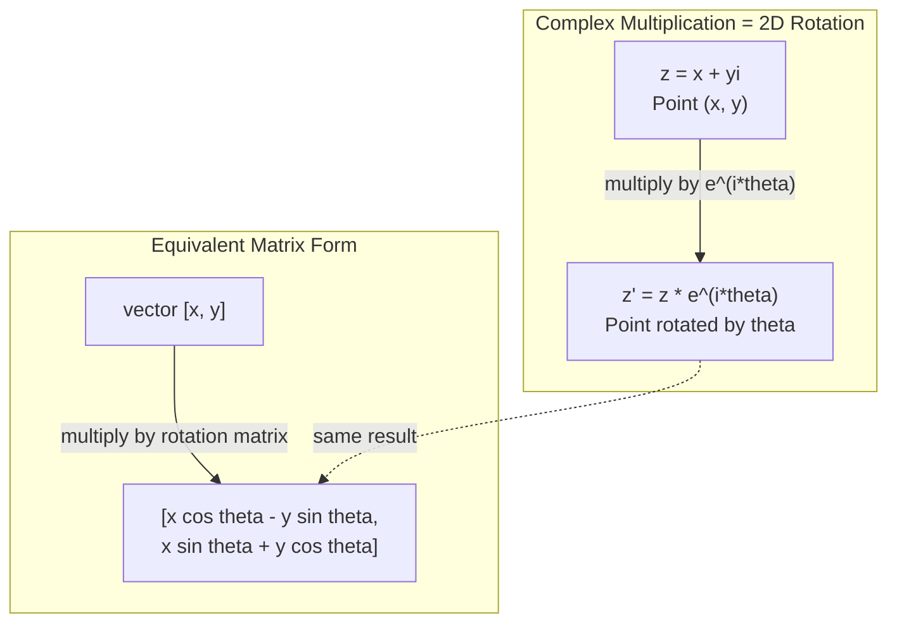
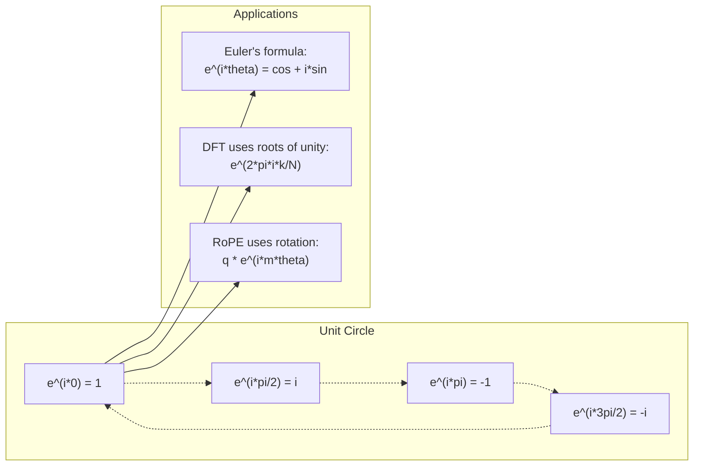

# AI için karmaşık sayılar

> -1'in kare kökü hayal edici değil. Dönüşümlerin, frekansların ve sinyal işleme yarısının anahtarıdır.

**Type:** Learn
**Language:**Python
**Prerequisites:** Phase 1, Lessons 01-04 (linear algebra, calculus)
**Time:** ~60 minutes

## Öğrenme Hedefleri

- Katı ve kutup şeklinde karmaşık aritmetik (ekle, kat, böl, birleştir) yapın
- Karmaşık eksponensialler ve trigonometrik fonksiyonlar arasında dönüştürmek için Euler'in formülünü uygulayın
- Karmaşık birlik köklerini kullanarak Diskret Fourier Transform uygulamak
- Transformatörlerde RoPE ve sinusoidal pozisyon kodlamalarının karmaşık dönümlerin nasıl altında olduğunu açıklayın.

## Sorun

Fourier dönüşümleri üzerine bir makale açarsanız , orada bir şey var .`i`Transformer konum kodlamalarına bakıp görebilirsiniz.`sin`ve `cos`karmaşık eksponensallerin gerçek ve hayalsel kısımları. Kuantum bilgisayarı hakkında okuyorsunuz ve karmaşık vektör alanlarında ifade edilen her şeyi bulursunuz.

Karmaşık sayılar soyut görünüyor. -1 kare kökü üzerine inşa edilmiş bir sayı sistemi bir matematik hilesi gibi hisseder. Ama bu bir hile değil. Bu dönüm ve titreşimlerin doğal dili. Bir şey her döndüğünde, titreştiğinde veya titreştiğinde, karmaşık sayılar doğru araçtır.

Karmaşık sayıları anlamadan, Diskret Fourier Transform'u anlayamazsınız. FFT'yi anlayamazsınız. RoPE (Rotary Position Embedding) modern dil modellerinde nasıl çalışır anlamıyorsunuz.

Bu ders karmaşık aritmetikleri sıfırdan inşa eder, jeometriyle bağlar ve makine öğreniminde karmaşık sayılar tam olarak nerede göründüğünü gösterir.

## Anlaşım

### Karmaşık bir sayı nedir?

Karmaşık bir sayı iki parçaya sahiptir: gerçek bir bölüm ve hayali bir bölüm.

```
z = a + bi

where:
  a is the real part
  b is the imaginary part
  i is the imaginary unit, defined by i^2 = -1
```

Bu sayılar, bir düzlemde, gerçek sayılar bir tarafa, hayal sayılar diğer tarafa, her karmaşık sayı bu düzlemde bir nokta.

### Karmaşık aritmetik

**Addition.**Gerçek parçaları bir araya getirin, hayali parçaları bir araya getirin.

```
(a + bi) + (c + di) = (a + c) + (b + d)i

Example: (3 + 2i) + (1 + 4i) = 4 + 6i
```

**Multiplication.**Paylaştırma yasasını kullanın ve i^2 = -1 olduğunu unutmayın.

```
(a + bi)(c + di) = ac + adi + bci + bdi^2
                 = ac + adi + bci - bd
                 = (ac - bd) + (ad + bc)i

Example: (3 + 2i)(1 + 4i) = 3 + 12i + 2i + 8i^2
                            = 3 + 14i - 8
                            = -5 + 14i
```

**Conjugate.**Hayal gücünün işaretini çevir.

```
conjugate of (a + bi) = a - bi
```

Karmaşık bir sayının ve onun eşleşmesinin ürünü her zaman gerçek olur:

```
(a + bi)(a - bi) = a^2 + b^2
```

**Division.**Sayıcı ve adlendiricini adlendiricinin birleşikliği ile çarpın.

```
(a + bi) / (c + di) = (a + bi)(c - di) / (c^2 + d^2)
```

Bu, isimlendiriciden hayali kısmı ortadan kaldırır ve size temiz karmaşık bir sayı verir.

### Karmaşık düzlem

Karmaşık düzlem her karmaşık sayıyı 2 boyutlu bir noktaya haritası yapar. Düz ekseni gerçek ekseni, dikey ekseni hayal ekseni.

```
z = 3 + 2i  corresponds to the point (3, 2)
z = -1 + 0i corresponds to the point (-1, 0) on the real axis
z = 0 + 4i  corresponds to the point (0, 4) on the imaginary axis
```

Karmaşık bir sayı aynı zamanda bir noktayı ve bir kaynağı olan vektördür. Bu çift yorumlama karmaşık sayıları jeometri için yararlı kılan şeydir.

### Kutup şekli

Düzende herhangi bir nokta, kökeninden uzaklığı ve pozitif gerçek eksiden açısı ile tanımlanabilir.

```
z = r * (cos(theta) + i*sin(theta))

where:
  r = |z| = sqrt(a^2 + b^2)     (magnitude, or modulus)
  theta = atan2(b, a)             (phase, or argument)
```

Dörtgenlik biçimi (a + bi) eklemek için iyidir. Polar biçimi (r, theta) çarpma için iyidir.

**Multiplication in polar form.**Büyüklükleri çarpıp açıları ekleyin.

```
z1 = r1 * e^(i*theta1)
z2 = r2 * e^(i*theta2)

z1 * z2 = (r1 * r2) * e^(i*(theta1 + theta2))
```

Bu yüzden karmaşık sayılar dönümler için mükemmel. 1 büyüklüğü ile karmaşık sayılarla çarpmak saf bir dönümdür.

### Euler'in formülü

Karmaşık eksponensal ve trigonometri arasındaki köprü:

```
e^(i*theta) = cos(theta) + i*sin(theta)
```

Bu dersdeki en önemli formül.

```
e^(i*pi) = cos(pi) + i*sin(pi) = -1 + 0i = -1

Therefore: e^(i*pi) + 1 = 0
```

Beş temel sabit (e, i, pi, 1, 0) bir denklemde birbirine bağlanmıştır.

### Euler'ın formülü ML için neden önemlidir

Euler'in formülü bunu söylüyor.`e^(i*theta)`Theta = 0, teta = pi/2, teta = pi = 0, teta = 1, teta = 2, teta = 1, teta = 3, teta = 3, teta = 0, teta = 2, teta = 2, teta = 2, teta = 2, teta = 2, teta = 2, teta = 2, teta = 2, teta = 2, teta = 2, teta = 1, teta = 2, teta = 1, teta = 2, teta = 1, teta = 1, teta = 1, teta = 1, teta = 1, teta = 1, teta = 1, teta = 1, teta = 1, teta = 1, teta = 1, teta = 1, teta = 1, teta = 1, teta = 1, teta = 1, teta = 1, teta = 1, teta = 1, teta = 1, teta = 1, teta = 1, teta = 1, teta = 1, teta = 1, teta = 1, teta = 1, teta = 1, teta = 1, teta = 1, teta = 1, teta = 1, teta = 1, teta = 1, teta = 1, teta = 1, teta = 1, teta = 1, teta = 1, teta = 1, teta = 1, teta = 1, teta = 1, teta = 2, teta = 1, teta = 1, teta = 2, teta = 1, teta = 1, teta = 2, teta = 1, teta = 1, teta = 2, teta = 1, teta = 2, teta = 1, teta = 2, teta = 2, teta = 1, teta = 2, t = 1, teta = 2, t = 1, t = 2, t = 1, t = 2, t = 2, t = 1, t = 2, t = 2, t = 1, t = 2, t = 2, t = 2, t = 2, t = 1, t = 2, t = 1, t = 2, t = 2, t = 1, t = 2, t = 1, t = 2, t = 1, t = 2, t = 2, t = 2, t = 2, t = 1, t = 2, t = = 1, t = 2, t = = 2, t = = = = = = = = = = = = = = = = = = = = = = = = = = = = = = = = = = = = = = = = = = = = = = = = = = = = = = = = = = = = = = = = = = = =

Bu karmaşık eksponensialler Dönüştürücüdür ve sinyal işleme ve ML'de her yerde dönüştür.

### 2D dönüşümlere bağlanmak

Karmaşık sayıyı (x + yi) e^(i*theta ile çarpırsak, noktayı (x, y) köşe theta tarafından köken etrafında döndürür.

```
Rotation via complex multiplication:
  (x + yi) * (cos(theta) + i*sin(theta))
  = (x*cos(theta) - y*sin(theta)) + (x*sin(theta) + y*cos(theta))i

Rotation via matrix multiplication:
  [cos(theta)  -sin(theta)] [x]   [x*cos(theta) - y*sin(theta)]
  [sin(theta)   cos(theta)] [y] = [x*sin(theta) + y*cos(theta)]
```

Bu iki metrekal bir dönüştürücü matrisin bir matris notasyonunda yazılmış karmaşık çarpma.



### Fasorlar ve dönük sinyaller

Karmaşık bir eksponensal e^(i*omega*t) açı frekansı omega'da birim döngüsünün etrafında dönen bir noktayır. t arttıkça nokta döngüyü izler.

Bu dönüm noktasının gerçek kısmı cos(omega*t) imajür kısmı sin(omega*t) sinusoidal bir sinyal dönümlü bir karmaşık sayının gölgesidir.

```
e^(i*omega*t) = cos(omega*t) + i*sin(omega*t)

Real part:      cos(omega*t)    -- a cosine wave
Imaginary part: sin(omega*t)    -- a sine wave
```

Bu fazör temsilidir. Bir sinüs dalgasını izlemek yerine, düzgün bir şekilde dönen bir ok izlersiniz. Faz değişimleri açı bozuklukları haline gelir. Amplitude değişiklikleri büyüklük değişimleri haline gelir. Sinyal eklemesi vektör eklemesi haline gelir.

### Birliğin Temelleri

Birlik köklerinin N-th kökü, birlik dairesinde eşit derecede uzanan N noktalardır:

```
w_k = e^(2*pi*i*k/N)    for k = 0, 1, 2, ..., N-1
```

N = 4 için kökler şunlardır: 1, i, -1, -i (dört pusula noktası).
N = 8 için dört pusula noktasını artı dört diyagonalı elde edersiniz.

Birlik kökleri Diskret Fourier Transform'un temelidir. DFT, bir sinyali bu N eşit alanlı frekanslarda bileşenlere parçalayır.

### DFT'ye Bağlantı

Bir sinyalin x[0], x[1], ..., x[N-1] Diskret Fourier Transform'u:

```
X[k] = sum_{n=0}^{N-1} x[n] * e^(-2*pi*i*k*n/N)
```

Her X[k] sinyalin birliğin k-inci kökü ile ne kadar ilişkili olduğunu ölçer. Bu karmaşık sinusoid bir frekans k. DFT bir sinyalü N dönümlü fazörlere ayırır ve her birinin amplitudu ve fazını söyler.

### Neden ben hayali değilim?

"Fantastik" kelimesi tarihi bir tesadüf. Descartes onu reddeterek kullandı. Ama i negatif sayılar ilk defa reddedildiğinde olduğu kadar daha hayali değildir.

Daha da kullanışlı: i 90 derecelik bir dönüm operatörüdür. Gerçek bir sayıyı bir kez i ile çarpırsak, hayalsel eksine 90 derece döndürürüz. tekrar i ile çarpırsak (i^2) bir başka 90 derece döndürürsünüz - şimdi negatif gerçek yönde işaret ediyorsunuz.

Bu yüzden mühendislikte karmaşık sayılar her yerde var. Dönen her şey - elektromanyetik dalgalar, kuantum durumları, sinyal titreşimleri, konum kodlamaları - doğal olarak karmaşık sayılarla tanımlanır.

### Karmaşık eksponensaller vs. trigonometrik fonksiyonlar

Euler'in formülünden önce mühendisler sinyalleri A*cos(omega*t + phi) olarak yazdılar. - amplitud A, frekans omega, faz phi. Bu çalışır ama aritmetik ağrılı hale getirir.

Karmaşık eksponensallerle aynı sinyal A*e^(i*(omega*t + phi)). İki sinyal eklemek sadece iki karmaşık sayı eklemektir. Karşılaştırmak (modülasyon) sadece büyüklükleri çarpıtmak ve açı eklemektir. Faz değişikliği açı eklemelerine dönüşür. Frekans değişikliği fazörlerle çarpıtım olur.

Tüm sinyal işleme alanı karmaşık eksponensel notasyona geçmiştir çünkü matematik daha temizdir. "gerçek sinyal" her zaman karmaşık temsilin gerçek bir parçasıdır. Hayali kısım da hesaplama olarak taşınır ve tüm cebir doğal olarak çalışır.

### Transformatörlere bağlama

**Sinusoidal positional encodings**(Orijinal Transformer kağıdı):

```
PE(pos, 2i) = sin(pos / 10000^(2i/d))
PE(pos, 2i+1) = cos(pos / 10000^(2i/d))
```

Günah ve cos çiftleri, karmaşık eksponensallerin gerçek ve hayalsel parçalarıdır. Her frekans kodlama pozisyonu için farklı bir " çözünürlük " sağlar. Düşük frekanslar yavaşça (kaşlı pozisyon) değişir. Yüksek frekanslar hızlıca (sık pozisyon) değişir. Birlikte her pozisyonu benzersiz bir frekans parmak izi verirler.

**RoPE (Rotary Position Embedding)**Bu, sorgu ve anahtar vektörlerini karmaşık döngü matrisleri ile açıkça çoğaltır. İki simge arasındaki göreceli konum bir döngü açısına dönüşür. Dikkat bu döngü vektörleri kullanarak hesaplanır.

| Operation | Algebraic Form | Geometric Meaning |
|-----------|---------------|-------------------|
| Addition | (a+c) + (b+d)i | Vector addition in the plane |
| Multiplication | (ac-bd) + (ad+bc)i | Rotate and scale |
| Conjugate | a - bi | Reflect over real axis |
| Magnitude | sqrt(a^2 + b^2) | Distance from origin |
| Phase | atan2(b, a) | Angle from positive real axis |
| Division | multiply by conjugate | Reverse rotation and rescale |
| Power | r^n * e^(i*n*theta) | Rotate n times, scale by r^n |



```figure
roots-of-unity
```

## Yapın

### Adım 1: Karmaşık sınıf

Dörtgen ve kutup şekiller arasındaki aritmetik, büyüklük, faz ve dönüşümü destekleyen karmaşık bir sayı sınıfı oluşturun.

```python
import math

class Complex:
    def __init__(self, real, imag=0.0):
        self.real = real
        self.imag = imag

    def __add__(self, other):
        return Complex(self.real + other.real, self.imag + other.imag)

    def __mul__(self, other):
        r = self.real * other.real - self.imag * other.imag
        i = self.real * other.imag + self.imag * other.real
        return Complex(r, i)

    def __truediv__(self, other):
        denom = other.real ** 2 + other.imag ** 2
        r = (self.real * other.real + self.imag * other.imag) / denom
        i = (self.imag * other.real - self.real * other.imag) / denom
        return Complex(r, i)

    def magnitude(self):
        return math.sqrt(self.real ** 2 + self.imag ** 2)

    def phase(self):
        return math.atan2(self.imag, self.real)

    def conjugate(self):
        return Complex(self.real, -self.imag)
```

### Adım 2: Kutup dönüşümü ve Euler formülü

```python
def to_polar(z):
    return z.magnitude(), z.phase()

def from_polar(r, theta):
    return Complex(r * math.cos(theta), r * math.sin(theta))

def euler(theta):
    return Complex(math.cos(theta), math.sin(theta))
```

Kontrol edin:`euler(theta).magnitude()`Her zaman 1.0 olmalı.`euler(0)`vermesi gerekir (1, 0). `euler(pi)`(-1, 0) vermeli.

### Adım 3: Dönüşüm

Bir noktayı (x, y) açı ile teta döndürmek bir karmaşık çarpma:

```python
point = Complex(3, 4)
rotated = point * euler(math.pi / 4)
```

Büyüklük aynı kalır. Sadece açı değişir.

### Adım 4: Karmaşık aritmetikten DFT

```python
def dft(signal):
    N = len(signal)
    result = []
    for k in range(N):
        total = Complex(0, 0)
        for n in range(N):
            angle = -2 * math.pi * k * n / N
            total = total + Complex(signal[n], 0) * euler(angle)
        result.append(total)
    return result
```

Bu O(N^2) DFT. Her çıkış X[k] sinyal örneklerinin toplamı birliğin kökleri ile çarpılmıştır.

### Adım 5: Ters DFT

Ters DFT, orijinal sinyali spektrumundan yeniden oluşturur. Ön DFT'den gelen tek değişiklikler: işaretini katılamada çevir ve N ile bölün.

```python
def idft(spectrum):
    N = len(spectrum)
    result = []
    for n in range(N):
        total = Complex(0, 0)
        for k in range(N):
            angle = 2 * math.pi * k * n / N
            total = total + spectrum[k] * euler(angle)
        result.append(Complex(total.real / N, total.imag / N))
    return result
```

Bu size mükemmel bir yeniden yapılandırma sağlar. DFT uygulayın, sonra IDFT, ve orijinal sinyal makine hassaslığına geri gelir. Hiçbir bilgi kaybolmaz.

### 6 . Adım: Birliğin Temelleri

```python
def roots_of_unity(N):
    return [euler(2 * math.pi * k / N) for k in range(N)]
```

İki özellik doğrulanıyor:
- Her kökenin büyüklüğü tam olarak 1'dir.
- Tüm N köklerinin toplamı sıfırdır (simetri ile iptal edilirler).

Bu özellikler DFT'yi dönüştürülebilir yapanlardır. Birlik kökleri frekans alanı için ortogonal bir temel oluşturur.

## Kullan

Python'da karmaşık sayı desteği yer alıyor.`j`Hayal birimi temsil eder.

```python
z = 3 + 2j
w = 1 + 4j

print(z + w)
print(z * w)
print(abs(z))

import cmath
print(cmath.phase(z))
print(cmath.exp(1j * cmath.pi))
```

Arraylar için, numpy karmaşık sayıları doğuştan ele alır:

```python
import numpy as np

z = np.array([1+2j, 3+4j, 5+6j])
print(np.abs(z))
print(np.angle(z))
print(np.conj(z))
print(np.real(z))
print(np.imag(z))

signal = np.sin(2 * np.pi * 5 * np.linspace(0, 1, 128))
spectrum = np.fft.fft(signal)
freqs = np.fft.fftfreq(128, d=1/128)
```

## Gönder

Çık .`code/complex_numbers.py`üretmek için`outputs/skill-complex-arithmetic.md`- Evet .

## Egzersizler

1. **Complex arithmetic by hand.**Hesaplayın (2 + 3i) * (4 - i) ve kod ile doğrulayın. Sonra hesaplayın (5 + 2i) / (1 - 3i). Her iki sonucu da karmaşık düzlemde çizin ve çarpımın ilk sayıyı döndüğünü ve ölçeklediğini kontrol edin.

2. **Rotation sequence.**Bu sayede, e^(i*pi/6) ile on iki kez çarpın. 12 çarpımdan sonra (1, 0) 'ye döndüğünüzü kontrol edin.

3. **DFT of a known signal.**32 noktada örneklenen sin ((2*pi*3*t) ve 0.5*sin ((2*pi*7*t) toplamı olan bir sinyal oluşturun. DFT'ni çalıştırın. Büyüklük spektrumun 3 ve 7 frekanslarında zirvelerinin olup olmadığını kontrol edin.

4. **Roots of unity visualization.**Birliğin 8. kökü hesaplayın. Onların sıfıra kadar toplamını kontrol edin. Bir kökü ilk kökü e^(2*pi*i/8) ile çarpmanın bir sonraki kökü verdiğini kontrol edin.

5. **Rotation matrix equivalence.**10 rastgele açı ve 10 rastgele nokta için, karmaşık çarpımın 2x2 döngü matrisinde matris-vektor çarpımı ile aynı sonucu verdiğini kontrol edin.

## Anahtar Terimler

| Term | What it means |
|------|---------------|
| Complex number | A number a + bi where a is the real part, b is the imaginary part, and i^2 = -1 |
| Imaginary unit | The number i, defined by i^2 = -1. Not imaginary in the philosophical sense -- it is a rotation operator |
| Complex plane | The 2D plane where the x-axis is real and the y-axis is imaginary. Also called the Argand plane |
| Magnitude (modulus) | The distance from the origin: sqrt(a^2 + b^2). Written as \|z\| |
| Phase (argument) | The angle from the positive real axis: atan2(b, a). Written as arg(z) |
| Conjugate | The mirror image across the real axis: conjugate of a + bi is a - bi |
| Polar form | Expressing z as r * e^(i*theta) instead of a + bi. Makes multiplication easy |
| Euler's formula | e^(i*theta) = cos(theta) + i*sin(theta). Connects exponentials to trigonometry |
| Phasor | A rotating complex number e^(i*omega*t) representing a sinusoidal signal |
| Roots of unity | The N complex numbers e^(2*pi*i*k/N) for k = 0 to N-1. N equally spaced points on the unit circle |
| DFT | Discrete Fourier Transform. Decomposes a signal into complex sinusoidal components using roots of unity |
| RoPE | Rotary Position Embedding. Uses complex multiplication to encode relative position in transformer attention |

## Daha Fazla Okumak

- [Visual Introduction to Euler's Formula](https://betterexplained.com/articles/intuitive-understanding-of-eulers-formula/)- ağır notasyon olmadan geometrik algı oluşturur
- [Su et al.: RoFormer (2021)](https://arxiv.org/abs/2104.09864)- karmaşık dönümleri kullanarak Rotary Position Embedding'i tanıtan kağıt
- [Vaswani et al.: Attention Is All You Need (2017)](https://arxiv.org/abs/1706.03762)- Sinusoidal pozisyon kodlamaları olan orijinal Transformer kağıdı
- [3Blue1Brown: Euler's formula with introductory group theory](https://www.youtube.com/watch?v=mvmuCPvRoWQ)- e^(i*pi) = -1 nedeninin görsel açıklaması
- [Needham: Visual Complex Analysis](https://global.oup.com/academic/product/visual-complex-analysis-9780198534464)- karmaşık sayılar için en iyi görsel tedavi, geometrik anlayışla dolu
- [Strang: Introduction to Linear Algebra, Ch. 10](https://math.mit.edu/~gs/linearalgebra/)- Düzsel cebir ve öz değerler bağlamında karmaşık sayılar
