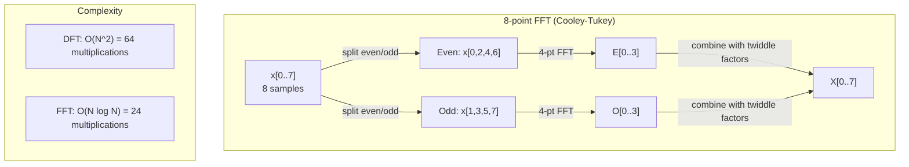
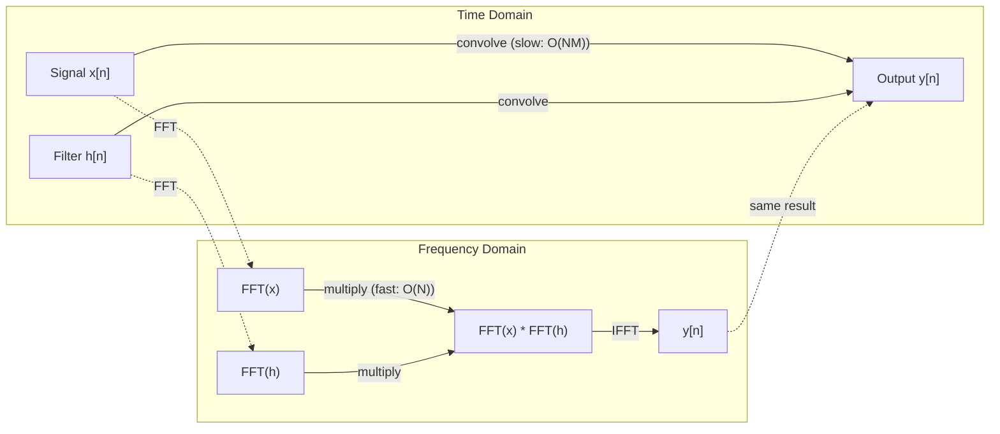

# Fourier Değişimi

> Her sinyal sinüs dalgalarının toplamıdır. Fourier dönüşümü hangisini söyler.

**Type:** Build
**Language:**Python
**Prerequisites:** Phase 1, Lessons 01-04, 19 (complex numbers)
**Time:** ~90 minutes

## Öğrenme Hedefleri

- DFT'yi sıfırdan uygulayın ve O(N log N) Cooley-Tukey FFT'ye karşı doğrulayın
- Frekans koefisienlerini yorumlayın: bir sinyaldeki amplitud, faz ve güç spektrumu çıkarın
- FFT çarpımı yoluyla konvulsiyon gerçekleştirmek için konvulsiyon teoremi uygulayın
- Fourier frekansı parçalanmasını transformatör pozisyon kodlama ve CNN konvolisyon katmanlarına bağlayın

## Sorun

Bir ses kaydesi, zamanla basınç ölçümlerinin bir dizilemesidir. Bir stok fiyatı, günler boyunca değerlerin bir dizilemesidir. Bir görüntü, uzay üzerinde piksel yoğunluklarının bir çubuğudur. Bunların hepsi zaman alanındaki (veya uzay alanındaki) veridir.

Ancak zaman alanında birçok desen görünmez. Bu ses sinyali saf bir ton mu yoksa akord mu? Bu hisse senedi bir haftalık döngü mi var? Bu görüntü tekrarlayan bir doku mu var?

Fourier dönüşümü, bir sinyal alır ve farklı frekanslarda sinüs dalgalarına parçalayır. Her sinüs dalgasının bir amplitudusu (ne kadar güçlü olduğu) ve bir aşaması vardır (nereye başladığı). Fourier dönüşümü her ikisini de söyler.

Bu ML için önemlidir çünkü frekans alanı düşüncesi her yerde ortaya çıkar. Konvülsiyonal sinir ağları konvülsiyonu gerçekleştirir, bu da frekans alanında çarpma. Transformer pozisyon kodlamaları konumları temsil etmek için frekans parçalanmasını kullanır. Ses modelleri (söz tanıma, müzik üretimi) spektrogramlar üzerinde çalışır - seslerin frekans temsilleri. Zaman dizisi modelleri periyodik desenleri arıyor. Fourier dönüşümünü anlamak, bunların hepsini kullanmak için kelime birikimi verir.

## Anlaşım

### DFT tanımı

N örnekler x[0], x[1], ..., x[N-1] verildiğinde, Diskret Fourier Transform N frekans katılıkları X[0], X[1], ..., X[N-1] üretir:

```
X[k] = sum_{n=0}^{N-1} x[n] * e^(-2*pi*i*k*n/N)

for k = 0, 1, ..., N-1
```

Her X [k] karmaşık bir sayıdır. Büyüklüğü. X [k] da size frekans k'nin amplitudunu söyler. Faz açısı.

Anahtar bilgi:`e^(-2*pi*i*k*n/N)`DFT, sinyal ile N eşit alanlı frekansların her biri arasındaki ilişkiyi hesaplar. Eğer sinyal k frekanslı enerji içerirse, ilişki büyüktür.

### Her bir katılamın anlamı

**X[0]: the DC component.**Bu, tüm örneklerin toplamı ortalama oranla oranlıdır.

```
X[0] = sum_{n=0}^{N-1} x[n] * e^0 = sum of all samples
```

**X[k] for 1 <= k <= N/2: positive frequencies.**X[k] N örnekler başına frekans k döngüleri temsil eder. Yüksek k, daha yüksek frekans (hızlı ossilasyon) anlamına gelir.

**X[N/2]: the Nyquist frequency.**N örneklerle temsil edebileceğiniz en yüksek frekans. Bu üzerinde, düşük frekanslar gibi maske edilen yüksek frekanslar.

**X[k] for N/2 < k < N: negative frequencies.**Gerçek değerli sinyaller için, X[N-k] = conj(X[k]). Negatif frekanslar pozitiflerin ayna görüntüleridir. Bu nedenle yararlı bilgiler ilk N/2 + 1 katılımcılarda bulunur.

### Ters DFT

Ters DFT, orijinal sinyali frekans koefisienlerinden yeniden oluşturur:

```
x[n] = (1/N) * sum_{k=0}^{N-1} X[k] * e^(2*pi*i*k*n/N)

for n = 0, 1, ..., N-1
```

Önceki DFT'den tek fark: Eksponent'teki işaret olumlu (menik değil) ve 1/N normallaşma faktörü vardır.

DFT tersine dönüşüm mükemmel. Hiçbir bilgi kaybolmaz. Zaman alanından frekans alanına ve geri herhangi bir hata olmadan gidebilirsiniz. DFT temel değişikliği - aynı bilgileri farklı koordinat sisteminde yeniden ifade eder.

### FFT: hızlı hale getirmek

Yukarıda tanımlanan DFT O(N^2): N çıkış katılıklarının her biri için N giriş örneklerini toplamlarsınız. N = 1 milyon için, bu 10^12 işlemdir.

Hızlı Fourier Değişimi (FFT) aynı sonucu O  N log N'de hesaplar. N = 1 milyon için, bu bir trilyon yerine yaklaşık 20 milyon işlemdir.

Cooley-Tukey algoritması (en yaygın FFT) bölme ve fetih yoluyla çalışır:

1. Sinyalı eşit indeksi ve eşsiz indeksi örneklere bölün.
2. Her yarısının DFT'sini geri dönüşlü olarak hesaplayın.
3. İki yarı boyutlu DFT'yi "ikili faktör" e^(-2*pi*i*k/N ile birleştirin.

```
X[k] = E[k] + e^(-2*pi*i*k/N) * O[k]          for k = 0, ..., N/2 - 1
X[k + N/2] = E[k] - e^(-2*pi*i*k/N) * O[k]    for k = 0, ..., N/2 - 1

where E = DFT of even-indexed samples
      O = DFT of odd-indexed samples
```

Simetri, her rekürsiyon düzeyinin O(N) çalışmasını ve log2(N) düzeylerinin olması anlamına gelir.



FFT, sinyal uzunluğunun 2'lik bir güç olması gerektiğini gerektirir.

### Spektral analiz

- Evet .**power spectrum**Bu, her frekans koefisieninin karesi büyüklüğü.

- Evet .**phase spectrum**Bu, her frekansın faz karşılığıdır.

```
Power at frequency k:  P[k] = |X[k]|^2 = X[k].real^2 + X[k].imag^2
Phase at frequency k:  phi[k] = atan2(X[k].imag, X[k].real)
```

### Frekans çözünürlüğü

DFT'nin frekans çözünürlüğü N örnek sayısına ve örnekleme hızı fs'ye bağlıdır.

```
Frequency of bin k:      f_k = k * fs / N
Frequency resolution:    delta_f = fs / N
Maximum frequency:       f_max = fs / 2  (Nyquist)
```

Birbiriyle yakın olan iki frekansı çözmek için daha fazla örnek gerekmektedir. Yüksek frekansları yakalamak için daha yüksek örnekleme oranına ihtiyacınız vardır.

### Konvulsiyon teoremi

Bu sinyal işleme alanındaki en önemli sonuçlardan biri ve CNN'lere doğrudan alakalı.

**Convolution in the time domain equals pointwise multiplication in the frequency domain.**

```
x * h = IFFT(FFT(x) . FFT(h))

where * is convolution and . is element-wise multiplication
```

Bunun neden önemli olduğunu:

- Uzunluk N ve M'li iki sinyali doğrudan kıvrım O(N*M) işlemleri yapar.
- FFT tabanlı konvolisyon O(N log N alır: her ikisini de dönüştür, katlay, geri dönüştür.
- Büyük çekirdekler için, FFT konvolyyonu çok daha hızlıdır.
- Büyük kabul alanları olan konvulsiyon katmanlarında da aynen böyle olur.

Not: DFT, döngülik konvulsiyon hesaplar (sinyal etrafta sarılır). Düzsel konvulsiyon için (kavrayış yok), hesaplamadan önce her iki sinyali de uzunluğu N + M - 1 ile sıfır-pad.



### Pencere

DFT, sinyalin periyodik olduğunu varsayır - N örneklerini sonsuz bir şekilde tekrarlanan bir sinyalin bir dönem olarak değerlendirir. Eğer sinyal aynı değerde başlamaz ve bitmezse, bu, sınırda bir kesintisizlik yaratır.

Pencereleme, DFT'yi hesaplamadan önce sinyalin her iki ucunda sıfıra indirerek sızıntıları azaltır.

Genel pencereler:

| Window | Shape | Main lobe width | Side lobe level | Use case |
|--------|-------|----------------|-----------------|----------|
| Rectangular | Flat (no window) | Narrowest | Highest (-13 dB) | When signal is exactly periodic in N samples |
| Hann | Raised cosine | Moderate | Low (-31 dB) | General purpose spectral analysis |
| Hamming | Modified cosine | Moderate | Lower (-42 dB) | Audio processing, speech analysis |
| Blackman | Triple cosine | Wide | Very low (-58 dB) | When side lobe suppression is critical |

```
Hann window:    w[n] = 0.5 * (1 - cos(2*pi*n / (N-1)))
Hamming window: w[n] = 0.54 - 0.46 * cos(2*pi*n / (N-1))
```

Pencereyi DFT'den önceki sinyalle element ölçüsünde çarparak uygulayın: `X = DFT(x * w)`- Evet .

### DFT özellikleri

| Property | Time Domain | Frequency Domain |
|----------|-------------|-----------------|
| Linearity | a*x + b*y | a*X + b*Y |
| Time shift | x[n - k] | X[f] * e^(-2*pi*i*f*k/N) |
| Frequency shift | x[n] * e^(2*pi*i*f0*n/N) | X[f - f0] |
| Convolution | x * h | X * H (pointwise) |
| Multiplication | x * h (pointwise) | X * H (circular convolution, scaled by 1/N) |
| Parseval's theorem | sum \|x[n]\|^2 | (1/N) * sum \|X[k]\|^2 |
| Conjugate symmetry (real input) | x[n] real | X[k] = conj(X[N-k]) |

Parseval teoremi, her iki alanda toplam enerjinin aynı olduğunu söyler.

### Konaklama kodlamalarına bağ

Orijinal Transformer sinusoidal pozisyon kodlamaları kullanıyor:

```
PE(pos, 2i)   = sin(pos / 10000^(2i/d_model))
PE(pos, 2i+1) = cos(pos / 10000^(2i/d_model))
```

Her boyut çiftinin (2i, 2i+1) farklı bir frekansta titreşiyor. Frekanslar coğrafi olarak yüksek (boyuta 0,1) ile düşük (son boyutlar) arasında uzanır. Bu, her pozisyonu tüm frekans bantlarında benzersiz bir kalıp sağlar. Fourier katılamalarının bir sinyali benzer şekilde tanımladığı gibi.

Bu özellikler şunlardır:

- **Uniqueness:**İki pozisyon aynı kodlamada bulunamaz.
- **Bounded values:**Günah ve cos her zaman [-1, 1]'de.
- **Relative position:**P + k pozisyonunun kodlanması, p pozisyonunda kodlamanın bir çizgisi işlevi olarak ifade edilebilir. Modelle görevi pozisyonlara dikkat etmeyi öğrenebilir.

### CNN'lere bağlantı

Bir konvolisyon katmanı, sinyal veya görüntü üzerinden kaydırarak girişine öğrenilmiş bir filtre (kernel) uyguluyor.

Konvulsiyon teoremi ile, bu eşdeğer:
1. FFT giriş
2. FFT çekirdeği
3. Frekans alanında çarpma
4. Sonuçı

Standart CNN uygulamalar doğrudan konvoluyonu kullanır (küçük 3x3 çekirdekler için daha hızlı). Ancak büyük çekirdekler veya küresel konvoluyon için, FFT tabanlı yaklaşımlar önemli ölçüde daha hızlıdır.

### Spektrogramlar ve Kısa Zamanlı Fourier Değişimi

Tek bir FFT size tüm sinyalin frekans içeriğini verir, ancak bu frekansların ne zaman meydana geldiği hakkında hiçbir şey söylemez. Bir çırp (sıkıntıları zamanla artış gösterdiği bir sinyal) ve bir akord (her frekans aynı anda mevcut) aynı büyüklük spektruma sahip olabilir.

Kısa Zaman Fourier Transform (STFT) bunu sinyalin üst üstü örtüşen pencerelerinde FFT'leri hesaplayarak çözür. Sonuç bir spektrogramdır: bir eksede zaman ve diğerinde frekans ile 2 boyutlu bir temsil.

```
STFT procedure:
1. Choose a window size (e.g., 1024 samples)
2. Choose a hop size (e.g., 256 samples -- 75% overlap)
3. For each window position:
   a. Extract the windowed segment
   b. Apply a Hann/Hamming window
   c. Compute FFT
   d. Store the magnitude spectrum as one column of the spectrogram
```

Spektrogramlar, ses ML modelleri için standart giriş temsilidir. Konuşma tanıma modelleri (Shisper, DeepSpeech) mel-spektrogramlar üzerinde çalışır - mel ölçeğine haritelenen frekansları olan spektrogramlar, insan yüksek ses algılamalarına daha iyi uymaktadır.

### İsimsiz

Bir sinyal fs/2'den (Nyquist frekansı) yüksek frekanslar içerirse, fs frekansı ile örnekleme isimli kopyalar oluşturacaktır. 100 Hz'de örneklenen 90 Hz sinyali 10 Hz sinyali ile aynı görünür.

```
Example:
  True signal: 90 Hz sine wave
  Sampling rate: 100 Hz
  Apparent frequency: 100 - 90 = 10 Hz

  The samples from the 90 Hz signal at 100 Hz sampling rate
  are identical to the samples from a 10 Hz signal.
  No amount of math can recover the original 90 Hz.
```

Bu nedenle analog-dijital dönüştürücüler, örnekleme yapmadan önce Nyquist'in üzerindeki frekansları kaldıran anti-aliasing filtrelerini içerir. ML'de, düşük geçiş filtresi olmadan özellik haritalarını aşağı örneklemekte, aliasing görünür. Bazı mimarlıklar bunu anti-aliased birleştirme katmanlarıyla ele alır.

### sıfır patlama çözünürlüğünü arttırmaz

Genel bir yanlış anlama: FFT'den önce bir sinyalin sıfır patlaması frekans çözünürlüğünü artırır. Yapmaz. sıfır patlama mevcut frekans kutuları arasında aralaşır, size daha düzgün görünen bir spektrum verir. Ama orijinal örneklerde bulunmayan frekans ayrıntılarını ortaya çıkaramaz.

Gerçek frekans çözünürlüğü yalnızca gözlem süresine bağlıdır T = N / fs. delta_f ile ayrılmış iki frekansın çözülmesi için, en az T = 1 / delta_f saniyelerinde verilere ihtiyacınız vardır.

```figure
fourier-synthesis
```

## Yapın

### Adım 1: DFT sıfırdan

O(N^2) DFT, tanımdan doğrudan çıkar.

```python
import math

class Complex:
    ...

def dft(x):
    N = len(x)
    result = []
    for k in range(N):
        total = Complex(0, 0)
        for n in range(N):
            angle = -2 * math.pi * k * n / N
            w = Complex(math.cos(angle), math.sin(angle))
            xn = x[n] if isinstance(x[n], Complex) else Complex(x[n])
            total = total + xn * w
        result.append(total)
    return result
```

### Adım 2: Ters DFT

Aynı yapı, pozitif katılımcı, N ile bölün.

```python
def idft(X):
    N = len(X)
    result = []
    for n in range(N):
        total = Complex(0, 0)
        for k in range(N):
            angle = 2 * math.pi * k * n / N
            w = Complex(math.cos(angle), math.sin(angle))
            total = total + X[k] * w
        result.append(Complex(total.real / N, total.imag / N))
    return result
```

### Adım 3: FFT (Cooley-Tukey)

Rekürsiv FFT'nin 2 uzunluğun güçünü gerektirir.

```python
def fft(x):
    N = len(x)
    if N <= 1:
        return [x[0] if isinstance(x[0], Complex) else Complex(x[0])]
    if N % 2 != 0:
        return dft(x)

    even = fft([x[i] for i in range(0, N, 2)])
    odd = fft([x[i] for i in range(1, N, 2)])

    result = [Complex(0)] * N
    for k in range(N // 2):
        angle = -2 * math.pi * k / N
        twiddle = Complex(math.cos(angle), math.sin(angle))
        t = twiddle * odd[k]
        result[k] = even[k] + t
        result[k + N // 2] = even[k] - t
    return result
```

### Adım 4: Spektral analiz yardımcıları

```python
def power_spectrum(X):
    return [xk.real ** 2 + xk.imag ** 2 for xk in X]

def convolve_fft(x, h):
    N = len(x) + len(h) - 1
    padded_N = 1
    while padded_N < N:
        padded_N *= 2

    x_padded = x + [0.0] * (padded_N - len(x))
    h_padded = h + [0.0] * (padded_N - len(h))

    X = fft(x_padded)
    H = fft(h_padded)

    Y = [xk * hk for xk, hk in zip(X, H)]

    y = idft(Y)
    return [y[n].real for n in range(N)]
```

## Kullan

Gerçek çalışmalar için, yüksek düzeyde optimize edilmiş C kütüphaneleri tarafından desteklenen numpy'nin FFT's'ini kullanın.

```python
import numpy as np

signal = np.sin(2 * np.pi * 5 * np.arange(256) / 256)
spectrum = np.fft.fft(signal)
freqs = np.fft.fftfreq(256, d=1/256)

power = np.abs(spectrum) ** 2

positive_freqs = freqs[:len(freqs)//2]
positive_power = power[:len(power)//2]
```

Pencereleme ve daha gelişmiş spektral analiz için:

```python
from scipy.signal import windows, stft

window = windows.hann(256)
windowed = signal * window
spectrum = np.fft.fft(windowed)
```

Çelişki için:

```python
from scipy.signal import fftconvolve

result = fftconvolve(signal, kernel, mode='full')
```

Spektrogramlar için:

```python
from scipy.signal import stft

frequencies, times, Zxx = stft(signal, fs=sample_rate, nperseg=256)
spectrogram = np.abs(Zxx) ** 2
```

Spektrogram matrisinin şekli vardır (n_frequencies, n_time_frames). Her sütun bir zaman penceresinde güç spektrumudır.

## Gönder

Çık .`code/fourier.py`üretmek için`outputs/prompt-spectral-analyzer.md`- Evet .

## Egzersizler

1. **Pure tone identification.**Bilinmeyen bir frekansta (1-50 Hz arasında) tek sinüs dalgasıyla bir sinyal oluşturun ve 128 Hz'de 1 saniye boyunca örnek alın. DFT'ni kullanarak frekansı tanımlayın. Cevap eşleşmesini kontrol edin. Şimdi standart sapma 0.5 ile Gaussian gürültüsünü ekleyin ve tekrarlayın.

2. **FFT vs DFT verification.**DFT (O(N^2) ve FFT her ikisini hesaplayın. Tüm katmanların 1e-10'a eşleştiğini kontrol edin. Zaman, uzunluk 256, 512, 1024, ve 2048 sinyallerinde her iki işlevi de gerçekleştirir. DFT zamanının FFT zamanına oranını çizin.

3. **Convolution theorem proof by example.**Sinyal x = [1, 2, 3, 4, 0, 0, 0, 0] oluşturun ve h = [1, 1, 1, 0, 0, 0, 0, 0] filtreleyin. Dört kıvrımlarını doğrudan hesaplayın (bir yuva).

4. **Windowing effects.**Bir sinyal oluşturun ki bu sinyal 10 Hz ve 12 Hz (çok yakın) iki sinüs dalgasının toplamıdır. 128 Hz'de 1 saniye boyunca örnek alın. Pencere olmayan güç spektrumu, Hann pencere ve Hamming pencereyi hesaplayın. Hangi pencere iki zirveyi ayırt etmenin en kolayını sağlar?

5. **Positional encoding analysis.**D_model = 128 ve max_pos = 512 için sinusoidal pozisyon kodlamaları oluşturun. Her iki pozisyon (p1, p2) için kodlamalarının nokta ürünü hesaplayın.

## Anahtar Terimler

| Term | What it means |
|------|---------------|
| DFT (Discrete Fourier Transform) | Converts N time-domain samples into N frequency-domain coefficients. Each coefficient is the correlation with a complex sinusoid at that frequency |
| FFT (Fast Fourier Transform) | An O(N log N) algorithm to compute the DFT. The Cooley-Tukey algorithm splits even/odd indices recursively |
| Inverse DFT | Reconstructs the time-domain signal from frequency coefficients. Same formula as DFT with flipped exponent sign and 1/N scaling |
| Frequency bin | Each index k in the DFT output represents frequency k*fs/N Hz. The "bin" is the discrete frequency slot |
| DC component | X[0], the zero-frequency coefficient. Proportional to the signal mean |
| Nyquist frequency | fs/2, the maximum frequency representable at sampling rate fs. Frequencies above this alias |
| Power spectrum | \|X[k]\|^2, the squared magnitude of each frequency coefficient. Shows energy distribution across frequencies |
| Phase spectrum | angle(X[k]), the phase offset of each frequency component. Often ignored in analysis |
| Spectral leakage | Spurious frequency content caused by treating a non-periodic signal as periodic. Reduced by windowing |
| Window function | A tapering function (Hann, Hamming, Blackman) applied before DFT to reduce spectral leakage |
| Twiddle factor | The complex exponential e^(-2*pi*i*k/N) used to combine sub-DFTs in the FFT butterfly computation |
| Convolution theorem | Convolution in time domain equals pointwise multiplication in frequency domain. Fundamental to signal processing and CNNs |
| Circular convolution | Convolution where the signal wraps around. This is what the DFT naturally computes |
| Linear convolution | Standard convolution without wraparound. Achieved by zero-padding before DFT |
| Parseval's theorem | Total energy is preserved through the Fourier transform. sum \|x[n]\|^2 = (1/N) sum \|X[k]\|^2 |
| Aliasing | When frequencies above Nyquist appear as lower frequencies due to insufficient sampling rate |

## Daha Fazla Okumak

- [Cooley & Tukey: An Algorithm for the Machine Calculation of Complex Fourier Series (1965)](https://www.ams.org/journals/mcom/1965-19-090/S0025-5718-1965-0178586-1/)- Bilgisayarı değiştiren orijinal FFT kağıdı
- [3Blue1Brown: But what is the Fourier Transform?](https://www.youtube.com/watch?v=spUNpyF58BY)- Fourier dönüşümlerine en iyi görsel giriş
- [Lee-Thorp et al.: FNet: Mixing Tokens with Fourier Transforms (2021)](https://arxiv.org/abs/2105.03824)- transformörlerde kendini dikkatle kullanmayı FFT ile değiştirir
- [Smith: The Scientist and Engineer's Guide to Digital Signal Processing](http://www.dspguide.com/)- FFT, pencereler ve spektral analizleri hakkında ücretsiz çevrimiçi ders kitabı
- [Vaswani et al.: Attention Is All You Need (2017)](https://arxiv.org/abs/1706.03762)- Fourier frekanslı parçalanma ile elde edilen sinusoidal pozisyon kodlamalar
- [Radford et al.: Whisper (2022)](https://arxiv.org/abs/2212.04356)- mel spektrogramları kullanarak konuşma tanıma giriş temsilciliği
