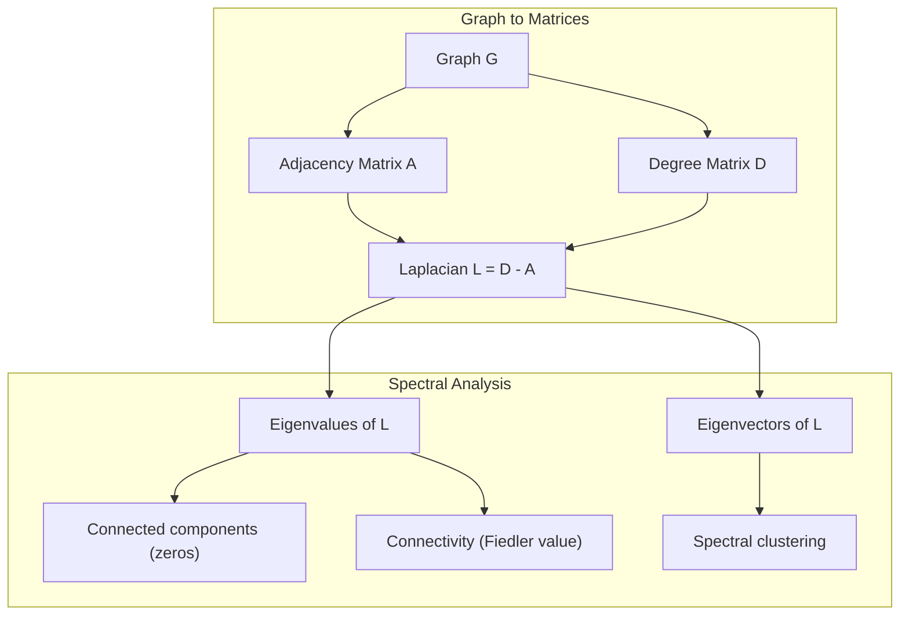
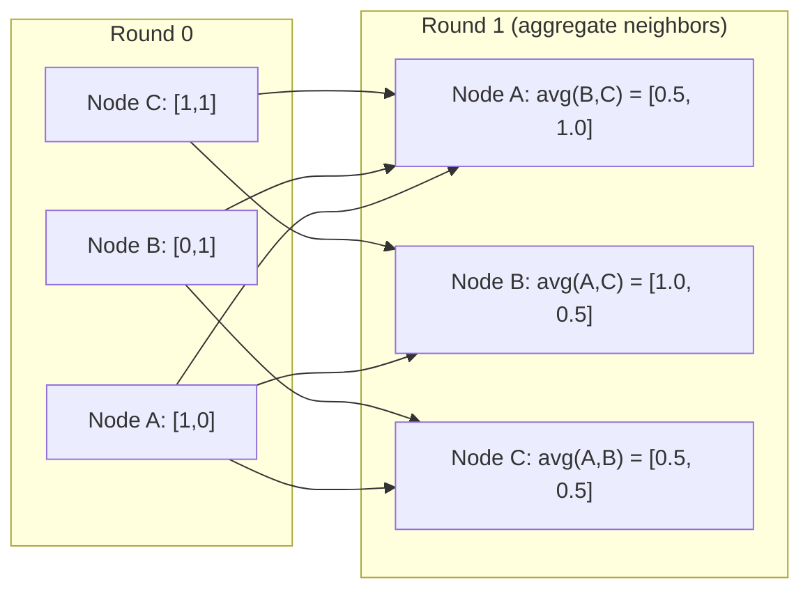

# Makine Öğrenimi için Graf Teorisi

> Grafikler ilişkilerin veri yapısıdır. Eğer verileriniz bağlantılı ise, grafik teorisine ihtiyacınız var.

**Type:** Build
**Language:**Python
**Prerequisites:** Phase 1, Lessons 01-03 (linear algebra, matrices)
**Time:** ~90 minutes

## Öğrenme Hedefleri

- Yakınlık matrisi/list temsilleri ile bir grafik sınıfı oluşturun ve BFS ve DFS geçişleri uygulayın
- Laplacian grafikini hesaplayın ve bağlantılı bileşenleri ve klüster düğümlerini tespit etmek için kendi değerlerini kullanın
- Normalleştirilmiş bitişiklik matrisi çarpımı olarak geçen GNN tarzı mesajın bir turunu uygulayın
- Bir grafiği Fiedler vektörü kullanarak bölmek için spektral gruplama uygulayın

## Sorun

Sosyal ağlar, moleküller, bilgi tabanları, sitasyon ağları, yol hariteleri - hepsi grafikler. Geleneksel ML verileri düz tablolar gibi değerlendirir. Her satır bağımsızdır. Her özellik bir sütundur. Ama bağlantıların yapısı önemli olduğunda, tablolar başarısız olur.

Bir sosyal ağı düşünün. Bir kullanıcının hangi ürünü alacağını tahmin etmek istiyorsunuz. Alış tarihi önemli. Ama arkadaşlarının satın alma tarihi daha önemli. Bağlantılar sinyal taşıyor.

Ya da bir molekülü düşünün. Bir proteine bağlanıp bağlanmayacağını tahmin etmek istiyorsunuz. Atomlar önemli ama asıl önemli olan atomların birbirine nasıl bağlandığını.

Graf sinir ağları (GNN) derin öğrenme alanında en hızlı büyüyen alanlardır. İlaç keşfi, sosyal tavsiye, dolandırıcılık tespit ve bilgi grafi düşüncesini güçlendiriyorlar. Her GNN aynı temel üzerinde inşa edilir: temel grafi teorisi.

Dört şeye ihtiyacın var:
1. Grafikleri matris olarak göstermenin bir yolu (onları çoğaltabilirsiniz)
2. Graf yapısını keşfetmek için geçiş algoritmaları
3. Laplakya -- spektral grafik teorisi'nde en önemli tek matris
4. Mesaj geçiş - GNN'leri çalıştırmak için yapılan işlem

## Anlaşım

### Grafikler: Kısımlar ve Kenarlar

Bir grafik G = (V, E) V ve E kenarlarından oluşan zirvelerden (nodlardan) oluşur. Her kenar iki düğmeyi birbirine bağlar.

**Directed vs undirected.**Yönlendirilmemiş bir graftede, kenar (u, v) u v ile bağlantılıdır ve v u ile bağlantılıdır. Yönlendirilmiş bir graftede (digraft) kenar (u, v) u v'ye işaret eder, ancak mutlaka tersine değildir.

**Weighted vs unweighted.**Ağırlaştırılmamış bir grafikte kenarlar ya var ya da yok. Ağırlaştırılmış bir grafikte her kenarın sayısal bir ağırlığı vardır - bir mesafe, bir maliyet, bir güç.

| Graph type | Example |
|-----------|---------|
| Undirected, unweighted | Facebook friendship network |
| Directed, unweighted | Twitter follow network |
| Undirected, weighted | Road map (distances) |
| Directed, weighted | Web page links (PageRank scores) |

### Yakınlık Matrisi

A'nın bitişiklik matrisi çekirdek temsilidir. n düğümlü bir grafik için:

```
A[i][j] = 1    if there is an edge from node i to node j
A[i][j] = 0    otherwise
```

Yönlendirilmemiş grafikler için, A simetriktir: A[i][j] = A[j][i]. Ağırlaştırılmış grafikler için, A[i][j] = kenar ağırlığı (i, j).

**Example -- a triangle:**

```
Nodes: 0, 1, 2
Edges: (0,1), (1,2), (0,2)

A = [[0, 1, 1],
     [1, 0, 1],
     [1, 1, 0]]
```

A'daki matris işlemleri grafikteki işlemlere karşılık gelir.

### Derece

Bir düğümün derecesi, ona bağlı olan kenarların sayısını gösterir. Yönlendirilmiş grafikler için, dereceden (girenler giren) ve dış dereceden (girenler çıkıp giden) vardır.

D derece matrisi diyagonaldir:

```
D[i][i] = degree of node i
D[i][j] = 0    for i != j
```

Üçgen örneği için: D = diag(2, 2, 2) çünkü her düğüm diğer iki düğüme bağlanır.

Derece, düğüm önemi hakkında size bilgi verir. Yüksek derece = merkez düğümü. Bir ağın derece dağılımı yapısını ortaya çıkarır. Sosyal ağlar güç yasalarını izler (beçik merkezler, birçok yaprak düğümü).

### BFS ve DFS

İki temel grafik geçiş algoritması. İkisine de ihtiyacınız var.

**Breadth-First Search (BFS):**Önce komşuları araştırın, sonra komşu komşularını.

```
BFS from node 0:
  Visit 0
  Queue: [1, 2]        (neighbors of 0)
  Visit 1
  Queue: [2, 3]        (add neighbors of 1)
  Visit 2
  Queue: [3]           (neighbors of 2 already visited)
  Visit 3
  Queue: []            (done)
```

BFS, ağırlıksız grafiklerde en kısa yolları bulur. Başlangıçtan herhangi bir düğümye kadar olan mesafe, bu düğümün ilk keşfedilen BFS seviyesine eşittir. Bu nedenle BFS sosyal ağlarda hop-sayım mesafeleri için kullanılır.

**Depth-First Search (DFS):**Geriye dönmeden önce mümkün olduğunca derinlere git.

```
DFS from node 0:
  Visit 0
  Stack: [1, 2]        (neighbors of 0)
  Visit 2               (pop from stack)
  Stack: [1, 3]         (add neighbors of 2)
  Visit 3               (pop from stack)
  Stack: [1]
  Visit 1               (pop from stack)
  Stack: []             (done)
```

DFS:
- Bağlı bileşenleri bulmak (gelenmeyen düğümlerden DFS çalıştırmak)
- DFS ağacında döngü tespit (Arka kenarları)
- Topolojik sıralama (DFS son sırası tersine)

| Algorithm | Data structure | Finds | Use case |
|-----------|---------------|-------|----------|
| BFS | Queue | Shortest paths | Social network distance, knowledge graph traversal |
| DFS | Stack | Components, cycles | Connectivity, topological sort |

### Grafik Laplakyan

L = D - A. Spektral grafik teorisi'nde en önemli matris.

Üçgen için:

```
D = [[2, 0, 0],    A = [[0, 1, 1],    L = [[2, -1, -1],
     [0, 2, 0],         [1, 0, 1],         [-1, 2, -1],
     [0, 0, 2]]         [1, 1, 0]]         [-1, -1,  2]]
```

Laplakya'nın dikkat çekici özellikleri vardır:

1. **L is positive semi-definite.**Tüm öz değerleri >= 0'dur.

2. **The number of zero eigenvalues equals the number of connected components.**Bağlı bir grafik tam olarak bir sıfır öz değere sahiptir. 3 bağlantısız bileşenli bir grafik üç sıfır öz değere sahiptir.

3. **The smallest non-zero eigenvalue (Fiedler value) measures connectivity.**Büyük Fiedler değeri, grafikin iyi bağlantılı olduğunu, küçük Fiedler değeri ise grafikin zayıf bir noktası olduğunu, bir şişek boynuzuna sahip olduğunu gösterir.

4. **The eigenvector of the Fiedler value (Fiedler vector) reveals the best split.**Pozitif değerli düğümler bir grupta, negatif değerli düğümler diğer grupta gider.



### Spektral Özellikler

Yakınlık matrisinin ve Laplakistan'ın öz değerleri herhangi bir geçiş olmadan yapısal özellikleri ortaya çıkarır.

**Spectral clustering**Bu şekilde çalışır:
1. Laplak L'yi hesaplayın
2. L'nin k en küçük öz vektörlerini bul (birincisi atlayın, bu bağlantılı grafikler için tüm-birler)
3. Bu öz vektörleri her düğüm için yeni koordinatlar olarak kullanın
4. K- ortalamaları bu koordinatlarda çalıştır

Bu neden çalışır? L'nin özvektorları grafikteki "en ince" fonksiyonları kodlar. İyi bağlantılı düğümler benzer özvektor değerlerini alır. Botluk boynuzıyla ayrılmış düğümler farklı değerler alır. Özvektorlar doğal olarak kümeleri ayırır.

**Random walk connection.**Normalleştirilmiş Laplakyan, grafikte rastgele yürüyüşlerle ilgilidir. rastgele yürüyüşün sabit dağılımı düğüm derecesine orantılıdır. Karıştırma zamanı ( yürüyüşün ne kadar hızlı bir şekilde yakınlaşması) spektral boşluğu üzerine bağlıdır.

### Mesaj Geçiriliyor

Graf Sinir Ağlarının temel işlevi. Her düğüm komşularından mesajlar toplar, onları toplar ve kendi durumunu güncelleyebilir.

```
h_v^(k+1) = UPDATE(h_v^(k), AGGREGATE({h_u^(k) : u in neighbors(v)}))
```

En basit biçimde, AGGREGATE = ortalama ve UPDATE = doğrusal dönüşüm + etkinleştirme:

```
h_v^(k+1) = sigma(W * mean({h_u^(k) : u in neighbors(v)}))
```

Bu, maskeli matris çarpımıdır. Eğer H tüm düğüm özelliklerinin matrisidir ve A bitişiklik matrisidirse:

```
H^(k+1) = sigma(A_norm * H^(k) * W)
```

A_norm normalleştirilmiş bitişiklik matrisidir (her satır 1'e kadar tutar).

Bir mesaj geçiş turunda her düğüm yakın komşularını "gör" sağlar. İki turda komşu komşuları görmesine izin verir. K turları her düğümde K-hop komşularından bilgi verir.



### Anlaşmalar ve ML Uygulamaları

| Concept | ML Application |
|---------|---------------|
| Adjacency matrix | GNN input representation |
| Graph Laplacian | Spectral clustering, community detection |
| BFS/DFS | Knowledge graph traversal, path finding |
| Degree distribution | Node importance, feature engineering |
| Message passing | GNN layers (GCN, GAT, GraphSAGE) |
| Eigenvalues of L | Community detection, graph partitioning |
| Spectral clustering | Unsupervised node grouping |
| PageRank | Node importance, web search |

```figure
graph-degree-distribution
```

## Yapın

### Adım 1: Graf sınıfı sıfırdan

```python
class Graph:
    def __init__(self, n_nodes, directed=False):
        self.n = n_nodes
        self.directed = directed
        self.adj = {i: {} for i in range(n_nodes)}

    def add_edge(self, u, v, weight=1.0):
        self.adj[u][v] = weight
        if not self.directed:
            self.adj[v][u] = weight

    def neighbors(self, node):
        return list(self.adj[node].keys())

    def degree(self, node):
        return len(self.adj[node])

    def adjacency_matrix(self):
        import numpy as np
        A = np.zeros((self.n, self.n))
        for u in range(self.n):
            for v, w in self.adj[u].items():
                A[u][v] = w
        return A

    def degree_matrix(self):
        import numpy as np
        D = np.zeros((self.n, self.n))
        for i in range(self.n):
            D[i][i] = self.degree(i)
        return D

    def laplacian(self):
        return self.degree_matrix() - self.adjacency_matrix()
```

Etraflılık listesine (`self.adj`Bu nedenle, komşuları etkin bir şekilde depolar.

### Adım 2: BFS ve DFS

```python
from collections import deque

def bfs(graph, start):
    visited = set()
    order = []
    distances = {}
    queue = deque([(start, 0)])
    visited.add(start)
    while queue:
        node, dist = queue.popleft()
        order.append(node)
        distances[node] = dist
        for neighbor in graph.neighbors(node):
            if neighbor not in visited:
                visited.add(neighbor)
                queue.append((neighbor, dist + 1))
    return order, distances


def dfs(graph, start):
    visited = set()
    order = []
    stack = [start]
    while stack:
        node = stack.pop()
        if node in visited:
            continue
        visited.add(node)
        order.append(node)
        for neighbor in reversed(graph.neighbors(node)):
            if neighbor not in visited:
                stack.append(neighbor)
    return order
```

BFS, O(1) pop sol için bir deque (iki uçlı kuyruk) kullanır. DFS bir listeyi bir yığın olarak kullanır. Her iki düğümde tam olarak bir kez ziyaret eder - O(V + E) zaman.

### Adım 3: Bağlı bileşenler ve Laplak öz değerleri

```python
def connected_components(graph):
    visited = set()
    components = []
    for node in range(graph.n):
        if node not in visited:
            order, _ = bfs(graph, node)
            visited.update(order)
            components.append(order)
    return components


def laplacian_eigenvalues(graph):
    import numpy as np
    L = graph.laplacian()
    eigenvalues = np.linalg.eigvalsh(L)
    return eigenvalues
```

`eigvalsh`Laplakya'nın, yönlendirilmemiş grafikler için her zaman simetrik olduğu için simetrik matrisler için.

### 4. Adım: Spektral gruplama

```python
def spectral_clustering(graph, k=2):
    import numpy as np
    L = graph.laplacian()
    eigenvalues, eigenvectors = np.linalg.eigh(L)
    features = eigenvectors[:, 1:k+1]

    labels = np.zeros(graph.n, dtype=int)
    for i in range(graph.n):
        if features[i, 0] >= 0:
            labels[i] = 0
        else:
            labels[i] = 1
    return labels
```

Fiedler vektörünün işaretinin k=2 için grafiği iki kümeye ayırması gerekir. k>2 için ilk k öz vektörlerinde k- ortalamaları çalıştırırsınız (büyük tüm-bir öz vektör hariç).

### Adım 5: Mesaj aktarılıyor

```python
def message_passing(graph, features, weight_matrix):
    import numpy as np
    A = graph.adjacency_matrix()
    row_sums = A.sum(axis=1, keepdims=True)
    row_sums[row_sums == 0] = 1
    A_norm = A / row_sums
    aggregated = A_norm @ features
    output = aggregated @ weight_matrix
    return output
```

Bu, GNN mesajının bir turundan geçer. Her düğümün yeni özellikleri, ağırlık matrisi ile dönüştürülen komşu özelliklerinin ağırlıklı ortalamasıdır.

## Kullan

Networkx ve numpy ile aynı işlemler tek satırlı:

```python
import networkx as nx
import numpy as np

G = nx.karate_club_graph()

A = nx.adjacency_matrix(G).toarray()
L = nx.laplacian_matrix(G).toarray()

eigenvalues = np.linalg.eigvalsh(L.astype(float))
print(f"Smallest eigenvalues: {eigenvalues[:5]}")
print(f"Connected components: {nx.number_connected_components(G)}")

communities = nx.community.greedy_modularity_communities(G)
print(f"Communities found: {len(communities)}")

pr = nx.pagerank(G)
top_nodes = sorted(pr.items(), key=lambda x: x[1], reverse=True)[:5]
print(f"Top 5 PageRank nodes: {top_nodes}")
```

networkx, optimize edilmiş C arka planları ile herhangi bir boyutdaki grafikleri işliyor.

### Numpy spektral analizi

```python
import numpy as np

A = np.array([
    [0, 1, 1, 0, 0],
    [1, 0, 1, 0, 0],
    [1, 1, 0, 1, 0],
    [0, 0, 1, 0, 1],
    [0, 0, 0, 1, 0]
])

D = np.diag(A.sum(axis=1))
L = D - A

eigenvalues, eigenvectors = np.linalg.eigh(L)
print(f"Eigenvalues: {np.round(eigenvalues, 4)}")
print(f"Fiedler value: {eigenvalues[1]:.4f}")
print(f"Fiedler vector: {np.round(eigenvectors[:, 1], 4)}")

fiedler = eigenvectors[:, 1]
group_a = np.where(fiedler >= 0)[0]
group_b = np.where(fiedler < 0)[0]
print(f"Cluster A: {group_a}")
print(f"Cluster B: {group_b}")
```

Fiedler vektörü ağır yüklenmeyi yapar. Bir küme pozitif girişler, diğerinde negatif girişler. İteratif optimizasyon gerekmez. Sadece bir özde kompozisyon.

## Gönder

Bu ders şunları ortaya çıkarır:
- `outputs/skill-graph-analysis.md`-- grafik yapılı verileri analiz etmek için bir beceri referansı

## Bağlantılar

| Concept | Where it shows up |
|---------|------------------|
| Adjacency matrix | GCN, GAT, GraphSAGE input |
| Laplacian | Spectral clustering, ChebNet filters |
| BFS | Knowledge graph traversal, shortest path queries |
| Message passing | Every GNN layer, neural message passing |
| Spectral gap | Graph connectivity, mixing time of random walks |
| Degree distribution | Power-law networks, node feature engineering |
| Connected components | Preprocessing, handling disconnected graphs |
| PageRank | Node importance ranking, attention initialization |

GNN'ler özel bir değinime layık. GCN'deki grafik konvulsiyon işlevi (Kipf & Welling, 2017) A_hat = A + I:

```text
H^(l+1) = sigma(D_hat^(-1/2) * A_hat * D_hat^(-1/2) * H^(l) * W^(l))
```

A_hat = A + I (ekşilik artı kendi-süküller) ve D_hat A_hat'ın dereceleri matrisidir. Kendi kendini oluşturan döngüler, her düğümün toplanma sırasında kendi özelliklerini içerdiğini sağlar. Bu tam olarak simetrik normallaşımla geçen mesaj. D_hat^(-1/2) * A_hat * D_hat^(-1/2) normalleştirilmiş bitişiklik matrisidir. Laplakyan ortaya çıkıyor çünkü bu normallaşma L_sym = I - D^(-1/2) * A * D^(-1/2) ile ilişkilidir. Laplakya'yı anlamak, GCN'lerin neden çalıştığını anlamak demektir.

## Egzersizler

1. **Implement PageRank from scratch.**Her adımda: skor(v) = (1-d) /n + d * toplam(score(u) /out_degree(u)) için v'ye işaret eden tüm u için. d=0.85 kullanın.

2. **Find communities using spectral clustering.**İki açıkça ayrılmış kümelerle bir grafik oluşturun (örneğin, tek bir kenar ile bağlantılı iki klik). Spektral kümeler çalıştırın ve doğru bölünmeyi bulduğunu kontrol edin.

3. **Implement Dijkstra's algorithm**Boşluklı grafiklerde en kısa yollar için.

4. **Build a 2-layer message passing network.**Farklı ağırlık matrisleri ile iki kez mesaj geçirme uygulayın. 2 turdan sonra her düğümün 2 hop komşusundan bilgi olduğunu gösterin.

5. **Analyze a real-world graph.**Karate Kulübü grafikini kullanın (34 düğüm, 78 kenar). Derece dağılımını, Laplakya öz değerlerini ve spektral kümeler oluşturmayı hesaplayın.

## Anahtar Terimler

| Term | What people say | What it actually means |
|------|----------------|----------------------|
| Graph | "Nodes and edges" | A mathematical structure G=(V,E) encoding pairwise relationships |
| Adjacency matrix | "The connection table" | An n x n matrix where A[i][j] = 1 if nodes i and j are connected |
| Degree | "How connected a node is" | The number of edges touching a node |
| Laplacian | "D minus A" | L = D - A, the matrix whose eigenvalues reveal graph structure |
| Fiedler value | "The algebraic connectivity" | The smallest non-zero eigenvalue of L, measuring how well-connected the graph is |
| BFS | "Level-by-level search" | Traversal that visits all neighbors before going deeper, finds shortest paths |
| DFS | "Go deep first" | Traversal that follows one path to its end before backtracking |
| Message passing | "Nodes talk to neighbors" | Each node aggregates information from its neighbors, the core of GNNs |
| Spectral clustering | "Cluster by eigenvectors" | Partition a graph using eigenvectors of its Laplacian |
| Connected component | "A separate piece" | A maximal subgraph where every node can reach every other node |

## Daha Fazla Okumak

- **Kipf & Welling (2017)**-- "Grafik Konvolyasyon Ağları ile Yarım Denetimli Sınıflandırma". Modern GNN'leri başlatan makale. Spektral grafik konvolyasyonlarının mesaj geçişini basitleştirdiğini gösterir.
- **Spielman (2012)**-- "Spektral Graf Teorisi" ders notları. Laplaklar, spektral boşluklar ve grafik bölünmesi hakkında kesin bir giriş.
- **Hamilton (2020)**-- "Grafik Temsil Öğrenimi". GNN'leri temellerden uygulamalara kadar kapsar.
- **Bronstein et al. (2021)**-- "Jometri Derin Öğrenimi: Gridler, Gruplar, Grafikler, Jeodetik ve Ölçüler".
- **Veličković et al. (2018)**- "Grafik Dikkat Ağları".
