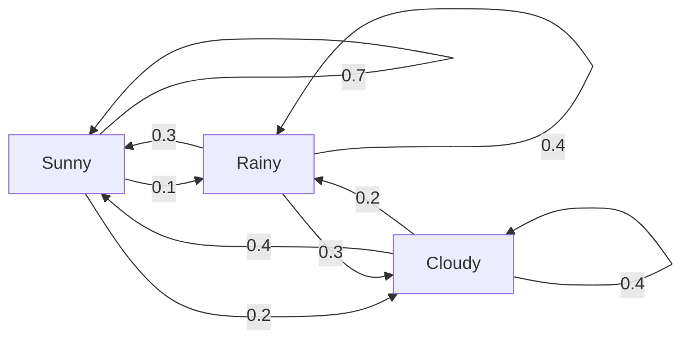
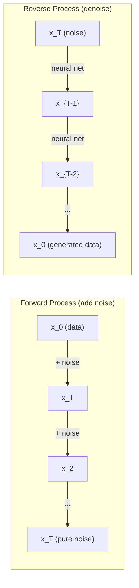

# Stochastic Prosesler

> Rastgele yürüyüşlerin, Markov zincirlerinin ve difüzyon modellerinin arkasındaki matematik.

**Type:** Learn
**Language:**Python
**Prerequisites:** Phase 1, Lessons 06-07 (probability, Bayes)
**Time:** ~75 minutes

## Öğrenme Hedefleri

- 1D ve 2D rastgele yürüyüşleri simüle edin ve yer değiştirme oranını doğrulayın
- Markov zinciri simülatörü oluşturun ve kendi kompozisyon yoluyla sabit dağılımını hesaplayın
- Metropolis-Hastings MCMC ve Langevin dinamiklerini hedef dağıtımlardan örnek almak için uygula
- Önceki difüzyon sürecini Brownian hareketi ile bağlayın ve ters süreçten veri nasıl üretildiğini açıklayın

## Sorun

Birçok AI sistemi zamanla gelişen rastlantıyı içerir. Statik rastlantıyı değil, her adımın daha önce gelenlere bağlı olduğu yapılandırılmış, sıralı rastlantıyı.

Dil modelleri bir seferde birer token oluşturur. Her token önceki bağlamdan bağlıdır. Model bir olasılık dağılımını, örnekleri çıkarır ve ilerler. Bu bir stohastik süreçtir.

Diffusion modelleri saf statik olana kadar bir görüntüye adım adım gürültü ekler. Sonra da süreci tersine çevirirler, yeni bir görüntü ortaya çıkana kadar adım adım denetler. Önüme giden süreç Markov zinciridir. Geriye giden süreç, geriye giden öğrenilmiş bir Markov zinciridir.

Bir ortamda güçlendirme öğrenme ajanları eylemler yapar. Her eylem bir olasılık ile yeni bir duruma yol açar. Bir rastgele dünyada rastgele bir politika izler. Tüm şey bir Markov karar süreci.

MCMC örneklemesi Bayesian sonuçlarının omurgası, Markov zincirini oluşturur.

Bunların hepsi dört temel fikir üzerine kuruluyor:
1. Rastgele yürüyüşler -- en basit stohastik süreç
2. Markov zincirleri -- geçiş matrisi ile yapılandırılmış rastlantı
3. Langevin dinamikleri - gürültü ile gradient düşüşü
4. Metropolis-Hastings - herhangi bir dağıtımdan örnek almak

## Anlaşım

### - Rastgele Yürüyüşler

0 pozisyonundan başlayın. Her adımda adil bir madeni para atın. Başlar: sağ (+1) hareket et. Kuyruklar: sola (-1) hareket et.

N adımdan sonra pozisyonunuz n rastgele +/-1 değerlerinin toplamıdır. Beklenen pozisyon 0 (yolculuk tarafsızdır).

Bu mantıklı değil. Yürüyüş adil - her iki yönde de sürüklenmez. Ama zamanla, başladığı yerden gittikçe daha da uzaklaşır. n adımdan sonra standart sapma n'dir.

```
Step 0:  Position = 0
Step 1:  Position = +1 or -1
Step 2:  Position = +2, 0, or -2
...
Step 100: Expected distance from origin ~ 10 (sqrt(100))
Step 10000: Expected distance from origin ~ 100 (sqrt(10000))
```

**In 2D**Bu yol, aynı olasılık ile yukarı, aşağı, sola veya sağa hareket eder.

**Why sqrt(n)?**Her adım eşit olasılıkla +1 veya -1'dir. N adımdan sonra, S_n = X_1 + X_2 + ... + X_n konumunda her X_i +/-1. Her adımın varyansi 1'dir ve adımlar bağımsızdır, bu nedenle Var(S_n) = n. Standart sapma = sqrt(n. Merkez sınır teoremi ile S_n / sqrt(n) standart normal bir dağılım ile birleşti.

Bu sqrt(n) ölçekleme ML'de her yerde görünür. SGD gürültü ölçekleri 1/sqrt(batch_size olarak.

**Connection to Brownian motion.**Adım boyutu 1/sqrt(n) ve n adımları birim zaman ile rastgele bir yürüyüş yapın. n sonsuzluğa giderken yürüyüş Brownian hareketi B(t) - B(t) normalde ortalama 0 ve varyansa t ile dağılmış olan bir sürekli zaman süreci olarak birleşti.

Brownian hareketi, difüzyonun matematiksel temelidir. Bir sıvıdaki parçacıkların rastgele titreşimini, hisse senet fiyatlarının dalgalanmasını ve - en önemlisi - difüzyon modellerinde gürültü sürecini modellemektedir.

**Gambler's ruin.**0 ve N'de absorber engellerle, k pozisyonundan başlayan rastgele yürüyüşçü. 0'dan önce N'ye ulaşma olasılığı nedir?

### Markov Zincirleri

Markov zinciri, sabit olasılıklara göre eyaletler arasında geçiş yapan bir sistemdir. Ana özellik: bir sonraki devlet sadece tarihte değil, mevcut durumda bağlıdır.

```
P(X_{t+1} = j | X_t = i, X_{t-1} = ...) = P(X_{t+1} = j | X_t = i)
```

Bu Markov özelliği. Tüm dinamikleri geçiş matrisi P ile tanımlayabilirsiniz:

```
P[i][j] = probability of going from state i to state j
```

P'nin her satırı 1'e denk gelir (bir yere gitmelisin).

**Example -- Weather:**

```
States: Sunny (0), Rainy (1), Cloudy (2)

P = [[0.7, 0.1, 0.2],    (if sunny: 70% sunny, 10% rainy, 20% cloudy)
     [0.3, 0.4, 0.3],    (if rainy: 30% sunny, 40% rainy, 30% cloudy)
     [0.4, 0.2, 0.4]]    (if cloudy: 40% sunny, 20% rainy, 40% cloudy)
```

Herhangi bir durumdan başlayın. Birçok geçişten sonra durumların dağılımı pi * P = pi olduğu sabit dağılım pi'ye yaklaşıyor. Bu, P'nin öz değerine sahip sol öz vektörüdür.

Hava zinciri için, sabit dağılım [0.55, 0.18, 0.27] -- uzun vadede, başlangıç durumundan bağımsız olarak, zamanın %55'inde güneşli.



**Computing the stationary distribution.**İki yaklaşım vardır:

1. **Power method**Bu da bir dizi farklılıktan sonra, bir dizi farklılıktan sonra, birbiriyle bir araya gelir.
2. **Eigenvalue method**: P'nin sol öz vektörünü öz değeri 1 ile bul. Bu, P^T'nin öz vektörünü öz değeri 1 ile bulur.

Her iki yaklaşım da zincirin konverjense koşullarını karşılamasını gerektirir.

**Convergence conditions.**Bir Markov zinciri, eğer:
- **Irreducible**Her eyalete diğer eyaletlerden ulaşılabilir.
- **Aperiodic**: zincir belirli bir süreyle döngülenmez

ML'de karşılaştığınız zincirlerin çoğu her iki şartı da karşılar.

**Absorbing states.**Bir durum, bir kere girdiğinizde asla ayrılmıyorsanız, emiliyor (P[i][i] = 1). Markov zincirlerini emleme terminal durumlarla modellemektedir. Sonlanan bir oyun, sarsılan bir müşteri, metin sonu tokenine çarpan bir token dizisi.

**Mixing time.**Zincir sabit dağılımına "yaklaşan" kaç adım var? Formal olarak, sabitliğin toplam değişim mesafesine kadar adım sayısı bir sınırın altında düşer. Hızlı karıştırma = birkaç adım gereklidir. P'nin spektral boşluğu (1 eksi en büyük özdeğer) karıştırma süresini kontrol eder. Büyük boşluk = daha hızlı karıştırma.

### Dil Modelleri ile Bağlantı

Bir dil modelinde simge üretimi yaklaşık olarak Markov işlemidir. Şu anki bağlamı göz önüne alarak, model bir sonraki simge üzerinde bir dağılım çıkarır.

```
P(token_i) = exp(logit_i / temperature) / sum(exp(logit_j / temperature))
```

- Sıcaklık = 1,0: standart dağılım
- Temperatür < 1,0: keskin (öntemsel)
- Temperatür > 1,0: daha düz (daha rastgele)
- Temperatür -> 0: argmax (açık)

Top-k örnekleme, en yüksek olasılıklı k simgelere kısaltır. Top-p (nukleus) örnekleme, toplama olasılığı p'yi aşan en küçük simgelere kısaltır. Her ikisi de Markov geçiş olasılığını değiştirir.

### Brownian Hareketi

Rastgele yürüyüşün sürekli zaman sınırı. B(t) pozisyonunun üç özelliği vardır:
1. B(0) = 0
2. B(t) - B(s) normalde ortalama 0 ve varians t -s ile (t > s için) dağılır
3. Dönüşmeyen aralıklarda artışlar bağımsızdır.

Brownian hareketi sürekli ama hiçbir yerde ayırt edilemez. Her ölçekte titreşiyor. Yolu düzlemde fraktal boyut 2'e sahiptir.

Ayrı simülasyonda Brownian hareketi ile yaklaşır:

```
B(t + dt) = B(t) + sqrt(dt) * z,    where z ~ N(0, 1)
```

Sqrt(dt) ölçeklenmesi önemlidir. Bu rastgele yürüyüşlere uygulanan merkezi sınır teoreminden gelir.

### Langevin Dinamikleri

Langevin dinamikleri, U'nun bir enerji fonksiyonu, T'nin ise sıcaklık olduğu exp(-U(x) / T'ye nispeten olasılık dağılımını bulur.

```
x_{t+1} = x_t - dt * gradient(U(x_t)) + sqrt(2 * T * dt) * z_t
```

Parçacık üzerinde iki güç etkilidir:
1. **Gradient force**(-dt * gradient(U)): düşük enerjiye doğru (gredyen düşüşü gibi) itme
2. **Random force**(sqrt(2*T*dt) * z): rastgele yönlerde itmektedir (kaşlama)

Bu, yüksek sıcaklıkta neredeyse rastgele bir yürüyüştür. Doğru sıcaklıkta parçacık enerji manzarasını keşfeder ve düşük enerji bölgelerinde daha fazla zaman geçirir.

**Connection to diffusion models.**Bir difüzyon modelinin ileriye doğru süreci:

```
x_t = sqrt(alpha_t) * x_{t-1} + sqrt(1 - alpha_t) * noise
```

Bu, Markov zinciri, veriyi gürültü ile yavaş yavaş karıştırır.

Geri dönüş süreci - gürültüden veriye dönüş - aynı zamanda Markov zinciri, ama geçiş olasılığı bir nöral ağ tarafından öğrenilmiştir. Ağ her adımda eklenen gürültüyü tahmin etmeyi öğrenir, sonra da onu çıkarır.



### MCMC: Markov Chain Monte Carlo

Bazen bir dağılımdan örnek almak gerekir p ((x) değerlendirebilirsiniz (bir sabit kadar) ama doğrudan örnek alamazsınız. Bayesian poziterleri klasik örnekler -- olasılığı önceden çarpıyor bilirsiniz, ama normalleşen sabit çözülebilir.

**Metropolis-Hastings**sabit dağılımının p ((x) olduğu Markov zinciri oluşturur:

1. Bir pozisyondan başla x
2. Teklif dağıtımından yeni bir pozisyon x' önerin Q(x'
3. Hesaplama kabul oranı: a(x') * Q(x (x) = (x) = (x) * (x) * (x) = (x)
4. - 1'nin olasılıkları ile x'yi kabul edin.
5. Tekrar ediyorum.

Eğer Q simetrik ise örneğin, Q(x' (leavingx) = Q(x (leavingx') = N(x, sigma^2)), oran a = p(x') / p(x'e basitleştirilir. Sadece olasılık oranına ihtiyacınız var - normalleşen sabitler iptal edilir.

Zincir hafif koşullarda p ((x) 'e doğru bir şekilde yaklaşması garantilidir. Ancak bir teklif çok küçükse (hassasi yürüyüş) veya çok büyükse (yüksek reddedilme) bir dönüş yavaş olabilir.

**Why it works.**Kabul oranı detaylı dengeyi sağlar: x'de olma ve x'ye geçme olasılığı x'de olma ve x'ye geçme olasılığına eşittir. Detaylı denge p(x) zincirin sabit dağılımını içerir.

**Practical considerations:**
- **Burn-in**Zincir, başlangıç noktasından sabit dağılımına ulaşmak için zaman gerektirir.
- **Thinning**: otokorrelasyonu azaltmak için her k-th örnek tutun.
- **Multiple chains**Eğer aynı dağılımlara doğru birleştilerse, birleştiği kanıtları elde edebilirsiniz.
- **Acceptance rate**Bu nedenle, bu değerler, bir dizi değişkenlik ve bir dizi değişkenlik gibi bir değişkenlik anlamına gelir.

### AI'de Stochastic Prosesler

| Process | AI Application |
|---------|---------------|
| Random walk | Exploration in RL, Node2Vec embeddings |
| Markov chain | Text generation, MCMC sampling |
| Brownian motion | Diffusion models (forward process) |
| Langevin dynamics | Score-based generative models, SGLD |
| Markov decision process | Reinforcement learning |
| Metropolis-Hastings | Bayesian inference, posterior sampling |

```figure
random-walk-diffusion
```

## Yapın

### Adım 1: Rastgele yürüyüş simülatörü

```python
import numpy as np

def random_walk_1d(n_steps, seed=None):
    rng = np.random.RandomState(seed)
    steps = rng.choice([-1, 1], size=n_steps)
    positions = np.concatenate([[0], np.cumsum(steps)])
    return positions


def random_walk_2d(n_steps, seed=None):
    rng = np.random.RandomState(seed)
    directions = rng.choice(4, size=n_steps)
    dx = np.zeros(n_steps)
    dy = np.zeros(n_steps)
    dx[directions == 0] = 1   # right
    dx[directions == 1] = -1  # left
    dy[directions == 2] = 1   # up
    dy[directions == 3] = -1  # down
    x = np.concatenate([[0], np.cumsum(dx)])
    y = np.concatenate([[0], np.cumsum(dy)])
    return x, y
```

1D yürüyüşü kumületif toplamları saklar. Her adım +1 veya -1. n adımdan sonra pozisyon toplamdır. Değişiklik n ile doğrusal olarak büyür, bu nedenle standart sapma sqrt(n olarak büyür.

### Adım 2: Markov zinciri

```python
class MarkovChain:
    def __init__(self, transition_matrix, state_names=None):
        self.P = np.array(transition_matrix, dtype=float)
        self.n_states = len(self.P)
        self.state_names = state_names or [str(i) for i in range(self.n_states)]

    def step(self, current_state, rng=None):
        if rng is None:
            rng = np.random.RandomState()
        probs = self.P[current_state]
        return rng.choice(self.n_states, p=probs)

    def simulate(self, start_state, n_steps, seed=None):
        rng = np.random.RandomState(seed)
        states = [start_state]
        current = start_state
        for _ in range(n_steps):
            current = self.step(current, rng)
            states.append(current)
        return states

    def stationary_distribution(self):
        eigenvalues, eigenvectors = np.linalg.eig(self.P.T)
        idx = np.argmin(np.abs(eigenvalues - 1.0))
        stationary = np.real(eigenvectors[:, idx])
        stationary = stationary / stationary.sum()
        return np.abs(stationary)
```

Durgun dağılım, P'nin sol özvektoru ve öz değeridir 1. Onu P^T'nin özvektorlarını hesaplayarak (sol özvektorları sağ özvektorlara dönüştürerek) buluruz.

### Adım 3: Langevin dinamikleri

```python
def langevin_dynamics(grad_U, x0, dt, temperature, n_steps, seed=None):
    rng = np.random.RandomState(seed)
    x = np.array(x0, dtype=float)
    trajectory = [x.copy()]
    for _ in range(n_steps):
        noise = rng.randn(*x.shape)
        x = x - dt * grad_U(x) + np.sqrt(2 * temperature * dt) * noise
        trajectory.append(x.copy())
    return np.array(trajectory)
```

Bu da bir diğer devirde, bir devirde, bir devirde, bir devirde, bir devirde, bir devirde, bir devirde, bir devirde, bir devirde, bir devirde, bir devirde, bir devirde, bir devirde, bir devirde, bir devirde, bir devirde, bir devirde, bir devirde, bir devirde, bir devirde, bir devirde, bir devirde, bir devirde, bir devirde, bir devirde, bir devirde, bir devirde, bir devirde, bir devirde, bir devirde, bir devirde, bir devirde, bir devirde, bir devirde, bir devirde, bir devirde, bir devirde, bir devirde, bir devirde, bir devirde, bir devirde, bir devirde, bir devirde, bir devirde, bir devirde, bir devirde, bir devirde, bir devirde, bir devirde, bir devirde, bir devirde, bir devirde, bir devirde, bir devirde, bir devirde, bir devirde, bir devirde, bir devirde, bir devirde, bir devirde, bir devirde, devirde, bir devirde, devirde, devirde, devirde, bir devirde, devirde, devirde, devirde, devirde, devirde, devirde, devirde, devirde, devirde, devirde, devirde, devirde, devirde, devirde, devirde, devirde, devirde, devirde, devirde, devirde, devirde, devirde, devirde, de de de de devirde, devirde, de de de de de de de de de de de de de de de de de de de de de de de de de de de de de de de de de de de de de de de de de de de de de de de de de de de de de de de de de de de de de de de de de de de de de de de de

### Dördüncü Adım: Metropolis-Hastings

```python
def metropolis_hastings(target_log_prob, proposal_std, x0, n_samples, seed=None):
    rng = np.random.RandomState(seed)
    x = np.array(x0, dtype=float)
    samples = [x.copy()]
    accepted = 0
    for _ in range(n_samples - 1):
        x_proposed = x + rng.randn(*x.shape) * proposal_std
        log_ratio = target_log_prob(x_proposed) - target_log_prob(x)
        if np.log(rng.rand()) < log_ratio:
            x = x_proposed
            accepted += 1
        samples.append(x.copy())
    acceptance_rate = accepted / (n_samples - 1)
    return np.array(samples), acceptance_rate
```

Algoritm yeni bir noktayı önerir, daha yüksek olasılıkla olup olmadığını kontrol eder (veya oranla oranla kabul eder) ve tekrarlar. İyi karıştırma için kabul oranı yaklaşık 23-50% olmalıdır.

## Kullan

Bu algoritmalar için pratikte mevcut kütüphaneler kullanılır ama mekanikleri anlamak debugging ve ayarlama için önemlidir.

```python
import numpy as np

rng = np.random.RandomState(42)
walk = np.cumsum(rng.choice([-1, 1], size=10000))
print(f"Final position: {walk[-1]}")
print(f"Expected distance: {np.sqrt(10000):.1f}")
print(f"Actual distance: {abs(walk[-1])}")
```

### geçiş matrisleri için numpy

```python
import numpy as np

P = np.array([[0.7, 0.1, 0.2],
              [0.3, 0.4, 0.3],
              [0.4, 0.2, 0.4]])

distribution = np.array([1.0, 0.0, 0.0])
for _ in range(100):
    distribution = distribution @ P

print(f"Stationary distribution: {np.round(distribution, 4)}")
```

İlk dağıtımını P ile tekrar tekrar çarpın. Yeterli tekrarlardan sonra, nereden başladığınızı düşünmeden sabit dağıtımına doğru birleşti.

### Gerçek çerçevelere bağlantılar

- **PyTorch diffusion:**- Evet .`DDPMScheduler`Yüzü sarılmış .`diffusers`Ön ve ters Markov zincirlerini uyguluyor
- **NumPyro / PyMC:**Bayesian sonuçları için MCMC (Metropolis-Hastings'de gelişen NUTS örneklemeci) kullanın
- **Gymnasium (RL):**Çevre adım işlevi Markov karar süreci tanımlar

### Markov zincirinin yakınlaşmasını doğrulama

```python
import numpy as np

P = np.array([[0.9, 0.1], [0.3, 0.7]])

eigenvalues = np.linalg.eigvals(P)
spectral_gap = 1 - sorted(np.abs(eigenvalues))[-2]
print(f"Eigenvalues: {eigenvalues}")
print(f"Spectral gap: {spectral_gap:.4f}")
print(f"Approximate mixing time: {1/spectral_gap:.1f} steps")
```

Spektral boşluk, zincirin başlangıç durumunu ne kadar hızlı unutuyor olduğunu gösterir. 0,2 boşluk yaklaşık 5 adım karışmak demektir. 0.01 boşluk yaklaşık 100 adım demektir. Uzun simülasyonlar çalıştırmadan önce bunu her zaman kontrol edin.

## Gönder

Bu ders şunları ortaya çıkarır:
- `outputs/prompt-stochastic-process-advisor.md`-- hangi stohastik süreç çerçevesinin belirli bir soruya uygulanacağını belirlemeye yardımcı olan bir ipucu

## Bağlantılar

| Concept | Where it shows up |
|---------|------------------|
| Random walk | Node2Vec graph embeddings, exploration in RL |
| Markov chain | Token generation in LLMs, MCMC sampling |
| Brownian motion | Forward diffusion process in DDPM, SDE-based models |
| Langevin dynamics | Score-based generative models, stochastic gradient Langevin dynamics (SGLD) |
| Stationary distribution | MCMC convergence target, PageRank |
| Metropolis-Hastings | Bayesian posterior sampling, simulated annealing |
| Temperature | LLM sampling, Boltzmann exploration in RL, simulated annealing |
| Mixing time | Convergence speed of MCMC, spectral gap analysis |
| Absorbing state | End-of-sequence token, terminal states in RL |
| Detailed balance | Correctness guarantee for MCMC samplers |

DDPM (Ho et al., 2020) ileri Markov zinciri tanımlar:

```
q(x_t | x_{t-1}) = N(x_t; sqrt(1-beta_t) * x_{t-1}, beta_t * I)
```

T adımlarından sonra x_T yaklaşık olarak N(0, I.) ters süreç, gürültüyü öngören bir sinir ağı tarafından parametrelidir:

```
p_theta(x_{t-1} | x_t) = N(x_{t-1}; mu_theta(x_t, t), sigma_t^2 * I)
```

Her aşama öğrenilmiş bir Markov zincirinde bir adımdır. Markov zincirlerini anlamak, difüzyon modellerinin nasıl ve neden verileri ürettiğini anlamak demektir.

SGLD (Stochastic Gradient Langevin Dynamics) mini-batch gradient düşüşünü Langevin gürültüsü ile birleştirir. Tam gradiyenti hesaplamak yerine, bir stohastik tahmin kullanır ve kalibrli gürültü eklersiniz. Öğrenme hızı azalırken, SGLD optimizasyondan örnek alma geçişleri yapar -- Bayesian arka örnekleri ücretsiz olarak elde edersiniz. Bu, bir sinir ağından belirsizlik tahminlerini elde etmenin en basit yollarından biridir.

Tüm bu bağlantıların anahtar anlayışı: Stochastic süreçler sadece teorik araçlar değildir. Bunlar modern AI sistemlerinin içindeki hesaplama mekanizmaları. Bir LLM'nin sıcaklığını ayarladığında, Markov zincirini ayarlıyorsun. Bir difüzyon modeli eğitildiğinde, Brownian hareket benzeri bir süreci tersine çevirmeyi öğreniyorsun. Bayesian sonucu kullanırken, arka tarafına doğru bir zincir oluşturursunuz.

## Egzersizler

1. **Simulate 1000 random walks of 10000 steps.**Son pozisyonların dağılımını çiz. Ortalama 0 ve standart sapma sqrt ((10000) = 100 ile yaklaşık olarak Gaussian olduğunu doğrulayın.

2. **Build a text generator using a Markov chain.**Küçük bir korpus üzerinde eğit: her kelime için, bir sonraki kelimeye geçişleri sayın. Değişim matrisi oluşturun. Zincirden örnek alarak yeni cümleler oluşturun.

3. **Implement simulated annealing**Metropolis-Hastings'i kullanın. Yüksek sıcaklıkta başlayın (geleneksel olarak her şeyi kabul edin) ve yavaş yavaş soğurun (sadece geliştirmeleri kabul edin).

4. **Compare Langevin dynamics at different temperatures.**İkiz kuyu potansiyelinden örnek U(x) = (x^2 - 1)^2. Düşük sıcaklıkta örnekler bir kuyuya toplanır. Yüksek sıcaklıkta, her iki kuyuya da yayılır.

5. **Implement the forward diffusion process.**1 boyutlu bir sinyalle başlayın (örneğin sinüs dalgası). Sıcak bir gürültü programı ile 100 adımdan fazla gürültü ekleyin. Sinyalın saf gürültüye nasıl düştüğünü gösterin. Sonra süreci tersine çeviren basit bir denoizer uygulayın (hətta tahmin edilen gürültüyü sadece çıkarırsa dahi saf bir şey).

## Anahtar Terimler

| Term | What people say | What it actually means |
|------|----------------|----------------------|
| Random walk | "Coin-flip movement" | A process where position changes by random increments at each step |
| Markov property | "Memoryless" | The future depends only on the present state, not on the history |
| Transition matrix | "The probability table" | P[i][j] = probability of moving from state i to state j |
| Stationary distribution | "The long-run average" | The distribution pi where pi*P = pi -- the chain's equilibrium |
| Brownian motion | "Random jiggling" | The continuous-time limit of a random walk, B(t) ~ N(0, t) |
| Langevin dynamics | "Gradient descent with noise" | Update rule that combines deterministic gradient and random perturbation |
| MCMC | "Walking toward the target" | Constructing a Markov chain whose stationary distribution is the one you want |
| Metropolis-Hastings | "Propose and accept/reject" | MCMC algorithm that uses acceptance ratios to ensure convergence |
| Temperature | "The randomness knob" | Parameter controlling the tradeoff between exploration and exploitation |
| Diffusion process | "Noise in, noise out" | Forward: gradually add noise. Reverse: gradually remove it. Generates data. |

## Daha Fazla Okumak

- **Ho, Jain, Abbeel (2020)**- "Difusion Model Probability Models'i Kulaklayan". - DDPM makalesinde, difüzyon model devrimini başlattı.
- **Song & Ermon (2019)**-- "Verilerin dağıtımının gradiyentlerini tahmin ederek jeneratif modellerleme".
- **Roberts & Rosenthal (2004)**"Genel devlet uzay Markov zincirleri ve MCMC algoritmaları". MCMC'nin ne zaman ve neden çalıştığını ortaya koyan teori.
- **Norris (1997)**- "Markov Zincirleri". Standart ders kitabı.
- **Welling & Teh (2011)**- "Stochastic Gradient Langevin Dinamikleri üzerinden Bayesian Öğrenimi".
