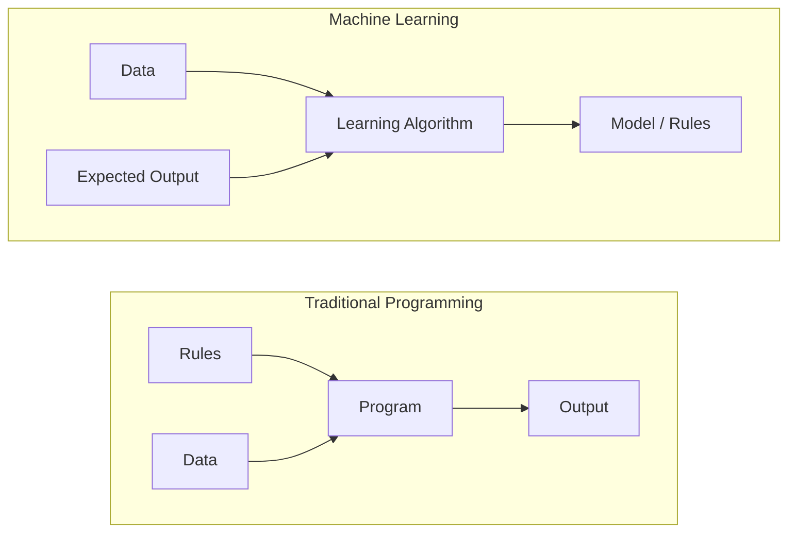
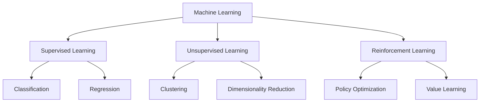
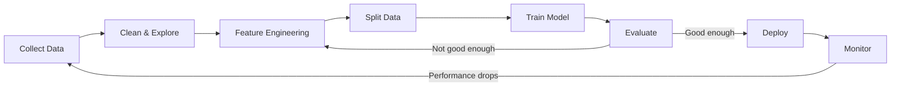
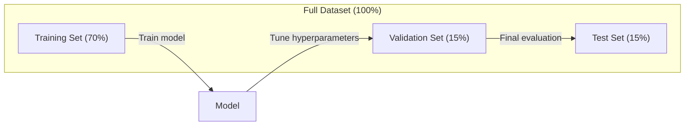
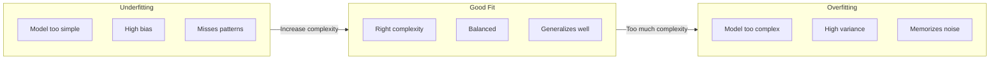
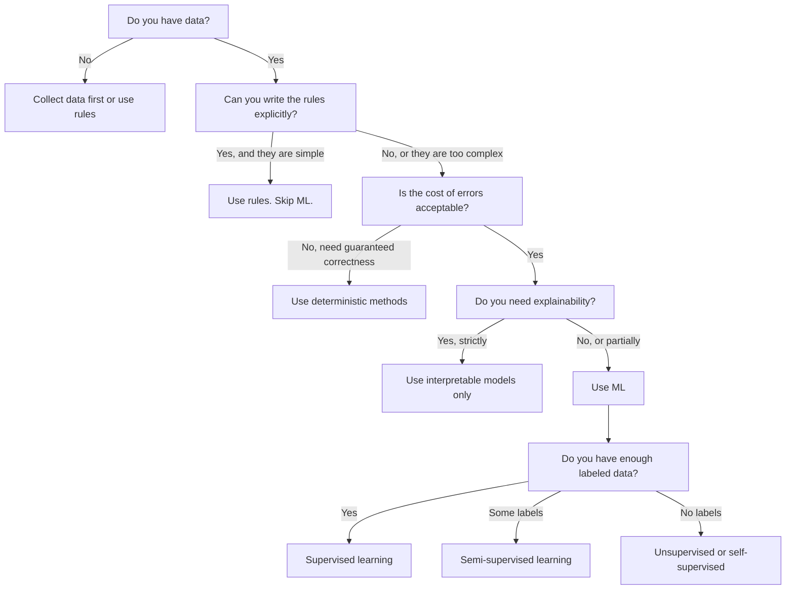

# Makine Öğrenimi Nedir?

> Makine öğrenimi, bilgisayarlara el ile kural yazmak yerine verilerde kalıplar bulmayı öğretiyor.

**Type:** Learn
**Languages:** Python
**Prerequisites:** Phase 1 (Math Foundations)
**Time:** ~45 minutes

## Öğrenme Hedefleri

- Gözetimli, gözetimsiz ve güçlendirme öğrenimi arasındaki farkı açıklayın ve belirli bir soruna hangi türde uygulanacağını belirleyin.
- En yakın merkez bölge sınıflandırıcısını sıfırdan uygulayın ve rastgele bir başlangıç çizgisi ile değerlendiriniz
- Sınıflandırma ve gerileme görevleri arasında ayrım yapın ve her bir için uygun kayıp fonksiyonunu seçin.
- Belirli bir iş sorununun ML için uygun olup olmadığını veya belirlenme kurallarıyla daha iyi çözülmediğini değerlendirmek

## Sorun

Spam filtreyi oluşturmak istiyorsunuz. Geleneksel yaklaşım: oturup yüzlerce kural yazın. "E-posta 'Ücretsiz Para' içerirse, spam işaretleyin. 3'den fazla çığlık işaretine sahipse, spam işaretleyin". Kural yazmak için haftalar harcıyorsunuz. Sonra spamcılar kelimelerini değiştirirler. Kurallarınız kırılır. Daha fazla kural yazıyorsunuz.

Makine öğrenimi bunu tersine çevirir. Kural yazmak yerine, bilgisayarına binlerce etiketlenmiş e-posta veriyorsunuz ("spam" veya "spam değil") ve kuralları kendi başına bulmasına izin veriyorsunuz. Bilgisayar asla düşünmediğiniz bir kalıp bulur. Spamcılar taktiklerini değiştirdiğinde, kod yazmak yerine yeni veriler üzerinde yeniden eğitilersiniz.

Bu değişim "programlama kurallarından" "verilerden öğrenme"e makineler öğrenmesinin çekirdeğidir. Her tavsiye motoru, ses asistanı, kendi kendine çalışan araba ve dil modeli bu şekilde çalışır.

## Anlaşım

### Kurallar değil, Verilerden Öğrenmek

Geleneksel programlama ve makine öğrenimi sorunları karşı yönde çözüyor.



Geleneksel programlama: kuralları yazıyorsunuz. Program onları verilere uyguluyor.

Makine öğrenimi: verileri ve beklenen çıkışları sağlıyorsunuz. Algoritm kuralları keşfeder.

Eğitimden çıkan "model" kurallardır, sayılar (koşullar, parametreler) olarak kodlanmıştır.

### Makine Öğrenimi Üç Türü



**Supervised Learning**Modelle giriş ve çıkış çiftleri vardır. Modelle giriş ve çıkışları haritalamayı öğrenir.
- "Burada kedi veya köpek etiketi olan 10.000 fotoğraf var.
- "Burada ev özellikleri ve fiyatları var.

**Unsupervised Learning**Sadece girişler var, etiket yok, model kendi kendine yapı bulur.
- "Burada 10.000 müşteri satın alma tarihi var. Doğal gruplamaları bulun".
- "Burada 1000 boyutlu veri noktası var. Yapısal olarak iki boyutlu olarak azaltın".

**Reinforcement Learning**Bir ajan, bir ortamda eylemler yapar ve ödül veya cezalar alır.
- "Bu oyunu oynayın. Kazanmak için +1 , kaybetmek için -1.
- "Bu robot kolunu kontrol et. Nesneyi ele geçirmek için +1'e, harcanmış her saniyede -0.01'e".

Pratik olarak inşa edeceğiniz şeylerin çoğu denetim altında öğrenmeyi kullanır. Denetimsiz öğrenme önceden işleme ve keşif için yaygındır.

### Büyük Üçlü'nün Ötesinde

Yukarıdaki üç kategori temizdir, ama gerçek dünya ML genellikle çizgileri bulanıklaştırır.

**Semi-supervised learning**Etiketlenmiş ve etiketlenmemiş bir dizi küçük veriyi kullanır. 100 etiketlenmiş tıbbi görüntü ve 100.000 etiketlenmemiş görüntü olabilir. Teknikler şunları içerir:

- **Label propagation:**Benzer veri noktalarını birbirine bağlayan bir grafik oluşturun. Etiketler etiketlenmiş düğümlerden etiketlenmemiş komşulara grafik üzerinden yayılır.
- **Pseudo-labeling:**Etiketlenmiş veriler üzerinde bir model eğit, etiketlenmemiş veriler için etiketleri tahmin etmek için kullan, sonra her şeyi yeniden eğit.
- **Consistency regularization:**Modeldeki giriş için aynı tahmin ve bu girişin biraz rahatsız edilmiş bir versiyonu verilmelidir.

**Self-supervised learning**Bu model, verilerin yapısından kendi tahmin görevini oluşturur.

- **Masked language modeling (BERT):**Bir cümlede kelimelerin %15'ini gizle, modelin eksik kelimeleri tahmin etmesini eğit. "Etiketler" orijinal metinden gelir.
- **Contrastive learning (SimCLR):**Bir görüntü alın, iki genişletilmiş versiyon oluşturun. Modelin aynı görüntüden geldiğini fark etmesini ve diğer görüntülerin genişletilmiş versiyonlarından ayırt etmesini eğitin.
- **Next-token prediction (GPT):**Önceki kelimeleri vererek bir sonraki kelimeyi tahmin edin. Her metin belge bir eğitim örneği haline gelir.

Bu üç büyük sınıftan ayrı kategoriler değil. Onlar denetim altında ve denetimsiz fikirleri birleştiren stratejiler. Kendini denetim altında öğrenme teknik olarak denetim altında (modeldeki bir şey öngörülür), ancak etiketler otomatik olarak üretilir, insanlar tarafından değil.

### Sınıflandırma vs. Geri dönüş

Bunlar iki ana denetimli öğrenme görevi.

| Aspect | Classification | Regression |
|--------|---------------|------------|
| Output | Discrete categories | Continuous numbers |
| Example | "Is this email spam?" | "What will the house price be?" |
| Output space | {cat, dog, bird} | Any real number |
| Loss function | Cross-entropy, accuracy | Mean squared error, MAE |
| Decision | Boundaries between classes | A curve that fits the data |

Sınıflama "ne kategori" cevabını verir.

Bazı sorunlar her iki şekilde de çerçeve edilebilir. Bir hisse senedi yükselmesinin veya düşmesinin tahmin edilmesi sınıflandırma demektir.

### ML Çalışma Akışı

Her makine öğrenme projesi algoritma ne olursa olsun aynı boru hattını takip eder.



**Collect Data**Daha fazla veri neredeyse her zaman daha iyidir, ancak kalite miktardan daha önemlidir.

**Clean & Explore**: Kayıp değerleri işleme, kopyaları kaldırma, dağılımları görselleştirme, anomalileri tespit etme.

**Feature Engineering**Modelin kullanabileceği özelliklere dönüştürmek. Tarihleri haftanın gününe dönüştürmek. Sayı sütunlarını normalleştirmek. Kategoriyal değişkenleri kodlamak. İyi özellikler, zarif algoritmalardan daha önemlidir.

**Split Data**: Eğitim, doğrulama ve test setlerine bölünür. Model eğitim verilerine dayanır, doğrulama verilerine hiperparametre ayarlanır ve test verilerine dayanarak son performans raporlanır.

**Train Model**: Algoritme'ye eğitim verilerini ekleyin. Algoritm bir kayıp fonksiyonunu en aza indirmek için iç parametreleri ayarlar.

**Evaluate**Eğer performans kabul edilemezse, geri dönüp farklı özellikleri, algoritmaları veya hiperparametreyi deneyin.

**Deploy**Modelle yeni verilere göre tahminler yaparak üretime koyun.

**Monitor**: Zamanla performans izleyin. Veriler dağıtımları değişir (veriler sürüklenir) ve modeller bozulur. Performans düştüğünde, yeniden eğitil.

### Eğitim, Valide ve Sınav Bölümleri

Bu, yeni başlayanların yanlış anladığı en önemli kavramdır. Modelini eğitimin sırasında hiç görmediği verilere dayanarak değerlendirmelisin. Aksi takdirde öğrenme değil hafıza ölçüyorsunuz.



| Split | Purpose | When used | Typical size |
|-------|---------|-----------|-------------|
| Training | Model learns from this data | During training | 60-80% |
| Validation | Tune hyperparameters, compare models | After each training run | 10-20% |
| Test | Final unbiased performance estimate | Once, at the very end | 10-20% |

Test setinin kutsal olduğu için, tam bir kez bakarsınız. Eğer test performansına göre modelinizi düzenlemeye devam ederseniz, test setinde etkili bir şekilde eğitim veriyorsunuz ve rapor edilen rakamlarınız anlamsızdır.

Küçük veri kümeleri için k katlı çapraz onay kullanın: verileri k parçalara ayırın, k-1 parçaları üzerinde çalışın, kalan kısmını onaylayın, döndürün ve ortalama sonuçlar.

### Üstü vs. Altı



**Underfitting**Modeldeki kalıpları yakalamak için çok basit. Kürük bir ilişkiyi uyumlu hale getirmeye çalışan düz çizgi. Eğitim hatası yüksek. Test hatası yüksek.

**Overfitting**Modelle çok karmaşık ve sesleri de dahil olmak üzere eğitim verilerini ezberler. Her eğitim noktasından geçen, ancak yeni verilerde başarısız olan bir kaygan eğri. Eğitim hatası düşük. Test hatası yüksek.

**Good fit**: Modelle, gürültüyi ezberlemeden gerçek desenleri yakalar.

Üstü takma belirtileri:
- Eğitim doğruluğu, onay doğruluğundan çok daha yüksek.
- Model eğitim verileri üzerinde iyi performans gösterir, ancak yeni veriler üzerinde kötü performans gösterir.
- Daha fazla eğitim verisini eklemek performansı artırır (modeldeki öğrenme değil, ezberlemeydi)

Üstü takma için sabitlemeler:
- Daha fazla eğitim verisini alın
- Modelin karmaşıklığını azaltmak (sadece parametreler, daha basit mimarlık)
- Düzenlendirme (büyük ağırlıklar için ceza eklenir)
- İptal (eğitim sırasında tesadüfen nöronları sıfırlamak)
- Erken durdurma (valyasyon hatası artmaya başladığında eğitim durdurma)

İhtiyacın düşük olması için sabitlemeler:
- Daha karmaşık bir model kullanın
- Daha fazla özellik ekle
- Düzenlenmeyi azaltmak
- Tren daha uzun

### Tarafsızlık ve Çeşitlilik Arası

Bu, aşırı ve düşük uyum altında kalmanın arkasındaki matematiksel çerçeve.

**Bias**Modeldeki yanlış varsayımlardan kaynaklanan hata. Gerçek ilişki doğrusal olmayan bir modeldeki yüksek önyargıya sahiptir. Yüksek önyargı uygunsuzluğa yol açar.

**Variance**Eğitim verilerindeki küçük dalgalanmalara karşı hassasiyet hatası. Yüksek varyansa olan bir model, farklı veri alt kümeleri üzerinde eğitildiğinde çok farklı tahminler verir. Yüksek varyansa aşırı uyumlu hale gelmesine neden olur.

| Model complexity | Bias | Variance | Result |
|-----------------|------|----------|--------|
| Too low (linear model for curved data) | High | Low | Underfitting |
| Just right | Medium | Medium | Good generalization |
| Too high (degree-20 polynomial for 10 points) | Low | High | Overfitting |

Toplam hata = Tarafsızlık^2 + Varians + Kısıtlanamayan gürültü

Kısıtlanamayan gürültüyi azaltamazsınız (bu verilerin kendisinde rastlantı) ve önyargının en az olarak azaltıldığı tatlı noktayı bulmak istiyorsunuz.

### Ücretsiz Öğle Öğle Teoremi Yok

Her sorunun en iyi işlediği tek bir algoritma yoktur. Bir sorunun bir sınıfında iyi performans gösteren bir algoritma, bir diğerinde kötü performans gösterecektir. Bu nedenle veri bilimcileri birden fazla algoritma denemek ve sonuçları karşılaştırmak için nedenler vardır.

Bu seçim, pratikte aşağıdakilere bağlıdır:
- Ne kadar veri var
- Kaç tane özellik var ?
- İlişki doğrusal ya da doğrusal olmayan
- Anlatabilme ihtiyacınız olup olmadığını
- Ne kadar hesaplayabilirsin

### Makine Öğrenimi Ne Zaman Kullanmaması Gerekebilir

ML güçlü bir araç ama her zaman doğru değildir.

**Do not use ML when:**

- **Rules are simple and well-defined.**Vergi hesaplamaları, sıralama algoritmaları, birim dönüşümleri. Eğer mantığı birkaç if if if if if if if if if if if if if if if if if if if if if if if if if if if if if if if if if if if if if if if if if if if if if if if if if if if if if if if if if if if if if if if if if if if if if if if if if if if if if if if if if if if if if if if if if if if if if if if if if if if if if if if if if if if if if if if if if if if if if if if if if if if if if if if if if if if if if if if if if if if if if if if if if if if if if if if if if if if if if if if if if if if if if if if if if if if if if if if if if if if if if if if if if if if if if if if if if if if if if if if if if if if if if if if if if if if if if if if if if if if if if if if if if if if if if if if if if if if if if if if if if if if if if if if if if if if if if if if if if if if if if if if if if if if if if if if if if if if if if if if if if if if if if if if if if if if if if if if if if if if if if if if if if if if if if if if if if if if if if if if if if if if if if if if if if if if if if if if if if if if if if if if if if if if if if if if if if if if if if if if if if if if if if if if if if if if if if if if if if if if if if if if if if if if if if if if if if if if if if if if if if if if if if if if if if if if if if if if if if if if if if if if if if if if if if if if if if if if if if if if if if if if if if if if if if if if if if if if if if if if if if if if if if if if if if if if if if if if if if if if if if if if if if if if if if
- **You have no data or very little data.**ML'nin öğrenmek için örnekler ihtiyacı var. 10 veri noktasıyla anlamlı bir şey eğitemezsin. Önce verileri topla.
- **The cost of being wrong is catastrophic and you need guaranteed correctness.**Tıbbi doz hesaplaması, nükleer reaktör kontrolü, şifreleme doğrulama. ML modelleri olasılıklıdır. Bazen yanılıyorlar.
- **A lookup table or heuristic solves the problem.**Eğer basit bir eşiğin veya tabloun %99'u kapsamaktadırsa, ML eklenmesi, bakım maliyetlerini anlamlı bir iyileştirme olmadan arttırır.
- **You cannot explain the decision and explainability is required.**Düzenlenmiş endüstriler (kredit, sigorta, ceza adaleti) bazen her kararın tam olarak açıklanabilmesini gerektirir.
- **The problem changes faster than you can retrain.**Kurallar her gün değişirse ve yeniden eğitim bir hafta sürerse model her zaman eski olur.

Bu karar akış çizelgesini kullanın:



```figure
f3-learning-boundary
```

## Yapın

Kodun içinde .`code/ml_intro.py`En basit ML algoritması olan en yakın merkez bölge sınıflandırıcısını sıfırdan uyguluyor.

### Adım 1: En yakın Centroid sınıflandırıcısı sıfırdan

En yakın merkez sınıflandırıcısı, eğitim verilerindeki her sınıfın merkezini (orta) hesaplar. Tahmin etmek için, her yeni noktayı en yakın merkezi olan sınıfına tahsis eder.

```python
class NearestCentroid:
    def fit(self, X, y):
        self.classes = np.unique(y)
        self.centroids = np.array([
            X[y == c].mean(axis=0) for c in self.classes
        ])

    def predict(self, X):
        distances = np.array([
            np.sqrt(((X - c) ** 2).sum(axis=1))
            for c in self.centroids
        ])
        return self.classes[distances.argmin(axis=0)]
```

Bu tüm algoritma. Fit iki yolu hesaplar. Predict mesafeleri hesaplar.

### İkinci Adım: Sintez veriyi eğit

İki sınıfın biraz üst üste geçişiyle 2 boyutlu bir sınıflandırma verisi oluştururuz.

```python
rng = np.random.RandomState(42)
X_class0 = rng.randn(100, 2) + np.array([1.0, 1.0])
X_class1 = rng.randn(100, 2) + np.array([-1.0, -1.0])
X = np.vstack([X_class0, X_class1])
y = np.array([0] * 100 + [1] * 100)
```

### Üçüncü Adım: Başlangıç Bilgiyle Karşılaştır

Her ML modeli önemsiz bir temel çizgiyle karşılaştırılmalıdır. Burada, temel çizgi rastgele bir sınıf öngörüyor. Eğer ML modeli rastgele tahminleri yenmezse, bir şey yanlış.

```python
baseline_preds = rng.choice([0, 1], size=len(y_test))
baseline_acc = np.mean(baseline_preds == y_test)
```

Merkez bölümü sınıflandırıcısı bu temiz veri kümesinde %90+ doğruluk elde etmeli.

### Neden Önemli?

En yakın merkez bölge sınıflandırıcısı önemsiz bir şekilde basit. Hiperparametre, iterasyon veya gradient düşüşü yoktur.

1. **Learn**Eğitim verilerinden bir temsil (centroids)
2. **Predict**Bu temsil ile ilgili yeni veriler (en yakın mesafe)
3. **Evaluate**Baseline karşısında (hassasi tahmin)

Her ML algoritması, lojistik gerileme ile transformatörlere kadar, aynı üç adımlı bir kalıp izler.

### Adım 4: Centroid sınıflandırıcısı ne yapamaz

En yakın merkez bölge sınıflandırıcısı, her sınıfın tek bir nokta oluşturduğunu varsayır.

- Sınıflar birden fazla kümelere sahiptir (örneğin, "1" rakamı çeşitli şekillerde yazılabilir)
- Karar sınırı doğrusal değildir (örneğin, bir sınıf diğerini sarar)
- Özellikler çok farklı ölçeklere sahiptir (uzaktan en büyük ölçek özellikleri baskınlık yapmaktadır)

Bu sınırlamalar öğrendiğiniz diğer algoritmaları motive eder. K'nin en yakın komşuları birden fazla kümeleri ele alır. Karar ağaçları çizgisiz sınırları ele alır. Özellik ölçekleme ölçek sorunu çözür. Her ders önceki birinin sınırlamalarına dayanır.

## Kullan

sklearn sağlıyor `NearestCentroid`ve sentetik veri üreticileri:

```python
from sklearn.neighbors import NearestCentroid
from sklearn.datasets import make_classification
from sklearn.model_selection import train_test_split

X, y = make_classification(
    n_samples=500, n_features=2, n_redundant=0,
    n_clusters_per_class=1, random_state=42
)
X_train, X_test, y_train, y_test = train_test_split(X, y, test_size=0.3)

clf = NearestCentroid()
clf.fit(X_train, y_train)
print(f"Accuracy: {clf.score(X_test, y_test):.3f}")
```

## Gönder

Bu ders bize çok yararlı .`outputs/prompt-ml-problem-framer.md`- belirsiz iş sorunlarını, tam bir ML görevlerine dönüştüren bir istek. Bir sorun açıklaması verin ("çıkışı azaltmak istiyoruz" veya "ölçümcü çeyrek için talep tahmin edelim") ve öğrenme türünü tanımlar, tahmin hedefini tanımlar, aday özelliklerini listeler, bir başarı ölçüsü seçer, bir temel çizgi oluşturur ve verilerin sızması veya sınıf dengesizliği gibi tuzakları işaretler. Yanlış şeyi yapmaktan kaçınmak için herhangi bir ML projesinin başında kullanın.

## Anahtar Terimler

| Term | What people say | What it actually means |
|------|----------------|----------------------|
| Model | "The AI" | A mathematical function with learnable parameters that maps inputs to outputs |
| Training | "Teaching the AI" | Running an optimization algorithm to adjust model parameters so predictions match known outputs |
| Feature | "An input column" | A measurable property of the data that the model uses to make predictions |
| Label | "The answer" | The known output for a training example, used to compute the error signal |
| Hyperparameter | "A setting you tweak" | A parameter set before training that controls the learning process (learning rate, number of layers) |
| Loss function | "How wrong the model is" | A function that measures the gap between predicted and actual outputs, which training tries to minimize |
| Overfitting | "It memorized the test" | The model learned training-specific noise instead of general patterns, so it fails on new data |
| Underfitting | "It didn't learn anything" | The model is too simple to capture the real patterns in the data |
| Generalization | "It works on new data" | The model's ability to make accurate predictions on data it was not trained on |
| Cross-validation | "Testing on different chunks" | Repeatedly splitting data into train/test folds and averaging results, giving a more robust performance estimate |
| Regularization | "Keeping weights small" | Adding a penalty term to the loss function that discourages overly complex models |
| Data drift | "The world changed" | The statistical distribution of incoming data shifts over time, degrading model performance |

## Egzersizler

1. Herhangi bir veri kümesini (örneğin Iris, Titanic) alın. 70/15/15'i tren/validasyon/test olarak bölün.
2. Her bir sorun için sınıflandırma, geri dönüş veya gruplama olup olmadığını ve denetim altında olup olmadığını belirleyin.
3. Bir model eğitim verilerinde %99 doğruluk elde eder, test verilerinde ise %60 doğruluk elde eder.

## Daha Fazla Okumak

- [An Introduction to Statistical Learning](https://www.statlearning.com/)- tüm klasik ML yöntemlerini kapsadığı ücretsiz ders kitabı pratik örneklerle
- [Google's Machine Learning Crash Course](https://developers.google.com/machine-learning/crash-course)- ML kavramlarına kısa bir görsel giriş
- [Scikit-learn User Guide](https://scikit-learn.org/stable/user_guide.html)- Python'da ML uygulaması için pratik referans
