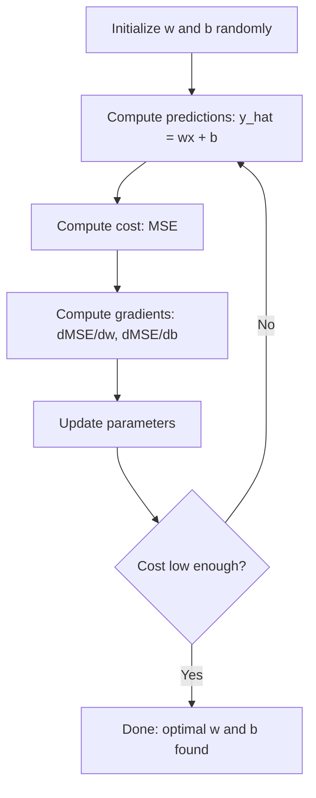

# Düzsel Geri Dönüş

> Düzsel geri dönüş, verilerinizi en iyi düz çizgiyi çizer. Bu makine öğrenme "hello world"ıdır.

**Type:** Build
**Languages:** Python
**Prerequisites:** Phase 1 (Linear Algebra, Calculus, Optimization), Phase 2 Lesson 1
**Time:** ~90 minutes

## Öğrenme Hedefleri

- Orta kareler hatası için gradient düşüş güncelleme kurallarını çıkarın ve sıfırdan çizgisi geri dönüşü uygulayın
- Bilgisayar karmaşıklığı açısından gradient düşüşü ve normal denklemle karşılaştırın ve her birini ne zaman kullanmanız gerektiği
- Özellik standartlaması ile birden fazla doğrusal gerileme modeli oluşturun ve öğrenilen ağırlıkları yorumlayın
- Ridge gerilemesinin (L2 düzenlenmesi) büyük ağırlıkları cezalandırarak aşırı uyumlu olmayı nasıl engellediğini açıklayın

## Sorun

Evlerin boyutları ve satış fiyatları. Yeni bir evin fiyatını tahmin etmek istersin.

Hattı gerileme size bu çizgiyi verir. Daha da önemlisi, tüm ML eğitim döngüsünü içeriyor: bir model tanımlamak, bir maliyet fonksiyonunu tanımlamak, parametreleri optimize etmek. Her ML algoritması aynı kalıpı takip eder. En basit durumla burada ustalaşın ve her yerde tanıyacaksınız.

Bu sadece basit sorunlar için değil. Linyer gerileme talep tahminleri, A / B test analizi, finansal modellerleme ve her gerileme görevi için bir temel olarak üretim sistemlerinde kullanılır.

## Anlaşım

### Örnek

Düzsel gerileme giriş (x) ve çıkış (y) arasındaki düzsel bir ilişkiyi varsayır:

```
y = wx + b
```

- `w`(koleksiyon/eğim): x 1 arttığında y'nin değişimi
- `b`(bias/intercept): x = 0 olduğunda y'nin değeri

Çoklu girişler (karakterlikler) için, bu aşağıdakilere kadar uzanır:

```
y = w1*x1 + w2*x2 + ... + wn*xn + b
```

Ya da vektör biçiminde: `y = w^T * x + b`

Amaç: tüm eğitim örneklerinde öngörülen y'yi mümkün olduğunca gerçek y'ye yakın hale getiren w ve b değerlerini bulmak.

### Maliyet işlevi (Orta Çekirde Hata)

"Mümkün olduğunca yakın" ölçmek için nasıl bir sayı gerekir? Öncülüklerinizin ne kadar yanlış olduğunu anlatan tek bir sayı gerekir. En yaygın seçenek ortalama kare hatadır (MSE):

```
MSE = (1/n) * sum((y_predicted - y_actual)^2)
```

Neden kare? İki neden. Birincisi, büyük hataları küçük hatalardan daha fazla cezalandırır (10'un hatası 1'den 100 kat daha kötüdür, 10'un hatasından daha kötüdür).

Masraf fonksiyonu bir yüzey oluşturur. Tek bir ağırlık w ve önyargı b için, MSE yüzeyi bir kase gibi görünür (konveks bir paraboloid).

### Aralıklı Düşüş

Devamlı bir inme, tepeden aşağı adımlar atarak kavanozun dibini bulur.



Değişkenler size iki şeyi söyler: her parametreyi hangi yönde hareket ettirmek ve ne kadar hareket etmek.

Y_hat = wx + b ile MSE için:

```
dMSE/dw = (2/n) * sum((y_hat - y) * x)
dMSE/db = (2/n) * sum(y_hat - y)
```

Güncelleme kuralı:

```
w = w - learning_rate * dMSE/dw
b = b - learning_rate * dMSE/db
```

Öğrenme hızı adım boyutunu kontrol eder. Çok büyük: minimumı aşarsınız ve ayrılığa düşersiniz. Çok küçük: eğitim sonsuza kadar sürer. Tipik başlangıç değerleri: 0.01, 0.001, veya 0.0001.

### Normal denklem (Kuplanmış Form Çözümü)

Özellikle doğrusal gerileme için, herhangi bir iterasyon olmadan en iyi ağırlıkları veren doğrudan bir formül vardır:

```
w = (X^T * X)^(-1) * X^T * y
```

Bu, bir adım içinde w için çözülecek bir matrisin tersine çevirir. Küçük veri kümeleri için mükemmel bir şekilde çalışır. Büyük veri kümeleri için (milyonlarca satır veya binlerce özellik), gradient düşüşü özellik sayısı için tercih edilir.

### Çoklu Düzsel Geri Dönüş

Çoklu özelliklerle, model:

```
y = w1*x1 + w2*x2 + ... + wn*xn + b
```

Her şey aynı şekilde çalışır: MSE maliyet fonksiyonu, gradient düşüşü tüm ağırlıkları aynı anda güncelleyebilir. Tek fark, bir çizgi yerine bir hiper düzlem yerleştirmek.

Özellik ölçeklemesi burada önemlidir. Eğer bir özellik 0'dan 1'e, diğerinden 0'dan 1.000.000'e kadar değişirse, maliyet yüzeyi uzanırken gradient düşüşü zorlanacaktır.

### Polinom geri dönüşü

Eğer ilişki doğrusal değilse ne olacak?

```
y = w1*x + w2*x^2 + w3*x^3 + b
```

Bu hala "lineer" geri dönüştür, çünkü model ağırlıklarda (w1, w2, w3) doğrusaldır.

Yüksek dereceleri polinomlar daha karmaşık eğriye uyum sağlayabilir, ancak aşırı uyum sağlama riski vardır. 10 dereceli bir polinom 10 nokta verisi kümesindeki her noktayı geçecek, ancak yeni veriler üzerinde kötü tahmin edecektir.

### R-Squared puanı

MSE size ne kadar yanıldığınızı söyler, ancak sayı y'in ölçeğine bağlıdır. R kare (R^2) ölçek bağımsız bir ölçüm verir:

```
R^2 = 1 - (sum of squared residuals) / (sum of squared deviations from mean)
    = 1 - SS_res / SS_tot
```

- R^2 = 1.0: mükemmel tahminler
- R^2 = 0.0: model her seferinde ortalamayı tahmin etmekten daha iyi değildir
- R^2 < 0.0: model ortalama tahmininden daha kötüdür

### Düzenleme Önbellek (Ridge Regression)

Çok sayıda özellik varsa, model büyük ağırlıklar tahsis ederek aşırı uyum sağlayabilir.

```
Cost = MSE + lambda * sum(w_i^2)
```

Ceza terimi büyük ağırlıkları engeller. Hiperparametr lambda, ödemeyi kontrol eder: daha yüksek lambda daha küçük ağırlıkları ve daha fazla düzenlenmeyi ifade eder. Bu daha sonraki bir dersde derinlemesine ele alınacaktır.

```figure
linear-regression-fit
```

## Yapın

### Adım 1: Örnek verileri oluştur

```python
import random
import math

random.seed(42)

TRUE_W = 3.0
TRUE_B = 7.0
N_SAMPLES = 100

X = [random.uniform(0, 10) for _ in range(N_SAMPLES)]
y = [TRUE_W * x + TRUE_B + random.gauss(0, 2.0) for x in X]

print(f"Generated {N_SAMPLES} samples")
print(f"True relationship: y = {TRUE_W}x + {TRUE_B} (+ noise)")
print(f"First 5 points: {[(round(X[i], 2), round(y[i], 2)) for i in range(5)]}")
```

### Adım 2: Dönüşe doğru aşağıdaki derecede sıfırdan çizgi gerileme

```python
class LinearRegression:
    def __init__(self, learning_rate=0.01):
        self.w = 0.0
        self.b = 0.0
        self.lr = learning_rate
        self.cost_history = []

    def predict(self, X):
        return [self.w * x + self.b for x in X]

    def compute_cost(self, X, y):
        predictions = self.predict(X)
        n = len(y)
        cost = sum((pred - actual) ** 2 for pred, actual in zip(predictions, y)) / n
        return cost

    def compute_gradients(self, X, y):
        predictions = self.predict(X)
        n = len(y)
        dw = (2 / n) * sum((pred - actual) * x for pred, actual, x in zip(predictions, y, X))
        db = (2 / n) * sum(pred - actual for pred, actual in zip(predictions, y))
        return dw, db

    def fit(self, X, y, epochs=1000, print_every=200):
        for epoch in range(epochs):
            dw, db = self.compute_gradients(X, y)
            self.w -= self.lr * dw
            self.b -= self.lr * db
            cost = self.compute_cost(X, y)
            self.cost_history.append(cost)
            if epoch % print_every == 0:
                print(f"  Epoch {epoch:4d} | Cost: {cost:.4f} | w: {self.w:.4f} | b: {self.b:.4f}")
        return self

    def r_squared(self, X, y):
        predictions = self.predict(X)
        y_mean = sum(y) / len(y)
        ss_res = sum((actual - pred) ** 2 for actual, pred in zip(y, predictions))
        ss_tot = sum((actual - y_mean) ** 2 for actual in y)
        return 1 - (ss_res / ss_tot)


print("=== Training Linear Regression (Gradient Descent) ===")
model = LinearRegression(learning_rate=0.005)
model.fit(X, y, epochs=1000, print_every=200)
print(f"\nLearned: y = {model.w:.4f}x + {model.b:.4f}")
print(f"True:    y = {TRUE_W}x + {TRUE_B}")
print(f"R-squared: {model.r_squared(X, y):.4f}")
```

### Adım 3: Normal denklem (kapalı biçimli çözüm)

```python
class LinearRegressionNormal:
    def __init__(self):
        self.w = 0.0
        self.b = 0.0

    def fit(self, X, y):
        n = len(X)
        x_mean = sum(X) / n
        y_mean = sum(y) / n
        numerator = sum((X[i] - x_mean) * (y[i] - y_mean) for i in range(n))
        denominator = sum((X[i] - x_mean) ** 2 for i in range(n))
        self.w = numerator / denominator
        self.b = y_mean - self.w * x_mean
        return self

    def predict(self, X):
        return [self.w * x + self.b for x in X]

    def r_squared(self, X, y):
        predictions = self.predict(X)
        y_mean = sum(y) / len(y)
        ss_res = sum((actual - pred) ** 2 for actual, pred in zip(y, predictions))
        ss_tot = sum((actual - y_mean) ** 2 for actual in y)
        return 1 - (ss_res / ss_tot)


print("\n=== Normal Equation (Closed-Form) ===")
model_normal = LinearRegressionNormal()
model_normal.fit(X, y)
print(f"Learned: y = {model_normal.w:.4f}x + {model_normal.b:.4f}")
print(f"R-squared: {model_normal.r_squared(X, y):.4f}")
```

### Adım 4: Çoklu doğrusal gerileme

```python
class MultipleLinearRegression:
    def __init__(self, n_features, learning_rate=0.01):
        self.weights = [0.0] * n_features
        self.bias = 0.0
        self.lr = learning_rate
        self.cost_history = []

    def predict_single(self, x):
        return sum(w * xi for w, xi in zip(self.weights, x)) + self.bias

    def predict(self, X):
        return [self.predict_single(x) for x in X]

    def compute_cost(self, X, y):
        predictions = self.predict(X)
        n = len(y)
        return sum((pred - actual) ** 2 for pred, actual in zip(predictions, y)) / n

    def fit(self, X, y, epochs=1000, print_every=200):
        n = len(y)
        n_features = len(X[0])
        for epoch in range(epochs):
            predictions = self.predict(X)
            errors = [pred - actual for pred, actual in zip(predictions, y)]
            for j in range(n_features):
                grad = (2 / n) * sum(errors[i] * X[i][j] for i in range(n))
                self.weights[j] -= self.lr * grad
            grad_b = (2 / n) * sum(errors)
            self.bias -= self.lr * grad_b
            cost = self.compute_cost(X, y)
            self.cost_history.append(cost)
            if epoch % print_every == 0:
                print(f"  Epoch {epoch:4d} | Cost: {cost:.4f}")
        return self

    def r_squared(self, X, y):
        predictions = self.predict(X)
        y_mean = sum(y) / len(y)
        ss_res = sum((actual - pred) ** 2 for actual, pred in zip(y, predictions))
        ss_tot = sum((actual - y_mean) ** 2 for actual in y)
        return 1 - (ss_res / ss_tot)


random.seed(42)
N = 100
X_multi = []
y_multi = []
for _ in range(N):
    size = random.uniform(500, 3000)
    bedrooms = random.randint(1, 5)
    age = random.uniform(0, 50)
    price = 50 * size + 10000 * bedrooms - 1000 * age + 50000 + random.gauss(0, 20000)
    X_multi.append([size, bedrooms, age])
    y_multi.append(price)


def standardize(X):
    n_features = len(X[0])
    means = [sum(X[i][j] for i in range(len(X))) / len(X) for j in range(n_features)]
    stds = []
    for j in range(n_features):
        variance = sum((X[i][j] - means[j]) ** 2 for i in range(len(X))) / len(X)
        stds.append(variance ** 0.5)
    X_scaled = []
    for i in range(len(X)):
        row = [(X[i][j] - means[j]) / stds[j] if stds[j] > 0 else 0 for j in range(n_features)]
        X_scaled.append(row)
    return X_scaled, means, stds


y_mean_val = sum(y_multi) / len(y_multi)
y_std_val = (sum((yi - y_mean_val) ** 2 for yi in y_multi) / len(y_multi)) ** 0.5
y_scaled = [(yi - y_mean_val) / y_std_val for yi in y_multi]

X_scaled, x_means, x_stds = standardize(X_multi)

print("\n=== Multiple Linear Regression (3 features) ===")
print("Features: house size, bedrooms, age")
multi_model = MultipleLinearRegression(n_features=3, learning_rate=0.01)
multi_model.fit(X_scaled, y_scaled, epochs=1000, print_every=200)

print(f"\nWeights (standardized): {[round(w, 4) for w in multi_model.weights]}")
print(f"Bias (standardized): {multi_model.bias:.4f}")
print(f"R-squared: {multi_model.r_squared(X_scaled, y_scaled):.4f}")
```

### Adım 5: Polinom geri dönüşü

```python
class PolynomialRegression:
    def __init__(self, degree, learning_rate=0.01):
        self.degree = degree
        self.weights = [0.0] * degree
        self.bias = 0.0
        self.lr = learning_rate

    def make_features(self, X):
        return [[x ** (d + 1) for d in range(self.degree)] for x in X]

    def predict(self, X):
        features = self.make_features(X)
        return [sum(w * f for w, f in zip(self.weights, row)) + self.bias for row in features]

    def fit(self, X, y, epochs=1000, print_every=200):
        features = self.make_features(X)
        n = len(y)
        for epoch in range(epochs):
            predictions = [sum(w * f for w, f in zip(self.weights, row)) + self.bias for row in features]
            errors = [pred - actual for pred, actual in zip(predictions, y)]
            for j in range(self.degree):
                grad = (2 / n) * sum(errors[i] * features[i][j] for i in range(n))
                self.weights[j] -= self.lr * grad
            grad_b = (2 / n) * sum(errors)
            self.bias -= self.lr * grad_b
            if epoch % print_every == 0:
                cost = sum(e ** 2 for e in errors) / n
                print(f"  Epoch {epoch:4d} | Cost: {cost:.6f}")
        return self

    def r_squared(self, X, y):
        predictions = self.predict(X)
        y_mean = sum(y) / len(y)
        ss_res = sum((actual - pred) ** 2 for actual, pred in zip(y, predictions))
        ss_tot = sum((actual - y_mean) ** 2 for actual in y)
        return 1 - (ss_res / ss_tot)


random.seed(42)
X_poly = [x / 10.0 for x in range(0, 50)]
y_poly = [0.5 * x ** 2 - 2 * x + 3 + random.gauss(0, 1.0) for x in X_poly]

x_max = max(abs(x) for x in X_poly)
X_poly_norm = [x / x_max for x in X_poly]
y_poly_mean = sum(y_poly) / len(y_poly)
y_poly_std = (sum((yi - y_poly_mean) ** 2 for yi in y_poly) / len(y_poly)) ** 0.5
y_poly_norm = [(yi - y_poly_mean) / y_poly_std for yi in y_poly]

print("\n=== Polynomial Regression (degree 2 vs degree 5) ===")
print("True relationship: y = 0.5x^2 - 2x + 3")

print("\nDegree 2:")
poly2 = PolynomialRegression(degree=2, learning_rate=0.1)
poly2.fit(X_poly_norm, y_poly_norm, epochs=2000, print_every=500)
print(f"  R-squared: {poly2.r_squared(X_poly_norm, y_poly_norm):.4f}")

print("\nDegree 5:")
poly5 = PolynomialRegression(degree=5, learning_rate=0.1)
poly5.fit(X_poly_norm, y_poly_norm, epochs=2000, print_every=500)
print(f"  R-squared: {poly5.r_squared(X_poly_norm, y_poly_norm):.4f}")

print("\nDegree 2 fits the true curve well. Degree 5 fits training data slightly better")
print("but risks overfitting on new data.")
```

### Adım 6: Ridge regresyonu (L2 düzenlenmesi)

```python
class RidgeRegression:
    def __init__(self, n_features, learning_rate=0.01, alpha=1.0):
        self.weights = [0.0] * n_features
        self.bias = 0.0
        self.lr = learning_rate
        self.alpha = alpha

    def predict_single(self, x):
        return sum(w * xi for w, xi in zip(self.weights, x)) + self.bias

    def predict(self, X):
        return [self.predict_single(x) for x in X]

    def fit(self, X, y, epochs=1000, print_every=200):
        n = len(y)
        n_features = len(X[0])
        for epoch in range(epochs):
            predictions = self.predict(X)
            errors = [pred - actual for pred, actual in zip(predictions, y)]
            mse = sum(e ** 2 for e in errors) / n
            reg_term = self.alpha * sum(w ** 2 for w in self.weights)
            cost = mse + reg_term
            for j in range(n_features):
                grad = (2 / n) * sum(errors[i] * X[i][j] for i in range(n))
                grad += 2 * self.alpha * self.weights[j]
                self.weights[j] -= self.lr * grad
            grad_b = (2 / n) * sum(errors)
            self.bias -= self.lr * grad_b
            if epoch % print_every == 0:
                print(f"  Epoch {epoch:4d} | Cost: {cost:.4f} | L2 penalty: {reg_term:.4f}")
        return self


print("\n=== Ridge Regression (L2 Regularization) ===")
print("Same data as multiple regression, with alpha=0.1")
ridge = RidgeRegression(n_features=3, learning_rate=0.01, alpha=0.1)
ridge.fit(X_scaled, y_scaled, epochs=1000, print_every=200)
print(f"\nRidge weights: {[round(w, 4) for w in ridge.weights]}")
print(f"Plain weights: {[round(w, 4) for w in multi_model.weights]}")
print("Ridge weights are smaller (shrunk toward zero) due to the L2 penalty.")
```

## Kullan

Şimdi aynı şey, üretiminde kullanacağınız scikit-learn ile de geçerli.

```python
from sklearn.linear_model import LinearRegression as SklearnLR
from sklearn.linear_model import Ridge
from sklearn.preprocessing import PolynomialFeatures, StandardScaler
from sklearn.model_selection import train_test_split
from sklearn.metrics import mean_squared_error, r2_score
import numpy as np

np.random.seed(42)
X_sk = np.random.uniform(0, 10, (100, 1))
y_sk = 3.0 * X_sk.squeeze() + 7.0 + np.random.normal(0, 2.0, 100)

X_train, X_test, y_train, y_test = train_test_split(X_sk, y_sk, test_size=0.2, random_state=42)

lr = SklearnLR()
lr.fit(X_train, y_train)
y_pred = lr.predict(X_test)

print("=== Scikit-learn Linear Regression ===")
print(f"Coefficient (w): {lr.coef_[0]:.4f}")
print(f"Intercept (b): {lr.intercept_:.4f}")
print(f"R-squared (test): {r2_score(y_test, y_pred):.4f}")
print(f"MSE (test): {mean_squared_error(y_test, y_pred):.4f}")

poly = PolynomialFeatures(degree=2, include_bias=False)
X_poly_sk = poly.fit_transform(X_train)
X_poly_test = poly.transform(X_test)

lr_poly = SklearnLR()
lr_poly.fit(X_poly_sk, y_train)
print(f"\nPolynomial degree 2 R-squared: {r2_score(y_test, lr_poly.predict(X_poly_test)):.4f}")

scaler = StandardScaler()
X_train_scaled = scaler.fit_transform(X_train)
X_test_scaled = scaler.transform(X_test)

ridge = Ridge(alpha=1.0)
ridge.fit(X_train_scaled, y_train)
print(f"Ridge R-squared: {r2_score(y_test, ridge.predict(X_test_scaled)):.4f}")
print(f"Ridge coefficient: {ridge.coef_[0]:.4f}")
```

Scikit-learn'ın ve Scikit-learning'ın uygulaması aynı sonuçları verir. Farklılık: Scikit-learn kenar durumları, sayısal istikrar ve performans optimizasyonlarını ele alır.

## Gönder

Bu ders şunları ortaya çıkarır:
- `outputs/skill-regression.md`- soruna göre doğru gerileme yaklaşımını seçme becerisi

## Egzersizler

1. Parçelerdaki gradient düşüşünü, stohastik gradient düşüşünü (SGD) ve mini-parçelerdeki gradient düşüşünü uygulayın. Aynı veri kümesinde yakınlaşma hızını karşılaştırın. Hangisi en hızlı yakınlaşır? Hangisinin en düzgün maliyet eğri var?
2. Bir küp fonksiyonundan veri oluşturmak (y = ax^3 + bx^2 + cx + d + gürültü). 1, 3 ve 10 dereceye ait uyumlu polinomlar.
3. Lasso geri dönüşü uygulayın (L1 düzenlenmesi: ceza alfa *((sümesi = çiğnemesi)). Çoklu özellikli konut verilerini çalıştırın. Hangi ağırlıkların sıfır vs. Ridge'e gittiğini karşılaştırın. L1 neden nadir çözümler üretir, L2 neden yapmaz?

## Anahtar Terimler

| Term | What people say | What it actually means |
|------|----------------|----------------------|
| Linear regression | "Draw a line through data" | Find weight w and bias b that minimize the sum of squared differences between wx+b and actual y values |
| Cost function | "How bad the model is" | A function that maps model parameters to a single number measuring prediction error, which optimization minimizes |
| Mean squared error | "Average of squared errors" | (1/n) * sum of (predicted - actual)^2, penalizing large errors disproportionately |
| Gradient descent | "Walk downhill" | Iteratively adjust parameters in the direction that reduces the cost function, using partial derivatives |
| Learning rate | "Step size" | A scalar that controls how much parameters change per gradient descent step |
| Normal equation | "Solve it directly" | The closed-form solution w = (X^T X)^-1 X^T y that gives optimal weights without iteration |
| R-squared | "How good the fit is" | The fraction of variance in y explained by the model, ranging from negative infinity to 1.0 |
| Feature scaling | "Make features comparable" | Transforming features to similar ranges (e.g., zero mean, unit variance) so gradient descent converges faster |
| Regularization | "Penalize complexity" | Adding a term to the cost function that shrinks weights, preventing overfitting |
| Ridge regression | "L2 regularization" | Linear regression with a penalty of lambda * sum(w_i^2) added to MSE |
| Polynomial regression | "Fitting curves with linear math" | Linear regression on polynomial features (x, x^2, x^3, ...), still linear in the weights |
| Overfitting | "Memorizing training data" | Using a model so complex that it fits noise in training data and fails on new data |

## Daha Fazla Okumak

- [An Introduction to Statistical Learning (ISLR)](https://www.statlearning.com/)-- ücretsiz PDF, bölümler 3 ve 6 pratik R örnekleriyle çizgisi gerileme ve düzenlenmeyi kapsar
- [The Elements of Statistical Learning (ESL)](https://hastie.su.domains/ElemStatLearn/)-- ücretsiz PDF, ISLR'nin daha matematiksel arkadaşı, tepesi ve lasso'nun daha derin bir şekilde tedavi edilmesi ile
- [Stanford CS229 Lecture Notes on Linear Regression](https://cs229.stanford.edu/main_notes.pdf)-- Andrew Ng'in notları normal denklem ve gradient düşüşü ilk ilkelerden elde eder
- [scikit-learn LinearRegression documentation](https://scikit-learn.org/stable/modules/linear_model.html)-- LinearRegression, Ridge, Lasso ve ElasticNet için pratik referans kod örnekleri ile
