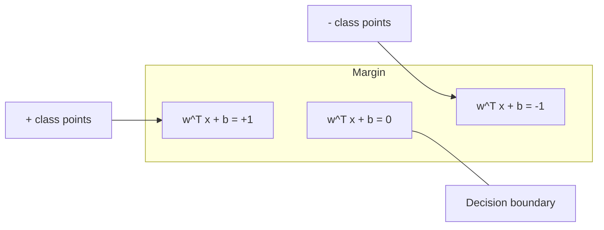
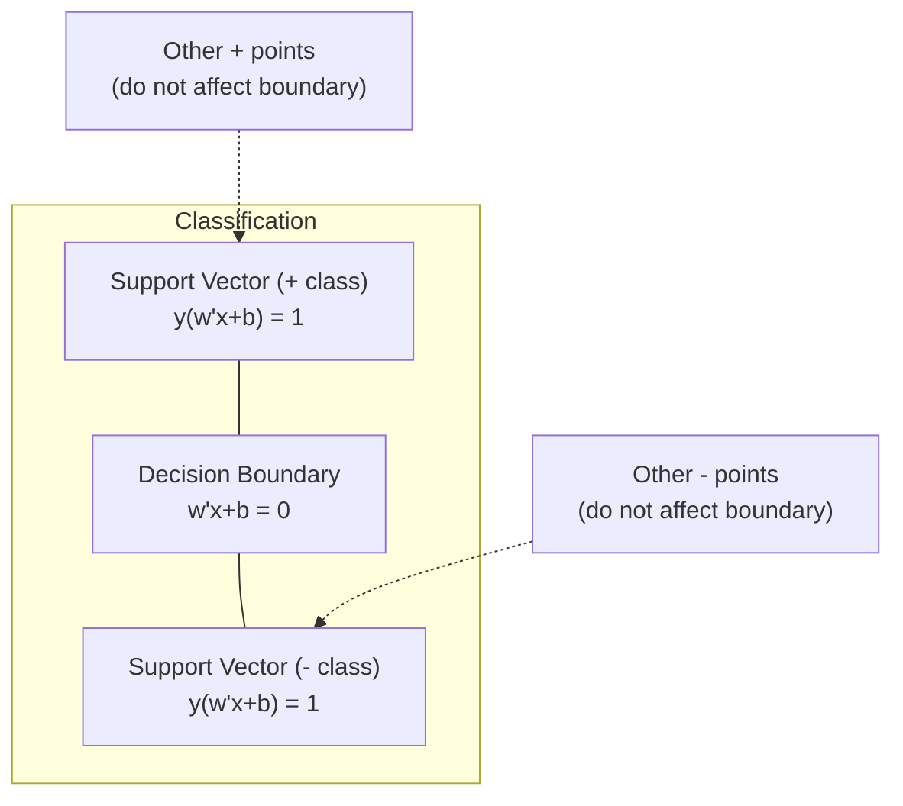
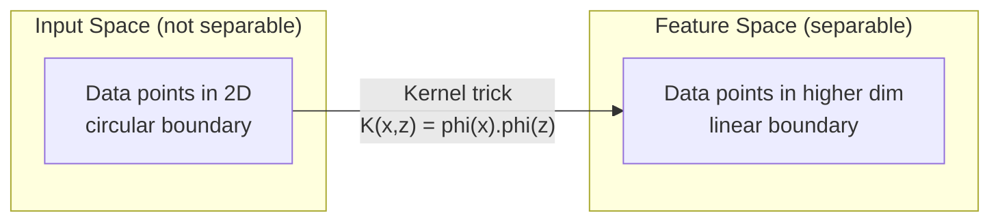

# Destek Vektör Makineleri

> İki sınıf arasındaki en geniş sokak bul.

**Type:** Build
**Language:**Python
**Prerequisites:** Phase 1 (Lessons 08 Optimization, 14 Norms and Distances, 18 Convex Optimization)
**Time:** ~90 minutes

## Öğrenme Hedefleri

- İlk formülasyonda çelişki kaybı ve gradient düşüşünü kullanarak sıfırdan bir doğrusal SVM uygulayın
- Maksimum marj prensibini açıklayın ve eğitilmiş bir modelden destek vektörlerini belirleyin
- Düzsel, çok boyutlu ve RBF çekirdekleri karşılaştırın ve çekirdek hilesi açık yüksek boyutlu haritalamaları nasıl önlediğini açıklayın
- C parametri tarafından kontrol edilen marjin genişliği ve sınıflandırma hataları arasındaki karıştırmayı değerlendirmek

## Sorun

İki sınıf veri noktası vardır ve onları ayırmak için bir çizgi (veya hiper düzlem) çizmeniz gerekir. Sonsuz sayıda çizgi çalışabilir. Hangisini seçmelisiniz?

En büyük marjı olan marj, karar sınırı ile her tarafta en yakın veri noktaları arasındaki mesafedir. Daha geniş bir marj sınıflandırıcı daha güvenilir ve görünmeyen verilere daha iyi genelleştirir.

Bu algılama, ML'deki en matematiksel olarak zarif algoritmalardan biri olan Destek vektör makinelerine yol açar. SVM derin öğrenmeden önce baskın sınıflandırma yöntemiydi ve küçük veri kümeleri, yüksek boyutlu veri ve teorik garantilerle ilkelerli, iyi anlaşılmış bir modele ihtiyaç duyan sorunlar için en iyi seçim olarak kalmaktadır.

SVM'ler doğrudan 1'inci aşamaya bağlanır: optimizasyon konveks (Dene 18), kenar normlarla ölçülür (Dene 14), ve çekirdek hilesi, yüksek boyutlu alanlarda hiçbir zaman hesaplama yapmadan çizgi olmayan sınırları ele almak için nokta ürünlerini kullanır.

## Anlaşım

### Maksimum marjin sınıflandırıcısı

{-1, +1} etiketleri y_i ve özellik vektörleri x_i ile doğrusal olarak ayırılabilir veriler verildiğinde sınıfları ayıran bir hiper düzlem w^T x + b = 0 istiyoruz.

Bir noktadan x_i'ye hiper düzlemine olan mesafe:

```
distance = |w^T x_i + b| / ||w||
```

Doğru sınıflandırılmış bir nokta için: y_i * (w^T x_i + b) > 0. Marj iki katı, hiper düzlemden her iki tarafta en yakın noktaya kadar olan mesafedir.



Optimizeleme sorunu:

```
maximize    2 / ||w||     (the margin width)
subject to  y_i * (w^T x_i + b) >= 1  for all i
```

Benzer şekilde (minimize edilmek, optimize edilmek için daha kolay):

```
minimize    (1/2) ||w||^2
subject to  y_i * (w^T x_i + b) >= 1  for all i
```

Bu bir konveks kareli programdır. Bu programın eşsiz bir küresel çözümü vardır. Sınır sınırlarında tam olarak yer alan veri noktaları (y_i * (w^T x_i + b) = 1) destek vektörleri.

### Destek vektörleri: kritik birkaç



Çoğu eğitim noktası önemsizdir. Sadece destek vektörleri önemlidir. Bu nedenle SVM'ler tahmin zamanında hafıza verimlidir: sadece destek vektörlerini depolamanız gerekir, tüm eğitim kümesini değil.

Destek vektörlerinin sayısı genelleştirme hatası için de bir sınır sağlar. Verim kümesi boyutuna göre daha az destek vektörü daha iyi genelleştirme anlamına gelir.

### Yumuşak kenarlık: C parametresi ile işleme gürültüsü

Gerçek veriler nadiren mükemmel bir şekilde ayrılabilir. Bazı noktalar sınırın yanlış tarafında veya kenarın içinde olabilir. Yumuşak kenar formülasyonu gevşek değişkenleri ekleyerek ihlallere izin verir.

```
minimize    (1/2) ||w||^2 + C * sum(xi_i)
subject to  y_i * (w^T x_i + b) >= 1 - xi_i
            xi_i >= 0  for all i
```

Bu değerler, bu değerlerin değerini belirlerken, bu değerlerin değerini belirler.

| C value | Behavior |
|---------|----------|
| Large C | Penalizes violations heavily. Narrow margin, fewer misclassifications. Overfits |
| Small C | Allows more violations. Wide margin, more misclassifications. Underfits |

C, düzenlenme gücü, tersine. Büyük C = daha az düzenlenme. Küçük C = daha fazla düzenlenme.

### Çakışıklık kaybı: SVM kaybı fonksiyonu

Yumuşak Marjin SVM, kısıtlama dışı bir optimizasyon olarak yeniden yazılabilir:

```
minimize    (1/2) ||w||^2 + C * sum(max(0, 1 - y_i * (w^T x_i + b)))
```

Max(0, 1 - y_i * f(x_i)) terimi, bir nokta doğru bir şekilde sınıflandırıldığında ve kenardan öte olduğunda sıfırdır.

```
Hinge loss for a single point:

loss
  |
  | \
  |  \
  |   \
  |    \
  |     \_______________
  |
  +-----|-----|-------->  y * f(x)
       0     1

Zero loss when y*f(x) >= 1 (correctly classified, outside margin).
Linear penalty when y*f(x) < 1.
```

Logistik kayıplarla (logistik gerileme) karşılaştırın:

```
Hinge:     max(0, 1 - y*f(x))          Hard cutoff at margin
Logistic:  log(1 + exp(-y*f(x)))        Smooth, never exactly zero
```

Hinge kaybı nadir çözümler üretir (sadece destek vektörleri sıfır dışı katkılara sahiptir).

### Dönüşe doğru düşen bir doğrusal SVM eğitimi

Sınırlı QP çözmeden, bir doğrusal SVM'yi, zarf kaybı ve L2 düzenlenmesi üzerinde gradient düşüşü kullanarak antrene edebilirsiniz:

```
L(w, b) = (lambda/2) * ||w||^2 + (1/n) * sum(max(0, 1 - y_i * (w^T x_i + b)))

Gradient with respect to w:
  If y_i * (w^T x_i + b) >= 1:  dL/dw = lambda * w
  If y_i * (w^T x_i + b) < 1:   dL/dw = lambda * w - y_i * x_i

Gradient with respect to b:
  If y_i * (w^T x_i + b) >= 1:  dL/db = 0
  If y_i * (w^T x_i + b) < 1:   dL/db = -y_i
```

Bu, ilk formülasyon olarak adlandırılır. O(n * d) epoca başına çalışır, burada n örnek sayısı ve d özellik sayısıdır. Büyük, nadir, yüksek boyutlu veriler (metin sınıflandırması) için bu hızlıdır.

### Çift formülasyon ve çekirdek hilesi

SVM sorununun Lagrangian çiftliği (Fase 1 Ders 18, KKT koşullarından) şunlardır:

```
maximize    sum(alpha_i) - (1/2) * sum_ij(alpha_i * alpha_j * y_i * y_j * (x_i . x_j))
subject to  0 <= alpha_i <= C
            sum(alpha_i * y_i) = 0
```

Dual sadece nokta ürünleri x_i. x_j ile veri noktaları arasında içerir. Bu ana bilgilerdir. Her nokta ürünü bir çekirdek fonksiyonu K(x_i, x_j ile değiştirin ve SVM, dönüşümün açıkça hesaplanmadan doğrusal olmayan sınırları öğrenebilir.

```
Linear kernel:      K(x, z) = x . z
Polynomial kernel:  K(x, z) = (x . z + c)^d
RBF (Gaussian):     K(x, z) = exp(-gamma * ||x - z||^2)
```

RBF çekirdeği verileri sonsuz boyutlu bir alanın haritasına yerleştiriyor. Giriş alanında yakın olan noktaların çekirdeğin değeri 1.



Kernelik hilesi, yüksek boyutlu alanın nokta ürünü'ni hiç oraya gitmeden hesaplar. D boyutlarında derece d'li polinom çekirdeği için açık özellik alanının O(D^d) boyutları vardır.

### Geri dönüş için SVM (SVR)

Destek vektörü Geri dönüşü, verilerin etrafında genişliğinde epsilon bir tüp tutar. tüp içindeki noktaların sıfır kaybı vardır. tüp dışındaki noktalar doğrusal olarak cezalandırılır.

```
minimize    (1/2) ||w||^2 + C * sum(xi_i + xi_i*)
subject to  y_i - (w^T x_i + b) <= epsilon + xi_i
            (w^T x_i + b) - y_i <= epsilon + xi_i*
            xi_i, xi_i* >= 0
```

Epsilon parametri tüp genişliğini kontrol eder. Geniş tüp = daha az destek vektörü = daha düzgün uyum. dar tüp = daha fazla destek vektörü = daha sıkı uyum.

### Neden SVM'ler derin öğrenme karşısında kaybediyor (ve hala ne zaman kazanıyorlar)

SVM'ler 1990'ların sonundan 2010'ların başlarına kadar ML'de egemenlik gösterdi. Derin öğrenme birkaç nedenden dolayı onları aştı:

| Factor | SVMs | Deep learning |
|--------|------|---------------|
| Feature engineering | Requires it | Learns features |
| Scalability | O(n^2) to O(n^3) for kernel | O(n) per epoch with SGD |
| Image/text/audio | Needs handcrafted features | Learns from raw data |
| Large datasets (>100k) | Slow | Scales well |
| GPU acceleration | Limited benefit | Massive speedup |

SVM'ler hala bu durumlarda kazanır:
- Küçük veri kümeleri (yüzlerce ila binlerce örnek)
- Yüksek boyutlu nadir veriler (TF-IDF özellikleri olan metin)
- Matematik garantilere ihtiyaç duyduğunuzda (marjin sınırları)
- Eğitim süresi minimum olması gerektiğinde (lineer SVM çok hızlıdır)
- Açık marjin yapısı olan ikili sınıflandırma
- Anomalyayı tespit etmek (bir sınıf SVM)

```figure
svm-margin
```

## Yapın

### Adım 1: Çakışıklık kaybı ve eğilimi

Bir parti için zar kaybını ve eğilimi hesaplayın.

```python
def hinge_loss(X, y, w, b):
    n = len(X)
    total_loss = 0.0
    for i in range(n):
        margin = y[i] * (dot(w, X[i]) + b)
        total_loss += max(0.0, 1.0 - margin)
    return total_loss / n
```

### Adım 2: Dönüşe doğru düşen çizgi SVM

Düzenlenmiş zarf kaybını en aza indirerek eğit.

```python
class LinearSVM:
    def __init__(self, lr=0.001, lambda_param=0.01, n_epochs=1000):
        self.lr = lr
        self.lambda_param = lambda_param
        self.n_epochs = n_epochs
        self.w = None
        self.b = 0.0

    def fit(self, X, y):
        n_features = len(X[0])
        self.w = [0.0] * n_features
        self.b = 0.0

        for epoch in range(self.n_epochs):
            for i in range(len(X)):
                margin = y[i] * (dot(self.w, X[i]) + self.b)
                if margin >= 1:
                    self.w = [wj - self.lr * self.lambda_param * wj
                              for wj in self.w]
                else:
                    self.w = [wj - self.lr * (self.lambda_param * wj - y[i] * X[i][j])
                              for j, wj in enumerate(self.w)]
                    self.b -= self.lr * (-y[i])

    def predict(self, X):
        return [1 if dot(self.w, x) + self.b >= 0 else -1 for x in X]
```

### Adım 3: Kernel fonksiyonları

Düzsel, polinom ve RBF çekirdekleri uygulayın.

```python
def linear_kernel(x, z):
    return dot(x, z)

def polynomial_kernel(x, z, degree=3, c=1.0):
    return (dot(x, z) + c) ** degree

def rbf_kernel(x, z, gamma=0.5):
    diff = [xi - zi for xi, zi in zip(x, z)]
    return math.exp(-gamma * dot(diff, diff))
```

### Adım 4: Marjin ve destek vektörünü tanımlamak

Eğitimden sonra hangi noktaların destek vektörleri olduğunu belirleyin ve kenar genişliğini hesaplayın.

```python
def find_support_vectors(X, y, w, b, tol=1e-3):
    support_vectors = []
    for i in range(len(X)):
        margin = y[i] * (dot(w, X[i]) + b)
        if abs(margin - 1.0) < tol:
            support_vectors.append(i)
    return support_vectors
```

Bakın .`code/svm.py`Tüm demolarla birlikte tam olarak uygulanması için.

## Kullan

Sikit-learn ile:

```python
from sklearn.svm import SVC, LinearSVC, SVR
from sklearn.preprocessing import StandardScaler
from sklearn.pipeline import Pipeline

clf = Pipeline([
    ("scaler", StandardScaler()),
    ("svm", SVC(kernel="rbf", C=1.0, gamma="scale")),
])
clf.fit(X_train, y_train)
print(f"Accuracy: {clf.score(X_test, y_test):.4f}")
print(f"Support vectors: {clf['svm'].n_support_}")
```

Önemli: SVM'yi eğitmeden önce her zaman özelliklerinizi ölçeklendirin. SVM'ler özellik büyüklüklerine hassasdır çünkü kenarlık ölçeklenmemiş özelliklere bağlıdır ve geometriyi çarpıtır.

Büyük veri kümeleri için kullan `LinearSVC`(başlangıç formu, O(n) dönem başına) yerine `SVC`(ikili formülasyon, O(n^2) ile O(n^3)):

```python
from sklearn.svm import LinearSVC

clf = Pipeline([
    ("scaler", StandardScaler()),
    ("svm", LinearSVC(C=1.0, max_iter=10000)),
])
```

## Egzersizler

1. 2D doğrusal olarak ayırılabilir bir veri kümesi oluşturun. LinearSVM'inizi çalıştırın ve destek vektörlerini tanımlayın. Destek vektörlerinin karar sınırına en yakın noktaları olup olmadığını kontrol edin.

2. C'nin değişimi 0.001'den 1000'e kadar gürültülü bir veri kümesi üzerinde. Her C değeri için karar sınırını çiz. Geniş marjinden (kilitsiz) dar marjine (kilitsiz) geçişi gözlemleyin.

3. Sınıf sınırlarının yuvarlak (lineer olmayan) bir veri kümesi oluşturun. Düzsel bir SVM'nin başarısız olduğunu gösterin. RBF çekirdek matrisini hesaplayın ve sınıfların çekirdek indüksiyonlu özellik alanında ayrılabilir olduğunu gösterin.

4. Aynı veri kümesi üzerinde kargaşa kaybı ile lojistik kaybı karşılaştırın. Düzsel SVM ve lojistik gerilemeyi eğitiniz. Her modelin karar sınırına kaç eğitim noktası katkıda bulunduğunu sayın (dayanım vektörleri vs. tüm noktalar).

5. SVR (epsilon-ansansitif kaybı) uygulayın. Y = sin(x) + gürültü ayarlayın. epsilon tüpünü tahminlerin etrafında çizin ve destek vektörlerini (tubanın dışındaki noktaları) vurgulayın.

## Anahtar Terimler

| Term | What it actually means |
|------|----------------------|
| Support vectors | The training points closest to the decision boundary. The only points that determine the hyperplane |
| Margin | The distance between the decision boundary and the nearest support vectors. SVMs maximize this |
| Hinge loss | max(0, 1 - y*f(x)). Zero when correctly classified and outside the margin. Linear penalty otherwise |
| C parameter | Trade-off between margin width and classification errors. Large C = narrow margin, small C = wide margin |
| Soft margin | SVM formulation that allows margin violations via slack variables. Handles non-separable data |
| Kernel trick | Computing dot products in a high-dimensional feature space without explicitly mapping to that space |
| Linear kernel | K(x, z) = x . z. Equivalent to standard dot product. For linearly separable data |
| RBF kernel | K(x, z) = exp(-gamma * \|\|x-z\|\|^2). Maps to infinite dimensions. Learns any smooth boundary |
| Polynomial kernel | K(x, z) = (x . z + c)^d. Maps to a feature space of polynomial combinations |
| Dual formulation | Reformulation of the SVM problem that depends only on dot products between data points. Enables kernels |
| SVR | Support Vector Regression. Fits an epsilon-tube around the data. Points inside the tube have zero loss |
| Slack variables | xi_i: measures how much a point violates the margin. Zero for correctly classified points outside margin |
| Maximum margin | The principle of choosing the hyperplane that maximizes the distance to the nearest points of each class |

## Daha Fazla Okumak

- [Vapnik: The Nature of Statistical Learning Theory (1995)](https://link.springer.com/book/10.1007/978-1-4757-3264-1)- SVM ve istatistik öğrenimi üzerine temel metin
- [Cortes & Vapnik: Support-vector networks (1995)](https://link.springer.com/article/10.1007/BF00994018)- orijinal SVM kağıdı
- [Platt: Sequential Minimal Optimization (1998)](https://www.microsoft.com/en-us/research/publication/sequential-minimal-optimization-a-fast-algorithm-for-training-support-vector-machines/)- SVM eğitimi pratik kılan SMO algoritması
- [scikit-learn SVM documentation](https://scikit-learn.org/stable/modules/svm.html)- uygulamalar hakkında detaylı pratik rehberlik
- [LIBSVM: A Library for Support Vector Machines](https://www.csie.ntu.edu.tw/~cjlin/libsvm/)- çoğu SVM uygulamasının arkasındaki C++ kütüphanesi
