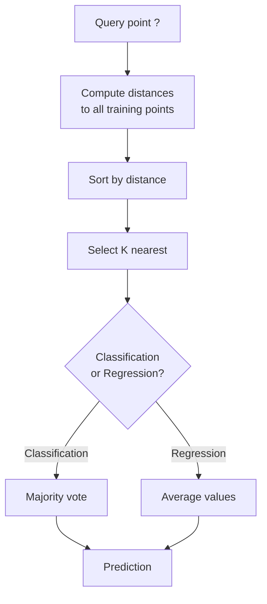
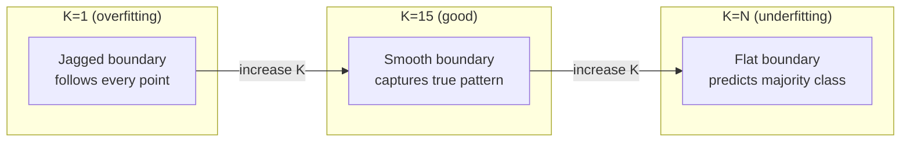
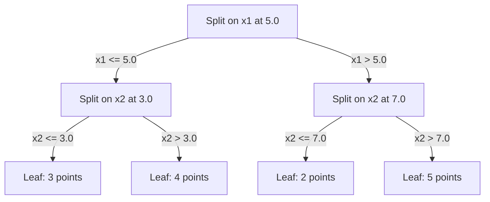

# K-En Yakın Komşular ve Uzaklıklar

> Her şeyi sakla, komşularına bakarak tahmin et, en basit algoritma aslında işe yarıyor.

**Type:** Build
**Language:**Python
**Prerequisites:** Phase 1 (Lesson 14 Norms and Distances)
**Time:** ~90 minutes

## Öğrenme Hedefleri

- KNN sınıflandırmasını ve sıfırdan geri çekilmeyi yapılandırılabilir K ve mesafe ağırlıklı oylama ile uygula
- L1, L2, cosine ve Minkowski mesafe ölçümlerini karşılaştırın ve verilen veri tipi için uygun olanı seçin
- Boyutlulığın lanetini açıkla ve KNN'nin yüksek boyutlu alanlarda neden bozulduğunu göster
- En yakın komşunu etkin bir şekilde aramak ve analiz etmek için bir KD ağacı inşa et .

## Sorun

Bir veri kümesi var. Yeni bir veri noktası geliyor. Onu sınıflandırmak veya değerini tahmin etmek gerekir. Verilerden parametreleri öğrenmek yerine (süre gerileme veya SVM gibi), yeni noktaya en yakın K eğitim noktalarını bulup oy vermelerini bırakın.

Bu K-en yakın komşular. Eğitim aşaması yok. Öğrenmek için parametre yok. Düşükleme için kayıp fonksiyonu yok. Tüm eğitim setini depolar ve tahmin zamanında mesafeleri hesaplarsınız.

İşlemek için çok basit gibi görünüyor. Ancak KNN, özellikle küçük ve orta ölçekli veri kümeleri ile birçok sorun için şaşırtıcı derecede rekabetçi ve bunu anlamak temel kavramları derinlemesine ortaya çıkarır: mesafe metriklerinin seçimi (Faz 1 Ders 14 ile bağlantı kurmak), boyutlulığın laneti ve tembel ve istekli öğrenme arasındaki fark.

KNN, modern AI'de de farklı isimlerle her yerde görünür. Vektör veritabanları KNN'in gömülmeler üzerinde arama yapmasını sağlar. Arama artıran nesil (RAG) K'ye en yakın belge parçalarını bulur. Tavsiye sistemleri benzer kullanıcıları veya öğeleri bulur. Algoritm aynıdır. Ölçü ve veri yapıları farklıdır.

## Anlaşım

### KNN' in işleyişi

Etiketlenmiş noktaların bir veri kümesi ve yeni bir soru noktası verildiğinde:

1. Sorgudan veri kümesindeki her noktaya kadar mesafeyi hesaplayın
2. Mesafe ile düzenlenir
3. K'ye en yakın noktaları alın .
4. Sınıflandırma için: K komşuları arasında çoğunluk oyları
5. Geri dönüş için: K komşu değerlerinin ortalaması (veya ağırlıklı ortalaması)



Bu tüm algoritma. Hiç uygunluk yok.

### K'yi seçmek

K tek hiperparametre.

| K | Behavior |
|---|----------|
| K = 1 | Decision boundary follows every point. Zero training error. High variance. Overfits |
| Small K (3-5) | Sensitive to local structure. Can capture complex boundaries |
| Large K | Smoother boundaries. More robust to noise. May underfit |
| K = N | Predicts the majority class for every point. Maximum bias |

Bir ortak başlangıç noktası, N noktaları olan bir veri kümesi için K = sqrt(N'dir.



### Mesafe ölçümleri

Mesafe fonksiyonu "yaklaş" ne anlama geldiğini belirler.

**L2 (Euclidean)**- Düz çizgi mesafesini.

```
d(a, b) = sqrt(sum((a_i - b_i)^2))
```

Özellik ölçekine duyarlı. KNN ile L2 kullanmadan önce özellikleri her zaman standartlaştırın.

**L1 (Manhattan)**L2'den daha güçlü, çünkü farklılıkları karıştırmaz.

```
d(a, b) = sum(|a_i - b_i|)
```

**Cosine distance**Vectörler arasındaki açıyı ölçerken büyüklüğü görmezden gelir.

```
d(a, b) = 1 - (a . b) / (||a|| * ||b||)
```

**Minkowski**L1 ve L2'yi p parametri ile genelleştirir.

```
d(a, b) = (sum(|a_i - b_i|^p))^(1/p)

p=1: Manhattan
p=2: Euclidean
p->inf: Chebyshev (max absolute difference)
```

Hangi metrik kullanılması verilere bağlıdır:

| Data type | Best metric | Why |
|-----------|------------|-----|
| Numeric features, similar scale | L2 (Euclidean) | Default, works for spatial data |
| Numeric features, outliers | L1 (Manhattan) | Robust, does not amplify large differences |
| Text embeddings | Cosine | Magnitude is noise, direction is meaning |
| High-dimensional sparse | Cosine or L1 | L2 suffers from curse of dimensionality |
| Mixed types | Custom distance | Combine metrics per feature type |

### Ağır KNN

Standart KNN tüm K komşular için eşit ağırlık verir.

**Distance-weighted KNN**Her komşunun mesafe ile tersine ağırlıkları:

```
weight_i = 1 / (distance_i + epsilon)

For classification: weighted vote
For regression:     weighted average = sum(w_i * y_i) / sum(w_i)
```

Epsilon, bir sorgu noktası eğitim noktasıyla tam olarak eşleştiğinde sıfırla bölünmeyi engeller.

K seçeneğine göre ağır KNN daha az duyarlıdır çünkü uzak komşular ne olursa olsun çok az katkı sağlar.

### Boyutsuzluk laneti

KNN performansı yüksek boyutlarda azalıyor. Bu belirsiz bir kaygı değil.

**Problem 1: distances converge.**Boyutlulık arttıkça, maksimum mesafe ile minimum mesafe oranı 1. yaklaşır. Tüm noktalar sorudan eşit derecede "uzaktır".

```
In d dimensions, for random uniform points:

d=2:    max_dist / min_dist = varies widely
d=100:  max_dist / min_dist ~ 1.01
d=1000: max_dist / min_dist ~ 1.001

When all distances are nearly equal, "nearest" is meaningless.
```

**Problem 2: volume explodes.**K komşularını verilerin sabit bir kısmında yakalamak için arama radiüsünü çok daha büyük bir bölümün kapsamına genişletmelisiniz.

**Problem 3: corners dominate.**D boyutlarındaki birim hiper küpünde, hacmin büyük kısmı merkez değil, köşeler yakınında yoğunlaşır.

Pratik sonuç: KNN yaklaşık 20-50 özelliklere kadar iyi çalışır. Bundan daha fazlası, KNN uygulamadan önce boyut azaltma (PCA, UMAP, t-SNE) veya verilerin içsel düşük boyutluğunu sömüren ağaç tabanlı arama yapıları kullanmanız gerekir.

### KD ağaçları: en yakın komşu arayışı

Kötü kuvvet KNN, sorgudan her eğitim noktasına kadarki mesafeyi hesaplar. Bu sorgu başına O(n * d) demektir. Büyük veri kümeleri için bu çok yavaş.

Bir KD ağacı, alanı özellik ekseleri boyunca geri dönüşlü olarak bölüyor. Her seviyede, ortalama değerde bir boyutta bölünür.



En yakın komşunu bulmak için, ağaçtan soruyu içeren yaprağa geçin, sonra geriye dönün ve komşu bölmelerini sadece daha yakın noktaları içerebilecekleri durumlarda kontrol edin.

Ortalama sorgu süresi: düşük boyutlarda O(log n). Ancak KD- ağaçları yüksek boyutlarda (d > 20) O(n'e düşer, çünkü geriye doğru ilerleme giderek daha az dalı ortadan kaldırır.

### Top ağaçları: Orta boyutlu için daha iyi

Top ağaçları, birikleri birer kemer yerine yuvalara yerleştirilmiş hiperferlere ayırır. Her düğüm, bu alt ağaçtaki tüm noktaları içeren bir top (merkez + radyüs) tanımlar.

KD ağaçlarına göre avantajlar:
- Orta boyutlarda (~50) daha iyi çalışın
- Ekipmanın aksine bağlı olmayan yapısı
- Sınırlama hacmi daha sıkı olması arama sırasında daha fazla dal kesildiği anlamına gelir

Hem KD ağaçları hem de top ağaçları tam algoritmalardır. Gerçekten büyük ölçekli arama (milyonlarca nokta, yüzlerce boyut), bunun yerine en yakın komşu yöntemleri (HNSW, IVF, ürün kuantitesi) kullanılır. Bunlar Fase 1 Ders 14'te ele alınmıştır.

### Uşak öğrenme vs. öğrenmek için hevesli

KNN tembel bir öğrenci: eğitim sırasında çalışmaz ve tüm çalışmalar tahmin zamanında. Diğer algoritmaların çoğu (lineer gerileme, SVM, sinir ağları) öğrenci isteklidir: kompakt bir model oluşturmak için eğitim sırasında ağır hesaplamalar yaparlar, sonra tahminler hızlıdır.

| Aspect | Lazy (KNN) | Eager (SVM, neural net) |
|--------|------------|------------------------|
| Training time | O(1) just store data | O(n * epochs) |
| Prediction time | O(n * d) per query | O(d) or O(parameters) |
| Memory at prediction | Store entire training set | Store model parameters only |
| Adapts to new data | Add points instantly | Retrain the model |
| Decision boundary | Implicit, computed on the fly | Explicit, fixed after training |

Uykucu öğrenme idealdir:
- Veri kümesi sıkça değişir (tekrar eğitim almadan nokta ekle/ekle)
- Çok az soruya tahmin gerek.
- Eğitim zamanı sıfır istiyorsun.
- Veriler yeterince küçüktür ki , kaba güçle arama hızlıdır .

### Regresiyon için KNN

Çoğunlukla oy kullanmak yerine, K komşularının hedef değerlerini gerileme için KNN ortalamalar.

```
prediction = (1/K) * sum(y_i for i in K nearest neighbors)

Or with distance weighting:
prediction = sum(w_i * y_i) / sum(w_i)
where w_i = 1 / distance_i
```

KNN geri dönüşü, parça-sasta (veya parça-sımsıkı ağırlık ile) tahminler üretir. Eğitim verilerinin aralığı ötesinde ekstrapolasyon yapamaz. Eğitim hedeflerinin hepsi 0 ile 100 arasında ise, KNN asla 200'ü tahmin edemez.

```figure
knn-smoothness
```

## Yapın

### Adım 1: Uzaklık fonksiyonları

L1, L2, cosine ve Minkowski mesafelerini uygulayın. Bunlar doğrudan 1. aşama 14. dersi ile bağlantılıdır.

```python
import math

def l2_distance(a, b):
    return math.sqrt(sum((ai - bi) ** 2 for ai, bi in zip(a, b)))

def l1_distance(a, b):
    return sum(abs(ai - bi) for ai, bi in zip(a, b))

def cosine_distance(a, b):
    dot_val = sum(ai * bi for ai, bi in zip(a, b))
    norm_a = math.sqrt(sum(ai ** 2 for ai in a))
    norm_b = math.sqrt(sum(bi ** 2 for bi in b))
    if norm_a == 0 or norm_b == 0:
        return 1.0
    return 1.0 - dot_val / (norm_a * norm_b)

def minkowski_distance(a, b, p=2):
    if p == float('inf'):
        return max(abs(ai - bi) for ai, bi in zip(a, b))
    return sum(abs(ai - bi) ** p for ai, bi in zip(a, b)) ** (1 / p)
```

### Adım 2: KNN sınıflandırıcısı ve geri dönüşçüsü

K, mesafe metrikası ve seçeneği olarak mesafe ağırlığı ile KNN'yi tamamlayın.

```python
class KNN:
    def __init__(self, k=5, distance_fn=l2_distance, weighted=False,
                 task="classification"):
        self.k = k
        self.distance_fn = distance_fn
        self.weighted = weighted
        self.task = task
        self.X_train = None
        self.y_train = None

    def fit(self, X, y):
        self.X_train = X
        self.y_train = y

    def predict(self, X):
        return [self._predict_one(x) for x in X]
```

### Adım 3: Verimli arama için KD ağacı

Her boyutun ortalamasında gerici olarak bölünen bir KD ağacını sıfırdan yapın.

```python
class KDTree:
    def __init__(self, X, indices=None, depth=0):
        # Recursively partition the data
        self.axis = depth % len(X[0])
        # Split on median of the current axis
        ...

    def query(self, point, k=1):
        # Traverse to leaf, then backtrack
        ...
```

Bakın .`code/knn.py`Tüm yardımcı yöntemler ve demolarla birlikte tam bir uygulama için.

### Adım 4: Özellik ölçeklendirme

KNN, özelliklerin ölçeklendirilmesini gerektirir, çünkü mesafeler özellik büyüklüklerine duyarlıdır. 0 ila 1000 aralığında bir özellik 0 ila 1 aralığında bir özelliğe hakim olacaktır.

```python
def standardize(X):
    n = len(X)
    d = len(X[0])
    means = [sum(X[i][j] for i in range(n)) / n for j in range(d)]
    stds = [
        max(1e-10, (sum((X[i][j] - means[j]) ** 2 for i in range(n)) / n) ** 0.5)
        for j in range(d)
    ]
    return [[((X[i][j] - means[j]) / stds[j]) for j in range(d)] for i in range(n)], means, stds
```

## Kullan

Sikit-learn ile:

```python
from sklearn.neighbors import KNeighborsClassifier
from sklearn.preprocessing import StandardScaler
from sklearn.pipeline import Pipeline

clf = Pipeline([
    ("scaler", StandardScaler()),
    ("knn", KNeighborsClassifier(n_neighbors=5, metric="euclidean")),
])
clf.fit(X_train, y_train)
print(f"Accuracy: {clf.score(X_test, y_test):.4f}")
```

Scikit-learn, veri kümesi yeterince büyük ve boyutları yeterince düşük olduğunda otomatik olarak KD ağaçları veya top ağaçlarını kullanır. Yüksek boyutlu veriler için, kaba kuvvete geri düşer.`algorithm`Parametre.

Büyük ölçekli en yakın komşu arama (milyonlarca vektör) için FAISS, Annoy veya vektör veritabanını kullanın:

```python
import faiss

index = faiss.IndexFlatL2(dimension)
index.add(embeddings)
distances, indices = index.search(query_vectors, k=5)
```

## Egzersizler

1. 3 sınıflı 2 boyutlu bir veri kümesine KNN sınıflandırmasını uygulayın. K=1, K=5, K=15, ve K=N için karar sınırını çizin.

2. 2, 5, 10, 50, 100, ve 500 boyutlarda 1000 rastgele nokta oluşturun. Her boyut için maksimum çiftlik mesafesinin en az çiftlik mesafesine oranını hesaplayın. Boyutsuzluk lanetini görselleştirmek için boyutsuzluk karşılığı oranı çizin.

3. Bir metin sınıflandırma sorunu üzerinde L1, L2 ve KNN için cosine mesafesini karşılaştırın (TF-IDF vektörlerini kullanın). Hangi metrik en iyi doğruluk sağlar?

4. KD ağacını uygulayın ve 2D, 10D ve 50D'de 1k, 10k ve 100k noktaları olan veri kümeleri için sorgu zamanını ve kaba kuvvetini ölçün. KD ağacı hangi boyutlarda kaba kuvvetten daha hızlı olmaktan vazgeçir?

5. Y = sin(x) + gürültü için ağırlıklı KNN gerici oluşturun. K=3, 10, 30 için ağırlıklı olmayan KNN ile karşılaştırın.

## Anahtar Terimler

| Term | What it actually means |
|------|----------------------|
| K-nearest neighbors | Non-parametric algorithm that predicts by finding the K closest training points to a query |
| Lazy learning | No computation at training time. All work happens at prediction time. KNN is the canonical example |
| Eager learning | Heavy computation at training time to build a compact model. Most ML algorithms are eager |
| Curse of dimensionality | In high dimensions, distances converge and neighborhoods expand to cover most of the space, making KNN ineffective |
| KD-tree | Binary tree that recursively partitions space along feature axes. O(log n) queries in low dimensions |
| Ball tree | Tree of nested hyperspheres. Works better than KD-trees in moderate dimensions (up to ~50) |
| Weighted KNN | Neighbors weighted inversely by distance. Closer neighbors have more influence on the prediction |
| Feature scaling | Normalizing features to comparable ranges. Required for distance-based methods like KNN |
| Majority vote | Classification by counting which class is most common among K neighbors |
| Brute force search | Computing distance to every training point. O(n*d) per query. Exact but slow for large n |
| Approximate nearest neighbor | Algorithms (HNSW, LSH, IVF) that find approximately nearest points much faster than exact search |
| Voronoi diagram | The partition of space where each region contains all points closer to one training point than any other. K=1 KNN produces Voronoi boundaries |

## Daha Fazla Okumak

- [Cover & Hart: Nearest Neighbor Pattern Classification (1967)](https://ieeexplore.ieee.org/document/1053964)- temel KNN kağıdı, en fazla Bayes'in en iyisinin iki katı hata oranına sahip olduğunu kanıtlar
- [Friedman, Bentley, Finkel: An Algorithm for Finding Best Matches in Logarithmic Expected Time (1977)](https://dl.acm.org/doi/10.1145/355744.355745)- orijinal KD- ağaç kağıdı
- [Beyer et al.: When Is "Nearest Neighbor" Meaningful? (1999)](https://link.springer.com/chapter/10.1007/3-540-49257-7_15)- En yakın komşuya boyutsuzluk lanetinin resmi analizi
- [scikit-learn Nearest Neighbors documentation](https://scikit-learn.org/stable/modules/neighbors.html)- Algoritm seçimi ile ilgili pratik rehber
- [FAISS: A Library for Efficient Similarity Search](https://github.com/facebookresearch/faiss)- Meta'nın milyarlık ölçekli yaklaşık komşu arama kütüphanesi
