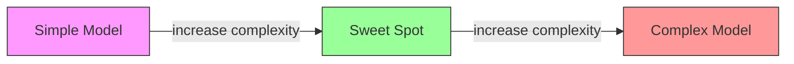
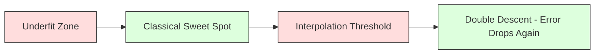
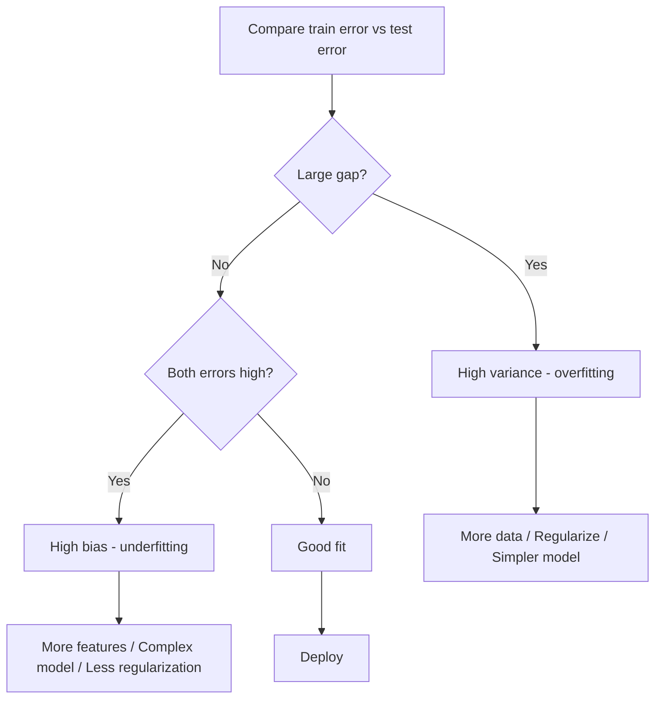
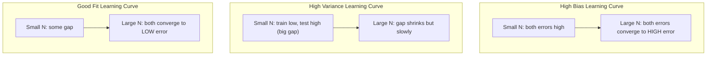
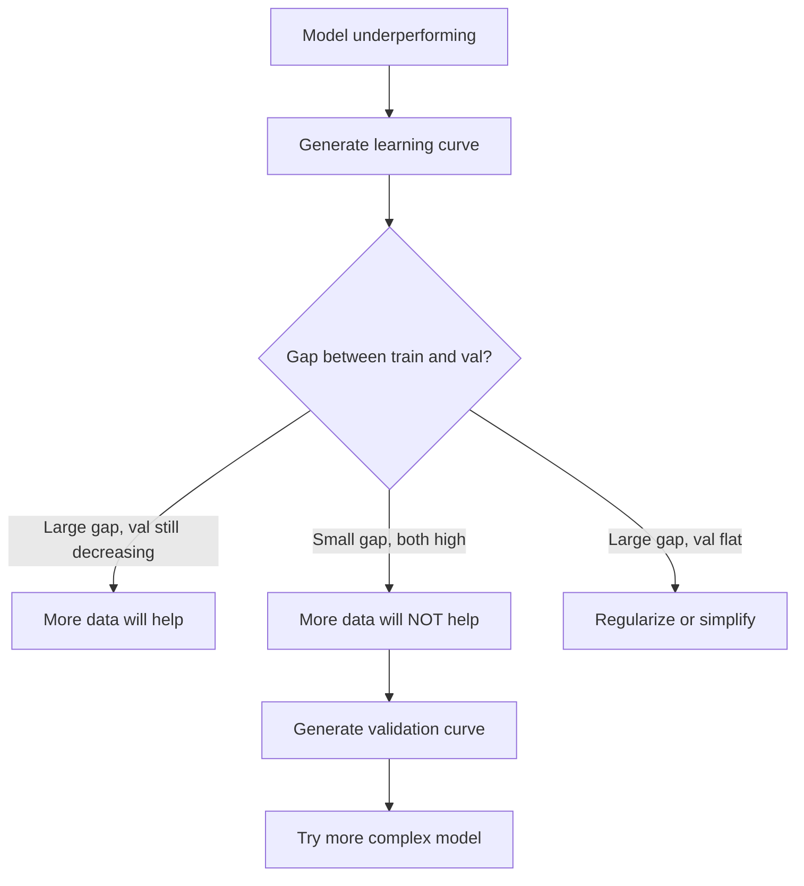

# Taraflı Çeşitlilik Ticaret

> Her model hatası üç kaynağın birinden gelir: önyargı, varyansa veya gürültü. Sadece ilk iki kaynağı kontrol edebilirsiniz.

**Type:** Learn
**Language:**Python
**Prerequisites:** Phase 2, Lessons 01-09 (ML basics, regression, classification, evaluation)
**Time:** ~75 minutes

## Öğrenme Hedefleri

- Beklenen tahmin hatasındaki önyargı-varians parçalanmasını çıkarın ve azaltılamaz gürültünün rolünü açıklayın
- Bir modelin yüksek önyargılılık veya yüksek varyansa ile ilgili olarak eğitim ve test hata modellerini kullanarak teşhis edilmelidir.
- Düzenleme tekniklerinin (L1, L2, bırakma, erken durma) varians için nasıl önyargılı olduğunu açıklayın
- Artan karmaşıklık modellerinde önyargı-varians pazarlamasını görselleştiren deneyler uygula

## Sorun

Bir model eğitmişsin. Test verilerinde bir hata var. Bu hata nereden geliyor?

Eğer modeliniz çok basitse (eğlenmiş bir veri kümesinde doğrusal gerileme), doğru örneği sürekli kaybeder. Bu tarafsızlık. Eğer modeliniz çok karmaşıksa (15 veri noktasında 20 derece polinom) eğitim verilerine mükemmel bir şekilde uyar ancak yeni verilere karşı çok farklı tahminler verir. Bu varyans.

Bir sabit model kapasitesi için her ikisini de aynı anda en aza indiremezsiniz. Tasarım ayrımını aşağıya ve varyansa artıyor. Varyansa ayrımını aşağıya ve varyansa artıyor. Bu anlaşmayı anlamak makine öğreniminde en faydalı teşhis becerisi.

## Anlaşım

### Tarafsızlıklar: Sistematik Hata

Tarafsızlık, modelinizin ortalama tahmininin gerçek değerden ne kadar uzak olduğunu ölçer. Eğer aynı modelyi aynı dağılımdan elde edilen ve tahminleri ortalama olarak değerlendirdiğiniz birçok farklı eğitim kümesi üzerinde eğitirseniz, tarafsızlık ortalama ile gerçeğin arasındaki farkdır.

Yüksek tarafsızlık, modelin gerçek örneği yakalayamayacak kadar sert olduğu anlamına gelir. Parabolaya uygun düz çizgi her zaman eğriyi kaçırır, ne kadar veri verirseniz veriniz. Bu uygunsuzluk.

```
High bias (underfitting):
  Model always predicts roughly the same wrong thing.
  Training error: HIGH
  Test error: HIGH
  Gap between them: SMALL
```

### Değişiklik: Eğitim Verilerine Duyarlılık

Varians, farklı veri alt kümeleri üzerinde eğitim verdiğinizde tahminlerin ne kadar değiştiğini ölçer.

Yüksek farklılık, modelin altındaki sinyal değil, eğitim verilerine gürültüye uygun olması anlamına gelir. 20 dereceli bir polinom her eğitim noktasını geçecek, ancak aralarında vahşice titreşecektir. Bu aşırı uygun.

```
High variance (overfitting):
  Model fits training data perfectly but fails on new data.
  Training error: LOW
  Test error: HIGH
  Gap between them: LARGE
```

### Çürümesi

Herhangi bir x noktası için, karesi kaybı altında beklenen tahmin hatası tam olarak parçalanır:

```
Expected Error = Bias^2 + Variance + Irreducible Noise

where:
  Bias^2   = (E[f_hat(x)] - f(x))^2
  Variance = E[(f_hat(x) - E[f_hat(x)])^2]
  Noise    = E[(y - f(x))^2]             (sigma^2)
```

- `f(x)`gerçek fonksiyon
- `f_hat(x)`modelinizin tahminidir.
- `E[...]`farklı eğitim setleri karşı beklentiler
- `y`gözlemlenen etiket (gerçek işlev artı gürültü)

Bu nedenle, sesli verilerde sigma^2'den daha iyi bir model bulunamaz.

### Modelleştirilmişlik vs Hata



Klasik U şeklinde eğri:

| Complexity | Bias | Variance | Total Error |
|-----------|------|----------|-------------|
| Too low | HIGH | LOW | HIGH (underfitting) |
| Just right | MODERATE | MODERATE | LOWEST |
| Too high | LOW | HIGH | HIGH (overfitting) |

### Düzenlendirme, Taraflı Çeşitlilik Kontrolü olarak

Düzenlendirme, değişimi azaltmak için bilerek önyargıyı arttırır.

- **L2 (Ridge):**Tüm ağırlıkları sıfıra doğru küçültür, tüm özellikleri korur ama etkilerini azaltır.
- **L1 (Lasso):**Bazı ağırlıkları tam olarak sıfıra doğru itirir.
- **Dropout:**Eğitim sırasında sinir hücrelerini rastgele devre dışı bırakır.
- **Early stopping:**Model eğitim verilerine tam olarak uyum sağlamadan eğitimini durdurur.

Düzenlenme gücü (lambda, çıkış oranı, dönem sayısı) önyargı-varians eğrisinde oturduğunuz yeri doğrudan kontrol eder.

### İki Katlı Bir Soykırım: Modern Bakış Açısı

Klasik teori şöyle diyor: tatlı noktan sonra daha fazla karmaşıklık her zaman ağrıtır. Ancak 2019'dan bu yana yapılan araştırmalar beklenmedik bir şey gösterdi. Eğer model kapasitesini interpolasyon eşiğinden çok daha fazla artırmaya devam ederseniz (modelde eğitim verilerine mükemmel şekilde uyum sağlayacak yeterli parametreler olduğu yerlerde), test hatası tekrar azalır.



Bu "ikili düşüş" fenomeni, neden büyük ölçüde aşırı parametreli sinir ağlarının (öğretim örneklerinden çok daha fazla parametre ile) hala iyi genelleşmesini açıklıyor.

Çift düşüşle ilgili temel gözlemler:
- Düzsel modeller, karar ağaçları ve sinir ağlarında olur.
- Daha fazla veri aslında interpolasyon bölgesinde zarar verebilir (sampül yönünde çift düşüş)
- Daha fazla eğitim dönemleri de buna neden olabilir (epoca yönünde çift düşüş)
- Düzenlenme, zirveyi düzeltir ama ortadan kaldırmaz

Neden böyle oluyor? Interpolasyon eşiğinde, model tüm eğitim noktalarına uygun olarak yeterli kapasiteye sahiptir. Her noktayı geçiren çok özel bir çözüme zorlanır ve verilerdeki küçük rahatsızlıklar uyum içinde büyük değişiklikler meydana getirir. Bu, değişikliğin zirvesinin olduğu yer. Eğitimin ötesinde, model verilere mükemmel şekilde uymak için birçok olası çözüm bulunmaktadır. Öğrenme algoritması (örneğin, içerikli düzenlenme ile gradient düşüşü) bunların arasında en basit olanı seçmeye eğilimlidir. Basit çözümlere yönelik bu içten tarafsızlık, aşırı parametreli modellerin genelleşmesinin nedenidir.

| Regime | Parameters vs Samples | Behavior |
|--------|----------------------|----------|
| Underparameterized | p << n | Classical tradeoff applies |
| Interpolation threshold | p ~ n | Variance peaks, test error spikes |
| Overparameterized | p >> n | Implicit regularization kicks in, test error drops |

Pratik amaçla: sinir ağlarını veya büyük ağaç gruplarını kullanıyorsanız, interpolasyon eşiğinde durmayın. Ya çok aşağıda kalın (aşırı düzenleyerek) ya da çok geçin.

### Modelinizi Tanımayın



| Symptom | Diagnosis | Fix |
|---------|-----------|-----|
| High train error, high test error | Bias | More features, complex model, less regularization |
| Low train error, high test error | Variance | More data, regularization, simpler model, dropout |
| Low train error, low test error | Good fit | Ship it |
| Train error decreasing, test error increasing | Overfitting in progress | Early stopping |

### Uygulanabilir Stratejler

**When bias is the problem:**
- Polinom veya etkileşim özelliklerini ekle
- Daha esnek bir model kullanın (lineer yerine ağaç ansambl)
- Düzenleme gücünü azaltmak
- Daha uzun tren (eğer henüz birleşmemişse)

**When variance is the problem:**
- Daha fazla eğitim verisini alın
- Çantalama (hassasi ormanlar) kullanın
- Düzenlenmeyi artırmak (yüksek lambda, daha fazla düşüş)
- Özellik seçimi (gürültülü özellikleri kaldır)
- Erken tespit için çapraz onay kullanın

### Metotları Birleştirmek ve Değişiklikleri azaltmak

Birleştirme yöntemleri, farklılıklarla mücadele için en pratik araçtır.

**Bagging (Bootstrap Aggregating)**Bu, eğitim verilerinin farklı başlangıç örnekleri üzerinde birden fazla model yetiştirir, sonra tahminlerini ortalamalar. Her bireysel model yüksek varyansa, ancak ortalama çok daha düşük varyansa.

Matematik olarak neden çalışır: Eğer her biri varyansa sigma^2 ile N bağımsız tahminleri ortalama yaparsanız, ortalamanın varyansa sigma^2 / N. Modeller gerçekten bağımsız değildir (hepsi benzer verileri görür), bu nedenle azalım 1/N'den daha azdır, ancak hala önemli.

**Boosting**Bu nedenle, her yeni modelin en az iki farklı modelleştirilmesi ve birbiriyle uyumlu olması için, birbiriyle uyumlu olarak modeller oluşturarak önyargıyı azaltır.

| Method | Primary Effect | Bias Change | Variance Change |
|--------|---------------|-------------|-----------------|
| Bagging | Reduces variance | No change | Decreases |
| Boosting | Reduces bias | Decreases | Can increase |
| Stacking | Reduces both | Depends on meta-learner | Depends on base models |
| Dropout | Implicit bagging | Slight increase | Decreases |

**Practical rule:**Eğer temel modeliniz yüksek bir varyansa ( derin ağaçlar, yüksek dereceli polinomlar) varsa, paketleme kullanın. Eğer temel modeliniz yüksek bir önyargıya sahipse (sıska saplar, basit doğrusal modeller), güçlendirme kullanın.

### Öğrenme Kurbalıkları

Öğrenme eğrilikleri eğitim setinin boyutuna göre eğitim ve doğrulama hatasını çizer. Bunlar sahip olduğunuz en pratik teşhis aracıdır. Tek bir tren/test karşılaştırmasından farklı olarak, öğrenme eğrilikleri size modelinizin yörüngesini gösterir ve daha fazla verinin yardımcı olup olmadığını söyler.



Nasıl okuyacağınız:

| Scenario | Training Error | Validation Error | Gap | What It Means | What to Do |
|----------|---------------|-----------------|-----|---------------|------------|
| High bias | High | High | Small | Model cannot capture the pattern | More features, complex model, less regularization |
| High variance | Low | High | Large | Model memorizes training data | More data, regularization, simpler model |
| Good fit | Moderate | Moderate | Small | Model generalizes well | Ship it |
| High variance, improving | Low | Decreasing with more data | Shrinking | Variance problem that data can fix | Collect more data |
| High bias, flat | High | High and flat | Small and flat | More data will NOT help | Change model architecture |

Önemli bir anlayış: her iki eğri de sabitlenmiş ve boşluk küçükse ama her iki hata da yüksekse, daha fazla verinin faydası olmaz. Daha iyi bir modele ihtiyacınız var. Eğer boşluk büyükse ve hala küçülüyorsa, daha fazla veri yardımcı olacaktır.

### Öğrenme Kurbalıkları Nasıl Oluşturulur

İki yaklaşım vardır:

**Approach 1: Vary training set size, fixed model.**Modelin ve hiperparametreyi sabit tutun. Eğitim verilerinin giderek daha büyük alt kümelerinde eğitim yapın. Eğitim hatası ve her boyutta doğrulama hatasını ölçün. Bu standart öğrenme eğri.

**Approach 2: Vary model complexity, fixed data.**Verileri sabit tutun. Karmaşıklık parametrini (polinom derecesi, ağaç derinliği, katman sayısı) tarayın. Her karmaşıklıkta eğitim hatası ve doğrulama hatasını ölçün. Bu bir doğrulama eğri ve önyargı-varians pazarlamasını doğrudan gösterir.

İki yaklaşım birbirini tamamlıyor. Birincisi size daha fazla verinin yardımcı olup olmadığını söylüyor. İkincisi de size farklı bir modelin yardımcı olup olmadığını söylüyor.



```figure
bias-variance
```

## Yapın

Kodun içinde .`code/bias_variance.py`Bu yaklaşım adım adım.

### Adım 1: Tanınmış bir fonksiyondan sentetik veriler oluştur

Kullanıyoruz .`f(x) = sin(1.5x) + 0.5x`Gerçek fonksiyonu bilmek, doğru tarafsızlığı ve değişimi hesaplamamıza olanak tanır.

```python
def true_function(x):
    return np.sin(1.5 * x) + 0.5 * x

def generate_data(n_samples=30, noise_std=0.5, x_range=(-3, 3), seed=None):
    rng = np.random.RandomState(seed)
    x = rng.uniform(x_range[0], x_range[1], n_samples)
    y = true_function(x) + rng.normal(0, noise_std, n_samples)
    return x, y
```

### Adım 2: Bootstrap Örnekleme ve Polinomal Ekleme

Her bir polinom derecesi için, birçok bootstrap eğitim seti çizerek, polinomya uygun ve sabit bir test şebekesinde tahminleri kaydetiriyoruz. Bu bize her test noktasında tahminlerin dağılmasını sağlar.

```python
def fit_polynomial(x_train, y_train, degree, lam=0.0):
    X = np.column_stack([x_train ** d for d in range(degree + 1)])
    if lam > 0:
        penalty = lam * np.eye(X.shape[1])
        penalty[0, 0] = 0
        w = np.linalg.solve(X.T @ X + penalty, X.T @ y_train)
    else:
        w = np.linalg.lstsq(X, y_train, rcond=None)[0]
    return w
```

200 farklı bootstrap örneğine sığıyoruz. Her bootstrap örneği aynı altta yatan dağılımdan alınır ama farklı noktaları içerir.

### Adım 3: Bilgisayar Taraflılık^2, Varians Decomposition

Her test noktasında 200 dizi tahminle, ayrıntıları tanımdan doğrudan hesaplayabiliriz:

```python
mean_pred = predictions.mean(axis=0)
bias_sq = np.mean((mean_pred - y_true) ** 2)
variance = np.mean(predictions.var(axis=0))
total_error = np.mean(np.mean((predictions - y_true) ** 2, axis=1))
```

- `mean_pred`E[f_hat(x) başlangıç örneğinden tahmin edilmiştir
- `bias_sq`ortalama tahmin ve gerçek arasındaki karede boşluk
- `variance`bu, başlangıç örneği üzerinde tahminlerin ortalama yayılmasıdır
- `total_error`yaklaşık olarak eşit bir önyargı^2 + varyansa + gürültü

### Dördüncü Adım: Öğrenme Kurbalıkları

Öğrenme eğrilikleri, model karmaşıklığını sabit tutarak eğitim setinin boyutunu tarar.

```python
def demo_learning_curves():
    sizes = [10, 15, 20, 30, 50, 75, 100, 150, 200, 300]
    degree = 5

    for n in sizes:
        train_errors = []
        test_errors = []
        for seed in range(50):
            x_train, y_train = generate_data(n_samples=n, seed=seed * 100)
            w = fit_polynomial(x_train, y_train, degree)
            train_pred = predict_polynomial(x_train, w)
            train_mse = np.mean((train_pred - y_train) ** 2)
            test_pred = predict_polynomial(x_test, w)
            test_mse = np.mean((test_pred - y_test) ** 2)
            train_errors.append(train_mse)
            test_errors.append(test_mse)
        # Average over runs gives the learning curve point
```

Yüksek varianslı bir model için (5 derece küçük veriler ile) şunları görürsünüz:
- Eğitim hatası düşük başlar ve daha fazla veri hafızayı zorlaştırır
- Test hatası yüksek başlar ve model daha fazla sinyal aldığı için azalır
- Daha fazla veriyle fark azalıyor .

Yüksek önyargılı bir modelde (1 derece), her iki hata da aynı yüksek değere hızla yaklaşıyor ve daha fazla veri yardımı olmaz.

### Adım 5: Düzenlenme Arama

Kod ayrıca `demo_regularization_sweep()`, yüksek dereceli bir polinom (degre 15) sabitler ve Ridge düzenleme gücünü 0.001'den 100'e kadar tarar. Bu farklı bir açıdan önyargı-varians ticareti gösterir: model karmaşıklığı değişmek yerine, kısıtlama gücünü değiştiriyoruz.

```python
def demo_regularization_sweep():
    alphas = [0.001, 0.005, 0.01, 0.05, 0.1, 0.5, 1.0, 5.0, 10.0, 50.0, 100.0]
    for alpha in alphas:
        results = bias_variance_decomposition([15], lam=alpha)
        r = results[15]
        print(f"alpha={alpha:.3f}  bias={r['bias_sq']:.4f}  var={r['variance']:.4f}")
```

Alfa düşük seviyede, 15 derece polinom neredeyse kısıtlanmamıştır. Varians baskın çünkü model her başlangıç örneğinde gürültü kovalar. Yüksek alfa'da ceza o kadar güçlüdür ki model etkili bir şekilde neredeyse sabit bir fonksiyona dönüşür. Tarafsızlık baskın. Optimal alfa bu aşırılıkların arasında yer alır.

Bu, değişik polinom derecesinden aynı U eğri, ancak ayrı bir yerine sürekli bir düğme ile kontrol edilir.

## Kullan

sklearn sağlıyor `learning_curve`ve `validation_curve`Bu teşhisleri, bootstrap döngüleri yazmadan otomatikleştirmek için.

### Validasyon eğri: Arama Modelli Karmaşıklık

```python
from sklearn.model_selection import validation_curve
from sklearn.pipeline import make_pipeline
from sklearn.preprocessing import PolynomialFeatures
from sklearn.linear_model import Ridge

degrees = list(range(1, 16))
train_scores_all = []
val_scores_all = []

for d in degrees:
    pipe = make_pipeline(PolynomialFeatures(d), Ridge(alpha=0.01))
    train_scores, val_scores = validation_curve(
        pipe, X, y, param_name="polynomialfeatures__degree",
        param_range=[d], cv=5, scoring="neg_mean_squared_error"
    )
    train_scores_all.append(-train_scores.mean())
    val_scores_all.append(-val_scores.mean())
```

Bu size doğrudan önyargı-varians karşılaşma eğri verir. Valide skorunun tren puanına göre en kötü olduğu yerde, farklılık baskın eder. Her ikisi de kötü olduğu yerde, önyargı baskın eder.

### Öğrenme eğri: Yıkım Eğitim Seti Boyutu

```python
from sklearn.model_selection import learning_curve

pipe = make_pipeline(PolynomialFeatures(5), Ridge(alpha=0.01))
train_sizes, train_scores, val_scores = learning_curve(
    pipe, X, y, train_sizes=np.linspace(0.1, 1.0, 10),
    cv=5, scoring="neg_mean_squared_error"
)
train_mse = -train_scores.mean(axis=1)
val_mse = -val_scores.mean(axis=1)
```

Çeviri`train_mse`ve `val_mse``train_sizes`Şekil modeliniz hakkında her şeyi anlatır.

### Çelişkili Valideasyon ve Düzenlenme Arama

```python
from sklearn.model_selection import cross_val_score

alphas = [0.001, 0.01, 0.1, 1.0, 10.0, 100.0]
for alpha in alphas:
    pipe = make_pipeline(PolynomialFeatures(10), Ridge(alpha=alpha))
    scores = cross_val_score(pipe, X, y, cv=5, scoring="neg_mean_squared_error")
    print(f"alpha={alpha:>7.3f}  MSE={-scores.mean():.4f} +/- {scores.std():.4f}")
```

Bu, sabit bir model karmaşıklığı için düzenleme gücünü tarar. Aynı önyargı-varians karşılaştırmasını göreceksiniz: düşük alfa yüksek varans, yüksek alfa yüksek önyargı anlamına gelir.

### Her şeyi Birleştirmek: Tam Bir Tanıdıcı İş Akışı

Uygulamalarda, bu teşhisleri sırayla yapıyorsunuz:

1. Modelinizi çalıştırın, tren hesaplayın ve test hatası yapın.
2. Eğer her ikisi de yüksekse, tarafsızlık sorunu var.
3. Eğer tren düşükse, test yüksekse: bir varyansa sorunu var. Daha fazla verinin yardımcı olup olmadığını görmek için bir öğrenme eğri oluşturun.
4. Ana karmaşıklık parametrini tarayan bir doğrulama eğri oluşturun.
5. Eğer boşluk hala büyükse, daha fazla veri veya düzenlenme gerekir.
6.                                                                                                                                                                                                                                                                                                                                                                                                                                                                                                                              `cross_val_score`- Anahtar hatası en düşük olduğu alfa seçin.

Bu, çoğu tablo verileri için 10-15 dakika hesaplama alır ve saatlerce tahmin yapmayı tasarruf eder.

## Gönder

Bu ders şu sonuçları verir: `outputs/prompt-model-diagnostics.md`

## Egzersizler

1. Çürümeyi  ile çalıştırın`noise_std=0`(Gürültü yok) Geri alınmaz hata terimi ne olacak?

2. Eğitim setinin büyüklüğünü 30'dan 300'e çıkarmak, bu değişim bileşenini nasıl etkiler?

3. Deneye L2 düzenlenmesini (Ridge gerileme) ekleyin. sabit yüksek dereceli bir polinom için (degre 15) lambda'yı 0'dan 100'e kadar süpürün.

4. Gerçek işlevi bir polinomdan `sin(x)`- Taraf-varians parçalanması nasıl değişir?

5. Basit bir bootstrap toplama (bagging) ambalajı uygulayın: 10 model bootstrap örnekleri ve ortalama tahminleri üzerinde eğit. Bu, önyargıyı çok arttırmadan farklılığı azaltır.

## Anahtar Terimler

| Term | What people say | What it actually means |
|------|----------------|----------------------|
| Bias | "The model is too simple" | Systematic error from wrong assumptions. The gap between the average model prediction and truth. |
| Variance | "The model is overfitting" | Error from sensitivity to training data. How much predictions change across different training sets. |
| Irreducible error | "Noise in the data" | Error from randomness in the true data-generating process. No model can eliminate it. |
| Underfitting | "Not learning enough" | Model has high bias. It misses the real pattern even on training data. |
| Overfitting | "Memorizing the data" | Model has high variance. It fits noise in training data that does not generalize. |
| Regularization | "Constraining the model" | Adding a penalty to reduce model complexity, trading bias for lower variance. |
| Double descent | "More parameters can help" | Test error decreases again when model capacity far exceeds the interpolation threshold. |
| Model complexity | "How flexible the model is" | The capacity of a model to fit arbitrary patterns. Controlled by architecture, features, or regularization. |

## Daha Fazla Okumak

- [Hastie, Tibshirani, Friedman: Elements of Statistical Learning, Ch. 7](https://hastie.su.domains/ElemStatLearn/)-- Taraf-varians parçalanmasının sonucunda tedavi
- [Belkin et al., Reconciling modern machine learning practice and the bias-variance trade-off (2019)](https://arxiv.org/abs/1812.11118)-- çift düşme kağıdı
- [Nakkiran et al., Deep Double Descent (2019)](https://arxiv.org/abs/1912.02292)-- çağ ve örnek açısından çift düşüş
- [Scott Fortmann-Roe: Understanding the Bias-Variance Tradeoff](http://scott.fortmann-roe.com/docs/BiasVariance.html)- Açık görsel açıklama
