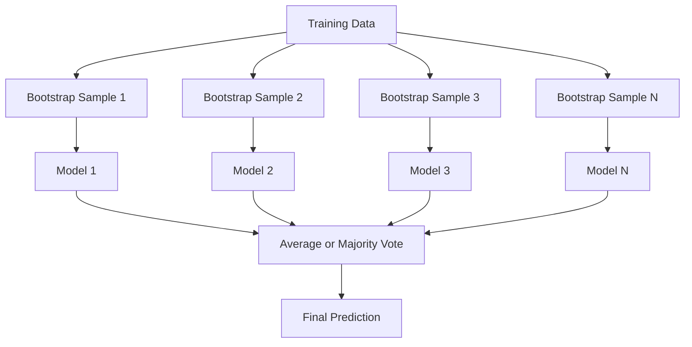
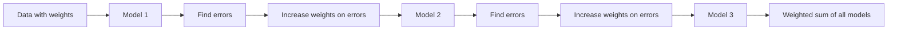
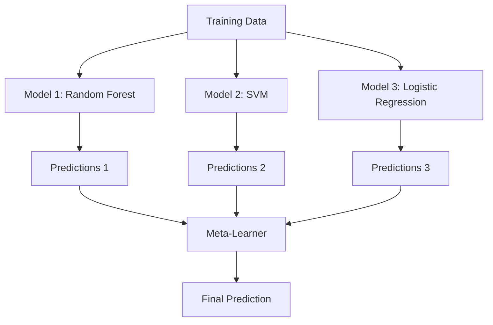

# Metotları Birleştir

> Zayıf öğrencilerden oluşan bir grup doğru bir şekilde birleştirildiğinde güçlü öğrenci olur.

**Type:** Build
**Language:**Python
**Prerequisites:** Phase 2, Lesson 10 (Bias-Variance Tradeoff)
**Time:** ~120 minutes

## Öğrenme Hedefleri

- AdaBoost ve gradient boosting uygulamasını sıfırdan başlatın ve boosting'ın tersi nasıl bir dizi olarak azaltıldığını açıklayın
- Bir paketleme ansamblini oluşturun ve ortalama korelasyonsuz modellerin önyargıyı arttırmadan nasıl azaltdığını gösterin
- Her yöntemin hangi hata bileşenini hedeflediği açısından paketleme, güçlendirme ve yığma karşılaştırın
- Ensem çeşitliliğini değerlendirin ve çoğunluk oylama doğruluğunun daha bağımsız zayıf öğrencilerle neden iyileştiğini açıklayın

## Sorun

Tek bir karar ağacı eğitilmesi hızlı ve yorumlanması kolaydır, ancak aşırı derecede. Tek bir çizgi model karmaşık sınırlara uymaktadır. Mükemmel model mimarisini tasarlamak için günler harcayabilirsiniz. Ya da bir grup kusurlu modelleri birleştirerek onlardan herhangi birinden ayrı olarak daha iyi bir şey elde edebilirsiniz.

Birleştirme yöntemleri tam olarak bunu yapar. Tablolar veriler üzerinde Kaggle yarışlarını kazanmak için en güvenilir tekniklerdir, çoğu üretim ML sistemini güçlendirirler ve eylemdeki önyargı-varians ticareti gösterirler. Çantalama farklılığı azaltır. Geliştirme önyargıyı azaltır. Yükleme hangi modellere güvenmeyi öğrenir.

## Anlaşım

### Grupların Neden Çalışması

N bağımsız sınıflandırıcılarınız var, her biri p > 0.5 doğruluğuna sahip.

```
P(majority correct) = sum over k > N/2 of C(N,k) * p^k * (1-p)^(N-k)
```

Her biri %60 doğruluğu olan 21 sınıflandırıcı için çoğunluk oylarının doğruluğu yaklaşık %74'dir. 101 sınıflandırıcı ile %84'e yükselmektedir.

Ana şart:**diversity**Tüm modeller aynı hatalar yaparsa, bunları birleştirmek hiçbir işe yaramaz.

- Farklı eğitim alt takımları (bagging)
- Farklı özellik alt kümeleri (hassasi ormanlar)
- Düzgün hata düzeltmesi (yüksetme)
- Farklı model aileleri (tüklenme)

### Çantalama (Bootstrap Aggregating)

Çantalama, her modelin eğitim verilerinin farklı bir başlangıç örneği üzerinde eğitilmesiyle çeşitliliği yaratır.



Bir bootstrap örneği orijinal verilerden değiştirilmiş olarak çizilmiştir. Orijinal ile aynı boyutta. Her bootstrap'da benzersiz örneklerin yaklaşık %63.2'si görünür. Geri kalan %36.8'i (bag dışı örnekler) ücretsiz bir onay kümesi sağlar.

Çöpleme, önyargıyı çok arttırmadan değişimi azaltır. Her bireysel ağaç, başlangıç örneğine aşırı katılır, ancak her ağaç için aşırı katılım farklıdır, bu nedenle ortalama gürültü iptal eder.

**Random Forests**Ekstra bir dönüşle paketleme yapıyorlar: her bölünmede, yalnızca rastgele bir alt dizi özellik göz önünde bulundurulur. Bu ağaçlar arasında daha da çok çeşitliliği zorlar.`sqrt(n_features)`sınıflandırma ve `n_features / 3`Geri dönüş için.

### Geliştirme (Sekvensiyel Hata Düzeltme)

Tren modellerini sıradan olarak artırmak. Her yeni model önceki modellerin yanlış yaptıkları örneklere odaklanır.



Bu nedenle, yeni modeller, tüm modellerin ağırlıklı toplamını oluşturur ve daha iyi modellerin daha yüksek ağırlıkları elde eder.

Tasarım: Fazla atış yaparsanız, artış çok fazla atış yapabilir, çünkü bazılarının gürültü olabileceği daha zor örnekleri takmaya devam eder.

### AdaBoost

AdaBoost (Adaptive Boosting) ilk pratik güçlendirme algoritmasıydı.

Algoritm:

```
1. Initialize sample weights: w_i = 1/N for all i

2. For t = 1 to T:
   a. Train weak learner h_t on weighted data
   b. Compute weighted error:
      err_t = sum(w_i * I(h_t(x_i) != y_i)) / sum(w_i)
   c. Compute model weight:
      alpha_t = 0.5 * ln((1 - err_t) / err_t)
   d. Update sample weights:
      w_i = w_i * exp(-alpha_t * y_i * h_t(x_i))
   e. Normalize weights to sum to 1

3. Final prediction: H(x) = sign(sum(alpha_t * h_t(x)))
```

Daha düşük hata olan modeller daha yüksek alfa alır. Yanlış sınıflandırılmış örnekler daha yüksek ağırlıklara sahip olur.

### Aradan Artarak

Gradyent artırma, keyfi kayıp fonksiyonlarına yükseltmeyi genelleştirir. Örnekleri yeniden ağırlaştırmak yerine, her yeni modeli mevcut ansamblın kalıntılarına (kayıpın negatif gradiyenti) uyarlar.

```
1. Initialize: F_0(x) = argmin_c sum(L(y_i, c))

2. For t = 1 to T:
   a. Compute pseudo-residuals:
      r_i = -dL(y_i, F_{t-1}(x_i)) / dF_{t-1}(x_i)
   b. Fit a tree h_t to the residuals r_i
   c. Find optimal step size:
      gamma_t = argmin_gamma sum(L(y_i, F_{t-1}(x_i) + gamma * h_t(x_i)))
   d. Update:
      F_t(x) = F_{t-1}(x) + learning_rate * gamma_t * h_t(x)

3. Final prediction: F_T(x)
```

Karakter hata kaybı için, sahte kalıntılar sadece gerçek kalıntılardır: `r_i = y_i - F_{t-1}(x_i)`Her ağaç, öncekilerin hatalarına uyuyor.

Öğrenme hızı (kısaltma) her ağacın ne kadar katkıda bulunduğunu kontrol eder. Daha küçük öğrenme hızı daha fazla ağaç gerektirir ancak daha iyi genelleştirir. Tipik değerler: 0.01 ila 0.3.

### XGBoost: Neden Tablo Verileri Üstünlükte

XGBoost (eXtreme Gradient Boosting) hızlı, doğru ve aşırı uyumlu hale getiren mühendislik optimizasyonlarıyla gradient artırma:

- **Regularized objective:**Yaprak ağırlıkları için L1 ve L2 cezaları, bireysel ağaçların çok güvenini engeller
- **Second-order approximation:**Kayıpın hem birinci hem de ikinci türevlerini kullanır, böylece daha iyi bölünmüş kararlar verir.
- **Sparsity-aware splits:**Kayıp veriler için en iyi yönü öğrenerek kayıp değerleri kendiliğinden ele alır
- **Column subsampling:**Rastgele ormanlar gibi, her bölünmede çeşitlilik için örnekler vardır.
- **Weighted quantile sketch:**Etkili olarak dağıtılmış verilerdeki sürekli özellikler için bölünme noktaları bulur
- **Cache-aware block structure:**CPU cache hatları için optimize edilmiş bellek düzenlemesi

Tablolar verileri için, XGBoost (ve onun halefi LightGBM) sürekli olarak sinir ağlarını üst kat eder. Bu yakın zamanda değişmeyecek. Verileriniz sıra ve sütunlu bir tabloya sığırsa, gradient artışı ile başlayın.

### Dökme (Meta-Learning)

Yükleme, meta öğrenci için özellik olarak birden fazla temel modelin tahminlerini kullanır.



Meta-öğrenci hangi temel modelin hangi girişlere güvenmesini öğrenir. Eğer rastgele orman belirli bölgelerde ve SVM diğerlerinde daha iyiyse, meta-öğrenci buna göre yönlendirmeyi öğrenecektir.

Verilerin sızmasını önlemek için, temel model tahminleri eğitim kümesinde çapraz onaylama yoluyla oluşturulmalıdır.

### Oylama

En basit takım. Sadece tahminleri doğrudan birleştirin.

- **Hard voting:**Çoğu sınıf etiketiyle oy kullanıyor.
- **Soft voting:**Ortalama tahmin olasılığı, en yüksek ortalama olasılığı olan sınıfı seçin.

```figure
f3-ensemble-average
```

## Yapın

### Adım 1: Kararlılık (Baş Öğrenci)

Kodun içinde .`code/ensembles.py`Bir karar topuyla başlayalım: tek bir parçacık olan bir ağaç.

```python
class DecisionStump:
    def __init__(self):
        self.feature_idx = None
        self.threshold = None
        self.polarity = 1
        self.alpha = None

    def fit(self, X, y, weights):
        n_samples, n_features = X.shape
        best_error = float("inf")

        for f in range(n_features):
            thresholds = np.unique(X[:, f])
            for thresh in thresholds:
                for polarity in [1, -1]:
                    pred = np.ones(n_samples)
                    pred[polarity * X[:, f] < polarity * thresh] = -1
                    error = np.sum(weights[pred != y])
                    if error < best_error:
                        best_error = error
                        self.feature_idx = f
                        self.threshold = thresh
                        self.polarity = polarity

    def predict(self, X):
        n = X.shape[0]
        pred = np.ones(n)
        idx = self.polarity * X[:, self.feature_idx] < self.polarity * self.threshold
        pred[idx] = -1
        return pred
```

### Adım 2: AdaBoost sıfırdan

```python
class AdaBoostScratch:
    def __init__(self, n_estimators=50):
        self.n_estimators = n_estimators
        self.stumps = []
        self.alphas = []

    def fit(self, X, y):
        n = X.shape[0]
        weights = np.full(n, 1 / n)

        for _ in range(self.n_estimators):
            stump = DecisionStump()
            stump.fit(X, y, weights)
            pred = stump.predict(X)

            err = np.sum(weights[pred != y])
            err = np.clip(err, 1e-10, 1 - 1e-10)

            alpha = 0.5 * np.log((1 - err) / err)
            weights *= np.exp(-alpha * y * pred)
            weights /= weights.sum()

            stump.alpha = alpha
            self.stumps.append(stump)
            self.alphas.append(alpha)

    def predict(self, X):
        total = sum(a * s.predict(X) for a, s in zip(self.alphas, self.stumps))
        return np.sign(total)
```

### Adım 3: Baştan İleri Gelişme

```python
class GradientBoostingScratch:
    def __init__(self, n_estimators=100, learning_rate=0.1, max_depth=3):
        self.n_estimators = n_estimators
        self.lr = learning_rate
        self.max_depth = max_depth
        self.trees = []
        self.initial_pred = None

    def fit(self, X, y):
        self.initial_pred = np.mean(y)
        current_pred = np.full(len(y), self.initial_pred)

        for _ in range(self.n_estimators):
            residuals = y - current_pred
            tree = SimpleRegressionTree(max_depth=self.max_depth)
            tree.fit(X, residuals)
            update = tree.predict(X)
            current_pred += self.lr * update
            self.trees.append(tree)

    def predict(self, X):
        pred = np.full(X.shape[0], self.initial_pred)
        for tree in self.trees:
            pred += self.lr * tree.predict(X)
        return pred
```

### Adım 4: Sklern ile karşılaştır

Kod, sıfırdan uygulamalarımızın sklearn'ınki gibi bir doğruluk ürettiğini doğruluyor.`AdaBoostClassifier`ve `GradientBoostingClassifier`, ve tüm yöntemleri yan yana karşılaştırır.

## Kullan

### Her Bir Yolu Ne Zaman Kullanmalıyız?

| Method | Reduces | Best for | Watch out for |
|--------|---------|----------|---------------|
| Bagging / Random Forest | Variance | Noisy data, many features | Does not help with bias |
| AdaBoost | Bias | Clean data, simple base learners | Sensitive to outliers and noise |
| Gradient Boosting | Bias | Tabular data, competitions | Slow to train, easy to overfit without tuning |
| XGBoost / LightGBM | Both | Production tabular ML | Many hyperparameters |
| Stacking | Both | Getting last 1-2% accuracy | Complex, risk of overfitting meta-learner |
| Voting | Variance | Quick combination of diverse models | Only helps if models are diverse |

### Tablo Verileri Üretim Stabı

Çoğu tablo önceden bildirim sorunu için, denemek için bu sıradır:

1. **LightGBM or XGBoost**Varsayılan parametrelerle
2. N_estimatorları ayarlayın, öğrenme oranı, maksimum derinlik, çocuk ağırlığı
3. Son %0,5'e ihtiyacınız varsa 3-5 farklı modelle bir yığma ansamblini yapın.
4. Tüm süreçlerde çapraz onay kullanın.

Tablolar verilerindeki sinir ağları, sürekli araştırma girişimlerine rağmen, neredeyse her zaman gradient artışından daha kötüdür. TabNet, NODE ve benzer mimarlıklar bazen eşleşir, ancak nadiren iyi ayarlanmış bir XGBoost'u yenir.

## Gönder

Bu ders bize çok yararlı .`outputs/prompt-ensemble-selector.md`- bir veri kümesi için doğru ansambl yöntemi seçmenize yardımcı olan bir istek. Verilerinizi (ölüm, özellik türleri, gürültü seviyesi, sınıf dengesi) ve çözmekte olduğunuz sorunu açıklayın. istek bir karar kontrol listesini geçirir, bir yöntemi önerir, hiperparametre başlatmayı önerir ve bu yöntemi için yaygın hatalar konusunda uyarır.`outputs/skill-ensemble-builder.md`Tam seçme rehberliği ile.

## Egzersizler

1. AdaBoost uygulamasını değiştirerek her turdan sonra eğitim doğruluğunu takip edin.

2. Rastgele bir orman uygulamak için, regresyon ağacına rastgele bir örnekleme özelliği ekleyerek sıfırdan başlayın.`max_features=sqrt(n_features)`Ve ortalama tahminler.

3. Gelişme artıran uygulamada erken duraklama ekleyin: her turdan sonra doğrulama kaybını izleyin ve 10 adet ardıcıl sürede iyileşmediğinde durun.

4. Üç temel model (lojik gerileme, karar ağacı, k-en yakın komşu) ve bir lojik gerileme meta öğrenci ile bir yığma ansamblini oluşturun. Meta- özellikleri oluşturmak için 5 katlı çapraz onay kullanın. Her bir temel modelle tek başına karşılaştırın.

5. XGBoost'u aynı veri kümesiyle öntanımlı parametrelerle çalıştırın. Düzgünlüğünü sıfırdan gradient artışına karşılaştırın. Her ikisini de zamanlandırın.

## Anahtar Terimler

| Term | What people say | What it actually means |
|------|----------------|----------------------|
| Bagging | "Train on random subsets" | Bootstrap aggregating: train models on bootstrap samples, average predictions to reduce variance |
| Boosting | "Focus on hard examples" | Train models sequentially, each correcting errors of the ensemble so far, to reduce bias |
| AdaBoost | "Reweight the data" | Boosting via sample weight updates; misclassified points get higher weight for the next learner |
| Gradient boosting | "Fit the residuals" | Boosting via fitting each new model to the negative gradient of the loss function |
| XGBoost | "The Kaggle weapon" | Gradient boosting with regularization, second-order optimization, and systems-level speed tricks |
| Stacking | "Models on top of models" | Use predictions of base models as input features for a meta-learner |
| Random forest | "Many randomized trees" | Bagging with decision trees, adding random feature subsampling at each split for diversity |
| Ensemble diversity | "Make different mistakes" | Models must be uncorrelated in their errors for the ensemble to improve over individuals |
| Out-of-bag error | "Free validation" | Samples not in a bootstrap draw (~36.8%) serve as a validation set without needing a holdout |

## Daha Fazla Okumak

- [Schapire & Freund: Boosting: Foundations and Algorithms](https://mitpress.mit.edu/9780262526036/)-- AdaBoost'un yaratıcılarının kitabı
- [Friedman: Greedy Function Approximation: A Gradient Boosting Machine (2001)](https://statweb.stanford.edu/~jhf/ftp/trebst.pdf)-- orijinal gradient artıran kağıt
- [Chen & Guestrin: XGBoost (2016)](https://arxiv.org/abs/1603.02754)-- XGBoost kağıdı
- [Wolpert: Stacked Generalization (1992)](https://www.sciencedirect.com/science/article/abs/pii/S0893608005800231)-- orijinal yığma kağıdı
- [scikit-learn Ensemble Methods](https://scikit-learn.org/stable/modules/ensemble.html)-- pratik referans
